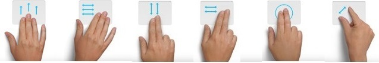

                            

Volt MX  Application Design and Development Guidelines: [Accessibility (508 Compliance)](Accessibility_Overview.md) > Accessibility: Platform Specific Limitations

Platform-specific Accessibility features
========================================

This topic provides information about various accessibility compliance features and guidelines provided by different OS providers.

An accessible app supports personalization by design and gives everyone a great user experience, regardless of their capabilities or how they use their devices. This allows individuals with a range of disabilities, such as visual, hearing, physical, or speech impairments, to enhance their ability to access and interact with web pages and apps.

iOS
---

On the iOS platform, Apple provides Accessibility features that are broadly classified into four categories: Vision, Physical and Motor, Hearing, and General.

The **Vision** section contains VoiceOver, Zoom, Display & Text Size and Audio Descriptions configurations. The **Physical and Moto**r section contains options such as Face ID, Switch Control, Apple TV Remote and Keyboard. The **Hearing** section provides configuration options for Hearing Devices, Audio/Visual, and Subtitles & Captioning. The **General** category contains Guided Access, Siri, and Accessibility Shortcut options.

For detailed information on all the features supported, refer [Accessibility Features on iPhone](https://support.apple.com/en-in/guide/iphone/iph3e2e4367/ios). For information on how to make your app accessible, refer [Human interface Guidelines](https://developer.apple.com/design/human-interface-guidelines/accessibility/overview/introduction/).

Android
-------

The accessibility features available on the Android platform vary depending on the OEM (original equipment manufacturer).

On the Android platform, options that a user can configure for Accessibility include settings for Screen Readers, Display options, Audio and On-screen Text options, Interaction controls, and Experimental. The **Screen Readers** section contains the configuration for the Text-to-speech output. The **Display** section contains the settings for Font Size, Display size, Magnification, Color correction, Color inversion. The **Interaction Controls** section contains the settings for Dwell timing, Power button ends call, Auto-rotate screen, Touch and hold delay, and Vibration. The **Audio and On-screen text** section has settings for Mono Audio and Captions. The **Experimental** section has the option to enable high contrast text.

For more information on the features supported on the Android platform and how to make your app accessible, refer [Development resources](https://developer.android.com/guide/topics/ui/accessibility).

Gestures
--------

When a device enables assistive technology, visually impaired users typically navigate through the UI controls such as tab/enter/arrow keys/page up/down keys. On various touch-only devices, a few of these key actions are mapped to touchscreen finger gestures.

The following table depicts how keyboard-based navigation keys are mapped to gestures on mobile platforms:

  
| Keyboard based devices (desktop) | Purpose | Android touch (Android 4.1 and higher) (talkback) | iOS touch |
| --- | --- | --- | --- |
| Tab | To move focus in forward direction | One finger right/down flick gesture | One finger right flick gesture |
| Shift+Tab | To move focus in reverse direction | One finger left/up flick gesture | One finger left flick gesture |
| Enter /Space | To take action on the focused widget | One finger double tap | One finger double tap |
| Right Arrow/Up Arrow | To increase the value selection on specific widgets like slider/picker |   | One finger up flick gesture |
| Left Arrow/Up Arrow | To decrease the value selection on specific widgets like slider/picker |   | One finger up flick gesture |
| Page Up | To scroll up/left of the content in a scroll container. | Two/three finger up/left flick gesture | Three fingers up/right flick gesture |
| Page Down | To scroll down/right the content in a scroll container | Two/three finger down/right flick gesture | Three fingers down/right flick gesture |
|   | Starts reading from the beginning of the page |   | Two fingers up flick gesture |
|   | Starts reading from the current focused item |   | Two fingers down flick gesture |

> **_Note:_** A gesture may function differently in different assistive technologies. Refer to the [respective assistive technology](#Platform) documentation for more information on gestures.

Following are some of the gestures explained in the above table:

For more information on accessibility gestures, refer to:

*   Android: [https://support.google.com/nexus/answer/2926960?hl=en](https://support.google.com/nexus/answer/2926960?hl=en)
*   iOS: [https://www.apple.com/in/accessibility/osx/voiceover/](https://www.apple.com/in/accessibility/osx/voiceover/)
*   SPA: [http://www.w3.org/WAI/mobile/](http://www.w3.org/WAI/mobile/)

Platform-specific Limitations
-----------------------------

The following is the list of platform-specific limitations.

### SPA

This section lists the accessibility limitations of SPA platforms.

1.  Scrolling a form and SegmentedUI through a swipe with three fingers and tab gestures (custom scroll) is not supported in SPA platform.
2.  When a Popup is loaded, the default focus goes to the form on which the Popup is loaded, and then it comes to Popup.
3.  A Label widget without any text is not focusable with tab gestures.
4.  When a form is loaded, the default focus can be any where in the form.
5.  For the widgets such as ScrollBox, Horizontal Image Strip, Slider, and Segment (PAGEVIEW), a swipe or tab gesture will not bring the focused item into a view area.
6.  On the SPA Android platform, accessibiltiyConfig for form and Popup is not supported.
7.  On the SPA Android platform, before loading a form, some random text is read by assistive technology. The random text is read from the script tag that may be present in JavaScript.
8.  For container widgets, if only a11yHint is configured, then accessibility first reads the text of the child widgets and then a11yHint text that is configured for a container widget.
9.  When the accessibilityConfig is set for any container widget (HBox, VBox, Scrollbox, FlexContainer and FlexScrollContainer), the widgets inside the container will not get focused while navigating in iOS Safari.
10.  When the accessibilityConfig is set for any container widget (HBox, VBox, Scrollbox, FlexContainer and FlexScrollContainer), the container widget will not get focused while navigating in Android browsers.
