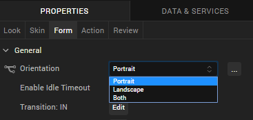
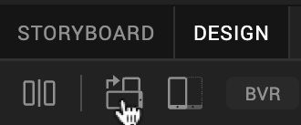
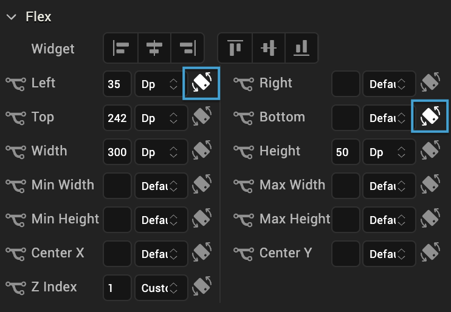

                          

Configure a Screen for Both Portrait and Landscape 
=========================================================

With Volt MX Iris, you can create a screen with properties for both portrait and landscape orientations without having to write any code. You set these properties at the form level. Once the app is published and is installed, when users rotate their device, a screen designed to support both orientations takes on the properties you set for that specific orientation.

To configure a screen for both portrait and landscape orientations, do the following:

1.  On the Project Explorer, click the **Project** tab.
2.  Expand **Forms**, and then click the form whose orientation you want to configure.
3.  On the **Form** tab of the Properties pane, from the **Orientation** drop-down list, click **Both**.

    

6.  Change the orientation of the screen on the Iris Canvas by clicking the **Orientation** toggle button. When you click this button, the orientation selected on the **Look** tab changes to match it.

     

7.  Modify the widget's properties by dragging the widget into position on the Iris Canvas, and/or setting the properties in the Flex section of the **Look** tab.
8.  To lock a particular Flex property so that it cannot be modified (whether by dragging, or changing its value in its property field) after switching to another orientation, click its orientation lock icon.

    

9.  When you have set the Flex properties for one orientation, change the orientation of the screen on the Iris Canvas by clicking the **Orientation** toggle button, click the other orientation button on the **Look** tab, and then modify the widget's Flex properties in that orientation by dragging the widget into position on the Iris Canvas, and/or setting its Flex properties on the **Look** tab. Lock any properties whose values you don't want to be inadvertently changed.
10.  Repeat steps 4 through 9 for each widget on the form that you want to customize for both portrait and landscape orientations.
