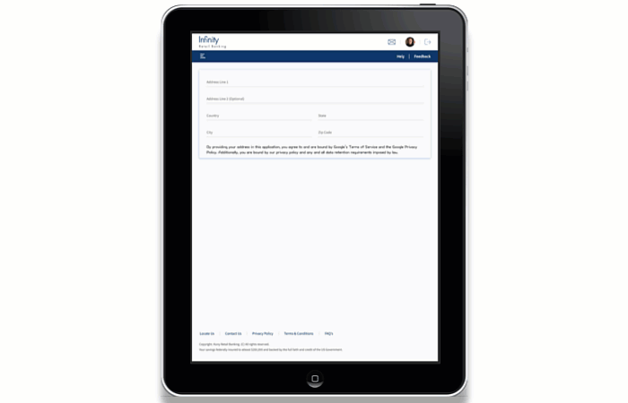
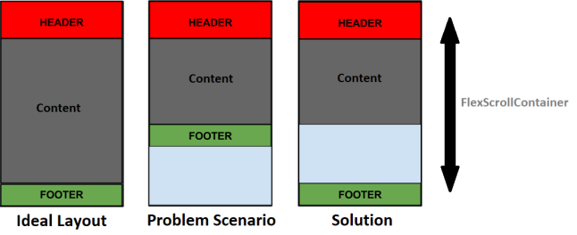

                          

Volt MX  Application Design and Development Guidelines: Common UI Issues

Common UI Issues
================

This section provides information on common UI issues and how to resolve those issues.

Handling Orientation Changes
----------------------------

The Orientation of a device changes when a user switches between Portrait mode and Landscape mode.

Consider a scenario in which a SPA app is accessed on a device in Portrait mode. When the orientation changes to the Landscape mode, the view of the app changes to display the view of the next breakpoint.

For example, the Volt MX Online Banking app is accessed on a Tablet device in Portrait mode. The app appears in the Tablet view with 768x1366 resolution. When the orientation of the Tablet device changes to Landscape mode, the resolution of the app changes to 1366x768. As 1366Px is the breakpoint for the Desktop Web app, the app appears in the Desktop Web view.


To solve the issue, implement the Orientation Handler in the Form Controller to force the required view.

The Orientation Handler is a module that is available in the Volt MX Online Banking app. All forms in the app have the Orientation Handler implemented, by default. The Orientation Handler must be imported and configured for any new forms that are added to the app.



To implement the Orientation Handler for every form that is created in the Volt MX Online Banking app, follow these steps:

1.  Create a new form.
2.  Access the controller of the form.
3.  Define a variable for the Orientation Handler.
4.  Instantiate the handler by adding the following code snippet in the formController:

```
define([], function() {
    var orientationHandler = new OrientationHandler();
    return {
        onBreakPointChange: function(eventobject, breakpoint) {
            orientationHandler.onOrientationChange(this.onBreakpointChange);
            if (orientationHandler.isDesktop) {
                //desktop view
            } else if (orientationHandler.isTablet) {
                //tablet view
            } else if (orientationHandler.isMobile) {
                //mobile view
            }
        }
    }
});
```

Handle Footer Docking
---------------------

The footer must appear at the bottom of the screen even if the content does not cover the entire screen.

Consider a scenario in which the content does not cover the space between the header and the bottom of the form. In such cases, the footer appears below the content and is not docked at the bottom of the form.



To solve the issue with footer docking, design the form in a specific layout with the layout properties for the Header, Content, and Footer of the form relative to each other, and force that layout by using the Form Controller.

The form must have a FlexScrollContainer with the Layout Type as Flow Vertical. Within the FlexScrollContainer, there are three FlexContainers, one for the Header, one for the Content, and one for the Footer. In the postShow event of the form, implement a code to adjust the height of the Content container based on the data.

To implement the code to adjust the height of the container and dock the Footer Container to the bottom of the screen, follow these steps:

1.  Create a new form.
2.  Drag and drop a **FlexScrollContainer** widget onto the form.
3.  Rename the FlexScrollContainer, **flxFormContent**.
4.  Navigate to the **Look** tab of the **Properties** panel.
5.  Under the **Flex** section, enter values for the following fields:
    *   Width: **100 %**
    *   Height: **100 %**
    *   Z Index: **1**
6.  Navigate to the **FlexScrollContainer** tab of the **Properties** panel.
7.  Under the **General** section, enter values for the following fields:
8.  Layout Type: **Flow Vertical**
9.  Child Widget Align: **Top to Bottom**
10.  Enable Scrolling: **On**
11.  Scroll Direction: **Vertical**
12.  Drag and drop a **FlexContainer** widget inside **flxFormContent**.
13.  Rename the FlexContainer, **flxHeader**.
14.  Drag and drop another FlexContainer widget inside flxFormContent.
15.  Rename the FlexContainer, **flxMain**.
16.  Drag and drop another **FlexContainer** widget inside **flxFormContent**.
17.  Rename the FlexContainer, **flxFooter**.
18.  From the **Project** explorer, select the form that you created.
19.  Navigate to the **Action** tab of the **Properties** panel.
20.  Under the **General** section, for the **postShow** event, click **Edit**.
21.  From the left menu of the Action Editor, under **Functions**, select **Add Snippet**.
22.  In the lower pane of the Action Editor, add the following code snippet:
    
```
this.view.flxContent.minHeight = voltmx.os.deviceInfo().screenHeight - this.view.flxHeader.frame.height - this.view.flxFooter.frame.height +"dp";
```
    
23.  Save and close the Action Editor.

Use the 1380Px Breakpoint for Desktop Web Apps
----------------------------------------------

Desktop Web apps are designed in the 1366 Px Breakpoint. On screens that have a resolution higher than 1366Px, the content of the app appears distorted.

To solve this issue, design Desktop Web apps in the 1380Px Breakpoint.

The view in the 1380 Px Breakpoint is similar to the 1366Px Breakpoint. The Header background spans the width of the screen, and the view contains gutter space.

Close Pop-ups
-------------

For pop-ups that appear on the screen, clicking any of the available options or outside the pop-up must close the pop-up.

This has been handled through a popup.utils module.

1.  From the Project explorer, expand Modules.
2.  Select PopupUtils.js.
3.  At the end of else-if ladder, add the following code:  
```
else if (currForm == "<newFormName>") {  
    currFormObj. < widgetToHide > .isVisible = false;  
    }
```  
    

Handle Image Resizing
---------------------

When you resize the Browser window, an image that is used as a background for a container does not cover the allotted screen space. The aspect ratio of the image is also not maintained.

To solve this issue, host the background image at a URL, and manage image resizing of the container by using Custom CSS.

To handle image resizing, follow these steps:

1.  From the Project explorer, select the required FlexContainer.
2.  From the Properties panel, navigate to the Skin tab.
3.  Select the Enable Custom CSS check box.
4.  In the Custom CSS text box, type the following code:  
```
background: url(<background image url>) no-repeat;  
    background-size: cover;
```

Handle Text in Toast Messages
-----------------------------

Status messages appear in Toast messages. Currently, a toast message can only display messages up to 2 lines. If there are more than 2 lines, the text gets truncated.

To solve this issue, add the following code in the postShow event of the FormController:

```
//flxPopup is the parent container of the component  
  
var height = this.view.customPopup.lblPopup.frame.height;   
this.view.flxPopup.height = height + 30 + "dp";
```

Handle Responsive Views in Desktop Web
--------------------------------------

If a form has multiple views, when you resize the Browser window, the view of the app changes according to the breakpoint.

For example, the Volt MX Online Banking app is accessed on a Desktop. The app appears in the Desktop Web view with the 1366x768 resolution. When you resize the browser, and the resolution of the app changes to 768Px, the app appears in the Tablet view with 768x1366 resolution.

To solve this issue, invoke the intializeResponsiveViews function in the preShow event of the form.

HCL recommends that you create a new form for every view.

To retain the current view when you resize the browser, follow these steps:

1.  Create a new form.
2.  Access the controller of the form.
3.  Define a variable to initialize the Responsive Views, intializeResponsiveViews.
4.  Instantiate the function by adding the following code snippet in the preShow event of the formController:  
```
define([], function() {
        var orientationHandler = new OrientationHandler();
        return {
            responsiveViews: {},
            initializeResponsiveViews: function() {
                this.responsiveViews["flxView1"] = this.view.flxLogin.isVisible;
                this.responsiveViews["flxView2"] = this.view.flxLogin.isVisible;
                this.responsiveViews["flxView3"] = this.view.flxLogin.isVisible;
            },
            changeView1: function() {
                this.view.flxView1.setVisibility(true);
                this.view.flxView2.setVisibility(false);
                this.view.flxView3.setVisibility(false);
                this.initializeResponsiveViews();
            },
            changeView2: function() {
                this.view.flxView1.setVisibility(false);
                this.view.flxView2.setVisibility(true);
                this.view.flxView3.setVisibility(false);
                this.initializeResponsiveViews();
            },
            changeView3: function() {
                this.view.flxView1.setVisibility(false);
                this.view.flxView2.setVisibility(false);
                this.view.flxView3.setVisibility(true);
                this.initializeResponsiveViews();
            },
            onBreakPointChange: function(eventobject, breakpoint) {
                var views = Object.keys(this.responsiveViews);
                views.forEach(function(e) {
                    scope.view[e].isVisible = scope.responsiveViews[e];
                });
            }
        }
    });
```

Layout Type for Containers
--------------------------

Ensure that you use appropriate layout types for container widgets.

For example, if an app contains a Button widget, ensure that the Layout Type of the parent FlexContainer is Flow Horizontal. Otherwise, the Button text does not appear appropriately, especially when you use Internationalization.

Handle scroll issues with Nested Containers
-------------------------------------------

Ensure that your app does not have nested FlexScrollContainers.

When an app contains multiple FlexScrollContainer widgets that are nested, the child container does not scroll appropriately.

Horizontal Text Wrapping in Segments
------------------------------------

For containers in a Segment that do not have a fixed width, if the text spans further than the width of the container, the text extends out of the column.

To wrap the text in the container, provide fixed values in % for the width of a container in a Segment.

Vertical Text Wrapping in Segments
----------------------------------

For a Segment widget that has a fixed row height, if the text spans further than the height of the row, the text gets truncated.

To wrap the text in the container, provide fixed values for the height of a Segment row, and set the heights of the child widgets as Preferred.

Custom Back button in iOS devices
---------------------------------

The native header for iOS devices contains the text Back along with the back arrow image. The header design of the Volt MX Mobile Banking app only contains the back arrow image. When you navigate from a form that contains the custom header to a form that does not contain the custom header, the native header for iOS appears.

To solve this issue, a customized native header is provided in the Volt MX Mobile Banking app.
