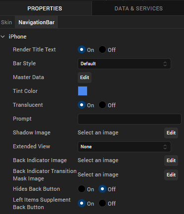
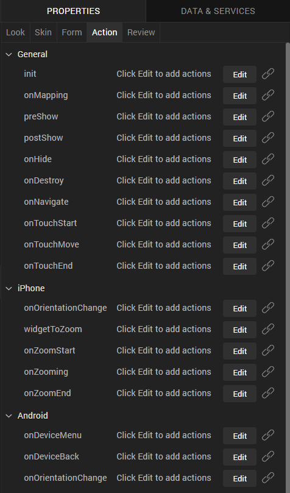
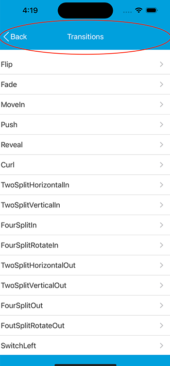

                          

Volt MX  Application Design and Development Guidelines: [Application Design Guidelines](Application_Design_Guidelines_Overview.md) > [UI Guidelines](UI_Guidelines.md) > iOS

Guidelines for Title Bar or Navigation Controls
-----------------------------------------------

### iOS

*   Typically all the iPhone applications have a title bar with a back button on the top left hand corner which facilities the navigation in the application.
*   It is recommended to use this same native behavior of configuring a title bar with back button on the top left hand corner.

### Android

Android’s native way of facilitating the navigation in the application is to use the device back key. It is recommended to use this same native behavior.

### Configure a Title Bar on a Form (iPhone)

### Configure Device Back on a Form (Android / BB)

### Title Bar Examples

Page Title Header will be horizontally center-aligned and vertically middle-aligned on the navigation bar by default.

