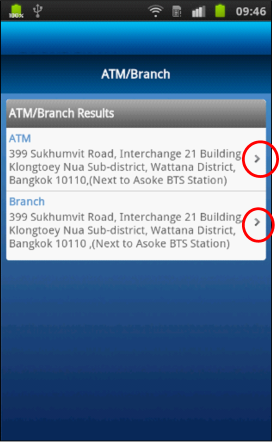
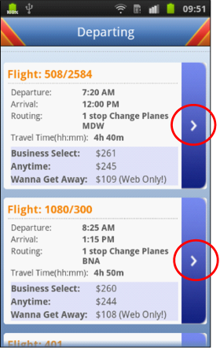

                          

Volt MX  Application Design and Development Guidelines: [Application Design Guidelines](Application_Design_Guidelines_Overview.md) > [UI Guidelines](UI_Guidelines.md) > Avoid using Unnecessary Container Widgets

Guidelines for using Segment Widget
-----------------------------------

### Avoid using unnecessary Container Widgets

Following are the guidelines to avoid using unnecessary Container widgets.

*   Use the orientation property for a Segmented UI to align the child widgets horizontally or vertically instead of using unnecessary container widgets (HBox or Vbox) to achieve the desired UI look and feel.
*   Understand that the memory occupied by segment widget will be based on the number of widgets that are placed inside the segment widget and the number of records that we are populating into the segment widget.

### Avoid Complex View Hierarchy

Avoid complex view hierarchy while designing Segmented UI. A view hierarchy is defined as the arrangement of boxes and widgets within them. Nesting of boxes in multiples of 4-5 and having 10-15 widgets in each of these boxes can lead to memory and performance issues.

### Standards around Maximum Number of Rows in a Segment

Following are standards around maximum number of rows in a Segment.

*   For a simple segment design (segment with less than 5 widgets) – the maximum number of rows that we can populate into the segment is 100.
*   For a complex segment design (segment with multiple nesting and having more than 5 widgets) – the maximum number of rows that we can populate into segment is 20.

### Use Pagination

It is recommended to use pagination whenever there is a use case to populate more than 20 records.

### Setting Segment as ScreenLevel Widget

Following are the guidelines for setting Segment as ScreenLevel widget.

*   Screen level widget – A widget that occupies the entire screen height, including headers and footers.
*   In case, the Segment has more than 15-20 records or has a complex view hierarchy, setting the ScreenLevel widget property to true for iPhone and Android leads to better scrolling performance.
*   This is due to the fact that with this property set to true, the Segmented UI widget re-uses the boxes as the user scrolls.
*   The downfall of this property is that the Segmented UI is the only scrollable widget on the form. The other widgets should be the part of header or footer.

### Do not use Hidden Widgets

*   Use the Hidden Columns property to set hidden fields for each record in a segment. Do not use hidden widgets.
*   Do not use the segment widget’s “setData” method for populating the data into the segment from inside a loop.

### Segment Widget Examples

 
