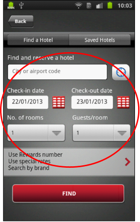

                          

Volt MX  Application Design and Development Guidelines: [Application Design Guidelines](Application_Design_Guidelines_Overview.md) > [UI Guidelines](UI_Guidelines.md) > Proper Margins and Padding Examples

Guidelines for Alignments (Margins and Paddings)
------------------------------------------------

Following are the guidelines for Alignment (Margins and paddings).

*   It is recommended to use margins and paddings as percentage based instead of pixel based. Using percentage based margins and paddings will arrange the widgets dependent on the available width of the container.
*   Follow a standard margins/paddings pattern for consistent representation within the application. For example, use 10 pixel (and 2%) for all left and right margins and 5 pixel (1%) for all the top and bottom margins.
*   To set margins or paddings to zero, specify the value as zero in the margin or paddings screen.
*   Use padding for the parent widget when aligning widgets within a container. This eliminates setting margins for individual widgets in the container.
*   Set margins for the containers first and then for the child widgets within.
*   Use either top margins or bottom margins for creating space between components but not both when it can be achieved with only one of these two.
*   Ensure you have enough space (margins and paddings) between widgets when developing applications for touch devices. If you have too many widgets, it becomes difficult for the user to make selections, leading to a bad user experience.
*   Make sure that the widgets are aligned properly to the center of the screen from left to right.

### Proper Margins and Padding Examples

 
