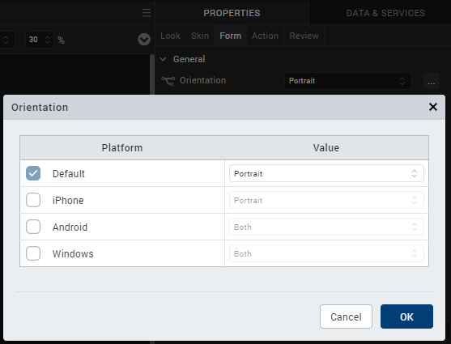

                          

Volt MX  Application Design and Development Guidelines: [Application Design Guidelines](Application_Design_Guidelines_Overview.md) > [UI Guidelines](UI_Guidelines.md) > Achieve a Uniform UI in both Orientation

Landscape vs. Portrait View
---------------------------

In Landscape View, the user interface should not get distorted when compared to Application in Portrait View.

### Achieve a Uniform UI in both Orientations

Following are the guidelines to achieve a uniform UI in both orientations.

*   Create skins for both orientations for all the applicable widgets.
*   Use percentage based margins and paddings
*   Use form forking, if the requirement is to have different forms designs for respective platforms.
*   Define the “OnOrientationChange” event to dynamically change the form to be viewed / skins to be applied depending on the requirement.

