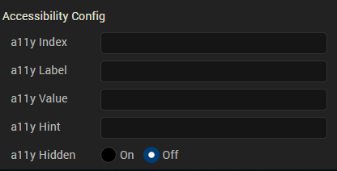

                            

Volt MX  Application Design and Development Guidelines: [Accessibility (508 Compliance)](Accessibility_Overview.md) > [Enable Accessibility in Iris](Accessibility_Iris.md#enable-accessibility-in-iris) > Widget Navigation

Widget Navigation
-----------------

Here is a sample representation of accessibility on iPhone and Android devices. For example, you have a Confirm button on form frm1, and the accessibilityConfig is defined as below:

> **_Note:_** In the above snapshot the highlighted text is role, generated by native platforms. The iPhone appended the text _button_ to the value, and Android appended the text _button_ to the hint automatically. Volt MX Iris has no control on this behavior. Developers should test the text that is provided for accessibilityConfig.

> **_Note:_** To focus on widgets in Responsive Web and SPA applications, you can use the Tab key on the keyboard. However, while using the Tab key to focus on non-input widgets (for example, Button widget) with the accessibility On, the focus skin does not always display. To get the focus skin for non-input widgets, use the [custom CSS](../../iris_user_guide/Content/AddCustomCSSCodeToSPAApp.md). Here is an example of a custom CSS for a widget:  
  
Widget:focus:not(\[kdisabled='true'\])  
{ border: 0px solid #ffffff;  
font: normal normal 24.0px Helvetica;  
color: #ffffff;  
background: #00ff00; }  

### Container Widgets

Following are the platforms behaviors for the container widgets when the accessibility feature is enabled.

*   [FlexForm](#FlexForm)
*   [Form (Deprecated)](#Form)
*   [HBox (Deprecated)](#HBox)
*   [VBox (Deprecated)](#VBox)
*   [ScrollBox (Deprecated)](#ScrollBo)
*   [Popup (Deprecated)](#Popup)

FlexForm

<table style="caption-side: top;border-left-style: solid;border-left-width: 1px;border-left-color: #a9a9a9;border-right-style: solid;border-right-width: 1px;border-right-color: #a9a9a9;border-top-style: solid;border-top-width: 1px;border-top-color: #a9a9a9;border-bottom-style: solid;border-bottom-width: 1px;border-bottom-color: #a9a9a9;border-spacing: 0px 0px;margin-left: 0;margin-right: auto;width: 717px;mc-table-style: url('Resources/TableStyles/Basic.css');" class="TableStyle-Basic" cellspacing="0"><colgroup><col style="width: 200px;" class="TableStyle-Basic-Column-Column1"> <col style="width: 515px;" class="TableStyle-Basic-Column-Column1"></colgroup><tbody><tr class="TableStyle-Basic-Body-Body1"><td class="TableStyle-Basic-BodyE-Column1-Body1">Keyboard/Gesture-based Interactions</td><td class="TableStyle-Basic-BodyD-Column1-Body1">Tab key or equivalent touch gesture moves the focus to the first focusable child widget of the form. Multiple tabs move the focus to the interactive child widgets of the form. The title of the form is accessible in the platforms that support native form widget titleBar property using the tab key or equivalent touch gesture along tab order.</td></tr><tr class="TableStyle-Basic-Body-Body1"><td class="TableStyle-Basic-BodyE-Column1-Body1">Default Behavior</td><td class="TableStyle-Basic-BodyD-Column1-Body1">The a11yLabel overrides the text of the title property. The a11yValue, a11yHint, and a11yHidden fields are not applicable to form and are ignored. accessibilityConfig property is supported in iPhone, Android, and SPA-iPhone platforms.</td></tr><tr class="TableStyle-Basic-Body-Body1"><td class="TableStyle-Basic-BodyB-Column1-Body1">Limitations</td><td class="TableStyle-Basic-BodyA-Column1-Body1">iOS: When the VoiceOver focus reaches the bottom of the form, it does not cycle to the top of the form again, with a right swipe gesture. Similarly, with a left swipe gesture, the focus does not cycle to the bottom of the form when you have reached the top of the form. The iOS VoiceOver, focus the first accessible widget available on the form. Android: onTap gesture on a form, when there are no focusable widgets, the assistive technology reads all non-focusable widgets text available in the form. In Android OS versions less than 4.2, form does not scroll, although it has content to scroll. You have to enable an option in Android OS versions 4.2 and above in system accessibility settings to auto scroll the content on swipe gesture. Accessibility capability of the ActionBar is left to the device default behavior. SPA: SPA-iPhone: When the VoiceOver focus reaches the bottom of the form, it does not cycle to the top of the form again, with a right swipe gesture. Similarly, with a left swipe gesture, the focus does not cycle to the bottom of the form when you have reached the top of the form. SPA-Android: accessibilityconfig is not supported</td></tr></tbody></table>

Form (Deprecated)

<table style="caption-side: top;border-left-style: solid;border-left-width: 1px;border-left-color: #a9a9a9;border-right-style: solid;border-right-width: 1px;border-right-color: #a9a9a9;border-top-style: solid;border-top-width: 1px;border-top-color: #a9a9a9;border-bottom-style: solid;border-bottom-width: 1px;border-bottom-color: #a9a9a9;border-spacing: 0px 0px;margin-left: 0;margin-right: auto;width: 717px;mc-table-style: url('Resources/TableStyles/Basic.css');" class="TableStyle-Basic" cellspacing="0"><colgroup><col style="width: 200px;" class="TableStyle-Basic-Column-Column1"> <col style="width: 515px;" class="TableStyle-Basic-Column-Column1"></colgroup><tbody><tr class="TableStyle-Basic-Body-Body1"><td class="TableStyle-Basic-BodyE-Column1-Body1">Keyboard/Gesture-based Interactions</td><td class="TableStyle-Basic-BodyD-Column1-Body1">Tab key or equivalent touch gesture moves the focus to the first focusable child widget of the form. Multiple tabs move the focus to the interactive child widgets of the form. The title of the form is accessible in the platforms that support native form widget titleBar property using the tab key or equivalent touch gesture along tab order.</td></tr><tr class="TableStyle-Basic-Body-Body1"><td class="TableStyle-Basic-BodyE-Column1-Body1">Default Behavior</td><td class="TableStyle-Basic-BodyD-Column1-Body1">The a11yLabel overrides the text of the title property. The a11yValue, a11yHint, and a11yHidden fields are not applicable to form and are ignored. accessibilityConfig property is supported in iPhone, Android, and SPA-iPhone platforms.</td></tr><tr class="TableStyle-Basic-Body-Body1"><td class="TableStyle-Basic-BodyB-Column1-Body1">Limitations</td><td class="TableStyle-Basic-BodyA-Column1-Body1">iOS: When the VoiceOver focus reaches the bottom of the form, it does not cycle to the top of the form again, with a right swipe gesture. Similarly, with a left swipe gesture, the focus does not cycle to the bottom of the form when you have reached the top of the form. The iOS VoiceOver, focus the first accessible widget available on the form. Android: onTap gesture on a form, when there are no focusable widgets, the assistive technology reads all non-focusable widgets text available in the form. In Android OS versions less than 4.2, form does not scroll, although it has content to scroll. You have to enable an option in Android OS versions 4.2 and above in system accessibility settings to auto scroll the content on swipe gesture. Accessibility capability of the ActionBar is left to the device default behavior. SPA: SPA-iPhone: When the VoiceOver focus reaches the bottom of the form, it does not cycle to the top of the form again, with a right swipe gesture. Similarly, with a left swipe gesture, the focus does not cycle to the bottom of the form when you have reached the top of the form. SPA-Android: accessibilityconfig is not supported</td></tr></tbody></table>

HBox (Deprecated)

<table style="caption-side: top;border-left-style: solid;border-left-width: 1px;border-left-color: #a9a9a9;border-right-style: solid;border-right-width: 1px;border-right-color: #a9a9a9;border-top-style: solid;border-top-width: 1px;border-top-color: #a9a9a9;border-bottom-style: solid;border-bottom-width: 1px;border-bottom-color: #a9a9a9;border-spacing: 0px 0px;margin-left: 0;margin-right: auto;width: 717px;mc-table-style: url('Resources/TableStyles/Basic.css');" class="TableStyle-Basic" cellspacing="0"><colgroup><col style="width: 200px;" class="TableStyle-Basic-Column-Column1"> <col style="width: 515px;" class="TableStyle-Basic-Column-Column1"></colgroup><tbody><tr class="TableStyle-Basic-Body-Body1"><td class="TableStyle-Basic-BodyE-Column1-Body1">Keyboard/Gesture based Interactions</td><td class="TableStyle-Basic-BodyD-Column1-Body1">Tab key or equivalent touch gesture moves the focus along the tab order when:<ol style="list-style-type: lower-alpha;">Box is clickableaccessibilityConfig is defined.</ol>With a focus on the HBox, press Spacebar or Enter or equivalent gesture action to select the HBox when it is clickable. Multiple tabs or navigation keys help in navigating focus to the child widgets that are actionable.</td></tr><tr class="TableStyle-Basic-Body-Body1"><td class="TableStyle-Basic-BodyE-Column1-Body1">Default Behavior</td><td class="TableStyle-Basic-BodyD-Column1-Body1">accessibilityConfig property is supported in iPhone, Android, and SPA platforms.</td></tr><tr class="TableStyle-Basic-Body-Body1"><td class="TableStyle-Basic-BodyB-Column1-Body1">Limitations</td><td class="TableStyle-Basic-BodyA-Column1-Body1">iOS: If the accessibilityConfig is set for an HBox, then the focus never goes to its child widgets and other widgets within the HBox are not accessible to the user. Android: None SPA: SPA-iPhone: If the accessibilityConfig is set for an HBox, then the focus never goes to its child widgets, and other widgets within the HBox are not accessible to the user. SPA-Android: If the accessibilityConfig is set for an HBox, then widgets within the HBox are not accessible to the user with a swipe gesture. But when touched explicitly the widgets gain focus. The option a11yHint is not supported.</td></tr></tbody></table>

VBox (Deprecated)

<table style="caption-side: top;border-left-style: solid;border-left-width: 1px;border-left-color: #a9a9a9;border-right-style: solid;border-right-width: 1px;border-right-color: #a9a9a9;border-top-style: solid;border-top-width: 1px;border-top-color: #a9a9a9;border-bottom-style: solid;border-bottom-width: 1px;border-bottom-color: #a9a9a9;border-spacing: 0px 0px;margin-left: 0;margin-right: auto;width: 717px;mc-table-style: url('Resources/TableStyles/Basic.css');" class="TableStyle-Basic" cellspacing="0"><colgroup><col style="width: 200px;" class="TableStyle-Basic-Column-Column1"> <col style="width: 515px;" class="TableStyle-Basic-Column-Column1"></colgroup><tbody><tr class="TableStyle-Basic-Body-Body1"><td class="TableStyle-Basic-BodyE-Column1-Body1">Keyboard/Gesture based Interactions</td><td class="TableStyle-Basic-BodyD-Column1-Body1">Tab key or equivalent touch gesture moves the focus along the tab order when:<ol style="list-style-type: lower-alpha;">Box is clickable.accessibilityConfig is defined.</ol>With a focus on the VBox, press Space or Enter or equivalent gesture action to select the VBox when it is clickable. Multiple tabs or navigation keys help in navigating focus to the child widgets that are actionable.</td></tr><tr class="TableStyle-Basic-Body-Body1"><td class="TableStyle-Basic-BodyE-Column1-Body1">Default Behavior</td><td class="TableStyle-Basic-BodyD-Column1-Body1">accessibilityConfig property is supported in iPhone, Android, and SPA platforms.</td></tr><tr class="TableStyle-Basic-Body-Body1"><td class="TableStyle-Basic-BodyB-Column1-Body1">Limitations</td><td class="TableStyle-Basic-BodyA-Column1-Body1">iOS: If the accessibilityConfig is set for a VBox, then the focus never goes to its child widgets and other widgets within the VBox. Android: None SPA: SPA-iPhone: If the accessibilityConfig is set for a VBox, then the focus will never go to its child widgets, and other widgets within the VBox are not accessible to the user. SPA-Android: If the accessibilityConfig is set for a VBox, then widgets within the VBox are not accessible to the user with a swipe gesture. But when touched explicitly the widgets gain focus. The option a11yHint is not supported.</td></tr></tbody></table>

ScrollBox (Deprecated)

<table style="caption-side: top;border-left-style: solid;border-left-width: 1px;border-left-color: #a9a9a9;border-right-style: solid;border-right-width: 1px;border-right-color: #a9a9a9;border-top-style: solid;border-top-width: 1px;border-top-color: #a9a9a9;border-bottom-style: solid;border-bottom-width: 1px;border-bottom-color: #a9a9a9;border-spacing: 0px 0px;margin-left: 0;margin-right: auto;width: 717px;mc-table-style: url('Resources/TableStyles/Basic.css');" class="TableStyle-Basic" cellspacing="0"><colgroup><col style="width: 200px;" class="TableStyle-Basic-Column-Column1"> <col style="width: 515px;" class="TableStyle-Basic-Column-Column1"></colgroup><tbody><tr class="TableStyle-Basic-Body-Body1"><td class="TableStyle-Basic-BodyE-Column1-Body1">Keyboard/Gesture based Interactions</td><td class="TableStyle-Basic-BodyD-Column1-Body1">Tab key or equivalent touch gesture moves the focus along the tab order when accessibilityConfig is defined. Multiple tabs or navigation keys help in navigating focus to the child widgets that are actionable. Page Up / Page Down or equivalent key/gesture allows you to scroll the content of the ScrollBox.</td></tr><tr class="TableStyle-Basic-Body-Body1"><td class="TableStyle-Basic-BodyE-Column1-Body1">Default Behavior</td><td class="TableStyle-Basic-BodyD-Column1-Body1">accessibilityConfig property is supported in iPhone, Android, and SPA platforms.</td></tr><tr class="TableStyle-Basic-Body-Body1"><td class="TableStyle-Basic-BodyB-Column1-Body1">Limitations</td><td class="TableStyle-Basic-BodyA-Column1-Body1">iOS: If the accessibilityConfig is set for a ScrollBox, then the focus never goes to its child widgets, and other widgets within the ScrollBox are not accessible to the user. Android: In Android OS versions less than 4.2, the form does not scroll although it has content to scroll. It depends on the capability of the built-in Accessibility service. You have to enable an option in Android OS versions 4.2 and above in the system accessibility settings to auto-scroll the content on swipe gesture. Similar behavior is observed with native applications as well. When the scrollDirection property is set to SCROLLBOX_SCROLL_BOTH, the behavior is undefined. SPA: When a user scrolls through the Scrollbox, it does not scroll and the widgets are not displayed in the view port, even if you set accessibility. This is due to the inability of the browsers to detect the touch gestures. But the widgets within Scrollbox are navigated and accessibility of the widget is read out. SPA-iPhone: If the accessibilityConfig is set for a ScrollBox, then widgets within the ScrollBox are not accessible to the user. SPA-Android: If the accessibilityConfig is set for a ScrollBox, then widgets within the ScrollBox are not accessible to the user with a swipe gesture. But when touched explicitly the widgets gain focus. The option a11yHint is not supported.</td></tr></tbody></table>

Popup (Deprecated)

<table style="caption-side: top;border-left-style: solid;border-left-width: 1px;border-left-color: #a9a9a9;border-right-style: solid;border-right-width: 1px;border-right-color: #a9a9a9;border-top-style: solid;border-top-width: 1px;border-top-color: #a9a9a9;border-bottom-style: solid;border-bottom-width: 1px;border-bottom-color: #a9a9a9;border-spacing: 0px 0px;margin-left: 0;margin-right: auto;width: 717px;mc-table-style: url('Resources/TableStyles/Basic.css');" class="TableStyle-Basic" cellspacing="0"><colgroup><col style="width: 200px;" class="TableStyle-Basic-Column-Column1"> <col style="width: 515px;" class="TableStyle-Basic-Column-Column1"></colgroup><tbody><tr class="TableStyle-Basic-Body-Body1"><td class="TableStyle-Basic-BodyE-Column1-Body1">Keyboard/Gesture based Interactions</td><td class="TableStyle-Basic-BodyD-Column1-Body1">Tab key or equivalent touch gesture moves the focus to the first focusable child widget of the popup. Multiple tabs move the focus to the interactive child widgets of the popup.</td></tr><tr class="TableStyle-Basic-Body-Body1"><td class="TableStyle-Basic-BodyE-Column1-Body1">Default Behavior</td><td class="TableStyle-Basic-BodyD-Column1-Body1">The a11yLabel overrides the text of the title property. The a11yValue, a11yHint, and a11yHidden fields are not applicable to popup and are ignored. accessibilityConfig property is supported in iPhone, Android, and SPA-iPhone platforms.</td></tr><tr class="TableStyle-Basic-Body-Body1"><td class="TableStyle-Basic-BodyB-Column1-Body1">Limitations</td><td class="TableStyle-Basic-BodyA-Column1-Body1">iOS: When the VoiceOver focus reaches the bottom of the popup, it does not cycle to the top of the popup again, with a right swipe gesture. Similarly with a left swipe gesture, the focus does not cycle to the bottom of the popup when you have reached the top of the popup. Android: When there are no focusable widgets in a popup, the assistive technology reads all non-focusable widgets text available in the popup. In Android OS versions less than 4.3, the popup does not scroll although it has more content to scroll. It is the capability of the built-in Accessibility service (TalkBack) that is lacking in versions less than 4.3 OS versions. You have to enable an option in Accessibility settings in 4.3 and 4.4 Android OS versions to auto-scroll the content on a swipe gesture. SPA: SPA-iPhone: When the VoiceOver focus reaches the bottom of the popup, it does not cycle to the top of the popup again, with a right swipe gesture. Similarly, with a left swipe gesture, the focus does not cycle to the bottom of the popup when you have reached the top of the popup. SPA-Android: accessibilityConfig is not supported.</td></tr></tbody></table>

### Basic Widgets

 Below are the platforms behaviors of the basic widgets when accessibility feature is enabled.

*   [Button](#Button)
*   [Calendar](#Calendar)
*   [CheckBox](#CheckBox)
*   [ComboBox](#ComboBox)
*   [Image](#Image)
*   [Label](#Label)
*   [Line](#Line)
*   [Link](#Link)
*   [ListBox](#ListBox)
*   [RadioButton](#RadioBut)
*   [RichText](#RichText)
*   [Slider](#Slider)
*   [TextArea](#TextArea)
*   [TextBox](#TextBox)

Button

<table style="caption-side: top;border-left-style: solid;border-left-width: 1px;border-left-color: #a9a9a9;border-right-style: solid;border-right-width: 1px;border-right-color: #a9a9a9;border-top-style: solid;border-top-width: 1px;border-top-color: #a9a9a9;border-bottom-style: solid;border-bottom-width: 1px;border-bottom-color: #a9a9a9;border-spacing: 0px 0px;margin-left: 0;margin-right: auto;width: 717px;mc-table-style: url('Resources/TableStyles/Basic.css');" class="TableStyle-Basic" cellspacing="0"><colgroup><col style="width: 200px;" class="TableStyle-Basic-Column-Column1"> <col style="width: 515px;" class="TableStyle-Basic-Column-Column1"></colgroup><tbody><tr class="TableStyle-Basic-Body-Body1"><td class="TableStyle-Basic-BodyE-Column1-Body1">Keyboard/Gesture based Interactions</td><td class="TableStyle-Basic-BodyD-Column1-Body1">With a focus on the Button, press the Spacebar or Enter key or equivalent gesture action to select the Button. Single finger double tap to execute the action. Accessible by the tab key or equivalent touch gesture along tab order.</td></tr><tr class="TableStyle-Basic-Body-Body1"><td class="TableStyle-Basic-BodyE-Column1-Body1">Default Behavior</td><td class="TableStyle-Basic-BodyD-Column1-Body1">accessibilityConfig property is supported in iPhone, Android, and SPA platforms.</td></tr><tr class="TableStyle-Basic-Body-Body1"><td class="TableStyle-Basic-BodyB-Column1-Body1">Limitations</td><td class="TableStyle-Basic-BodyA-Column1-Body1">iOS: None Android: None SPA: SPA-iPhone: None SPA-Android: The option a11yHint is not supported.</td></tr></tbody></table>

Calendar

<table style="caption-side: top;border-left-style: solid;border-left-width: 1px;border-left-color: #a9a9a9;border-right-style: solid;border-right-width: 1px;border-right-color: #a9a9a9;border-top-style: solid;border-top-width: 1px;border-top-color: #a9a9a9;border-bottom-style: solid;border-bottom-width: 1px;border-bottom-color: #a9a9a9;border-spacing: 0px 0px;margin-left: 0;margin-right: auto;width: 717px;mc-table-style: url('Resources/TableStyles/Basic.css');" class="TableStyle-Basic" cellspacing="0"><colgroup><col style="width: 200px;" class="TableStyle-Basic-Column-Column1"> <col style="width: 515px;" class="TableStyle-Basic-Column-Column1"></colgroup><tbody><tr class="TableStyle-Basic-Body-Body1"><td class="TableStyle-Basic-BodyE-Column1-Body1">Description</td><td class="TableStyle-Basic-BodyD-Column1-Body1">A Calendar widget accepts dates from the user. Following are the view types that support accessibility in respective platforms: CALENDAR_VIEW_TYPE_DEFAULT (Android) CALENDAR_VIEW_TYPE_WHEEL_POPUP (iPhone) CALENDAR_VIEW_TYPE_ GRID_POPUP (iPhone and SPA)</td></tr><tr class="TableStyle-Basic-Body-Body1"><td class="TableStyle-Basic-BodyE-Column1-Body1">Keyboard/Gesture based Interactions</td><td class="TableStyle-Basic-BodyD-Column1-Body1">Accessible by the tab key or equivalent touch gesture along tab order. With a focus on the Calendar, press the Spacebar or Enter key or equivalent gesture action to launch the date selector. You can reach to each available day, month, and year in a calendar through one/some of the keys or touch gestures.</td></tr><tr class="TableStyle-Basic-Body-Body1"><td class="TableStyle-Basic-BodyE-Column1-Body1">Default Behavior</td><td class="TableStyle-Basic-BodyD-Column1-Body1">accessibilityConfig property is supported in iPhone, Android, and SPA platforms.</td></tr><tr class="TableStyle-Basic-Body-Body1"><td class="TableStyle-Basic-BodyB-Column1-Body1">Limitations</td><td class="TableStyle-Basic-BodyA-Column1-Body1">a11yValue is not applicable. It is recommended to provide accessibility text to the assistive technology to read the date when the tab focus/gesture makes a selection. accessibilityConfig is not supported for the viewTypes that are not focused as a whole. &nbsp;</td></tr></tbody></table>

 

CheckBox

<table style="caption-side: top;border-left-style: solid;border-left-width: 1px;border-left-color: #a9a9a9;border-right-style: solid;border-right-width: 1px;border-right-color: #a9a9a9;border-top-style: solid;border-top-width: 1px;border-top-color: #a9a9a9;border-bottom-style: solid;border-bottom-width: 1px;border-bottom-color: #a9a9a9;border-spacing: 0px 0px;margin-left: 0;margin-right: auto;width: 717px;mc-table-style: url]('Resources/TableStyles/Basic.css');" class="TableStyle-Basic" cellspacing="0"><colgroup><col style="width: 200px;" class="TableStyle-Basic-Column-Column1"><col style="width: 515px;" class="TableStyle-Basic-Column-Column1"></colgroup><tbody><tr class="TableStyle-Basic-Body-Body1"><td class="TableStyle-Basic-BodyE-Column1-Body1">Keyboard/Gesture based Interactions</td><td class="TableStyle-Basic-BodyD-Column1-Body1">Accessible by the tab key or equivalent touch gesture along tab order.Multiple tabs or navigation keys help in navigating the focus to each check button in the group. With a focus on the CheckBox, press the Spacebar or Enter key or equivalent gesture to change the selection state of the focused check button.</td></tr><tr class="TableStyle-Basic-Body-Body1"><td class="TableStyle-Basic-BodyE-Column1-Body1">Default Behavior</td><td class="TableStyle-Basic-BodyD-Column1-Body1">accessibilityConfig property is supported in iPhone, Android, and SPA platforms.</td></tr><tr class="TableStyle-Basic-Body-Body1"><td class="TableStyle-Basic-BodyE-Column1-Body1">Limitations</td><td class="TableStyle-Basic-BodyD-Column1-Body1">iOS: Following are the limitations of iOS platform based on the selected viewType:<table cellspacing="0" style="mc-table-style: url('Resources/TableStyles/Basic.css');width: 458px;" class="TableStyle-Basic"><colgroup><col style="width: 204px;" class="TableStyle-Basic-Column-Column1"><col class="TableStyle-Basic-Column-Column1"><col class="TableStyle-Basic-Column-Column1"></colgroup><thead><tr class="TableStyle-Basic-Head-Header1"><th class="TableStyle-Basic-HeadE-Column1-Header1" style="font-size: 11pt;">viewType</th><th class="TableStyle-Basic-HeadD-Column1-Header1" colspan="2" style="font-size: 11pt;">&nbsp; accessibilityConfig</th><th>zzEmptyCellzz</th><th>zzEmptyCellzz</th><th>zzEmptyCellzz</th></tr></thead><tbody><tr class="TableStyle-Basic-Body-Body1"><td class="TableStyle-Basic-BodyE-Column1-Body1" style="background-color: #005386;">&nbsp;</td><td class="TableStyle-Basic-BodyE-Column1-Body1" style="font-weight: bold;background-color: #005386;color: #ffffff;text-align: center;">&nbsp;Widget Level</td><td class="TableStyle-Basic-BodyD-Column1-Body1" style="padding: 0px;font-weight: bold;background-color: #005386;color: #ffffff;text-align: center;">Items within widget</td></tr><tr class="TableStyle-Basic-Body-Body1"><td class="TableStyle-Basic-BodyE-Column1-Body1">CHECKBOX_VIEW_TYPE_LISTVIEW</td><td class="TableStyle-Basic-BodyE-Column1-Body1" style="font-size: 9pt;text-align: center;">Respected</td><td class="TableStyle-Basic-BodyD-Column1-Body1" style="padding: 0px;font-size: 9pt;text-align: center;">Ignored</td></tr><tr class="TableStyle-Basic-Body-Body1"><td class="TableStyle-Basic-BodyE-Column1-Body1">CHECKBOX_VIEW_TYPE_TOGGLEVIEW</td><td class="TableStyle-Basic-BodyE-Column1-Body1" style="font-size: 9pt;text-align: center;">Ignored</td><td class="TableStyle-Basic-BodyD-Column1-Body1" style="padding: 0px;font-size: 9pt;text-align: center;">Respected</td></tr><tr class="TableStyle-Basic-Body-Body1"><td class="TableStyle-Basic-BodyE-Column1-Body1">CHECKBOX_VIEW_TYPE_ONSCREENWHEEL</td><td class="TableStyle-Basic-BodyE-Column1-Body1" style="font-size: 9pt;text-align: center;">Ignored</td><td class="TableStyle-Basic-BodyD-Column1-Body1" style="padding: 0px;font-size: 9pt;text-align: center;">Ignored</td></tr><tr class="TableStyle-Basic-Body-Body1"><td class="TableStyle-Basic-BodyB-Column1-Body1">CHECKBOX_VIEW_TYPE_TABLEVIEW</td><td class="TableStyle-Basic-BodyB-Column1-Body1" style="font-size: 9pt;text-align: center;">Ignored</td><td class="TableStyle-Basic-BodyA-Column1-Body1" style="padding: 0px;font-size: 9pt;text-align: center;">Respected</td></tr></tbody></table>
* accessibilityConfig is ignored when set through <i>masterData</i> or <i>masterDataMap</i> to the items within the widget that pops up as pickerview from the bottom.

Android: None

SPA:
<ul><li value="1">SPA-iPhone: accessibilityConfig for CheckBox as a whole is not respected, but the items within the widget are respected. The CheckBox state and the item text gets the focus separately.</li><li value="2">SPA-Android: accessibilityConfig for CheckBox as a whole is not respected, but the items within the widget are respected. The CheckBox state and the item text get the focus separately. The option a11yHint is not supported.</li></ul></td></tr><tr class="TableStyle-Basic-Body-Body1"><td class="TableStyle-Basic-BodyB-Column1-Body1">Example code</td><td class="TableStyle-Basic-BodyA-Column1-Body1">Click here to view the <a href="../../../Iris/iris_widget_prog_guide/Content/CheckBox_Properties.html#accessibilityConfig" target="_blank">sample code</a></td></tr></tbody></table>

 

ComboBox

 ComboBox 

ComboBox

<table style="caption-side: top;border-left-style: solid;border-left-width: 1px;border-left-color: #a9a9a9;border-right-style: solid;border-right-width: 1px;border-right-color: #a9a9a9;border-top-style: solid;border-top-width: 1px;border-top-color: #a9a9a9;border-bottom-style: solid;border-bottom-width: 1px;border-bottom-color: #a9a9a9;border-spacing: 0px 0px;margin-left: 0;margin-right: auto;width: 717px;mc-table-style: url]('Resources/TableStyles/Basic.css');" class="TableStyle-Basic" cellspacing="0"><colgroup><col style="width: 194px;" class="TableStyle-Basic-Column-Column1"><col style="width: 521px;" class="TableStyle-Basic-Column-Column1"></colgroup><tbody><tr class="TableStyle-Basic-Body-Body1"><td class="TableStyle-Basic-BodyE-Column1-Body1">Keyboard/Gesture based Interactions</td><td class="TableStyle-Basic-BodyD-Column1-Body1">Tab key or equivalent touch gesture along tab order.With a focus on the ComboBox, press the Spacebar or Enter key or equivalent gesture action to open the drop-down list.With drop-down list in an expanded state, press the Spacebar or Enter key or equivalent gesture to select the focused item.Multiple tabs or navigation keys help in navigating the focus to each item in the ComboBox.</td></tr><tr class="TableStyle-Basic-Body-Body1"><td class="TableStyle-Basic-BodyE-Column1-Body1">Default Behavior</td><td class="TableStyle-Basic-BodyD-Column1-Body1">accessibilityConfig property is supported in iPhone, Android, and SPA platforms.</td></tr><tr class="TableStyle-Basic-Body-Body1"><td class="TableStyle-Basic-BodyE-Column1-Body1">Limitations</td><td class="TableStyle-Basic-BodyD-Column1-Body1">iOS: Following are the limitations of iOS platform based on the selected viewType:<table cellspacing="0" style="mc-table-style: url('Resources/TableStyles/Basic.css');width: 476px;" class="TableStyle-Basic"><colgroup><col style="width: 204px;" class="TableStyle-Basic-Column-Column1"><col class="TableStyle-Basic-Column-Column1"><col class="TableStyle-Basic-Column-Column1"></colgroup><thead><tr class="TableStyle-Basic-Head-Header1"><th class="TableStyle-Basic-HeadE-Column1-Header1" style="font-size: 11pt;">viewType</th><th class="TableStyle-Basic-HeadD-Column1-Header1" colspan="2" style="font-size: 11pt;">&nbsp; accessibilityConfig</th><th>zzEmptyCellzz</th><th>zzEmptyCellzz</th><th>zzEmptyCellzz</th></tr></thead><tbody><tr class="TableStyle-Basic-Body-Body1"><td class="TableStyle-Basic-BodyE-Column1-Body1" style="background-color: #005386;">&nbsp;</td><td class="TableStyle-Basic-BodyE-Column1-Body1" style="font-weight: bold;background-color: #005386;color: #ffffff;text-align: center;">&nbsp;Widget Level</td><td class="TableStyle-Basic-BodyD-Column1-Body1" style="padding: 0px;font-weight: bold;background-color: #005386;color: #ffffff;text-align: center;">Items Within Widget</td></tr><tr class="TableStyle-Basic-Body-Body1"><td class="TableStyle-Basic-BodyE-Column1-Body1">COMBOBOX_VIEW_TYPE_LISTVIEW</td><td class="TableStyle-Basic-BodyE-Column1-Body1" style="font-size: 9pt;text-align: center;">Respected</td><td class="TableStyle-Basic-BodyD-Column1-Body1" style="padding: 0px;font-size: 9pt;text-align: center;">Ignored *</td></tr><tr class="TableStyle-Basic-Body-Body1"><td class="TableStyle-Basic-BodyE-Column1-Body1">COMBOBOX_VIEW_TYPE_TABLEVIEW</td><td class="TableStyle-Basic-BodyE-Column1-Body1" style="font-size: 9pt;text-align: center;">Ignored</td><td class="TableStyle-Basic-BodyD-Column1-Body1" style="padding: 0px;font-size: 9pt;text-align: center;">Respected</td></tr><tr class="TableStyle-Basic-Body-Body1"><td class="TableStyle-Basic-BodyE-Column1-Body1">COMBOBOX_VIEW_TYPE_TOGGLEVIEW</td><td class="TableStyle-Basic-BodyE-Column1-Body1" style="font-size: 9pt;text-align: center;">Ignored</td><td class="TableStyle-Basic-BodyD-Column1-Body1" style="padding: 0px;font-size: 9pt;text-align: center;">Respected</td></tr><tr class="TableStyle-Basic-Body-Body1"><td class="TableStyle-Basic-BodyB-Column1-Body1">COMBOBOX_VIEW_TYPE_ONSCREENWHEEL</td><td class="TableStyle-Basic-BodyB-Column1-Body1" style="font-size: 9pt;text-align: center;">Ignored</td><td class="TableStyle-Basic-BodyA-Column1-Body1" style="padding: 0px;font-size: 9pt;text-align: center;">Ignored</td></tr></tbody></table>
* accessibilityConfig is ignored when set through <i>masterData</i> or <i>masterDataMap</i> to the items within the widget that pops up as pickerview from the bottom.

Android: If the accessibilityConfig is set, it will override the selected item.

SPA:
<ul><li value="1">SPA-iPhone: The ComboBox widget is mapped to the.md ComboBox, and browsers launch the list items as native popup. Accessibility configuration working for the list items cannot be controlled by Volt MX Platform. Accessibility is not supported for the items of the ComboBox widget.</li><li value="2">SPA-Android:The ComboBox widget is mapped to the HTML ComboBox, and browsers launch the list items as native popup. Accessibility configuration working for the list items cannot be controlled by Volt MX Platform. Accessibility is not supported for the items of the ComboBox widget.</li></ul></td></tr><tr class="TableStyle-Basic-Body-Body1"><td class="TableStyle-Basic-BodyB-Column1-Body1">Example code</td><td class="TableStyle-Basic-BodyA-Column1-Body1">Click here to view the <a href="../../../Iris/iris_widget_prog_guide/Content/ComboBox_Properties.html#accessibilityConfig" target="_blank">sample code</a></td></tr></tbody></table>

 

Image

 Image 

Image

<table style="caption-side: top;border-left-style: solid;border-left-width: 1px;border-left-color: #a9a9a9;border-right-style: solid;border-right-width: 1px;border-right-color: #a9a9a9;border-top-style: solid;border-top-width: 1px;border-top-color: #a9a9a9;border-bottom-style: solid;border-bottom-width: 1px;border-bottom-color: #a9a9a9;border-spacing: 0px 0px;margin-left: 0;margin-right: auto;width: 717px;mc-table-style: url('Resources/TableStyles/Basic.css');" class="TableStyle-Basic" cellspacing="0"><colgroup><col style="width: 200px;" class="TableStyle-Basic-Column-Column1"><col style="width: 515px;" class="TableStyle-Basic-Column-Column1"></colgroup><tbody><tr class="TableStyle-Basic-Body-Body1"><td class="TableStyle-Basic-BodyE-Column1-Body1">Keyboard/Gesture based Interactions</td><td class="TableStyle-Basic-BodyD-Column1-Body1" style="font-size: 9pt;color: #484848;">Tab key or equivalent touch gesture along tab order.</td></tr><tr class="TableStyle-Basic-Body-Body1"><td class="TableStyle-Basic-BodyE-Column1-Body1">Default Behavior</td><td class="TableStyle-Basic-BodyD-Column1-Body1">accessibilityConfig property is supported in iPhone, Android, and SPA platforms.</td></tr><tr class="TableStyle-Basic-Body-Body1"><td class="TableStyle-Basic-BodyB-Column1-Body1">Limitations</td><td class="TableStyle-Basic-BodyA-Column1-Body1">On all platforms, except SPA, if the accessibility is not configured, the image widget is not accessible to the user.SPA-Android: The option a11yHint is not supported.</td></tr></tbody></table>

Label

<table style="caption-side: top;border-left-style: solid;border-left-width: 1px;border-left-color: #a9a9a9;border-right-style: solid;border-right-width: 1px;border-right-color: #a9a9a9;border-top-style: solid;border-top-width: 1px;border-top-color: #a9a9a9;border-bottom-style: solid;border-bottom-width: 1px;border-bottom-color: #a9a9a9;border-spacing: 0px 0px;margin-left: 0;margin-right: auto;width: 717px;mc-table-style: url('Resources/TableStyles/Basic.css');" class="TableStyle-Basic" cellspacing="0"><colgroup><col style="width: 200px;" class="TableStyle-Basic-Column-Column1"><col style="width: 515px;" class="TableStyle-Basic-Column-Column1"></colgroup><tbody><tr class="TableStyle-Basic-Body-Body1"><td class="TableStyle-Basic-BodyE-Column1-Body1">Description</td><td class="TableStyle-Basic-BodyD-Column1-Body1" style="font-size: 9pt;color: #484848;">A Label widget is used to display non-editable text to the user.</td></tr><tr class="TableStyle-Basic-Body-Body1"><td class="TableStyle-Basic-BodyE-Column1-Body1">Keyboard/Gesture based Interactions</td><td class="TableStyle-Basic-BodyD-Column1-Body1">Tab key or equivalent touch gesture along tab order.</td></tr><tr class="TableStyle-Basic-Body-Body1"><td class="TableStyle-Basic-BodyE-Column1-Body1">Default Behavior</td><td class="TableStyle-Basic-BodyD-Column1-Body1">accessibilityConfig property is supported in iPhone, Android, and SPA-Android platforms.</td></tr><tr class="TableStyle-Basic-Body-Body1"><td class="TableStyle-Basic-BodyB-Column1-Body1">Limitations</td><td class="TableStyle-Basic-BodyA-Column1-Body1">iOS: NoneAndroid: NoneSPA: SPA-iPhone: accessibilityConfig property is not supported.SPA-Android:The option a11yHint is not supported</td></tr></tbody></table>

Line

<table style="caption-side: top;border-left-style: solid;border-left-width: 1px;border-left-color: #a9a9a9;border-right-style: solid;border-right-width: 1px;border-right-color: #a9a9a9;border-top-style: solid;border-top-width: 1px;border-top-color: #a9a9a9;border-bottom-style: solid;border-bottom-width: 1px;border-bottom-color: #a9a9a9;border-spacing: 0px 0px;margin-left: 0;margin-right: auto;width: 717px;mc-table-style: url('Resources/TableStyles/Basic.css');" class="TableStyle-Basic" cellspacing="0"><colgroup><col style="width: 200px;" class="TableStyle-Basic-Column-Column1"><col style="width: 515px;" class="TableStyle-Basic-Column-Column1"></colgroup><tbody><tr class="TableStyle-Basic-Body-Body1"><td class="TableStyle-Basic-BodyE-Column1-Body1">Keyboard/Gesture based Interactions</td><td class="TableStyle-Basic-BodyD-Column1-Body1">Not accessible by the tab key or equivalent touch gesture.</td></tr><tr class="TableStyle-Basic-Body-Body1"><td class="TableStyle-Basic-BodyE-Column1-Body1">Default Behavior</td><td class="TableStyle-Basic-BodyD-Column1-Body1">accessibilityConfig property is not supported.</td></tr><tr class="TableStyle-Basic-Body-Body1"><td class="TableStyle-Basic-BodyB-Column1-Body1">Limitations</td><td class="TableStyle-Basic-BodyA-Column1-Body1">None</td></tr></tbody></table>

Link

<table style="caption-side: top;border-left-style: solid;border-left-width: 1px;border-left-color: #a9a9a9;border-right-style: solid;border-right-width: 1px;border-right-color: #a9a9a9;border-top-style: solid;border-top-width: 1px;border-top-color: #a9a9a9;border-bottom-style: solid;border-bottom-width: 1px;border-bottom-color: #a9a9a9;border-spacing: 0px 0px;margin-left: 0;margin-right: auto;width: 717px;mc-table-style: url('Resources/TableStyles/Basic.css');" class="TableStyle-Basic" cellspacing="0"><colgroup><col style="width: 200px;" class="TableStyle-Basic-Column-Column1"><col style="width: 515px;" class="TableStyle-Basic-Column-Column1"></colgroup><tbody><tr class="TableStyle-Basic-Body-Body1"><td class="TableStyle-Basic-BodyE-Column1-Body1">Keyboard/Gesture based Interactions</td><td class="TableStyle-Basic-BodyD-Column1-Body1">With a focus on the link, press the Spacebar or Enter key or equivalent gesture action to select the link.Single finger double tap to execute the action.Tab key or equivalent touch gesture along tab order.</td></tr><tr class="TableStyle-Basic-Body-Body1"><td class="TableStyle-Basic-BodyE-Column1-Body1">Default Behavior</td><td class="TableStyle-Basic-BodyD-Column1-Body1">accessibilityConfig property is supported in iPhone, Android, and SPA platforms.</td></tr><tr class="TableStyle-Basic-Body-Body1"><td class="TableStyle-Basic-BodyB-Column1-Body1">Limitations</td><td class="TableStyle-Basic-BodyA-Column1-Body1">iOS: NoneAndroid: NoneSPA: SPA-iPhone: NoneSPA-Android: The option a11yHint is not supported.</td></tr></tbody></table>

ListBox

<table style="caption-side: top;border-left-style: solid;border-left-width: 1px;border-left-color: #a9a9a9;border-right-style: solid;border-right-width: 1px;border-right-color: #a9a9a9;border-top-style: solid;border-top-width: 1px;border-top-color: #a9a9a9;border-bottom-style: solid;border-bottom-width: 1px;border-bottom-color: #a9a9a9;border-spacing: 0px 0px;margin-left: 0;margin-right: auto;width: 717px;mc-table-style: url]('Resources/TableStyles/Basic.css');" class="TableStyle-Basic" cellspacing="0"><colgroup><col style="width: 200px;" class="TableStyle-Basic-Column-Column1"><col style="width: 515px;" class="TableStyle-Basic-Column-Column1"></colgroup><tbody><tr class="TableStyle-Basic-Body-Body1"><td class="TableStyle-Basic-BodyE-Column1-Body1">Keyboard/Gesture based Interactions</td><td class="TableStyle-Basic-BodyD-Column1-Body1">Accessible by the tab key or equivalent touch gesture along tab order.With a focus on the ListBox, press the Spacebar or Enter key or equivalent gesture to open the drop-down list.With drop-down list in an expanded state, press the Spacebar or Enter key or equivalent gesture to select the focused item.Multiple tabs or navigation keys help in navigating the focus to each item in the ListBox.</td></tr><tr class="TableStyle-Basic-Body-Body1"><td class="TableStyle-Basic-BodyE-Column1-Body1">Default Behavior</td><td class="TableStyle-Basic-BodyD-Column1-Body1">accessibilityConfig property is supported in iPhone, Android, and SPA platforms.</td></tr><tr class="TableStyle-Basic-Body-Body1"><td class="TableStyle-Basic-BodyE-Column1-Body1">Limitations</td><td class="TableStyle-Basic-BodyD-Column1-Body1">iOS: Following are the limitations of iOS platform based on the selected viewType:<table class="TableStyle-Basic" cellspacing="0" style="mc-table-style: url('Resources/TableStyles/Basic.css');width: 457px;"><colgroup><col style="width: 186px;" class="TableStyle-Basic-Column-Column1"><col class="TableStyle-Basic-Column-Column1"><col class="TableStyle-Basic-Column-Column1"></colgroup><thead><tr style="height: -202px;" class="TableStyle-Basic-Head-Header1"><th class="TableStyle-Basic-HeadE-Column1-Header1" style="font-size: 11pt;">viewType</th><th class="TableStyle-Basic-HeadD-Column1-Header1" colspan="2" style="font-size: 11pt;">&nbsp; accessibilityConfig</th><th>zzEmptyCellzz</th><th>zzEmptyCellzz</th><th>zzEmptyCellzz</th></tr></thead><tbody><tr class="TableStyle-Basic-Body-Body1"><td class="TableStyle-Basic-BodyE-Column1-Body1" style="background-color: #005386;">&nbsp;</td><td class="TableStyle-Basic-BodyE-Column1-Body1" style="font-weight: bold;background-color: #005386;color: #ffffff;text-align: center;">&nbsp;Widget Level</td><td class="TableStyle-Basic-BodyD-Column1-Body1" style="padding: 0px;font-weight: bold;background-color: #005386;color: #ffffff;text-align: center;">Items Within Widget</td></tr><tr class="TableStyle-Basic-Body-Body1"><td class="TableStyle-Basic-BodyE-Column1-Body1">LISTBOX_VIEW_TYPE_LISTVIEW</td><td class="TableStyle-Basic-BodyE-Column1-Body1" style="font-size: 9pt;text-align: center;">Supported</td><td class="TableStyle-Basic-BodyD-Column1-Body1" style="padding: 0px;font-size: 9pt;text-align: center;">Ignored *</td></tr><tr class="TableStyle-Basic-Body-Body1"><td class="TableStyle-Basic-BodyE-Column1-Body1">LISTBOX_VIEW_TYPE_TABLEVIEW</td><td class="TableStyle-Basic-BodyE-Column1-Body1" style="font-size: 9pt;text-align: center;">Ignored</td><td class="TableStyle-Basic-BodyD-Column1-Body1" style="padding: 0px;font-size: 9pt;text-align: center;">Supported</td></tr><tr class="TableStyle-Basic-Body-Body1"><td class="TableStyle-Basic-BodyE-Column1-Body1">LISTBOX_VIEW_TYPE_TOGGLEVIEW</td><td class="TableStyle-Basic-BodyE-Column1-Body1" style="font-size: 9pt;text-align: center;">Ignored</td><td class="TableStyle-Basic-BodyD-Column1-Body1" style="padding: 0px;font-size: 9pt;text-align: center;">Supported</td></tr><tr class="TableStyle-Basic-Body-Body1"><td class="TableStyle-Basic-BodyB-Column1-Body1">LISTBOX_VIEW_TYPE_ONSCREENWHEEL</td><td class="TableStyle-Basic-BodyB-Column1-Body1" style="font-size: 9pt;text-align: center;">Ignored</td><td class="TableStyle-Basic-BodyA-Column1-Body1" style="padding: 0px;font-size: 9pt;text-align: center;">Ignored</td></tr></tbody></table>
* accessibilityConfig is ignored when set through <i>masterData</i> or <i>masterDataMap</i> to the items within the widget that pops up as pickerview from the bottom.

Android: If the accessibilityConfig is set, it will override the selected item.

SPA:
<ul><li value="1">SPA-iPhone: The ListBox widget is mapped to the.md ListBox, and browsers launch the list items as native popup. Accessibility configuration working for the list items cannot be controlled by Volt MX Platform. Accessibility is not supported for the items of the ListBox widget.</li><li value="2">SPA-Android:The ListBox widget is mapped to the HTML ListBox and browsers launch the list items as native popup. Accessibility configuration working for the list items cannot be controlled by Volt MX Platform. Accessibility is not supported for the items of the ListBox widget. The option a11yHint is not supported.</li></ul></td></tr><tr class="TableStyle-Basic-Body-Body1"><td class="TableStyle-Basic-BodyB-Column1-Body1">Example code</td><td class="TableStyle-Basic-BodyA-Column1-Body1">Click here to view the <a href="../../../Iris/iris_widget_prog_guide/Content/ListBox_Basic_Properties.html#accessibilityConfig" target="_blank">sample code</a></td></tr></tbody></table>

 

RadioButton

 RadioButton  

RadioButton

<table style="caption-side: top;border-left-style: solid;border-left-width: 1px;border-left-color: #a9a9a9;border-right-style: solid;border-right-width: 1px;border-right-color: #a9a9a9;border-top-style: solid;border-top-width: 1px;border-top-color: #a9a9a9;border-bottom-style: solid;border-bottom-width: 1px;border-bottom-color: #a9a9a9;border-spacing: 0px 0px;margin-left: 0;margin-right: auto;width: 717px;mc-table-style: url]('Resources/TableStyles/Basic.css');" class="TableStyle-Basic" cellspacing="0"><colgroup><col style="width: 200px;" class="TableStyle-Basic-Column-Column1"><col style="width: 515px;" class="TableStyle-Basic-Column-Column1"></colgroup><tbody><tr class="TableStyle-Basic-Body-Body1"><td class="TableStyle-Basic-BodyE-Column1-Body1">Keyboard/Gesture based Interactions</td><td class="TableStyle-Basic-BodyD-Column1-Body1">Accessible by the tab key or equivalent touch gesture along tab order.With a focus on the RadioButton, press the Spacebar or Enter key or equivalent gesture to change the selection state of the focused item.Multiple tabs or navigation keys help in navigating the focus to each item in the RadioButton.</td></tr><tr class="TableStyle-Basic-Body-Body1"><td class="TableStyle-Basic-BodyE-Column1-Body1">Default Behavior</td><td class="TableStyle-Basic-BodyD-Column1-Body1">accessibilityConfig property is supported in iPhone, Android, and SPA platforms.</td></tr><tr class="TableStyle-Basic-Body-Body1"><td class="TableStyle-Basic-BodyE-Column1-Body1">Limitations</td><td class="TableStyle-Basic-BodyD-Column1-Body1">iOS: Following are the limitations of the iOS platform based on the selected viewType:<table class="TableStyle-Basic" cellspacing="0" style="width: 468px;mc-table-style: url('Resources/TableStyles/Basic.css');"><colgroup><col style="width: 221px;" class="TableStyle-Basic-Column-Column1"><col class="TableStyle-Basic-Column-Column1"><col class="TableStyle-Basic-Column-Column1"></colgroup><thead><tr class="TableStyle-Basic-Head-Header1"><th class="TableStyle-Basic-HeadE-Column1-Header1" style="font-size: 11pt;">viewType</th><th class="TableStyle-Basic-HeadD-Column1-Header1" colspan="2" style="font-size: 11pt;">&nbsp; accessibilityConfig</th><th>zzEmptyCellzz</th><th>zzEmptyCellzz</th><th>zzEmptyCellzz</th></tr></thead><tbody><tr class="TableStyle-Basic-Body-Body1"><td class="TableStyle-Basic-BodyE-Column1-Body1" style="background-color: #005386;">&nbsp;</td><td class="TableStyle-Basic-BodyE-Column1-Body1" style="font-weight: bold;background-color: #005386;color: #ffffff;text-align: center;">&nbsp;Widget Level</td><td class="TableStyle-Basic-BodyD-Column1-Body1" style="padding: 0px;font-weight: bold;background-color: #005386;color: #ffffff;text-align: center;">Items Within Widget</td></tr><tr class="TableStyle-Basic-Body-Body1"><td class="TableStyle-Basic-BodyE-Column1-Body1">RADIOGROUP_VIEW_TYPE_LISTVIEW</td><td class="TableStyle-Basic-BodyE-Column1-Body1" style="font-size: 9pt;text-align: center;">Supported</td><td class="TableStyle-Basic-BodyD-Column1-Body1" style="padding: 0px;font-size: 9pt;text-align: center;">Ignored *</td></tr><tr class="TableStyle-Basic-Body-Body1"><td class="TableStyle-Basic-BodyE-Column1-Body1">RADIOGROUP_VIEW_TYPE_TABLEVIEW</td><td class="TableStyle-Basic-BodyE-Column1-Body1" style="font-size: 9pt;text-align: center;">Ignored</td><td class="TableStyle-Basic-BodyD-Column1-Body1" style="padding: 0px;font-size: 9pt;text-align: center;">Supported</td></tr><tr class="TableStyle-Basic-Body-Body1"><td class="TableStyle-Basic-BodyE-Column1-Body1">RADIOGROUP_VIEW_TYPE_TOGGLEVIEW</td><td class="TableStyle-Basic-BodyE-Column1-Body1" style="font-size: 9pt;text-align: center;">Ignored</td><td class="TableStyle-Basic-BodyD-Column1-Body1" style="padding: 0px;font-size: 9pt;text-align: center;">Supported</td></tr><tr class="TableStyle-Basic-Body-Body1"><td class="TableStyle-Basic-BodyB-Column1-Body1">RADIOGROUP_VIEW_TYPE_ONSCREENWHEEL</td><td class="TableStyle-Basic-BodyB-Column1-Body1" style="font-size: 9pt;text-align: center;">Ignored</td><td class="TableStyle-Basic-BodyA-Column1-Body1" style="padding: 0px;font-size: 9pt;text-align: center;">Ignored</td></tr></tbody></table>
* accessibilityConfig is ignored when set through <i>masterData</i> or <i>masterDataMap</i> to the items within the widget that pops up as pickerview from the bottom is ignored.

Android: None

SPA:
<ul><li value="1">SPA-iPhone: accessibilityConfig for RadioButton as a whole is not supported, but the items within the widget are supported.</li><li value="2">SPA-Android: accessibilityConfig for RadioButton as a whole is not supported, but the items within the widget are supported. The option a11yHint is not supported.</li></ul></td></tr><tr class="TableStyle-Basic-Body-Body1"><td class="TableStyle-Basic-BodyB-Column1-Body1">Example code</td><td class="TableStyle-Basic-BodyA-Column1-Body1">Click here to view the <a href="../../../Iris/iris_widget_prog_guide/Content/RadioButton_Properties.html#accessibilityConfig" target="_blank">sample code</a></td></tr></tbody></table>

 

RichText

 RichText 

RichText

<table style="caption-side: top;border-left-style: solid;border-left-width: 1px;border-left-color: #a9a9a9;border-right-style: solid;border-right-width: 1px;border-right-color: #a9a9a9;border-top-style: solid;border-top-width: 1px;border-top-color: #a9a9a9;border-bottom-style: solid;border-bottom-width: 1px;border-bottom-color: #a9a9a9;border-spacing: 0px 0px;margin-left: 0;margin-right: auto;width: 717px;mc-table-style: url('Resources/TableStyles/Basic.css');" class="TableStyle-Basic" cellspacing="0"><colgroup><col style="width: 200px;" class="TableStyle-Basic-Column-Column1"><col style="width: 515px;" class="TableStyle-Basic-Column-Column1"></colgroup><tbody><tr class="TableStyle-Basic-Body-Body1"><td class="TableStyle-Basic-BodyE-Column1-Body1">Keyboard/Gesture based Interactions</td><td class="TableStyle-Basic-BodyD-Column1-Body1">Accessible by the tab key or equivalent touch gesture along tab order.</td></tr><tr class="TableStyle-Basic-Body-Body1"><td class="TableStyle-Basic-BodyE-Column1-Body1">Default Behavior</td><td class="TableStyle-Basic-BodyD-Column1-Body1">accessibilityConfig property is supported in iPhone, Android, and SPA platforms.</td></tr><tr class="TableStyle-Basic-Body-Body1"><td class="TableStyle-Basic-BodyB-Column1-Body1">Limitations</td><td class="TableStyle-Basic-BodyA-Column1-Body1">On all platforms, links inside a RichText widget are not accessible.SPA-Android: The option a11yHint is not supported.</td></tr></tbody></table>

Slider

<table style="caption-side: top;border-left-style: solid;border-left-width: 1px;border-left-color: #a9a9a9;border-right-style: solid;border-right-width: 1px;border-right-color: #a9a9a9;border-top-style: solid;border-top-width: 1px;border-top-color: #a9a9a9;border-bottom-style: solid;border-bottom-width: 1px;border-bottom-color: #a9a9a9;border-spacing: 0px 0px;margin-left: 0;margin-right: auto;width: 717px;mc-table-style: url('Resources/TableStyles/Basic.css');" class="TableStyle-Basic" cellspacing="0"><colgroup><col style="width: 200px;" class="TableStyle-Basic-Column-Column1"><col style="width: 515px;" class="TableStyle-Basic-Column-Column1"></colgroup><tbody><tr class="TableStyle-Basic-Body-Body1"><td class="TableStyle-Basic-BodyE-Column1-Body1">Keyboard/Gesture based Interactions</td><td class="TableStyle-Basic-BodyD-Column1-Body1">Accessible by the tab key or equivalent touch gesture along tab order.With a focus on the Slider, press the Right / Up key or equivalent gesture to increase the value of the slider. Press the Left / Down key or equivalent gesture to decrease the value of the slider.</td></tr><tr class="TableStyle-Basic-Body-Body1"><td class="TableStyle-Basic-BodyE-Column1-Body1">Default Behavior</td><td class="TableStyle-Basic-BodyD-Column1-Body1">accessibilityConfig property is supported in iPhone, Android, and SPA platforms.</td></tr><tr class="TableStyle-Basic-Body-Body1"><td class="TableStyle-Basic-BodyB-Column1-Body1">Limitations</td><td class="TableStyle-Basic-BodyA-Column1-Body1">Android: Android OS cannot change the slider value when accessibility is set.SPA: SPA-iPhone: Browsers cannot change the slider value when accessibility is set.SPA-Android: Browsers cannot change the slider value when accessibility is set.</td></tr></tbody></table>

TextArea

<table style="caption-side: top;border-left-style: solid;border-left-width: 1px;border-left-color: #a9a9a9;border-right-style: solid;border-right-width: 1px;border-right-color: #a9a9a9;border-top-style: solid;border-top-width: 1px;border-top-color: #a9a9a9;border-bottom-style: solid;border-bottom-width: 1px;border-bottom-color: #a9a9a9;border-spacing: 0px 0px;margin-left: 0;margin-right: auto;width: 717px;mc-table-style: url('Resources/TableStyles/Basic.css');" class="TableStyle-Basic" cellspacing="0"><colgroup><col style="width: 200px;" class="TableStyle-Basic-Column-Column1"><col style="width: 515px;" class="TableStyle-Basic-Column-Column1"></colgroup><tbody><tr class="TableStyle-Basic-Body-Body1"><td class="TableStyle-Basic-BodyE-Column1-Body1">Keyboard/Gesture based Interactions</td><td class="TableStyle-Basic-BodyD-Column1-Body1">With a focus on the TextArea, press the Spacebar or equivalent gesture to open the soft keypad for touch devices.Single finger double tap to execute the action.Accessible by the tab key or equivalent touch gesture along tab order.Soft keypad gains focus on explicit touch on the soft keypad.</td></tr><tr class="TableStyle-Basic-Body-Body1"><td class="TableStyle-Basic-BodyE-Column1-Body1">Default Behavior</td><td class="TableStyle-Basic-BodyD-Column1-Body1">accessibilityConfig property is supported in iPhone, Android, and SPA platforms.</td></tr><tr class="TableStyle-Basic-Body-Body1"><td class="TableStyle-Basic-BodyB-Column1-Body1">Limitations</td><td class="TableStyle-Basic-BodyA-Column1-Body1">iOS: NoneAndroid: When the accessibilityConfig is defined for placeholder or entered text, then behavior is left to the device. SPA: SPA-iPhone: NoneSPA-Android: The option a11yHint is not supported.</td></tr></tbody></table>

TextBox

<table style="caption-side: top;border-left-style: solid;border-left-width: 1px;border-left-color: #a9a9a9;border-right-style: solid;border-right-width: 1px;border-right-color: #a9a9a9;border-top-style: solid;border-top-width: 1px;border-top-color: #a9a9a9;border-bottom-style: solid;border-bottom-width: 1px;border-bottom-color: #a9a9a9;border-spacing: 0px 0px;margin-left: 0;margin-right: auto;width: 717px;mc-table-style: url('Resources/TableStyles/Basic.css');" class="TableStyle-Basic" cellspacing="0"><colgroup><col style="width: 200px;" class="TableStyle-Basic-Column-Column1"><col style="width: 515px;" class="TableStyle-Basic-Column-Column1"></colgroup><tbody><tr class="TableStyle-Basic-Body-Body1"><td class="TableStyle-Basic-BodyE-Column1-Body1">Keyboard/Gesture based Interactions</td><td class="TableStyle-Basic-BodyD-Column1-Body1">With a focus on the TextBox, press the Spacebar or equivalent gesture to open the soft keypad for touch devices.Single finger double tap to execute the action.Accessible by the tab key or equivalent touch gesture along tab order.Soft keypad gains focus on explicit touch on the soft keypad.</td></tr><tr class="TableStyle-Basic-Body-Body1"><td class="TableStyle-Basic-BodyE-Column1-Body1">Default Behavior</td><td class="TableStyle-Basic-BodyD-Column1-Body1">accessibilityConfig property is supported in iPhone, Android, and SPA platforms.<b><i>Note: </i></b>To configure the clear text button, use the property accessibilityConfigForClearButton and the keys are same as that of accessibilityConfig. This is applicable to iOS platform only</td></tr><tr class="TableStyle-Basic-Body-Body1"><td class="TableStyle-Basic-BodyB-Column1-Body1">Limitations</td><td class="TableStyle-Basic-BodyA-Column1-Body1">iOS: NoneAndroid: When the accessibilityConfig is defined for placeholder or entered text, then behavior is left to the device.SPA: SPA-iPhone: NoneSPA-Android: The option a11yHint is not supported.</td></tr></tbody></table>

### Advanced Widgets

Below are the behaviors of the advanced widgets when the accessibility feature is enabled.

*   [Alert](#Alert)
*   [Camera](#Camera)
*   [Hz Image Strip](#Hz)
*   [PickerView](#PickerVi)
*   [SegmentedUI - TABLEVIEW](#Segmente)
*   [SegmentedUI - PAGEVIEW](#Segmente)
*   [Switch](#Switch)

Alert

<table style="caption-side: top;border-left-style: solid;border-left-width: 1px;border-left-color: #a9a9a9;border-right-style: solid;border-right-width: 1px;border-right-color: #a9a9a9;border-top-style: solid;border-top-width: 1px;border-top-color: #a9a9a9;border-bottom-style: solid;border-bottom-width: 1px;border-bottom-color: #a9a9a9;border-spacing: 0px 0px;margin-left: 0;margin-right: auto;width: 717px;mc-table-style: url('Resources/TableStyles/Basic.css');" class="TableStyle-Basic" cellspacing="0"><colgroup><col style="width: 200px;" class="TableStyle-Basic-Column-Column1"><col style="width: 515px;" class="TableStyle-Basic-Column-Column1"></colgroup><tbody><tr class="TableStyle-Basic-Body-Body1"><td class="TableStyle-Basic-BodyE-Column1-Body1">Description</td><td class="TableStyle-Basic-BodyD-Column1-Body1" style="font-size: 9pt;color: #484848;">An Alert is a dialog displayed to show an alert message.</td></tr><tr class="TableStyle-Basic-Body-Body1"><td class="TableStyle-Basic-BodyE-Column1-Body1">Keyboard/Gesture based Interactions</td><td class="TableStyle-Basic-BodyD-Column1-Body1">Touch gesture: Single finger double tap.Accessible by the tab key or equivalent touch gesture to navigate and focus on the buttons and messages of the Alert dialog box.With a focus on the Alert button, press the Enter or Spacebar or equivalent gesture to select the button.By default, Alerts should gain focus as Alert displays.</td></tr><tr class="TableStyle-Basic-Body-Body1"><td class="TableStyle-Basic-BodyE-Column1-Body1">Default Behavior</td><td class="TableStyle-Basic-BodyD-Column1-Body1">accessibilityConfig is not supported.</td></tr><tr class="TableStyle-Basic-Body-Body1"><td class="TableStyle-Basic-BodyB-Column1-Body1">Limitations</td><td class="TableStyle-Basic-BodyA-Column1-Body1">On all platforms, the buttons within the Alert dialog are not configurable.</td></tr></tbody></table>

Camera

<table style="caption-side: top;border-left-style: solid;border-left-width: 1px;border-left-color: #a9a9a9;border-right-style: solid;border-right-width: 1px;border-right-color: #a9a9a9;border-top-style: solid;border-top-width: 1px;border-top-color: #a9a9a9;border-bottom-style: solid;border-bottom-width: 1px;border-bottom-color: #a9a9a9;border-spacing: 0px 0px;margin-left: 0;margin-right: auto;width: 717px;mc-table-style: url('Resources/TableStyles/Basic.css');" class="TableStyle-Basic" cellspacing="0"><colgroup><col style="width: 200px;" class="TableStyle-Basic-Column-Column1"><col style="width: 515px;" class="TableStyle-Basic-Column-Column1"></colgroup><tbody><tr class="TableStyle-Basic-Body-Body1"><td class="TableStyle-Basic-BodyE-Column1-Body1">Keyboard/Gesture based Interactions</td><td class="TableStyle-Basic-BodyD-Column1-Body1">Touch gesture: Single finger double tap.Accessible by the tab key or equivalent touch gesture along tab order.With a focus on the camera, press the Enter or Spacebar or equivalent gesture to launch the camera.</td></tr><tr class="TableStyle-Basic-Body-Body1"><td class="TableStyle-Basic-BodyE-Column1-Body1">Default Behavior</td><td class="TableStyle-Basic-BodyD-Column1-Body1">accessibilityConfig property is supported in iPhone and Android platforms.</td></tr><tr class="TableStyle-Basic-Body-Body1"><td class="TableStyle-Basic-BodyB-Column1-Body1">Limitations</td><td class="TableStyle-Basic-BodyA-Column1-Body1">accessibilityConfig property is not supported in SPA platform</td></tr></tbody></table>

Hz Image Strip

<table style="caption-side: top;border-left-style: solid;border-left-width: 1px;border-left-color: #a9a9a9;border-right-style: solid;border-right-width: 1px;border-right-color: #a9a9a9;border-top-style: solid;border-top-width: 1px;border-top-color: #a9a9a9;border-bottom-style: solid;border-bottom-width: 1px;border-bottom-color: #a9a9a9;border-spacing: 0px 0px;margin-left: 0;margin-right: auto;width: 717px;mc-table-style: url]('Resources/TableStyles/Basic.css');" class="TableStyle-Basic" cellspacing="0"><colgroup><col style="width: 200px;" class="TableStyle-Basic-Column-Column1"><col style="width: 515px;" class="TableStyle-Basic-Column-Column1"></colgroup><tbody><tr class="TableStyle-Basic-Body-Body1"><td class="TableStyle-Basic-BodyE-Column1-Body1">Keyboard/Gesture based Interactions</td><td class="TableStyle-Basic-BodyD-Column1-Body1">Touch gesture: Single finger double tap.Accessible by the tab key or equivalent touch gesture along tab order.On multiple tabs or equivalent touch gesture, move the focus to the images where accessibility is configured and visible on the screen.Images that are not visible are scrolled automatically to a visible region on a tab or equivalent gesture.</td></tr><tr class="TableStyle-Basic-Body-Body1"><td class="TableStyle-Basic-BodyE-Column1-Body1">Default Behavior</td><td class="TableStyle-Basic-BodyD-Column1-Body1">accessibilityConfig property is supported in iPhone, Android, and SPA platforms.</td></tr><tr class="TableStyle-Basic-Body-Body1"><td class="TableStyle-Basic-BodyE-Column1-Body1">Limitations</td><td class="TableStyle-Basic-BodyD-Column1-Body1">If the entire image strip widget is not focused as a whole, then the accessibilityConfig is not respected in any of the platform. The accessibilityConfig is supported only when the viewType is set to HORIZONTAL_IMAGESTRIP_VIEW_TYPE_STRIPVIEW.iOS:For the viewType when set to HORIZONTAL_IMAGESTRIP_VIEW_TYPE_STRIPVIEW, accessibility is ignored. But the accessibility configured for each image is supported. Accessibility is not available for all other viewtypes. &nbsp;Android: In Android OS versions less than 4.2, Horizontal Image Strip does not scroll though it has content to scroll. It depends on the capability of the built-in accessibility service. You must enable an option in Android OS versions greater than equal to 4.2 in system accessibility settings to auto scroll the content on swipe gesture. You will observe similar behavior with native applications as well.SPA: SPA-iPhone: If the accessibilityConfig is set for a Horizontal Image Strip, then widgets within the Horizontal Image Strip are not accessible to the user.SPA-Android: If the accessibilityConfig is set for a Horizontal Image Strip, then widgets within the Horizontal Image Strip are not accessible to the user with a swipe gesture. But when touched explicitly the widgets gain focus. The option a11yHint is not supported.&nbsp;</td></tr><tr class="TableStyle-Basic-Body-Body1"><td class="TableStyle-Basic-BodyB-Column1-Body1">Example code</td><td class="TableStyle-Basic-BodyA-Column1-Body1"><a href="../../../Iris/iris_widget_prog_guide/Content/HzImage_Properties.html#accessibilityConfig" target="_blank">sample code</a></td></tr></tbody></table>

 

PickerView

<table style="caption-side: top;border-left-style: solid;border-left-width: 1px;border-left-color: #a9a9a9;border-right-style: solid;border-right-width: 1px;border-right-color: #a9a9a9;border-top-style: solid;border-top-width: 1px;border-top-color: #a9a9a9;border-bottom-style: solid;border-bottom-width: 1px;border-bottom-color: #a9a9a9;border-spacing: 0px 0px;margin-left: 0;margin-right: auto;width: 717px;mc-table-style: url]('Resources/TableStyles/Basic.css');" class="TableStyle-Basic" cellspacing="0"><colgroup><col style="width: 200px;" class="TableStyle-Basic-Column-Column1"><col style="width: 515px;" class="TableStyle-Basic-Column-Column1"></colgroup><tbody><tr class="TableStyle-Basic-Body-Body1"><td class="TableStyle-Basic-BodyE-Column1-Body1">Keyboard/Gesture based Interactions</td><td class="TableStyle-Basic-BodyD-Column1-Body1">Touch gesture: Single finger double tap.Accessible by the tab key or equivalent touch gesture along tab order.Every column in the PickerView is reachable by the tab key or equivalent touch gesture.With a focus on the PickerView, press the Right / Up key or Left / Down key or equivalent gesture to allow navigation between items in the focused column. With a focus on the PickerView, press the Enter or Spacebar or equivalent gesture to select the focused item in the PickerView.</td></tr><tr class="TableStyle-Basic-Body-Body1"><td class="TableStyle-Basic-BodyE-Column1-Body1">Default Behavior</td><td class="TableStyle-Basic-BodyD-Column1-Body1">accessibilityConfig property is supported in Android &nbsp;platforms.</td></tr><tr class="TableStyle-Basic-Body-Body1"><td class="TableStyle-Basic-BodyE-Column1-Body1">Limitations</td><td class="TableStyle-Basic-BodyD-Column1-Body1">iOS: accessibilityConfig is not supported Android: In Android OS versions less than 4.2, SegmentedUI does not scroll though it has content to scroll. It depends on the capability of the built-in accessibility service. You must enable an option in Android OS versions greater than equal to 4.2 in system accessibility settings to auto-scroll the content on a swipe gesture. You will observe similar behavior with native applications as well.</td></tr><tr class="TableStyle-Basic-Body-Body1"><td class="TableStyle-Basic-BodyB-Column1-Body1">Example code</td><td class="TableStyle-Basic-BodyA-Column1-Body1"><a href="../../../Iris/iris_widget_prog_guide/Content/PickerView_Basic_Properties.html#accessibilityConfig" target="_blank">sample code</a></td></tr></tbody></table>

 

SegmentedUI - TABLEVIEW

<table style="caption-side: top;border-left-style: solid;border-left-width: 1px;border-left-color: #a9a9a9;border-right-style: solid;border-right-width: 1px;border-right-color: #a9a9a9;border-top-style: solid;border-top-width: 1px;border-top-color: #a9a9a9;border-bottom-style: solid;border-bottom-width: 1px;border-bottom-color: #a9a9a9;border-spacing: 0px 0px;margin-left: 0;margin-right: auto;width: 717px;mc-table-style: url]('Resources/TableStyles/Basic.css');" class="TableStyle-Basic" cellspacing="0"><colgroup><col style="width: 200px;" class="TableStyle-Basic-Column-Column1"><col style="width: 515px;" class="TableStyle-Basic-Column-Column1"></colgroup><tbody><tr class="TableStyle-Basic-Body-Body1"><td class="TableStyle-Basic-BodyE-Column1-Body1">Description</td><td class="TableStyle-Basic-BodyD-Column1-Body1">A SegmentedUI is a container widget to display multiple rows of information in vertical order.</td></tr><tr class="TableStyle-Basic-Body-Body1"><td class="TableStyle-Basic-BodyE-Column1-Body1">Keyboard/Gesture based Interactions</td><td class="TableStyle-Basic-BodyD-Column1-Body1">Accessible by the tab key or equivalent touch gesture along the tab order moves the focus to the first row. If the first row is a section header, then the subsequent tabs move the focus to the interactive child widgets. If there are no child widgets or interactive widgets, or all child widgets are reached, the tab moves the focus to the next row until it reaches the last visible row.In SINGLE_SELECT_MODE or MULTI_SELECT_MODE, as the row gets the focus through the tab, underlying accessibility technology conveys the user as either selected/unselected.</td></tr><tr class="TableStyle-Basic-Body-Body1"><td class="TableStyle-Basic-BodyE-Column1-Body1">Default Behavior</td><td class="TableStyle-Basic-BodyD-Column1-Body1">At widget level, accessibilityConfig property is not supported in iPhone, Android, and SPA platforms because it is not focusable completely. Accessibility is supported only for the individual rows because they are focused completely. accessibilityConfig is applied to the row template, and then accessibility is applied to each row, unless overridden by the row data.Row template's accessibility configurations can be modified before setting the row data to the SegmentedUI and should not be modified after data are set.</td></tr><tr class="TableStyle-Basic-Body-Body1"><td class="TableStyle-Basic-BodyE-Column1-Body1">Limitations</td><td class="TableStyle-Basic-BodyD-Column1-Body1">iOS: If the accessibilityConfig is set to a row of a SegmentedUI, then actionable child widgets of the row become inaccessible.Android: In Android OS versions less than 4.2, SegmentedUI does not scroll though it has content to scroll. You must enable an option in Android OS versions 4.2 and above system accessibility settings to auto-scroll the content on a swipe gesture. You will observe similar behavior with native applications.SPA: SPA-iPhone: If the accessibilityConfig is set to a row of a SegmentedUI, then actionable child widgets of the row become inaccessible.SPA-Android: If the accessibilityConfig is set to a row of a SegmentedUI, then actionable child widgets of the row become inaccessible. But when touched explicitly the widgets gain focus with a swipe gesture. The option a11yHint is not supported.</td></tr><tr class="TableStyle-Basic-Body-Body1"><td class="TableStyle-Basic-BodyB-Column1-Body1">Example code</td><td class="TableStyle-Basic-BodyA-Column1-Body1"><a href="../../iris_widget_prog_guide/Content/Segment_Properties.html#accessibilityConfig" target="_blank">sample code</a></td></tr></tbody></table>

 

SegmentedUI - PAGEVIEW

<table style="caption-side: top;border-left-style: solid;border-left-width: 1px;border-left-color: #a9a9a9;border-right-style: solid;border-right-width: 1px;border-right-color: #a9a9a9;border-top-style: solid;border-top-width: 1px;border-top-color: #a9a9a9;border-bottom-style: solid;border-bottom-width: 1px;border-bottom-color: #a9a9a9;border-spacing: 0px 0px;margin-left: 0;margin-right: auto;width: 717px;mc-table-style: url('Resources/TableStyles/Basic.css');" class="TableStyle-Basic" cellspacing="0"><colgroup><col style="width: 200px;" class="TableStyle-Basic-Column-Column1"><col style="width: 515px;" class="TableStyle-Basic-Column-Column1"></colgroup><tbody><tr class="TableStyle-Basic-Body-Body1"><td class="TableStyle-Basic-BodyE-Column1-Body1">Description</td><td class="TableStyle-Basic-BodyD-Column1-Body1">A SegmentedUI is a container widget to display multiple rows of information in horizontal layout with a single row appearing on the widget.</td></tr><tr class="TableStyle-Basic-Body-Body1"><td class="TableStyle-Basic-BodyE-Column1-Body1">Keyboard/Gesture based Interactions</td><td class="TableStyle-Basic-BodyD-Column1-Body1">Touch gesture: Single finger double tap.Accessible by the tab key or equivalent touch gesture along tab order.If the first row is a section header, then the subsequent tabs move the focus to the interactive child widgets. If there are no child widgets or interactive widgets, or all child widgets are reached, the tab moves the focus out of the widget.If there are page indicators at the bottom of the PAGEVIEW and the page indicators are interactive, the tab focus each page and pass the index of the total page information to the assistive technology. In SINGLE_SELECT_MODE or MULTI_SELECT_MODE, as the row gets the focus through the tab, underlying assistive technology conveys the user as either selected/unselected.</td></tr><tr class="TableStyle-Basic-Body-Body1"><td class="TableStyle-Basic-BodyE-Column1-Body1">Default Behavior</td><td class="TableStyle-Basic-BodyD-Column1-Body1">At widget level accessibilityConfig property is not respected. It is respected only for the page level in iPhone, Android, and SPA platforms.accessibilityConfig applied to the row template and its internal widgets are applied to each row, unless overridden by the row data.Row template's accessibility configurations can be modified before setting the row data to the SegmentedUI and should not be modified after data are set.</td></tr><tr class="TableStyle-Basic-Body-Body1"><td class="TableStyle-Basic-BodyB-Column1-Body1">Limitations</td><td class="TableStyle-Basic-BodyA-Column1-Body1">On all platforms, accessibilityConfig is not supported for page indicators.iOS: If the accessibilityConfig is set to a row of a SegmentedUI, then actionable child widgets of the row become inaccessible.Android: In Android OS versions less than 4.2, SegmentedUI does not scroll though it has content to scroll. It depends on the capability of the built-in accessibility service. You must enable an option in Android OS versions 4.2 and above, in system accessibility settings to auto-scroll the content on a swipe gesture. You will observe similar behavior with native applications as well.SPA: The event onRowClick is fired when any child widget is explicitly selected or clicked.SPA-iPhone: If the accessibilityConfig is set to a row of a SegmentedUI, then actionable child widgets of the row become inaccessible.SPA-Android: If the accessibilityConfig is set to a row of a SegmentedUI, then actionable child widgets of the row become inaccessible. But when touched explicitly the widget's gain focus. The option a11yHint is not supported.</td></tr></tbody></table>

Switch

<table style="caption-side: top;border-left-style: solid;border-left-width: 1px;border-left-color: #a9a9a9;border-right-style: solid;border-right-width: 1px;border-right-color: #a9a9a9;border-top-style: solid;border-top-width: 1px;border-top-color: #a9a9a9;border-bottom-style: solid;border-bottom-width: 1px;border-bottom-color: #a9a9a9;border-spacing: 0px 0px;margin-left: 0;margin-right: auto;width: 717px;mc-table-style: url('Resources/TableStyles/Basic.css');" class="TableStyle-Basic" cellspacing="0"><colgroup><col style="width: 200px;" class="TableStyle-Basic-Column-Column1"><col style="width: 515px;" class="TableStyle-Basic-Column-Column1"></colgroup><tbody><tr class="TableStyle-Basic-Body-Body1"><td class="TableStyle-Basic-BodyE-Column1-Body1">Keyboard/Gesture based Interactions</td><td class="TableStyle-Basic-BodyD-Column1-Body1">Accessible by the tab key or equivalent touch gesture along tab order.With a focus on the Switch, press the Enter key or Spacebar or equivalent gesture to toggle the state and initiate the action.</td></tr><tr class="TableStyle-Basic-Body-Body1"><td class="TableStyle-Basic-BodyE-Column1-Body1">Default Behavior</td><td class="TableStyle-Basic-BodyD-Column1-Body1">accessibilityConfig property is supported in iPhone and SPA platforms.</td></tr><tr class="TableStyle-Basic-Body-Body1"><td class="TableStyle-Basic-BodyB-Column1-Body1">Limitations</td><td class="TableStyle-Basic-BodyA-Column1-Body1">iOS: The option a11yValue is not supported.SPA: SPA-iPhone: NoneSPA-Android: The option a11yHint is not supported.</td></tr></tbody></table>

<!-- trivial change -->
