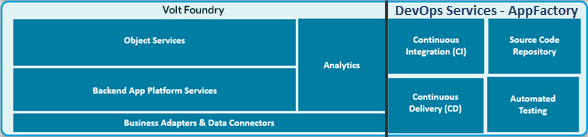

AppPlatform Overview
================
Here is a brief overview on Volt MX products, sub-products and their features. We also discuss how these products interact to provide you with a comprehensive solution to develop omni-channel digital apps.
We classify Volt MX's product portfolio as follows:

Volt MX AppPlatform

*  [Volt MX Iris](#volt-mx-iris)
    * Widgets
    * APIs 
    * Reusable Components
*  [Volt MX Foundry](#volt-mx-foundry)
    * Identity Services
    * Integration Services
    * Orchestration Services
    * Object Services
    * API Management
    * Engagement Services
    * Offline Objects
    * Reports
*  [Volt MX App Viewer](#volt-mx-appviewer)
*  [DevOps Services - App Factory](#devops-services---appfactory)
*  [Volt MX Marketplace](#volt-mx-marketplace)

Volt MX AppPlatform is a comprehensive app development platform for various digital channels. AppPlatform allows you to build an Omni-channel, multi-platform app. It consists of the following sub-products:
* Iris – Design your app and add business logic.
* Volt MX – Integrate with data and allied services.
* App Viewer – preview the app as you develop.

Volt MX Iris
-------------

Iris is the Volt MX integrated development environment used to design, build, debug and deploy apps for mobile, tablet, desktop web, and other digital channels. Apps are designed using:
* Widgets: Collection of user interface elements that can be dragged and dropped onto the application forms. Explore more about widgets [here](../../../Iris/iris_widget_prog_guide/Content/Overview.md).
* APIs: Set of functions and procedures that are used to write the code in controller files to achieve various functionalities. Explore more about APIs [here](../../../Iris/iris_api_dev_guide/content/introduction.md).
* Components: Ready-to-use building blocks for applications.

Volt MX Foundry
-------------

Volt MX’s capabilities extend to providing Identity Services, Integration Services, Orchestration Services, Object Services, Engagement Services, Offline Objects, and generating reports.

### Identity Services
* Authenticates users of the application.
* Supports Enterprise Identity Providers like MS Active Directory, Open LDAP, OAuth 2.0, Salesforce, Custom Identity Service etc.
* Supports Social Identity providers like Google, Linkedin, Instagram, Amazon, Microsoft, Yahoo, BOX, and Facebook.
* Explore more about Identity services [here](../../../Foundry/voltmx_foundry_user_guide/Content/Identity.md).

### Integration Services
* Define back-end services for your application.
* Enables the application to exchange data with any external data source.
* Supports end point adapters like SOAP, JSON, XML, JavaScript, Database, SalesForce etc.
* Build Java Services if external data source does not expose the services.
* Explore more about Integration services [here](../../../Foundry/voltmx_foundry_user_guide/Content/Services.md).

### Orchestration Services
* Service orchestration integrates several services and exposes them as a single service.
* Create work flows and composite services that include custom logic and data processing.
* Create Composite or Looping Services.
* Explore more about Orchestration services [here](../../../Foundry/voltmx_foundry_user_guide/Content/Orchestration.md).

### Object Services
* Create a data model that serves as a bridge between back-end data and the client application.
* Enables you to control your API calls and data in a better manner.
* Develop applications in a faster and more intuitive manner.
* Explore more about Object Services [here](../../../Foundry/voltmx_foundry_user_guide/Content/Objectservices.md).

### API Management
* Manage shared services (identity, integration, orchestration, objects, and logic for Node.js services) without linking or configuring them within an app.
* Supports versioning for integration services and orchestration services.
* Create a Portal for exposing APIs created using Volt MX Foundry.
* Explore more about API Management [here](../../../Foundry/voltmx_foundry_user_guide/Content/API_Management.md).

### Engagement Services
* Send notifications to subscribed applications.
* Provides services like push notifications, event management, campaign management, and user management.
* Supports multiple digital platforms.
* Explore more about Engagement Services [here](../../../Foundry/vms_console_user_guide/Content/Introduction.md).

### Offline Objects
* Download objects data an object service, use the data without network connectivity and sync later with the Volt MX Foundry object services back end.
* Uses the OData protocol, an open-sourced protocol to connect directly with object services.
* Use with apps developed with Volt MX Iris or apps that are developed natively.
* Explore more about Offline Objects [here](../../../Foundry/offline_objects_gettingstarted/Content/Offline_Objects_Getting_Started.md).

### Reports
* Reports provide information about the app usage statistics such as active users, error reports, error details.
* Explore more about metrics and reports [here](../../../Foundry/custom_metrics_and_reports/Content/Custom_Metrics_and_Reports_Guide.md).

Volt MX AppViewer
-------------
Use App Viewer to view the front-end prototype of a project on a device and run any action attached to a form, pop-up, or widget such as navigating from one form to other, applying a skin to a widget, and opening a pop-up window. As you make changes to your project and incrementally build and publish those changes using the App Viewer command, you can see those changes reflected in a local preview of the app on the device. Explore more about AppViewer [here](../../..//Iris/iris_app_viewer/Content/FunctionalPreviewEnterprise.md#preview-an-app-on-the-cloud).
{: .left-float}
{: .right-float-img}	

DevOps Services - AppFactory
-------------

* Consists of features like Continuous Integration, Continuous Delivery, and Device Testing.
* Allows developers to continuously build, test, and deploy apps.
* Provides a Continuous Delivery platform for building multi-channel applications.
* Check-in your Foundry configurations and Iris source code into GitHub and build the application across mobile, desktop, and web.
* Deploy the application to a specific environment and test it through automation testing on real devices.
* Explore more about AppFactory [here](../../../Foundry/voltmx_appfactory_user_guide/Content/Introduction.md).

Volt MX Marketplace
-------------
It is a repository of ready-to-use Apps, Micro Apps, Components, and Data Adapters. Apps, Micro Apps, and Components are developed using widgets and APIs in Iris. Data adapters are developed using services in Volt MX Foundry. Explore more about components and data adapters [here](../../../Foundry/voltmx_foundry_user_guide/Content/CustomDataConfig.md). Explore more about Volt MX Marketplace [here](https://marketplace.hclvoltmx.com/).
{: .left-float}
{: .right-float-img}
