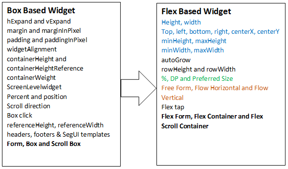

  

Overview
========

The Box-to-Flex Converter tool enables you to leverage capabilities of the new flex widget in your existing box-based applications. Currently, you cannot use both Box and Flex layout widgets together.

Click [here](https://download.hcl-cloud.com/onpremise/apps/box2flexconverter/Box2FlexConverter.zip) to download the Box-to-Flex Converter tool.

Use the Box-to-Flex Converter tool in the following scenarios:

*   To implement rich animations in existing box-based applications.
*   Introduce new flows to an existing app with new flex capabilities, while retaining the properties of the existing forms.

Do not use the Box-to-Flex Converter tool if the navigational flow (for example, the Hamburger menu) changes are planned in upcoming versions. In that scenario, we recommended that you design the application from scratch instead of using this tool.

Key Features
------------

The key features of the Flex layout converter tool are as follows:

*   It takes any box-based Eclipse application as an input and creates a new Eclipse application with FlexContainers.
*   It coverts forms into FlexForms, and also suggests the target form-type.
*   You can convert all Box, Tab, and ScrollBox containers into Flex and FlexScrollContainers.
*   It supports all types of layouts (Free Form, Horizontal, and Vertical). You can convert existing Boxes to different types of FlexContainers automatically. This tool intelligently decides the layout type of the target FlexContainer.
*   You can remove unnecessary Box widgets created in Box layout that are not required in the Flex layout. This tool identifies the placeholder Boxes and removes them automatically.
*   The HBox container is directly mapped to the Horizontal flex container. Similarly, the Vbox is mapped to vertical flex. However, the new container called Free Form FlexContainer allows you to place any widget at any location. The recorded data is analyzed and any Hbox/Vbox to be mapped to the Free Flow flex container are suggested. This tool can remove child boxes to any level.
*   It can convert existing parameters of the Box to DP or Percentage units. The supported parameters for conversion are hExpand, vExpand, and widgetAlignment.
*   Dynamically created widgets in JavaScript modules can also be converted.
*   It sets positional and dimensional properties to all widgets in designer forms and JavaScript modules.
*   Dynamically-created widgets can be reused across multiple forms. You can manually match the recorded widget with a dynamically-created widget.
*   You can choose to convert different types of Box templates to Flex-based templates
*   It is a cross-platform tool.
*   It not only sets the top/left/height/width, but can also set the right/bottom/centerX/center intelligently by using the existing Box-based properties (percent or auto box, box position, hExpand, vExpand, containerweight, margin, padding, widgetAlignment, contentAlignment, containerHeight, and containerHeightReference).
*   You can manually update the positional and dimensional properties of any widget.
*   The option to choose whether to convert Templates is available.
*   It suggests new Flex properties even if a matching recorded widget is not found by analyzing the Box hierarchy and the layout.
*   It identifies and informs you about risky references such as updating the margin, padding, widgetAlignment, containerHeight, refeenceheight, width, and containerHeightReference in JavaScript modules and form snippets.
*   It suggests possible Flex code to replace the risky reference Box code. For example, set height for a widget instead of containerHeight.
*   It saves risky references as a report, so that you can analyze the source code later by referring to the report.
*   It allows the merging of multiple widget data recordings into a single widget data recording.

Conversion Flow
---------------

