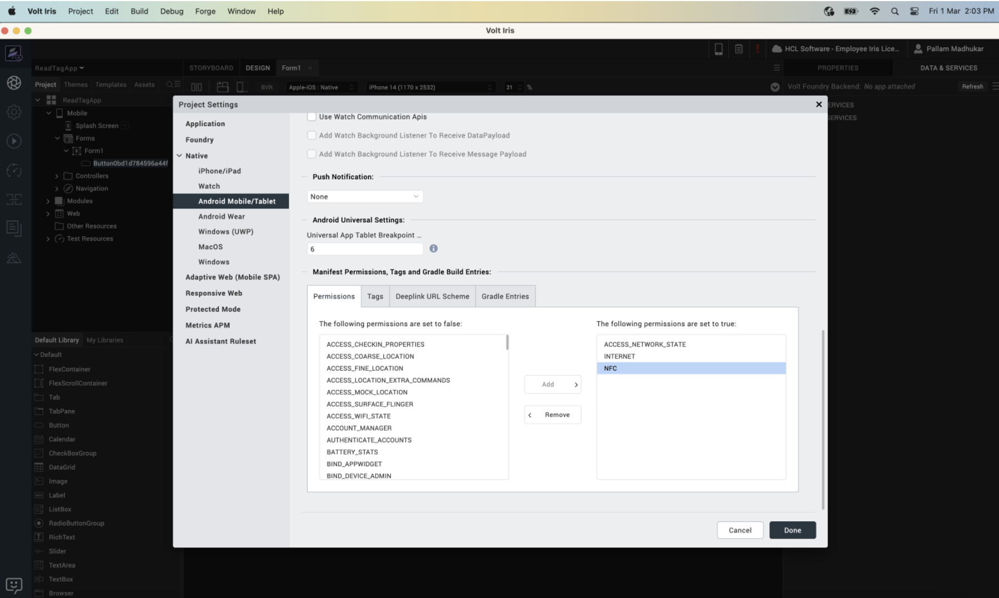
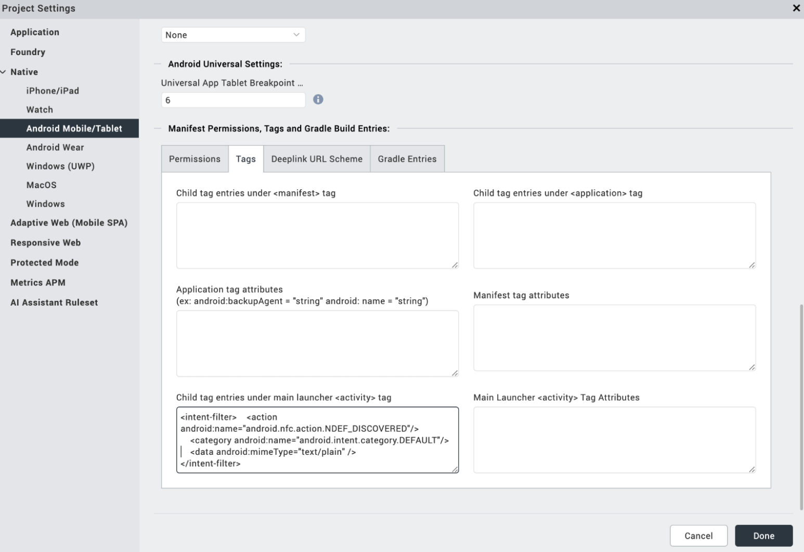

                            
Android NFC Manifest configuration
==================================

## Permissions required 

To enable the NFC functionality on Android the applications below permission must be added in its Manifest file. 

`<uses-permission android:name="android.permission.NFC"/>`

<b>If this permission is not added, the NFC functionality will not be enabled.</b>

This permission can be added through Iris using the steps below. 

**Open Project Settings -> select Native Tab -> select Android Mobile/Tablet -> In Manifest Permissions (Permission Tab) -> add NFC and click Done.**

## Mime Type determination by Android 

When an Android-powered device scans an NFC tag containing NDEF formatted data, it parses the message and tries to figure out the data's MIME type or identifying URI. To do this, the system reads the first NdefRecord inside the NdefMessage to determine how to interpret the entire NDEF message (an NDEF message can have multiple NDEF records).If any of your application intent filter matches the first record, the application gets launched by the Android system.If there are multiple applications that listen for that record, the system shows the list of applications, and the user can select the application among the list. 

Currently below data types are supported by voltmx.nfc namespace for reading and writing. 

* Text 
* Uri 
* Mime Media 

## Filters for NFC Intent 

Through the set of NFC Api’s provided by voltmx.nfc namespace user can read or write the data to NFC tags. 

If an application wants to read a particular type of data, and the application can handle that type of data then that data intent filter must be defined inside the manifest as an intent-filter. 

If the NFC tag is scanned and contains the data that your application can handle, your application will be automatically launched by the Android system and the data will be sent to your application through the launch intent. 

For reading or writing the tag your application can listen for below two actions through intent-filter in the manifest file. 

* android.nfc.action.NDEF_DISCOVERED 
* android.nfc.action.TAG_DISCOVERED 

## Action NDEF_DISCOVERED 

Whenever the NFC tag is scanned and contains the NDEF data in the tag. Intent with this action will be delivered to the application which is capable of handling that type of data and the application will be started automatically by Android system. 

>**Note :** If there are multiple applications able to handle the type of data, Android system will present the list of applications to the user. The user will need to select which application to be launched and handle that data. 

The intent filter category should be **android.intent.category.DEFAULT** and the data element can change depending on the type of data your application can handle and listen to. 

Below intent filter is an example of the application which can handle the data of type text/plain. 

`<intent-filter>` 
`<action android:name="android.nfc.action.NDEF_DISCOVERED"/>` 
`<category android:name="android.intent.category.DEFAULT"/>`  
`<data android:mimeType="text/plain"/>` 
`</intent-filter>`

Here is one more example of the intent filter which filters for a URI in the form of

click [here](https://developer.android.com/index.html)

`<intent-filter>` 
`<action android:name="android.nfc.action.NDEF_DISCOVERED"/>` 
`<category android:name="android.intent.category.DEFAULT"/>`  
`<data android:scheme="https"` 
`android:host="developer.android.com"` 
`android:pathPrefix="/index.html"/>` 
`</intent-filter>`

<b>Please note that the data element can be configured differently for different data types, and you can follow the standard Android guidelines to configure the data element in the intent filter so that your application can only listen to the data types you are interested in.</b>

For more detailed information regarding the intent filter and data types, please go through the official Android document links below. 

[intent filter](https://developer.android.com/guide/components/intents-filters )

[data types](https://developer.android.com/guide/topics/manifest/data-element )

## Action TAG_DISCOVERED 

This action will be triggered when the tag does not contain any data, that is the tag is empty. 

This action also gets triggered if no activities handle the ACTION_NDEF_DISCOVERD 

Your application can listen to this action by adding the below intent filter.

`<intent-filter>` 
`<action android:name="android.nfc.action.TAG_DISCOVERED"/>` 
`</intent-filter>`

For more information regarding how the Android system filters the NFC intent visit the link below. 

click [here](https://developer.android.com/develop/connectivity/nfc/nfc#dispatching)

## How to add intent filter through Iris 

Intent filters can be added to the application using the steps below. 

**Open Project Settings -> select Native Tab -> select Android Mobile/Tablet -> In Tags section ->  Child tag entries under main launcher < activity > tag -> add intent filters and click Done**

## Android Official Resource link 

For more information regarding NFC on Android, you can go through the official Android document link. 

click [here](https://developer.android.com/develop/connectivity/nfc)

