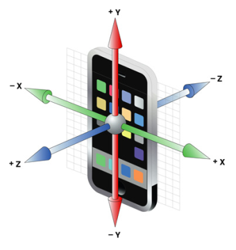

                              

You are here: Accelerometer APIs

Accelerometer API
=================

Using the Accelerometer API, you can register various gesture events (such as shake), and then detect the change in orientation of a device along three orthogonal axes x, y, and z.

The following diagram shows the standard coordinate system that the Volt MX Accelerometer API uses

This coordinate system is independent of any particular type of device. The following table describes the coordinate system to be used for the accelerometer API:

<table style="caption-side: top;mc-table-style: url('resources/tablestyles/basic.css');" class="TableStyle-Basic" cellspacing="0"><colgroup><col class="TableStyle-Basic-Column-Column1"> <col class="TableStyle-Basic-Column-Column1"> <col class="TableStyle-Basic-Column-Column1"> <col class="TableStyle-Basic-Column-Column1"></colgroup><tbody><tr class="TableStyle-Basic-Body-Body1"><th class="TableStyle-Basic-BodyE-Column1-Body1">Axis</th><th class="TableStyle-Basic-BodyE-Column1-Body1">Description</th><th class="TableStyle-Basic-BodyE-Column1-Body1">Value</th><th class="TableStyle-Basic-BodyD-Column1-Body1">Direction</th></tr><tr class="TableStyle-Basic-Body-Body1"><td rowspan="2" class="TableStyle-Basic-BodyE-Column1-Body1">X</td><td class="TableStyle-Basic-BodyE-Column1-Body1" rowspan="2">Floating point value indicating the magnitude of the acceleration force along the X-Axis</td><td class="TableStyle-Basic-BodyE-Column1-Body1">positive</td><td class="TableStyle-Basic-BodyD-Column1-Body1">Towards the right when the device is facing you</td></tr><tr class="TableStyle-Basic-Body-Body1"><td class="TableStyle-Basic-BodyE-Column1-Body1">negative</td><td class="TableStyle-Basic-BodyD-Column1-Body1">Towards the left when the device is facing you</td></tr><tr class="TableStyle-Basic-Body-Body1"><td class="TableStyle-Basic-BodyE-Column1-Body1" rowspan="2">Y</td><td class="TableStyle-Basic-BodyE-Column1-Body1" rowspan="2">Floating point value indicating the magnitude of the acceleration force along the Y-Axis</td><td class="TableStyle-Basic-BodyE-Column1-Body1">positive</td><td class="TableStyle-Basic-BodyD-Column1-Body1">Towards the top of the top of the device</td></tr><tr class="TableStyle-Basic-Body-Body1"><td class="TableStyle-Basic-BodyE-Column1-Body1">negative</td><td class="TableStyle-Basic-BodyD-Column1-Body1">Towards the bottom of the device</td></tr><tr class="TableStyle-Basic-Body-Body1"><td class="TableStyle-Basic-BodyE-Column1-Body1" rowspan="2">Z</td><td class="TableStyle-Basic-BodyE-Column1-Body1" rowspan="2">Floating point value indicating the magnitude of the acceleration force along the Z-Axis</td><td class="TableStyle-Basic-BodyE-Column1-Body1">positive</td><td class="TableStyle-Basic-BodyD-Column1-Body1">The axis coming out from the device screen (towards you) when the device is facing you</td></tr><tr class="TableStyle-Basic-Body-Body1"><td class="TableStyle-Basic-BodyE-Column1-Body1">negative</td><td class="TableStyle-Basic-BodyD-Column1-Body1">The axis coming out from the device back (away from you) when the device is facing you</td></tr></tbody></table>

 

<iframe src="https://www.youtube.com/embed/L4nic6Y49yc" allowfullscreen=""></iframe>

The Accelerometer API uses `voltmx.accelerometer Namespace` and helps you manage and retrieve data from the device's accelerometer. It comprises of the following API elements.

| Function | Description |
| --- | --- |
| [voltmx.accelerometer.registerAccelerationEvents](accelerometerfunctions.md#accelero4) | Registers event handlers for acceleration events, such as 'shake'. |
| [voltmx.accelerometer.retrieveCurrentAcceleration](accelerometerfunctions.md#accelero) | Sets callback functions for retrieving the current device acceleration. |
| [voltmx.accelerometer.startMonitoringAcceleration](accelerometerfunctions.md#accelero2) | Starts monitoring the device's acceleration on a continuous basis. |
| [voltmx.accelerometer.stopMonitoringAcceleration](accelerometerfunctions.md#accelero3) | Stops the device monitoring activity if it is active. |
| [voltmx.accelerometer.unregisterAccelerationEvents](accelerometerfunctions.md#accelero5) | Unregisters event handlers for the specified acceleration event types. |

 

When you use the Acceleometer API, any changes in gestures are registered by invoking the [voltmx.accelerometer.registerAccelerationEvents](accelerometerfunctions.md#accelero4) function. After the change is registered, the current acceleration of the device is determined by using the [voltmx.accelerometer.retrieveCurrentAcceleration](accelerometerfunctions.md#accelero) function. Moniter the acceleration of the device by using the [voltmx.accelerometer.startMonitoringAcceleration](accelerometerfunctions.md#accelero2) function. To stop monitoring the device, use the [voltmx.accelerometer.stopMonitoringAcceleration](accelerometerfunctions.md#accelero3) function. To unregister event handlers for the specified acceleration event types, you can use the [voltmx.accelerometer.unregisterAccelerationEvents](accelerometerfunctions.md#accelero5) function.

> **_Note:_** The accelerometer APIs are applicable only when `os.platform().hasaccelerometer` returns true.

 

To view the functionality of the Accelerometer API in action, download the sample application from the link below. Once the application is downloaded, build and preview the application using the Volt MX App.

  

