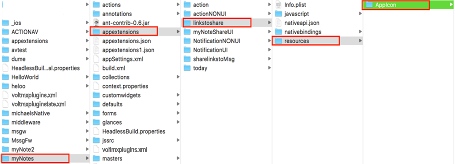
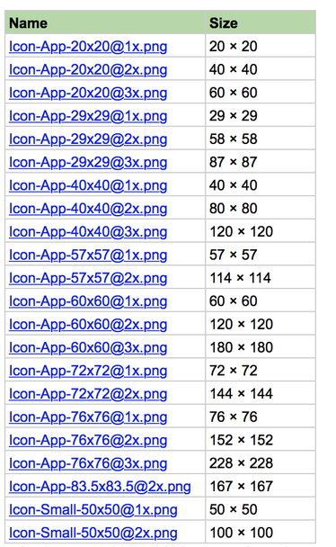

                             

You are here: App Extension API for iOS

App Extension API for iOS
=========================

Volt MX  Iris facilitates the process of creating app extensions for iOS apps. An app extension adds extended functionality to the app in which the extension is embedded. Apps use app extensions to perform only specific tasks that take small amounts of time to execute. For example, you can create an app extension that enables users to edit images that are embedded within another app, such as a document viewer or text editor.

The App Extension API for iOS contains the following namespaces and API elements:

*   [voltmx.actionExtension Namespace](voltmx.actionextension_functions.md)

| Function | Description |
| --- | --- |
| [voltmx.actionExtension.setExtensionsCallbacks](voltmx.actionextension_functions.md#setExtensionsCallbacks) | Sets an Action Extension with callbacks for app extension state changes. |

 

| Property | Description |
| --- | --- |
| [voltmx.actionExtensions.view](voltmx.actionextension_properties.md#view) | Holds the current extension view. |

 

*   [voltmx.iMessageExtensions Namespace](voltmx.imessageextensionsfunctions.md)

| Function | Description |
| --- | --- |
| [voltmx.iMessageExtensions.setExtensionsCallbacks](voltmx.imessageextensionsfunctions.md#setExtensionsCallbacks) | Sets an iMessage extension functionality with various states as callback events. |

 

| Property | Description |
| --- | --- |
| [voltmx.iMessageExtensions.view](voltmx.imessageextensionsfunctions.md#view) | Holds the current extension view. |

 

*   [voltmx.intentExtension Namespace](voltmx.intentextension_functions.md)

| Function | Description |
| --- | --- |
| [voltmx.intentExtension.setExtensionsCallbacks](voltmx.intentextension_functions.md#setExtensionsCallbacks) | Sets an iMessage extension functionality with various states as callback events. |

 

*   [voltmx.notificationContentExtension Namespace](voltmx.notificationcontentextension_functions.md)

| Function | Description |
| --- | --- |
| [voltmx.notificationContentExtension.setExtensionsCallbacks](voltmx.notificationcontentextension_functions.md#setExtensionsCallbacks) | Sets a notification content extension with various states as callback events. |

 

| Property | Description |
| --- | --- |
| [voltmx.notificationContentExtension .view](voltmx.notificationcontentextension_functions.md#view) | Holds the current extension view. |

 

*   [voltmx.shareExtensions Namespace](voltmx.shareextensionsfunctions.md)

| Function | Description |
| --- | --- |
| [voltmx.shareExtensions.popConfigurationViewController](voltmx.shareextensionsfunctions.md#popConfigurationViewController) | Dismisses the current configuration view controller. |
| [voltmx.shareExtensions.pushConfigurationViewController](voltmx.shareextensionsfunctions.md#pushConfigurationViewController) | Displays a configuration view controller. |
| [voltmx.shareExtensions.setExtensionsCallbacks](voltmx.shareextensionsfunctions.md#setExtensionsCallbacks) | Allows your app to set callback event handlers for a Share extension. |

 

| Property | Description |
| --- | --- |
| [voltmx.shareExtensions.charactersRemaining](voltmx.shareextensionsfunctions.md#charactersRemaining) | Sets an initial value to be displayed as the number of characters remaining in the placeholder. |
| [voltmx.shareExtensions.contentText](voltmx.shareextensionsfunctions.md#contentText) | Contains the text from the current textView. |
| [voltmx.shareExtensions.extensionContext](voltmx.shareextensionsfunctions.md#extensionContext) | Returns the current extension context. |
| [voltmx.shareExtensions.placeholder](voltmx.shareextensionsfunctions.md#placeholder) | Sets the text for the share app extension in the placeholder. |
| [voltmx.shareExtensions.view](voltmx.shareextensionsfunctions.md#view) | Holds the current extension view. |

 

*   [voltmx.todayExtension Namespace](voltmx.todayextension_functions.md)

| Function | Description |
| --- | --- |
| [voltmx.todayExtension.setExtensionsCallbacks](voltmx.todayextension_functions.md#setExtensionsCallbacks) | Sets a Today extension with callbacks for app extension state changes. |

 

| Property | Description |
| --- | --- |
| [voltmx.todayExtension.view](voltmx.todayextension.md#view) | Stores the current extension view. |

   

Overview
--------

Volt MX  Iris provides support for the following Apple App Extensions.

*   Action Extensions
*   iMessage Extensions
*   Intent Extensions
*   Notification Content Extensions
*   Share Extensions
*   Today Extensions

For more information about what app extension are and what you can do with them, refer Apple's [App Extension Programming Guide](https://developer.apple.com/library/archive/documentation/General/Conceptual/ExtensibilityPG/index.md#//apple_ref/doc/uid/TP40014214).

Volt MX  Iris Classic allows you to create app extensions directly in its workspace. Each app extension within the workspace will be treated as a Iris Classic project within the project and stored in a folder called  `appextensions`.

### Creating App Extensions

App extensions must be embedded in a container app. The app extension enhances the functionality of the container app. To build an app extension in Volt MX Iris, you write your app extension using the Volt MX App Extension API for iOS and with native iOS calls that your app invokes through the Volt MX [Native Function API](../../../Iris/iris_nf_api_dev_guide/content/native_function_api_developers__guide.md).

To learn about creating an app extension in Volt MX Iris, follow these steps:

1.  Open an existing Volt MX Iris project. This is your container app.
2.  From Volt MX Iris's main menu, select **File** > **New Project**.
3.  In the dialog box that appears, choose **App Extension**.
4.  In the dialog box that appears, choose the type of app extension that you would like to create and then click **Add**.
5.  The **Configure App Extension** dialog box appears. Type in a name for your app extension.
6.  Select the template to use for the extension. Your extension can either have a UI or not, depending on which template you select.
7.  Click **Finish**.

Volt MX  Iris creates an empty view that you can add JavaScript code to. For more information, refer [create an iOS application extension](../../../Iris/iris_user_guide/Content/CreateApplicationExtension.md).

You can then import an existing app extension into your project. To learn about importing an app extension, refer [Import an application extension](../../../Iris/iris_user_guide/Content/ImportAppExtension.md).

### Sharing Data between an Extension and Its App

Even though the app extension is packaged within the containing app bundle, you must explicitly set up a share container so that the app extension and the containing app can share data among themselves.

The shared container can be created using the [App Group AP](sharedappgroupcontainerapi.md)I and the [Native Function API](native_function.md). For more about sharing data, refer to the **Sharing Data with Your Containing App** section in the [Apple documentation](https://developer.apple.com/library/archive/documentation/General/Conceptual/ExtensibilityPG/ExtensionScenarios.md). Also, see the [App Group API](sharedappgroupcontainerapi.md) overview in the [VoltMX Iris API Developer’s Guide](../../../Iris/iris_api_dev_guide/content/introduction.md).

### Deleting an App Extension from a Project

You can delete an app extension from your project by right-clicking the extension in the **Project** pane of Volt MX Iris and selecting Delete. Iris will remove the extension and its folder from the project.

### Enabling and Disabling an App Extension within a Project

You can enable or disable an app extension that is in a project by right-clicking the extension in the **Project** pane of Volt MX Iris. If the app extension is enabled, **Disabled** will appear in the context menu and you can select that to disable the app extension. Disabled app extensions are not compiled or added to the final app when you do a build.

If the app extension is disabled, the context menu contains **Enable**. Select that to enable the app extension.

### Adding an Icon to an App Extension

You can add a custom icon to your app extension that represents the function it performs. To do so, you must create a template image that iOS uses as a mask when it generates the final icon. To ensure that the template image looks good in the final UI, please follow the guidelines below.

*   DO use a black and white image with the appropriate level of transparency.
*   DON'T include a drop shadow.
*   DO use antialiasing when you create your template image.
*   DO use a transparent background for your template image.
*   DON'T use a solid white background for the image.

After you have created the image, place it in the AppIcon folder, which is shown in the illustration below.

Apple requires you to provide your template image in specific sizes. The following table shows the required template image files.

