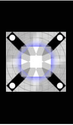
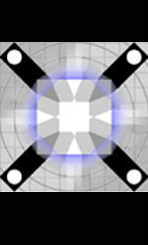
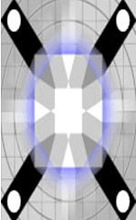

constants Namespace
===================

The `constants` namespace contains constants that are used by the Volt MX Iris API framework, the Volt MX Iris Widgets, and the Volt MX Iris Reference Architecture.

*   [Alphabetical Listing of All Constants](#alphabetical-listing-of-all-constants)
*   [Constants by Functional Area](#constants-by-functional-area)

Alphabetical Listing of All Constants
-------------------------------------

<!-- | Constant | Functional Area |
| --- | --- |
| constants.ACTION\_ITEM\_STYLE\_CANCEL | [Action Item Style Constants](#ActionItemStyles) |
| constants.ACTION\_ITEM\_STYLE\_DEFAULT | [Action Item Style Constants](#ActionItemStyles) |
| constants.ACTION\_ITEM\_STYLE\_DESTRUCTIVE | [Action Item Style Constants](#ActionItemStyles) |
| constants.ANCHOR\_DIRECTION\_BOTTOM | [Action Sheet Anchor Direction Constants](#ActionSheetAnchorDirection) |
| constants.ANCHOR\_DIRECTION\_LEFT | [Action Sheet Anchor Direction Constants](#ActionSheetAnchorDirection) |
| constants.ANCHOR\_DIRECTION\_RIGHT | [Action Sheet Anchor Direction Constants](#ActionSheetAnchorDirection) |
| constants.ANCHOR\_DIRECTION\_TOP | [Action Sheet Anchor Direction Constants](#ActionSheetAnchorDirection) |
| constants.AUTOMATIC | [Tint Mode Constants](#TintMode) |
| constants.BAR\_BUTTON\_CUSTOM | [ButtonBarItem Type Constants](#ButtonBarItemType) |
| constants.BAR\_BUTTON\_IMAGE | [ButtonBarItem Type Constants](#ButtonBarItemType) |
| constants.BAR\_BUTTON\_SYSTEM\_ITEM | [ButtonBarItem Type Constants](#ButtonBarItemType) |
| constants.BAR\_BUTTON\_TITLE | [ButtonBarItem Type Constants](#ButtonBarItemType) |
| constants.BAR\_ITEM\_STYLE\_DONE | [Bar Item Style Constants](#BarItemStyle) |
| constants.BAR\_ITEM\_STYLE\_PLAIN | [Bar Item Style Constants](#BarItemStyle) |
| constants.BAR\_METRICS\_COMPACT | [Bar Metrics Constants](#BarMetricsConstants) |
| constants.BAR\_METRICS\_DEFAULT | [Bar Metrics Constants](#BarMetricsConstants) |
| constants.BAR\_STYLE\_BLACK | [Bar Style Constants](#BarStyleConstants) |
| constants.BAR\_STYLE\_DEFAULT | [Bar Style Constants](#BarStyleConstants) |
| constants.BLUR\_EFFECT\_DARK | [Blur Effect Constants](#BLUREFFECT) |
| constants.BLUR\_EFFECT\_EXTRALIGHT | [Blur Effect Constants](#BLUREFFECT) |
| constants.BLUR\_EFFECT\_LIGHT | [Blur Effect Constants](#BLUREFFECT) |
| constants.BLUR\_EFFECT\_NONE | [Blur Effect Constants](#BLUREFFECT) |
| constants.BLUR\_EFFECT\_PROMINENT | [Blur Effect Constants](#BLUREFFECT) |
| constants.BLUR\_EFFECT\_REGULAR | [Blur Effect Constants](#BLUREFFECT) |
| constants.BREAKPOINT\_MAX\_VALUE | [Breakpoint Constant](#Breakpoint_Constants) |
| constants.DIMMED | [Toast Position Constants](#ToastPosition) |
| constants.TOAST\_LENGTH\_LONG | [Toast Duration Constants](#ToastDuration) |
| constants.MULTIPLY | [Toast Position Constants](#ToastPosition) |
| constants.NORMAL | [Toast Position Constants](#ToastPosition) |
| constants.SCREEN | [Toast Position Constants](#ToastPosition) |
| constants.TOAST\_LENGTH\_SHORT | [Toast Duration Constants](#ToastDuration) |
| constants.SKIN\_IMAGE\_SCALE\_MODE\_DEFAULT | [Skin Image Scale Mode Constants](#SkinImageScaleMode) |
| constants.SKIN\_IMAGE\_SCALE\_MODE\_FILL | [Skin Image Scale Mode Constants](#SkinImageScaleMode) |
| constants.SKIN\_IMAGE\_SCALE\_MODE\_NONE | [Skin Image Scale Mode Constants](#SkinImageScaleMode) |
| constants.SKIN\_IMAGE\_SCALE\_MODE\_UNIFORM | [Skin Image Scale Mode Constants](#SkinImageScaleMode) |
| constants.SKIN\_IMAGE\_SCALE\_MODE\_UNIFORMTOFILL | [Skin Image Scale Mode Constants](#SkinImageScaleMode) |
| constants.SRC\_ATOP | [Toast Position Constants](#ToastPosition) |
| constants.SRC\_IN | [Toast Position Constants](#ToastPosition) |
| constants.SRC\_OVER | [Toast Position Constants](#ToastPosition) |
| constants.SYSTEM\_ITEM\_ACTION | [System Item Constants](#SystemItem) |
| constants.SYSTEM\_ITEM\_ADD | [System Item Constants](#SystemItem) |
| constants.SYSTEM\_ITEM\_BOOKMARKS | [System Item Constants](#SystemItem) |
| constants.SYSTEM\_ITEM\_CAMERA | [System Item Constants](#SystemItem) |
| constants.SYSTEM\_ITEM\_CANCEL | [System Item Constants](#SystemItem) |
| constants.SYSTEM\_ITEM\_COMPOSE | [System Item Constants](#SystemItem) |
| constants.SYSTEM\_ITEM\_DONE | [System Item Constants](#SystemItem) |
| constants.SYSTEM\_ITEM\_EDIT | [System Item Constants](#SystemItem) |
| constants.SYSTEM\_ITEM\_FAST\_FORWARD | [System Item Constants](#SystemItem) |
| constants.SYSTEM\_ITEM\_FIXED\_SPACE | [System Item Constants](#SystemItem) |
| constants.SYSTEM\_ITEM\_FLEXIBLE\_SPACE | [System Item Constants](#SystemItem) |
| constants.SYSTEM\_ITEM\_ORGANIZE | [System Item Constants](#SystemItem) |
| constants.SYSTEM\_ITEM\_PAGE\_CURL | [System Item Constants](#SystemItem) |
| constants.SYSTEM\_ITEM\_PAUSE | [System Item Constants](#SystemItem) |
| constants.SYSTEM\_ITEM\_PLAY | [System Item Constants](#SystemItem) |
| constants.SYSTEM\_ITEM\_REDO | [System Item Constants](#SystemItem) |
| constants.SYSTEM\_ITEM\_REFRESH | [System Item Constants](#SystemItem) |
| constants.SYSTEM\_ITEM\_REPLY | [System Item Constants](#SystemItem) |
| constants.SYSTEM\_ITEM\_REWIND | [System Item Constants](#SystemItem) |
| constants.SYSTEM\_ITEM\_SAVE | [System Item Constants](#SystemItem) |
| constants.SYSTEM\_ITEM\_SEARCH | [System Item Constants](#SystemItem) |
| constants.SYSTEM\_ITEM\_STOP | [System Item Constants](#SystemItem) |
| constants.SYSTEM\_ITEM\_TRASH | [System Item Constants](#SystemItem) |
| constants.SYSTEM\_ITEM\_UNDO | [System Item Constants](#SystemItem) |
| constants.TOAST\_POS\_BOTTOM\_CENTER | [Toast Position Constants](#ToastPosition) |
| constants.TOAST\_POS\_BOTTOM\_LEFT | [Toast Position Constants](#ToastPosition) |
| constants.TOAST\_POS\_BOTTOM\_RIGHT | [Toast Position Constants](#ToastPosition) |
| constants.TOAST\_POS\_MIDDLE\_CENTER | [Toast Position Constants](#ToastPosition) |
| constants.TOAST\_POS\_MIDDLE\_LEFT | [Toast Position Constants](#ToastPosition) |
| constants.TOAST\_POS\_MIDDLE\_RIGHT | [Toast Position Constants](#ToastPosition) |
| constants.TOAST\_POS\_TOP\_CENTER | [Toast Position Constants](#ToastPosition) |
| constants.TOAST\_POS\_TOP\_LEFT | [Toast Position Constants](#ToastPosition) |
| constants.TOAST\_POS\_TOP\_RIGHT | [Toast Position Constants](#ToastPosition) | -->


<table>
<tr>
<th>Constant</th>
<th>Functional Area</th>
</tr>
<tr>
<td>constants.ACTION_ITEM_STYLE_CANCEL</td>
<td rowspan="3"><a href="#ActionItemStyles">Action Item Style Constants</a></td>
</tr>
<tr>
<td>constants.ACTION_ITEM_STYLE_DEFAULT</td>
</tr>
<tr>
<td>constants.ACTION_ITEM_STYLE_DESTRUCTIVE</td>
</tr>

<tr>
    <td>constants.ANCHOR_DIRECTION_BOTTOM</td>
    <td rowspan="4"><a href="#ActionSheetAnchorDirection">Action Sheet Anchor Direction Constants</a></td>
</tr>
<tr>
    <td>constants.ANCHOR_DIRECTION_LEFT</td>
</tr>
<tr>
    <td>constants.ANCHOR_DIRECTION_RIGHT</td>
</tr>
<tr>
    <td>constants.ANCHOR_DIRECTION_TOP</td>
</tr>

<tr>
    <td>constants.AUTOMATIC</td>
    <td><a href="#TintMode">Tint Mode Constants</a></td>
</tr>

<tr>
    <td>constants.BAR_BUTTON_CUSTOM</td>
    <td rowspan="4"><a href="#ButtonBarItemType">ButtonBarItem Type Constants</a></td>
</tr>
<tr>
    <td>constants.BAR_BUTTON_IMAGE</td>
</tr>
<tr>
    <td>constants.BAR_BUTTON_SYSTEM_ITEM</td>
</tr>
<tr>
    <td>constants.BAR_BUTTON_TITLE</td>
</tr>


<!-- <tr>
    <td>constants.BAR_ITEM_STYLE_DONE</td>
    <td rowspan="2"><a href="#BarStyleConstants">Bar Item Style Constants</a></td>
</tr>
<tr>
    <td>constants.BAR_ITEM_STYLE_PLAIN</td>
</tr> -->


<tr>
    <td>constants.BAR_METRICS_COMPACT</td>
    <td rowspan="2"><a href="#BarMetricsConstants">Bar Metrics Constants</a></td>
</tr>
<tr>
    <td>constants.BAR_METRICS_DEFAULT</td>
</tr>

<tr>
    <td>constants.BAR_STYLE_BLACK</td>
    <td rowspan="2"><a href="#BarStyleConstants">Bar Style Constants</a></td>
</tr>
<tr>
    <td>constants.BAR_STYLE_DEFAULT</td>
</tr>


<!-- <tr>
    <td>constants.BLUR_EFFECT_DARK</td>
    <td rowspan="6"><a href="#BLUREFFECT">Blur Effect Constants</a></td>
</tr>
<tr>
    <td>constants.BLUR_EFFECT_EXTRALIGHT</td>
</tr>
<tr>
    <td>constants.BLUR_EFFECT_LIGHT</td>
</tr>
<tr>
    <td>constants.BLUR_EFFECT_NONE</td>
</tr>
<tr>
    <td>constants.BLUR_EFFECT_PROMINENT</td>
</tr>
<tr>
    <td>constants.BLUR_EFFECT_REGULAR</td>
</tr> -->


<!-- <tr>
    <td>constants.BREAKPOINT_MAX_VALUE</td>
    <td rowspan="1"><a href="#Breakpoint_Constants">Breakpoint Constant</a></td>
</tr> -->


<tr>
    <td>constants.DIMMED</td>
    <td rowspan="4"><a href="#TintMode">Tint Mode Constants</a></td>
</tr>
<tr>
    <td>constants.MULTIPLY</td>
</tr>
<tr>
    <td>constants.NORMAL</td>
</tr>
<tr>
    <td>constants.SCREEN</td>
</tr>


<tr>
    <td>constants.SKIN_IMAGE_SCALE_MODE_DEFAULT</td>
    <td rowspan="5"><a href="#SkinImageScaleMode">Skin Image Scale Mode Constants</a></td>
</tr>
<tr>
    <td>constants.SKIN_IMAGE_SCALE_MODE_FILL</td>
</tr>
<tr>
    <td>constants.SKIN_IMAGE_SCALE_MODE_NONE</td>
</tr>
<tr>
    <td>constants.SKIN_IMAGE_SCALE_MODE_UNIFORM</td>
</tr>
<tr>
    <td>constants.SKIN_IMAGE_SCALE_MODE_UNIFORMTOFILL</td>
</tr>


<tr>
    <td>constants.SRC_ATOP</td>
    <td rowspan="3"><a href="#TintMode">Tint Mode Constants</a></td>
</tr>
<tr>
    <td>constants.SRC_IN</td>
</tr>
<tr>
    <td>constants.SRC_OVER</td>
</tr>


<tr>
    <td>constants.SYSTEM_ITEM_ACTION</td>
    <td rowspan="24"><a href="#SystemItem">System Item Constants</a></td>
</tr>
<tr>
    <td>constants.SYSTEM_ITEM_ADD</td>
</tr>
<tr>
    <td>constants.SYSTEM_ITEM_BOOKMARKS</td>
</tr>
<tr>
    <td>constants.SYSTEM_ITEM_CAMERA</td>
</tr>
<tr>
    <td>constants.SYSTEM_ITEM_CANCEL</td>
</tr>
<tr>
    <td>constants.SYSTEM_ITEM_COMPOSE</td>
</tr>
<tr>
    <td>constants.SYSTEM_ITEM_DONE</td>
</tr>
<tr>
    <td>constants.SYSTEM_ITEM_EDIT</td>
</tr>
<tr>
    <td>constants.SYSTEM_ITEM_FAST_FORWARD</td>
</tr>
<tr>
    <td>constants.SYSTEM_ITEM_FIXED_SPACE</td>
</tr>
<tr>
    <td>constants.SYSTEM_ITEM_FLEXIBLE_SPACE</td>
</tr>
<tr>
    <td>constants.SYSTEM_ITEM_ORGANIZE</td>
</tr>
<tr>
    <td>constants.SYSTEM_ITEM_PAGE_CURL</td>
</tr>
<tr>
    <td>constants.SYSTEM_ITEM_PAUSE</td>
</tr>
<tr>
    <td>constants.SYSTEM_ITEM_PLAY</td>
</tr>
<tr>
    <td>constants.SYSTEM_ITEM_REDO</td>
</tr>
<tr>
    <td>constants.SYSTEM_ITEM_REFRESH</td>
</tr>
<tr>
    <td>constants.SYSTEM_ITEM_REPLY</td>
</tr>
<tr>
    <td>constants.SYSTEM_ITEM_REWIND</td>
</tr>
<tr>
    <td>constants.SYSTEM_ITEM_SAVE</td>
</tr>
<tr>
    <td>constants.SYSTEM_ITEM_SEARCH</td>
</tr>
<tr>
    <td>constants.SYSTEM_ITEM_STOP</td>
</tr>
<tr>
    <td>constants.SYSTEM_ITEM_TRASH</td>
</tr>
<tr>
    <td>constants.SYSTEM_ITEM_UNDO</td>
</tr>

<tr>
    <td>constants.TOAST_LENGTH_LONG</td>
    <td rowspan="2"><a href="#ToastDuration">Toast Duration Constants</a></td>
</tr>
<tr>
    <td>constants.TOAST_LENGTH_SHORT</td>
</tr>

<tr>
    <td>constants.TOAST_POS_BOTTOM_CENTER</td>
    <td rowspan="9"><a href="#ToastPosition">Toast Position Constants</a></td>
</tr>
<tr>
    <td>constants.TOAST_POS_BOTTOM_LEFT</td>
</tr>
<tr>
    <td>constants.TOAST_POS_BOTTOM_RIGHT</td>
</tr>
<tr>
    <td>constants.TOAST_POS_MIDDLE_CENTER</td>
</tr>
<tr>
    <td>constants.TOAST_POS_MIDDLE_LEFT</td>
</tr>
<tr>
    <td>constants.TOAST_POS_MIDDLE_RIGHT</td>
</tr>
<tr>
    <td>constants.TOAST_POS_TOP_CENTER</td>
</tr>
<tr>
    <td>constants.TOAST_POS_TOP_LEFT</td>
</tr>
<tr>
    <td>constants.TOAST_POS_TOP_RIGHT</td>
</tr>


</table>


<h2 id="constants-by-functional-area">Constants by Functional Area</h2>

The `constants` namespace provides groups of constants that are used by the rest of the Volt MX Iris API framework. The following constants are available, grouped by functional area.


<details close markdown="block"><summary id="ActionItemStyles">Action Item Style Constants</summary> 

* * *

The constants in this group select the style of an [action item](voltmx.ui_functions.md#ActionItem), which is used in an [Action Sheet](actionsheet_object.md).

| Constant | Description |
| --- | --- |
| constants.ACTION\_ITEM\_STYLE\_CANCEL | Specifies that the action item is a **Cancel** button. |
| constants.ACTION\_ITEM\_STYLE\_DEFAULT | The default action item style for the device. |
| constants.ACTION\_ITEM\_STYLE\_DESTRUCTIVE | Specifies that the Action Sheet changes data. |

* * *

</details>
<details close markdown="block"><summary id="ActionSheetAnchorDirection">Action Sheet Anchor Direction Constants</summary> 

* * *

These constants specify the [anchor direction](actionsheet_object_methods.md#setAnchorConfiguration) that is used to attach an Action Sheet to a widget on an iPad.

| Constant | Description |
| --- | --- |
| constants.ANCHOR\_DIRECTION\_BOTTOM | The Action Sheet attaches to the bottom of the widget. |
| constants.ANCHOR\_DIRECTION\_LEFT | The Action Sheet attaches to the left side of the widget. |
| constants.ANCHOR\_DIRECTION\_RIGHT | The Action Sheet attaches to the right side of the widget. |
| constants.ANCHOR\_DIRECTION\_TOP | The Action Sheet attaches to the top of the widget. |

* * *

</details>
<details close markdown="block"><summary id="ButtonBarItemType">ButtonBarItem Type Constants</summary> 

* * *

### Specifies the type of the `ButtonBarItem` to create.

| Constant | Description |
| --- | --- |
| constants.BAR\_BUTTON\_CUSTOM | Create a custom `ButtonBarItem.` |
| constants.BAR\_BUTTON\_IMAGE | Create a button with a bitmapped image. |
| constants.BAR\_BUTTON\_SYSTEM\_ITEM | Create a button with a system icon. |
| constants.BAR\_BUTTON\_TITLE | Create a button with a title. |

### Remarks

These constants are passed to the `ButtonBarItem` constructor to tell it what type of `ButtonBarItem` to create.

### Example

```

var item = new voltmx.ui.BarButtonItem(
    {type:constants.BAR_BUTTON_IMAGE,   
    tintColor: hex color string,   
    style :constants.BAR_ITEM_STYLE_PLAIN,   
    enabled :true,   
    action : funtionObject,   
    metaData:{image:"imagename"}} );
```

* * *

</details>
<details close markdown="block"><summary id="BarMetricsConstants">Bar Metrics Constants</summary> 

* * *

### The constants in this group select the metrics for a Toolbar widget.

| Constant | Description |
| --- | --- |
| constants.BAR\_METRICS\_COMPACT | Use compact metrics. Supported in landscape orientation only. |
| constants.BAR\_METRICS\_DEFAULT | Use the default toolbar metrics for the hardware platform. Supported in all orientations. |

* * *

</details>
<details close markdown="block"><summary id="BarStyleConstants">Bar Style Constants</summary> 

* * *

### These constants specify the style of a Toolbar widget.

| Constant | Description |
| --- | --- |
| constants.BAR\_STYLE\_BLACK | Use a black toolbar. |
| constants.BAR\_STYLE\_DEFAULT | Use the default style for the hardware platform. |

* * *

</details>
<details close markdown="block"><summary id="SkinImageScaleMode">Skin Image Scale Mode Constants</summary> 

* * *

### The following constants set the skin image scaling mode.

| Constant | Description |
| --- | --- |
| constants.SKIN\_IMAGE\_SCALE\_MODE\_DEFAULT | Selects the default scaling mode. |
| constants.SKIN\_IMAGE\_SCALE\_MODE\_NONE | Uses no scaling. If the image is larger than the control, the widget expands to the size of the image, else, the image occupies its actual height within the control. Example:  |
| constants.SKIN\_IMAGE\_SCALE\_MODE\_FILL | Sets the image to scale to fill the size of the widget. Its aspect ratio is not preserved. Example:  |
| constants.SKIN\_IMAGE\_SCALE\_MODE\_UNIFORM | Selects uniform scaling for images. The image is scaled to fill the size of the widget while ensuring it’s aspect ratio is preserved. Example:  |
| constants.SKIN\_IMAGE\_SCALE\_MODE\_UNIFORMTOFILL | Sets the image to resize to fill the widget dimensions while preserving the native aspect ratio. If the aspect ratio of the widget differs from that of the image, the image is clipped to fit in the destination. Example:  |

### Platform Availability

Available on only Windows.

* * *

</details>
<details close markdown="block"><summary id="SystemItem">System Item Constants</summary> 

* * *

Selects the type of `BarButtonItem` from one of the system-provided items.

| Constant | Description |
| --- | --- |
| constants.SYSTEM\_ITEM\_ACTION | The `BarButtonItem` is an Action button. |
| constants.SYSTEM\_ITEM\_ADD | The `BarButtonItem` is and Add button. |
| constants.SYSTEM\_ITEM\_BOOKMARKS | The `BarButtonItem` is a Bookmarks button. |
| constants.SYSTEM\_ITEM\_CAMERA | The `BarButtonItem` is a Camera. |
| constants.SYSTEM\_ITEM\_CANCEL | The `BarButtonItem` is a Cancel button. |
| constants.SYSTEM\_ITEM\_COMPOSE | The `BarButtonItem` is a Compose button. |
| constants.SYSTEM\_ITEM\_DONE | The `BarButtonItem` is a Done button. |
| constants.SYSTEM\_ITEM\_EDIT | The `BarButtonItem` is an Edit button. |
| constants.SYSTEM\_ITEM\_FAST\_FORWARD | The `BarButtonItem` is a Fast Forward. |
| constants.SYSTEM\_ITEM\_FIXED\_SPACE | The `BarButtonItem` is a fixed space. |
| constants.SYSTEM\_ITEM\_FLEXIBLE\_SPACE | The `BarButtonItem` is a flexible space. |
| constants.SYSTEM\_ITEM\_ORGANIZE | The `BarButtonItem` is an Organize button. |
| constants.SYSTEM\_ITEM\_PAGE\_CURL | The `BarButtonItem` is a Page Curl button. |
| constants.SYSTEM\_ITEM\_PAUSE | The `BarButtonItem` is a Pause button. |
| constants.SYSTEM\_ITEM\_PLAY | The `BarButtonItem` is a Play button. |
| constants.SYSTEM\_ITEM\_REDO | The `BarButtonItem` is a Redo button. |
| constants.SYSTEM\_ITEM\_REFRESH | The `BarButtonItem` is a Refresh button. |
| constants.SYSTEM\_ITEM\_REPLY | The `BarButtonItem` is a Reply button. |
| constants.SYSTEM\_ITEM\_REWIND | The `BarButtonItem` is is a Rewind button. |
| constants.SYSTEM\_ITEM\_SAVE | The `BarButtonItem` is a Save button. |
| constants.SYSTEM\_ITEM\_SEARCH | The `BarButtonItem` is a Search button. |
| constants.SYSTEM\_ITEM\_STOP | The `BarButtonItem` is a Stop button. |
| constants.SYSTEM\_ITEM\_TRASH | The `BarButtonItem` is a Trash button. |
| constants.SYSTEM\_ITEM\_UNDO | The `BarButtonItem` is an Undo button |

* * *

</details>
<details close markdown="block"><summary id="TintMode">Tint Mode Constants</summary> 

* * *

### The following constants select the tint mode for images.

  
| Constant | Description | Availability |
| --- | --- | --- |
| constants.AUTOMATIC | The tint mode is the same as the tint mode of the parent view. | iOS |
| constants.DIMMED | The tint color is a desaturated, dimmed version of the view's tint color. iOS only. | iOS |
| constants.MULTIPLY | The tint color is multiplied with the widget color. | Android, iOS |
| constants.NORMAL | The tine color is the unmodified tint color of the view. | iOS |
| constants.SCREEN | The tint color is calculated by adding the source and destination pixels, then subtracting the source pixels multiplied by the destination. | Android, iOS |
| constants.SRC\_ATOP | The tint color is calculated by discarding the source pixels that do not cover destination pixels. Draws remaining source pixels over destination pixels. | Android, iOS |
| constants.SRC\_IN | The tint color is calculated by keeping the source pixels that cover the destination pixels, and discarding the remaining source and destination pixels. | Android, iOS |
| constants.SRC\_OVER | Draws the source color over the destination color. This is the default mode if none is supplied. | Android, iOS, SPA |

### Remarks

The iOS-specific tint modes are available only for the Button and Image widgets. When a tint mode is assigned to a set of skins, only one tint mode is applied even if there are other tint modes applied to individual skins in the set.

### Platform Availability

Android, iOS, SPA

* * *

</details>
<details close markdown="block"><summary id="ToastDuration">Toast Duration Constants</summary> 

* * *

The following constants designate the length of time that [toasts](voltmx.ui_functions.md#Toast) are displayed on the screen.

| Constant | Description |
| --- | --- |
| constants.TOAST\_LENGTH\_LONG | The app displays the toast for a relatively long period of time. |
| constants.TOAST\_LENGTH\_SHORT | The app displays the toast for a relatively short period of time. |

### Remarks

These constants are defined only in relative terms. The exact length of time is determined by the underlying hardware platform.

* * *

</details>
<details close markdown="block"><summary id="ToastPosition">Toast Position Constants</summary> 

* * *

The constants in this group set the gravity point or anchor point of a toast.

| Constant | Description |
| --- | --- |
| TOAST\_POS\_BOTTOM\_CENTER | Specifies the toast should align at bottom center of the device screen. |
| TOAST\_POS\_BOTTOM\_LEFT | Specifies the toast should align at bottom left of the device screen. |
| TOAST\_POS\_BOTTOM\_RIGHT | Specifies the toast should align at bottom right of the device screen. |
| TOAST\_POS\_MIDDLE\_CENTER | Specifies the toast should align at center of the device screen. |
| TOAST\_POS\_MIDDLE\_LEFT | Specifies the toast should align at middle left of the device screen. |
| TOAST\_POS\_MIDDLE\_RIGHT | Specifies the toast should align at middle right of the device screen. |
| TOAST\_POS\_TOP\_CENTER | Specifies the toast should align at top center of the device screen. |
| TOAST\_POS\_TOP\_LEFT | Specifies the toast should align at top left corner of the device screen. |
| TOAST\_POS\_TOP\_RIGHT | Specifies the toast should align at top right of the device screen. |

* * *
</details>


