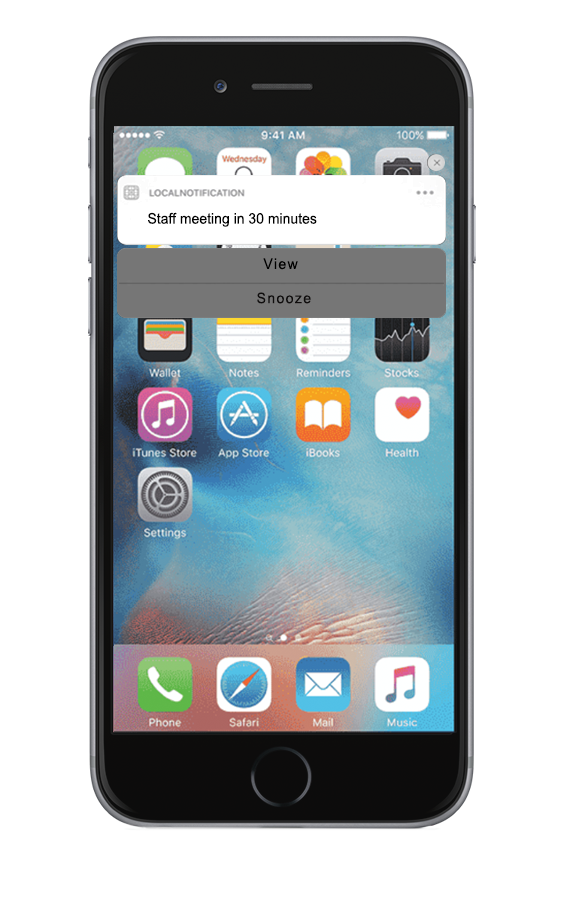

                             


Local Notifications
===================

Local notifications are scheduled by an app and delivered on the same device. They are suited for apps with time-based behaviors, such as calendar events.

When you run your app on a device with Android OS 8.0 or above, Volt MX uses default channels that are mentioned in the localnotificationconfig.xml file.

> **_Note:_** Each app on a device is limited to 64 scheduled local notifications. The system discards scheduled notifications exceeding this limit. Recurring notifications are treated as a single notification.



The local notification system consists of the following namespace and related functions:

*   [voltmx.localNotifications Namespace](voltmx.localnotifications_functions.md)

Initializing Local Notifications
--------------------------------

To initialize your app to receive local notifications, it must invoke the [voltmx.localnotifications.setCallbacks](voltmx.localnotifications_functions.md#voltmx.loc) function in the Notifications API and pass it the callback handler functions. The following sample code demonstrates how to initialize local notifications.

```
/*************************************************************************************
 * Function:localNotCallBacks()
 * Description: Initializes local notifications.
 * Author: Volt MX
 *************************************************************************************/
function localNotCallBacks() {
    try {
        voltmx.localnotifications.setCallbacks({
            "offlinenotification": offlinenotification,
            "onlinenotification": onlinenotification
        });
    } catch (err) {
        voltmx.print("Error Code " + err.errorCode + " Message " + err.message);
    }
}

/* Notification callback handlers. These are invoked automatically when their respective notifications are fired. */
function offlinenotification(notificationobject, actionid) {
    alert("offline notification callback inkvoked");
    alert("notification object is :" + JSON.stringify(notificationobject) + " action id is " + actionid);
}

function onlinenotification(notificationobject, actionid) {
    alert("onlinenotification notification callback inkvoked");
    alert("notification object is :" + JSON.stringify(notificationobject) + " action id is " + actionid);
}
```

Creating Local Notifications
----------------------------

Your app creates local notifications that are triggered then their corresponding events occur.

```
/*************************************************************************************
 * Function:createLocalnotification()
 * Description: Creates local notifications.
 * Author: Volt MX
 *************************************************************************************/
function createLocalnotification() {
    var notificationId = "01";
    var date = "05 jan 2017 16:42:00 +0530";
    var format = "dd MMM yyyy HH:mm:ss Z";
    var message = "Local notification Received";
    var title = "Title";
    var categoryId = "calendar";

    voltmx.localnotifications.create({
        "id": notificationId,
        "dateTime": {
            "date": date,
            "format": format
        },
        "message": message,
        "title": title,
        "categoryId": categoryId,
        "pspConfig": {
            "badge": 1,
            "sound": voltmx.localnotifications.DEFAULT_SOUND
        }

    });

}	
```

> **_Note:_** The local notification API, voltmx.localnotification.create  
  
       •   Can be called directly in Android devices.  
  
       •   In iOS devices you must first call [voltmx.notificationsettings.registerCategory](#registerAPI) API in order to call the create API.  

Canceling Local Notifications
-----------------------------

To stop receiving local notifications, your all calls the [voltmx.localnotifications.cancel](voltmx.localnotifications_functions.md#voltmx.loc3) function, as shown in the code sample below.

```
/*************************************************************************************
 * Function:cancelLocalnotifications()
 * Description: Cancels local notifications.
 * Author: Volt MX
 *************************************************************************************/
function cancelLocalnotifications() {
    notificationIdArray = [];
    notificationIdArray.push("01");
    voltmx.localnotifications.cancel(notificationIdArray);
}
```

Creating Actions and Categories
-------------------------------

Your app can create categories of notifications and set actions for those categories. To do so, it call the voltmx.notificationsettings.registerCategory function, as illustrated in the following sample code.

```
/*************************************************************************************
 * Function:registerActions()
 * Description: Creates Actions and a Category.
 * Author: Volt MX
 *************************************************************************************/
function registerActions() {
    var accept = voltmx.notificationsettings.createAction({
        "id": "Accept",
        "label": "Accept",
        "pspConfig": {
            "authenticationRequired": true,
            "destructive": true,
            "activationMode": voltmx.notificationsettings.ACTIVATION_MODE_FORWARDS,
            "visibleOn": voltmx.notificationsettings.BOTH
        }
    });

    var reject = voltmx.notificationsettings.createAction({
        "id": "Reject",
        "label": "Reject",
        "pspConfig": {
            "authenticationRequired": false,
            "destructive": false,
            "activationMode": voltmx.notificationsettings.ACTIVATION_MODE_FORWARDS,
            "visibleOn": voltmx.notificationsettings.BOTH
        }
    });

    var decline = voltmx.notificationsettings.createAction({
        "id": "Decline",
        "label": "Decline",
        "pspConfig": {
            "activationMode": voltmx.notificationsettings.ACTIVATION_MODE_BACKWARDS,
            "authenticationRequired": true,
            "destructive": false,
            "visibleOn": voltmx.notificationsettings.BOTH
        }
    });


    var defaultActionContextArr = [accept, reject, decline];
    var minimalActionContextArr = [accept, reject];

    var categoryObj = voltmx.notificationsettings.createCategory({
        "categoryId": "invitation",
        "actions": defaultActionContextArr,
        "pspConfig": {
            "minimalActions": minimalActionContextArr
        }
    });


    //Using voltmx.notificationsettings.registerCategory 

    var categoryArr = [categoryObj];

    var registerCategory = voltmx.notificationsettings.registerCategory({
        "categories": categoryArr,
        "pspConfig": {
            "types": [0, 1, 2]
        }
    });

}
```

Important Consideration for Android Platform
--------------------------------------------

The default settings are located in the localnotificationconfig.xml file (available after the application is built) in the 'dist{APP-ID}\\res\\values' location. You can modify these settings by using a regular expression replacement task that is written in the androidprecompiletask.xml file.

For example, if you want to update the value of the 'notify\_local\_msg\_notifications\_count' key from '1' to '5 ', you must use the following code snippet, which replaces the value directly in the file.

```
<replace file="$
{app.dir}/res/values/localnotificationconfig.xml" 
token = "<string name="notify_local_msg_notifications_count">1" 
value = "<string name="notify_local_msg_notifications_count">5"/> 

```

Similarly, you can configure other keys by using the _androidprecompiletask.xml_ file.

Modifying localnotificationconfig.xml File in Android Platform
--------------------------------------------------------------

The default behavior of the local notification message can be customized by modifying the localnotificationconfig.xml file. The localnotificationconfig.xml file contains key value pairs that allow applications to configure individual keys to override the default behavior.

You can customize the notification using the keys provided in localnotificationconfig.xml.

The table below shows a list of key value pairs, each with a brief description.

  
| Notification ID | Default Value | Description |
| --- | --- | --- |
| notify\_local\_msg | true | Enable or disable new local message notifications. If false, no status bar notification is shown when application is running in background. |
| notify\_local\_msg\_channel\_title | Local Notifications | Channel title for local notifications. |
| notify\_local\_msg\_channel\_desc | All local notifications will be displayed under this category | Channel description for local notifications. |
| notify\_local\_msg\_notifications\_count | 1 | By default, only the latest local message notification is kept in the status bar. Use this option to control the number of messages to be stored. The maximum limit allowed in Android is 50. > **_Note:_** After exceeding the storage limit, older messages are replaced with newer messages. However, sometimes older notifications are replaced with newer messages even before the storage reaches the specified count (this happens when the app is closed by the Android system). |
| notify\_local\_msg\_icon | icon | Specify icon resource without extension. For example, set a logo to use an image for the message icon for which the file name is logo.png. The default is icon.png. |
| notify\_local\_msg\_sound | true | Enable or disable sound for local message notification. |
| notify\_local\_msg\_vibrate | true | Enable or disable vibrate for local message notification. |
| notify\_local\_msg\_lights | true | Enable or disable lights for local message notification. |
| notify\_local\_msg\_clear | true | Indicates if a user can clear the unread local message notification. |


