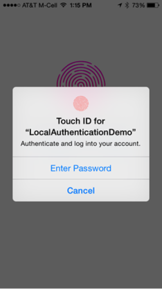

                            

You are here: Local Authentication API

Local Authentication API
========================

The Local Authentication API enables the validation of credentials in iOS and Android applications. The `voltmx.localAuthentication Namespace` provides APIs for various authentication modes. With Biometrics authentication, users can authenticate various payments, manage sensitive data, and so on. Biometrics information is stored securely on the device and is not accessible outside.

> **_Note:_** iOS supports Fingerprint and Face authentication modes of biometric authentication. Fingerprint mode is supported from iOS 8 onwards and the Face authentication is supported from iPhone X onwards. From iPhone X onwards, fingerprint mode is not supported.  
  
For information about how to enable the Face ID feature in your Volt MX Iris application, click [here](../../../Iris/iris_user_guide/Content/Support_for_iPhoneX.md). For information about how to detect whether a device supports either the Touch ID or Face ID feature, refer the [getBiometryType](#biometryofDevice) API.

The Local Authentication API contains the `voltmx.localAuthentication Namespace` and the following API elements.

  
| Function | Description |
| --- | --- |
| [voltmx.localAuthentication.authenticate](voltmx.localauthentication_functions.md#authenticate) | Authenticates the user. |
| [voltmx.localAuthentication.getBiometryType](voltmx.localauthentication_functions.md#biometryofDevice) | Differentiates whether a device supports either the Touch ID or Face ID feature. This API is available from iOS 11. |
| [voltmx.localAuthentication.cancelAuthentication](voltmx.localauthentication_functions.md#cancelAuthentication) | Cancels the current authentication process. |
| [voltmx.localAuthentication.getStatusForAuthenticationMode](voltmx.localauthentication_functions.md#getStatusForAuthenticationMode) | Returns the status of the authentication mode. |

To find the mode of local authentication supported by your device, use the [voltmx.localAuthentication.getBiometryType](voltmx.localauthentication_functions.md#biometryofDevice) function. To find the support and usability status of biometric authentication, use the [voltmx.localAuthentication.getStatusForAuthenticationMode](voltmx.localauthentication_functions.md#getStatusForAuthenticationMode) function. You will receive a status code indicating support for the local authentication. After you get the success status code (5000), you can now authenticate the user by using the [voltmx.localAuthentication.authenticate](voltmx.localauthentication_functions.md#authenticate) function. The [authenticate()](voltmx.localauthentication_functions.md#authenticate)function contains a callback which conveys the status of the authentication with appropriate status and message. If you want to cancel the authentication process, you can use the [voltmx.localAuthentication.cancelAuthentication](voltmx.localauthentication_functions.md#cancelAuthentication) function.

  
| iOS | Android ||
| --- | --- | --- |
|  |  The **deviceCredentialAllowed**  property is configured to **false**.       |  The **deviceCredentialAllowed**  property is configured to **true**. |

 

In the above illustrations, a dialog box is prompted to authenticate the user to continue further. User can choose to authenticate either by biometrics or by device credentials (PIN, Password, Pattern) by clicking the **Enter Password** button in iOS or the **Use Pin** button in Android.

In case of Android, a custom authentication flow can be triggered by configuring a negative button.

In both Android and IOS, when the `voltmx.localAuthentication.authenticate` API is invoked, the system UI appears. User can configure the UI with the help of config object in the `authenticate` API.

Users must register the biometrics at global settings, and the same secured data is accessed from application to authenticate.

> **_Note:_** **Android**: For using local authentication APIs , the `enableLocalAuthentication` property must be enabled in the **androidbuild.properties** file.

