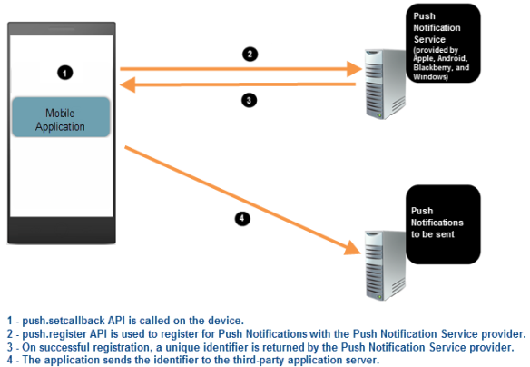

                            


Push Notifications
==================

Push Notifications is a mechanism using which you can initiate a message delivery to a device without receiving a request. Push notifications are sent by Volt MX Foundry Engagement Services to the Apple Push Notification Service (APNS), which pushes the notification to devices.

> **_Note:_** Push Notifications will not work in the simulator.

The Notification Payload For Push Notification

Each push notification includes a payload In iOS 8 and later, the maximum size allowed for a notification payload is 2 kilobytes. Apple Push Notification service refuses any notification that exceeds this limit. (Prior to iOS 8, the maximum payload size is 256 bytes.)

> **_Note:_** Delivery of notifications is a “best effort”, not guaranteed. It is not intended to deliver data to your app.

When you run your app on a device with Android OS 8.0 or above, Volt MX uses default channels that are mentioned in the pushconfig.xml file.

For a more hands-on approach in the understanding and implementation of Push Notifications API, you can import and preview the [Events](https://marketplace.hclvoltmx.com/items/events) app by using Volt MX Iris.

How it Works
------------

The following are the primary processes involved in an application being setup for Push Notifications:

1.  [Enabling Push Notifications](#enabling-push-notifications): When an application needs to use the Push Notifications service, it uses the [voltmx.push.setCallbacks](voltmx.push_functions.md#volt-mx-push-setcallbacks) function and specifies the functions to be executed for Push Notifications.  
    The application then uses the [voltmx.push.register](voltmx.push_functions.md#volt-mx-push-register) API to register the application and the device with the corresponding Push Notification Service provider of the device OS.
2.  [Sending Push Notifications](#sending-push-notifications): If the registration is successful, the application can receive Push Notifications on the device from the third-party application server.
3.  [Receiving a Message](#receiving-a-message): The third-party application server sends a Push Notification to the application and the device extracts the data from the message and passes it to the application.
4.  [Disabling Push Notifications](#disabling-push-notifications): The application can deregister from Push Notification service by using the [voltmx.push.deRegister](voltmx.push_functions.md#volt-mx-push-deregister) function.

### Platforms Supporting Push Notifications

Push Notifications are currently supported only by Android, iPhone, and Windows Phone platforms.

For Push Notifications to work, the application and the device must first register with the corresponding Push Notification Service provider of the device os.

The following is the list of platforms and their corresponding Push Notifications Service providers they must register with:

  
| Platform | Push Notifications Service |
| --- | --- |
| Android/Android Tablet | Android Cloud to Device Messaging (C2DM) |
| iPhone | Apple Push Notification Service (APNS) |
| Desktop Web | Google Firebase Cloud Messaging (FCM) |


### Enabling Push Notifications

To enable Push Notifications for an application do the following:

1.  The application uses the [voltmx.push.setCallbacks](voltmx.push_functions.md#volt-mx-push-setcallbacks) function and specifies the functions to be executed for Push Notifications.
2.  The application uses the [voltmx.push.register](voltmx.push_functions.md#volt-mx-push-register) API to register for Push Notifications with the corresponding Push Notification Service provider of the device OS.
3.  If the registration is successful, the Push Notification Service provider returns a unique identifier to the device.  
      
    The following is the list of Push Notification Service providers and the unique identifier they return:  
      
    

  
| Push Notifications Service | Returned Unique Identifier |
| --- | --- |
| Android Cloud to Device Messaging (C2DM) Firebase Cloud Messaging (FCM) | Registration ID |
| Apple Push Notification Service (APNS) | DeviceToken |
| Microsoft Push Notification Service (MPNS) | Unique URL |

1.  The application sends the identifier to the third-party application server. The third-party application server can use this identifier to send Push Notifications to it.

The following image illustrates the steps involved in enabling Push Notifications for an application on a device:  
  


### Sending Push Notifications

The following are the steps involved in a third-party application server sending Push Notifications to an application on a device:

1.  The third-party application server uses the unique identifier (sent by the application ) in sending the Push Notifications to the Push Notification Service provider of the device.
2.  The Push Notification Service provider then sends the Push Notification message to the application on the device.

The following image illustrates the steps involved in sending Push Notifications to an application on a device:  
  


### Receiving a Message

When an application on a device receives a message, the following sequence of events occur:

1.  The device receives the incoming Push Notification and extracts the data from the message payload.
2.  The device passes the data to the application.
3.  The application processes the data and displays it to the user.

### Disabling Push Notifications

You can use the [voltmx.push.deRegister](voltmx.push_functions.md#volt-mx-push-deregister) API and deregister the application and the device from the Push Notifications service.

### Silent Push Notifications

Push notifications can occur in the background without triggering a notification that is visible to the app's user through its UI. These are known as silent notifications and are often used to download data in the background while the user continues with other tasks.

To enable your app to receive silent notifications, your app must call the [voltmx.push.setCallbacks](voltmx.push_functions.md#volt-mx-push-setcallbacks) function and pass it the `onlinenotification` callback function that is invoked whenever a silent notification arrives from a Volt MX Foundry server. The `onlinenotification` function then checks the payload from the server to see if it has received a silent notification. The payload has the following format.

```
            
{
    "data": {
        "mid": "8304002566299090338",
        "content-available": “1”
    }
}
```

Note in particular that the data contains the key `"content-available"`, which is set to `"1"`. This specifies to your app that a silent notification has been received and that it should process the notification silently. Therefore, it should not display UI alerts to the user or put itself into foreground mode if it is running in the background. Instead, the callback function your app sets through the `onlinenotification` parameter of the [voltmx.localnotifications.setCallbacks](voltmx.localnotifications_functions.md#voltmx.loc) function is invoked automatically so that it can process the notification without disturbing the user. The callback function is invoked irrespective of the current state of the app. So the app can be running, not running, in the foreground, or in the background and still receive the silent notification.

To enable silent push notifications, your app must be able to receive push messages from the server. It must also call the [voltmx.localnotifications.setCallbacks](voltmx.localnotifications_functions.md#voltmx.loc) function when processing either the pre-appinit or post-appinit events.

API Functions for Push Notifications
------------------------------------

Volt MX  Iris platform provides APIs that you can use to enable Push Notifications for an application on a device and also an API to deregister from the Push Notifications service.

The following are the APIs for Push Notifications:

1.  [voltmx.push.setCallbacks](voltmx.push_functions.md#volt-mx-push-setcallbacks)
2.  [voltmx.push.register](voltmx.push_functions.md#volt-mx-push-register)
3.  [voltmx.push.deRegister](voltmx.push_functions.md#volt-mx-push-deregister)

> **_Note:_** The following are the generic error codes for Push Notification APIs:

  
| Error Code | Error Message |
| --- | --- |
| 1400 | Invalid number of arguments. |
| 1401 | Illegal arguments. |
| 1402 | Unable to connect to push service - PNS service is not available |
| 1406 | Platform-specific issue. Full details are available in the errormessage. For example, received payload but payload is in incorrect format. |

> **_Important:_** Use _Error Codes_ to refer and do not rely on _Error Messages_ as each message may differ from platform to platform.

Important Considerations for Android
------------------------------------

The following are the important considerations you must be aware for Android platform:

*   Before you build the application for Android, navigate to the Project Properties of the application and navigate to _Native App_ -> _Android_ tab. Selecting this option will copy the required Push Notification libraries into the application during build time."
<!-- *   Before you build the application for Android, navigate to the Project Properties of the application and navigate to _Native App_ -> _Android_ tab, and select the _GCM_ under the _Push Notification_ section. Selecting this option will copy the required Push Notification libraries into the application during build time." -->
<!-- *   For C2DM to GCM conversion refer, [http://developer.android.com/guide/google/gcm/c2dm.html](http://developer.android.com/guide/google/gcm/c2dm.html) -->
    
*   Google may occasionally refresh the Registration ID. Hence, you must design the application to update the third-party Application server with the new ID.  
      
    If the Volt MX Android platform receives a new registration ID, the following takes place:  
    *   If the application is running in the foreground or the background - _onsuccessfulregistration_ function is called.
    *   If the application is not running - a status bar notification is displayed. If you select the notification, the application is launched and _onsuccessfulregistration_ function is called.
*   If the Volt MX Android platform receives a new Push notification message, the following takes place:
    *   If the application is running in the foreground:
        <!-- *   GCM - Online callback is triggered without any notification. -->
        *   FCM - Online callback is triggered without any notification.
    *   If the application is running in the background:
        <!-- *   GCM - A status bar notification is displayed. If you click the notification, the application is brought to the foreground and its _onlinenotification_ function is called. -->
        *   FCM - A status bar notification is displayed. If you click the notification, the application is brought to the foreground and its _onlinenotification_ function is called.
    *   If the application is not running:
        <!-- *   GCM - A status bar notification is displayed. If you click the notification, the application is launched and its _offlinenotification_ function is called. -->
        *   FCM - Any of the following can occur:
            *   If the payload contains a notification key, a status bar notification is displayed by the system. If you click the notification, the application is launched and its _onlinenotification_ function is called.
            *   If the payload does not contain a notification key, a status bar notification is displayed by Framework. If you click the notification, the application is launched and its _offlinenotification_ function is called.  
        
*   The status bar notification is displayed by the platform with the default settings.  
    The default settings are in the _pushconfig.xml_ file (available after the application is built) in the 'dist{APP-ID}\\res\\values' location. You can modify these settings by using a regular expression replacement task that is written in the _androidprecompiletask.xml_ file.  
    For example, if you want to update the value of the 'notify\_push\_msg\_title\_keys' key to 'title,' you must use the following code snippet, which replaces the value  
    directly in the file.  
    
    <replace file="${app.dir} /res/values/pushconfig.xml"  
    token="<string name="notify\_push\_msg\_title\_keys">"  
    value="<string name="notify\_push\_msg\_title\_keys">title"/>
    
      
    Similarly, you can configure other keys by using the _androidprecompiletask.xml_ file.
<!-- *   To customize GCM broadcast receiver, refer [VoltMX IrisUser Guide](../../../Iris/iris_user_guide/Content/Custom_GCM.md). -->

* * *

Important Considerations for Desktop Web
----------------------------------------

*   From Project Settings of your Iris project, you must go to the Desktop Web tab and perform the following actions:
    
    *   Select the **Enable PWA** checkbox.
    *   Select the **Enable push notifications** check box.
    *   Specify your messagingSenderId in the **FCM Sender ID** field.
*   Push notifications will work only when you build the app in Release mode.
*   Push notifications work only in HTTPS environment, which means that you must publish the app in HTTPS server.
    
    > **_Important:_** Desktop web push notifications are not supported on localhost.
    
*   The Push notifications feature for the Desktop Web channel is supported from V9 SP2 onwards.
<!-- *   The Push notifications feature for the Desktop Web channel is supported from V8 SP4 onwards. -->
    
*   Push notifications for the Desktop Web channel is not supported in:
    
    *   Mac Safari
    *   All web browsers in iOS
*   If a web browser has the support for service worker, only then push notifications will work in that browser.
    
*   If the Volt MX Desktop Web platform receives a new Push notification message, the following takes place:
    
    *   If the application is running in the foreground, an online callback is triggered without any notification.
        
    
    *   If the application is running in the background or if the application is not running, a status bar notification is displayed.

Modifying pushconfig.xml File in Android Platform
-------------------------------------------------

The default behavior of the push notification message can be customized by modifying the pushconfig.xml file. The pushconfig.xml file contains key value pairs that allow applications to configure individual keys to override the default behavior.

You can customize the notification using the keys provided in pushconfig.xml.

The table below shows a list of key value pairs, each with a brief description.

  
| Notification ID | Default Value | Description |
| --- | --- | --- |
| notify\_push\_msg\_channel\_title | Push Notifications | Channel title for push notifications. |
| notify\_push\_msg\_channel\_desc | All push notifications will be displayed under this category | Channel description for push notifications. |
| use\_same\_channel\_details\_for\_local\_notifications | false | If configured to true, same channel details will be used for local notifications. |

Reference Links
---------------

You can get detailed information regarding the implementation of Push Notifications on various platforms, by visiting the following links:

*   **Desktop Web**: [https://firebase.google.com/docs/cloud-messaging/js/client](https://firebase.google.com/docs/cloud-messaging/js/client)


