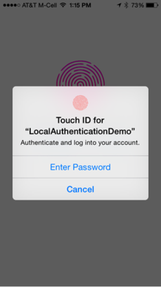
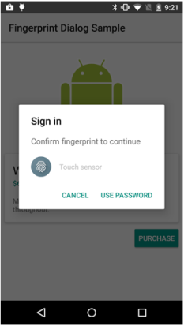

                            

Local Authentication API
========================

The voltmx.localAuthentication Namespace enables authentication in iOS and Android applications. The namespace provides APIs for various authentication modes. Currently, the voltmx.localAuthentication namespace supports the Touch ID mode for authenticating.

Touch ID is an authenticating mechanism introduced mainly for local authentication in iOS and Android devices. Touch ID is a biometric fingerprint reader that takes the place on the devices where manufactures integrated. For example, the traditional Home button on iPhone 5 and later version devices. The Touch ID feature unlocks the device, authenticates various payments, and so on. Touch ID is stored securely in the secure layer of the devices and is not accessible outside.

The Touch ID feature is available in the iOS from iOS 8 onwards and in the Android from Android M onwards.

> **_Note:_** The applications using the voltmx.localAuthentication APIs must be in the foreground. If an application uses voltmx.localAuthentication APIs, the application should handle errors and respond properly with the UI to ensure an alternative method for logging into the application.

  
| iOS | Android |
| --- | --- |
|  |  |

In the above illustrations, a dialog box is prompted to authenticate the user to use the app. User can choose to authenticate either by fingerprint or by password. User will be authenticated by touching the Touch ID with the registered fingerprint. If the user clicks the Enter password button or the USE PASSWORD button respectively, the user can authenticate using the registered password.

In the iOS devices, the dialog box is prompted automatically by the platform itself, where as in the Android devices, the dialog box is a custom UI; you have to design and build the custom logic as per your requirement.

User needs to register fingerprint at the global settings, and the same secured data is accessed from application to authenticate. You can also set a password at the application level, which acts as an alternative method for authentication.

To use the local authentication feature in the Android platform, you need the USE\_FINGERPRINT permission set to true under the Manifest Properties in the Project Settings>Native>Android tab.

Following are the voltmx.localAuthentication APIs:

*   [voltmx.localAuthentication.authenticate](voltmx.localauthentication_functions.md#authenticate)
*   [voltmx.localAuthentication.cancelAuthentication](voltmx.localauthentication_functions.md#cancelAuthentication)
*   [voltmx.localAuthentication.getStatusForAuthenticationMode](voltmx.localauthentication_functions.md#getStatusForAuthenticationMode)
*   [voltmx.localAuthentication.getBiometryType](voltmx.localauthentication_functions.md#biometryofDevice)

<table style="margin-left: 0;margin-right: auto;" data-mc-conditions="Default.HTML5 Only"><colgroup><col style="width: 37px;"> <col> <col></colgroup><tbody><tr><td>Rev</td><td>Author</td><td>Edits</td></tr><tr><td>7.1</td><td>NC</td><td>NC</td></tr></tbody></table>

