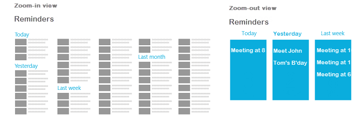

                              


## <a id="voltmxapplication-namespace"></a>voltmx.application Namespace


The voltmx.application namespace contains the following constants and functions that you can use to manage many aspects of your applications.

Constants
---------

The voltmx.application namespace provides the following constants.


<details close markdown="block"><summary>Application Constants</summary> 

* * *

These application constants are available from V9 SP2 onwards.
<!-- These application constants are available from V8 SP3 onwards. -->

| Constant | Description |
| --- | --- |
| voltmx.application.APP\_LAUNCH\_MODE\_NORMAL | Constant that identifies if the app was launched in Normal mode. |
| voltmx.application.APP\_LAUNCH\_MODE\_PUSH | Constant that identifies if the app was launched from push notifications. |
| voltmx.application.APP\_LAUNCH\_MODE\_URL | Constant that identifies if the app was launched from a deep link. |
| voltmx.application.APP\_LAUNCH\_MODE\_LIBRARY | Constant that identifies if the app was launched from the library. |

> **_Note:_** The framework sends any one of these application constants in the **launchmode** property key of the object that is passed as a argument to the appService callback .

* * *

</details>
<details close markdown="block"><summary>Breakpoint Constants</summary> 

* * *

| Constant | Description |
| --- | --- |
| constants.BREAKPOINT\_MAX\_VALUE | Checks if the current browser window size has gone beyond highest value of breakpoints list defined. |

* * *

</details>
<details close markdown="block"><summary>Runtime Permissions Constants</summary> 

* * *

The following constants report the status of runtime permissions.

| Constant | Description |
| --- | --- |
| voltmx.application.PERMISSION\_DENIED | The app does not have permission to access the resource or file. |
| voltmx.application.PERMISSION\_GRANTED | The app has permission to access the resource or file. |
| voltmx.application.PERMISSION\_RESTRICTED | The app has permission to access the resource or file on a restricted basis. |

* * *
</details>

Functions
---------

The voltmx.application namespace contains the following functions.

<details close markdown="block"><summary>voltmx.application.addApplicationCallbacks</summary>

* * *

<!-- The voltmx.application.addApplicationCallbacks API helps you to register multiple callbacks for the same event. This API is available from V8 SP4 onwards. -->
The voltmx.application.addApplicationCallbacks API helps you to register multiple callbacks for the same event. This API is available from V9 SP2 onwards.

### Syntax

voltmx.application.addApplicationCallbacks(callbacksMap)

### Input Parameters

callbacksMap \[Object\] - Mandatory

Specifies an Object with key as **appstate** and value as the Map Object (key with value as callback function) for the corresponding appstate. The following appstates are applicable:

  
| App state | Description |
| --- | --- |
| isAppLaunchedForInteraction | State which indicates that the application is visible to users for interaction. isAppLaunchedForInteraction is triggered only once in the lifecycle of the app. If the app is already visible to the user by the time the callback is registered, it is immediately triggered irrespective of whether the app is in the foreground or the background. If the same key is used again, you need to throw a "#APP\_STATE# callback with #CALLBACK\_ID # key already exists" error message. For example, consider a scenario where the isAppLaunchedForInteraction callback with xyz key already exists. If the callbackID is removed or the callback for that respective callbackID is already executed, a duplicate error message is not displayed if the user tries to add the callback with the same callbackID. |
| onactive | State which indicates that the mobile device is active and the application is running. |
| oninactive | State which indicates that the mobile device is inactive and the application is running. |
| onbackground | State which indicates that the application is active and running in the background. |
| onforeground | State which indicates that the application is active and running in the foreground. |
| onappterminate | State which indicates that the application has been terminated, and has stopped running. |
| onkeyboardchange | State which indicates whether a keyboard is deployed for an application. |
| onpowersourcechange | State which indicates whether a power source is attached to the user's device. |
| onnetworkchange | This is specific to Mango. State which occurs when there is a change in the following: **Status**: Indicates the status of the device. The applicable statuses are Connected, Disconnected, Roaming, or Unknown. **Network**: Indicates the available network on the device. The network statuses are Wireless80211, Ethernet, MobileBroadbandGSM, MobileBroadbandCDMA, or None. **Date**: Indicates the date on which the event occurs. |

### Example

```

function functionCallback() {
    voltmx.print alert("====isAppLaunchedForInteraction callback executed====");
}

var callbacksMapObject = {
    "isAppLaunchedForInteraction": {“
        functionID”: functionCallback
    }
};

voltmx.application.addApplicationCallbacks(callbacksMapObject);
```

### Platform Availability

*   Android
*   iOS
*   Windows

* * *

</details>
<details close markdown="block"><summary>voltmx.application.addBMState</summary>

* * *

This API adds a specified key and value to the parameter list of the URL of the form.

### Syntax

```

voltmx.application.addBMState([formID](#id3), [key](#key), [value](#value))
```

### Input Parameters

| Parameter | Description |
| --- | --- |
| formID \[String\] - Mandatory. | Identifier of the form to be bookmarked. |
| key \[String\] - Mandatory | Key string representing the LHS of the parameter. |
| value \[String\] - Mandatory | Value string representing the RHS of the key-value combination. The value can not be a nested structure. |

### Example

```

addbookmark: function() {

    voltmx.application.addBMState("Form1", "About", "page2");
    alert("A specified key and value are added to the parameter list of the URL");

},
```

### Return Values

None.

### Platform Availability

Supported for SPA and Desktop Web.

* * *

</details>
<details close markdown="block"><summary>voltmx.application.setGestureRecognizerForAllForms</summary>

* * *

Using the setGestureRecognizerForAllForms function, you can set a gesture recognizer for all the forms.

### Syntax

```

voltmx.application.setGestureRecognizerForAllForms ([gestureType](#gestureType1), [gestureConfigParams](#gestureConfigParams1),[onGestureClosure](#onGestureClosure1))
```

### Input Parameters

**gestureType \[Number\] - Mandatory**

Indicates the type of gesture that must be detected on the widget. Following are the possible gestureType values:

*   1 – constants.GESTURE\_TYPE\_TAP
*   2 - constants.GESTURE\_TYPE\_SWIPE
*   3 – constants.GESTURE\_TYPE\_LONGPRESS
*   4 – constants.GESTURE\_TYPE\_PAN
*   5 – constants.GESTURE\_TYPE\_ROTATION
*   6 - constants.GESTURE\_TYPE\_PINCH
*   7 - constants.GESTURE\_TYPE\_RIGHTTAP

> **_Note:_** 
*   RIGHTTAP is applicable only to Windows 10 platform.
*   ROTATION is not supported on Android.

### gestureConfigParams \[object\] - Mandatory

Specifies a table that has the configuration parameters that are required to setup a gesture recognizer. The configuration parameters vary based on the type of the gesture.

| Gesture Type | Configuration Parameter |
| --- | --- |
| TAP | fingers \[Number\] - specifies the maximum number of fingers that are allowed for a gesture. The possible values are 1, 2. Default value is 1.taps \[Number\] - specifies the maximum number of taps that are allowed for a gesture. The possible values are 1, 2. Default value is 1. |
| SWIPE | fingers \[ Number\] - specifies the maximum number of fingers that are allowed for a gesture. The possible values are 1, 2. Default value is 1. swipedistance \[Number\] - specifies the distance between the pixel from where the swipe started to the pixel where the swipe stopped (finger is moved up or removed). The default value is 50 pixels. > **_Note:_** This parameter is applicable only on Android. swipevelocity \[Number\] - specifies the velocity of the swipe, measured in pixels per second. The default value is 75. > **_Note:_** This parameter is applicable only on Android. For example,{fingers:1,swipedistance:50,swipevelocity:75} |
| LONGPRESS | pressDuration \[Number\] - specifies the minimum time interval (in seconds) after which the gesture is recognized. The default value is 1. This is not applicable to Windows. For example, {pressDuration:1} |
| PAN | fingers \[number\] - specifies the minimum number of fingers that are required to recognize this gesture. Default value is 1. continuousEvents \[Boolean\] - indicates if callback should be called continuously for every change beginning from the time the gesture is recognized to the time it ends. |
| ROTATION | fingers \[Number\] - The number of fingers that are required to recognize the gesture. The Default value is 2. continuousEvents \[Boolean\] - indicates if callback must be called continuously for every change beginning from the time the gesture is recognized to the time it ends. |
| PINCH | fingers \[Number\] - The number of fingers that are required to recognize the gesture. The Default value is 2. continuousEvents \[Boolean\] indicates if callback should be called continuously every change beginning from the time the gesture is recognized to the time it ends. |

### onGestureClosure \[function\] - Mandatory

Specifies the function that needs to be executed when a gesture is recognized. This function will be raised asynchronously and has the following signature:

```

onGestureClosure(widgetRef, gestureInfo, context)
```

| Parameter | Description |
| --- | --- |
| widgetRef | specifies the handle to the widget on which the gesture was recognized. |
| gestureInfo | Table with information about the gesture. The contents of this table vary based on the gesture type. |
| context | Table with SegmentedUI row details. |

### gestureInfo table has the following key-value pairs:

| Key | Description |
| --- | --- |
| gestureType \[number\] | Indicates the gesture type |
| gesturesetUpParams \[object\] | Specifies the set up parameters passed while adding the gesture recognizer |
| gesturePosition \[number\] | Indicates the position where the gesture is recognized. Possible values are: 1 for TOPLEFT2 for TOPCENTER3 for TOPRIGHT4 for MIDDLELEFT5 for MIDDLECENTER6 for MIDDLERIGHT7 for BOTTOMLEFT8 for BOTTOMCENTER9 for BOTTOMRIGHT10 for CENTER |
| swipeDirection \[number\] | Indicates the direction of swipe. Direction is w.r.t the view and not device orientation. This parameter is applicable only if the gesture type is SWIPE. Possible values are: 1 for LEFT 2 for RIGHT 3 for TOP4 for BOTTOM |
| gestureX \[number\] | specifies the X coordinate of the point (in pixels) where the gesture has occurred. The coordinate is relative to the widget coordinate system. |
| gestureY \[number\] | specifies the Y coordinate of the point (in pixels) where the gesture has occurred. The coordinate is relative to the widget coordinate system. |
| widgetWidth \[number\] | specifies the width of the widget (in pixels). |
| widgetHeight \[number\] | specifies the height of the widget (in pixels). |
| gestureState\[number\] | Indicates the gesture state. The gestureState is applicable only for continuous gestures like PAN, ROTATION, and PINCH.1 – gesture state begin2 - gesture state changed3 – gesture state ended |
| rotation \[number\] | Rotation of the gesture in degrees since its last change.( Applicable only when gesture type is ROTATION) |
| velocityX and velocityY | horizontal and vertical component of velocity expressed in points per second. (Applicable only for PAN gesture type) |
| velocity \[number\] | velocity of pinch in scale per second. (Applicable only for Pinch gesture) |
| scale \[number\] | scale factor relative to the points of the two touches in screen coordinates. |
| touchType\[number\] | (Applicable to windows platform only)0 - constants.TOUCHTYPE\_FINGER1 - constants.TOUCHTYPE\_PEN2 - constants.TOUCHTYPE\_MOUSE |
| translationX and translationY \[number\] | Cumulative distance as number. (Applicable only for PAN gesture type) |

 
### context table has the following key-value pairs:

| Key | Description |
| --- | --- |
| rowIndex \[number\] | Row index of the segment UI where gesture is recognized. (Applicable to gestures added to segUI rows) |
| sectionIndex \[number\] | Section index of the segment UI where gesture is recognized. (Applicable to gestures added to segUI rows) |


### Example

```

//Defining a function
function formGesture(widgetID, gestureInfo) {
    var y = voltmx.type(gestureInfo); //expected value of y = table
    var z = voltmx.type(gestureInfo.gesturesetUpParams); //expected values of z = table
    var a = gestureInfo.gestureType;
    var b = gestureInfo.gesturesetUpParams;
    var c = gestureInfo.gesturePosition;
    var d = gestureInfo.gestureX;
    var e = gestureInfo.gestureY;
    var f = gestureInfo.widgetWidth;
    var g = gestureInfo.widgetHeight;
    voltmx.print("*******************************************");
    if (voltmx.os.toNumber(gestureInfo.gestureType) == 2) {
        h = gestureInfo.swipeDirection;
        voltmx.print("swipe direction is: " + h);
    } else {
        h = "";
    }
    if (voltmx.os.toNumber(a) == 1) {
        b1 = "fingers: " + gestureInfo.gesturesetUpParams.fingers;
        b2 = "taps: " + gestureInfo.gesturesetUpParams.taps;
        voltmx.print("" + b1 + "" + b2);
    } else if (voltmx.os.toNumber(a) == 2) {
        b1 = "fingers :" + gestureInfo.gesturesetUpParams.fingers;
        b2 = "";
        voltmx.print("" + b1 + "" + b2);
    } else if (voltmx.os.toNumber(a) == 3) {
        b1 = "pressduration:" + gestureInfo.gesturesetUpParams pressDuration;
        b2 = "";
        voltmx.print("" + b1 + "" + b2);
    }

    voltmx.print("widget id is: " + widgetID[id]); //will print the widgetID. 
    //To print widgetID use widgetID.id
    voltmx.print("type of gestureInfo is: " + y);
    voltmx.print("type of gesturesetUpParams is: " + z);
    voltmx.print("gestureType is: " + a); //gestureType=1 or 2 or 3
    voltmx.print("gesturesetUpParams is: " + b.fingers); 
  /*gesturesetUpParams 
    = {
        fingers = 1, taps = 1
    }
    or {
        fingers = 1, taps = 2
    }
    or {
        fingers = 1
    }
    or {
        pressDuration = 1
    }*/
    voltmx.print("gesturePosition is: " + c); //gesturePosition=1 or 2 or 3 or .....9
    voltmx.print("gestureX is: " + d); //ex: gestureX=30
    voltmx.print("gestureY is: " + e); //ex: gestureY=100
    voltmx.print("widgetWidth is: " + f); //ex: widgetWidth=320
    voltmx.print("widgetHeight is: " + g); //ex: widgetHeight=28
    //gesturePosition, gestureX, gestureY, widgetWidth, widgetHeight params are not applicable in android
    voltmx.print("*******************************************");
}

function callbackSingleTapGesture() {
    var x = {
        fingers: 1,
        taps: 1
    };
    try {
        voltmx.application.setGestureRecognizerForAllForms(1, x,
            formGesture);
    } catch (err) {
        alert(typeof err);
        alert("error in function callbackSingleTapGesture: " + err.message);
    }
}
```

### Return Values

String - Reference to the gesture is returned.

### Platform Availability

Available on all platforms except Server Side Mobile Web, and Desktop Web.

* * *

</details>
<details close markdown="block"><summary>voltmx.application.addSettingsMenuItemAt</summary>

* * *

This API enables you to add a menu item at a given index in the Charm settings menu.

### Syntax

```

voltmx.application.addSettingsMenuItemAt ([id](#id3), [index](#index), [menuSettings](#menuSettings2))
```

### Input Parameters

  
| Parameter | Description |
| --- | --- |
| id \[String\] - Mandatory. | Identifier of the Charm setting menu created. |
| index \[Number\] - Mandatory. | The index at which the menu item must be added. The index value lies between 0 and n-1. If the index is beyond the current length of the Charm menu items then the item is added to the end. |
| menuSettings \[Hash table\] - Mandatory | The menuSettings hash table comprises the following key-value pairs: **id**: ID of the Charm menu item. **text**: Name of the menu item. **onClick**: onclick event to be executed for the menu item. |

### Example

To add a menu item at a given index, enter the following:

```

//The below function is the callback function for onClickClosure event of app menu item with id "appmenuitemid3".
function onClickClosure3() {
    //proceed with the logic
}

var settingsMenuItem1 = {
    id: "about",
    text: "About",
    onClick: onClickClosure3
};

//Adding the above app menu item at the index 3.
voltmx.application.addSettingsMenuItemAt("accountMenu", 3, settingsMenuItem1);
```

### Return Values

None.

### Platform Availability

Available on Windows only.

* * *

</details>
<details close markdown="block"><summary>voltmx.application.beginBackgroundTask</summary>

* * *

In some scenarios apps are launched in the background to perform some long running task. A typical example, could be when a watch app requests its parent app (phone app) for some information, the phone app is launched in the background. If the phone app needs to run a long running task in order to serve the requirement of the watch app, it is recommended to start a background task. This API ensures iOS does not suspend the phone app when running in the background that take too much time or resources for execution.

This API is used when you want to run a long running or the asynchronous task in the background of the phone app. When the long running task is completed, you must end the background task using the API voltmx.application.endBackgroundTask.

### Syntax

```

voltmx.application.beginBackgroundTask(taskID, callback)
```

### Input Parameters

| Parameter | Description |
| --- | --- |
| taskID \[String\] - Mandatory | Specifies the unique identifier for the task. |
| callback \[function\] - Optional | Specifies the callback that gets executed in the background before iOS suspends the app. You can use this callback to save information or clean up resources before your app gets suspended. |

 
### Example

```

function ExpirationHandlercallback(){  
//your logic to clear resources or save data.  
} function jsfunction(userInfo, replyObj){

    var taskID = voltmx.application.beginBackgroundTask("TaskName", ExpirationHandlercallback);

    //Long running task.

    voltmx.application.endbackgroundTask(taskID);

}
```

### Return Values

This API returns taskID as a number that is used as an input for voltmx.application.endBackgroundTask API.

### Platform Availability

Available on iPhone and iPad.

* * *

</details>
<details close markdown="block"><summary>voltmx.application.checkPermission</summary>

* * *

Checks and returns the permission status of one or more resources. Checks the calendar permission status.

### Syntax

```

voltmx.application.checkPermission(resourceId\[constant/String\], options\[JSObject\])
```

### Input Parameters


<table>
<tr>
<th>Parameter</th>
<th>Description</th>
</tr>
<tr>
<td>resourceId [constant/String] - Mandatory</td>
<td>
<p></p>
<p>Specifies the ID of the resource or name of the permission that you want to access. You can specify either a String (permission name) or an integer (resourceId) value.</p>
<br>
<p>The feature to specify the name of the permission as a String is applicable only for Android. For instance, you can query a Native Android permission from the AndroidManifest.xml file by specifying the String directly: “android.permission.READ_PHONE_STATE”.</p>
<br>
<p>The available resourceId constants are as follows:</p>
<ul>
<li>voltmx.os.RESOURCE_CAMERA</li>
<li>voltmx.os.RESOURCE_LOCATION</li>
<li>voltmx.os.RESOURCE_PHOTO_GALERY</li>
<li>voltmx.os.RESOURCE_CONTACTS</li>
<li>voltmx.os.RESOURCE_CALENDAR</li>
<li>voltmx.os.RESOURCE_SIRI (iOS-specific)</li>
<li>voltmx.os.RESOURCE_AUDIO_RECORD (iOS-specific)</li>
<li>voltmx.os.RESOURCE_NOTIFICATION (iOS-specific)</li>
<li>voltmx.os.RESOURCE_CALENDAR_WRITE_ONLY <br><em><b>Note: </b></em>returns true when user granted write only access and full access for app. Works only iOS 17 and above.</li>
</ul>
</td>
</tr>
<tr>
<td>options [JSObject] - Optional</td>
<td>
<p></p>
<p>Specify the additional option to identify the exact resource of which you want to know the status. This is a platform-specific key. For more information, refer to Resource ID.</p>
</td>
</tr>
</table>

 
### Example 1

```

var options = {
    isAccessModeAlways: true
};
var result = voltmx.application.checkPermission(voltmx.os.RESOURCE_LOCATION, options);
if (result.status = = voltmx.application.PERMISSION_DENIED) {
    voltmx.application.requestPermission();
} else if (result.status = voltmx.application.PERMISSION_GRANTED) {
    voltmx.location.getCurrentPosition();
}
```

### Example 2

```

< uses - permission  android: name = "android.permission.READ_PHONE_STATE" / >
var result = voltmx.application.checkPermission("android.permission.READ_PHONE_STATE");
if (result.status = = voltmx.application.PERMISSION_DENIED) {
    voltmx.application.requestPermission();
} else if (result.status = voltmx.application.PERMISSION_GRANTED) {
    voltmx.location.getCurrentPosition();
}
```

### Return Values

JSObject

A JS Object contains the authorization status of the requested resource. The returned JSObject contains the following keys:

| Return value | Description |
| --- | --- |
| status \[constant\] | Resource status constant which indicates the overall status of the resource authorization. For more information, refer to Permission Status. |
| canRequestPermission \[Boolean\] | Indicates whether you can request for the permissions or not in case the value of the status is PERMISSION\_DENIED. In the iOS platform, authorization for a resource can be requested only once. For more information, refer to [Permission model in iOS](runtime_permissions.md#iOS). |

 

### Platform Availability

*   Android
*   iOS
*   Windows
*   SPA

</details>
<details close markdown="block"><summary>voltmx.application.createSettingsMenu</summary>

* * *

This API enables you to create a _Charm settings_ menu for an application.

### Syntax

```

voltmx.applicationcreateSettingsMenu ([id](#id), [menuSettings](#menuSettings))
```

### Input Parameters

| Parameter | Description |
| --- | --- |
| id \[String\] - Mandatory | Identifier of the Charm setting menu created. |
| menuSettings \[Hash table\] - Mandatory | The menuSettings hash table comprises the following key-value pairs:**id**: ID of the Charm menu item.**text**: Name of the menu item. |

### Example

```

//To create a Charm settings menu, enter the following  
var settingsMenuItem1 = {
    id: "about",
    text: "About"
};
var settingsMenuItem2 = {
    id: "help",
    text: "Help"
};
var settingsMenu = [settingsMenuItem1, settingsMenuItem2];
voltmx.application.createSettingsMenu("mysettingsmenu", settingsMenu);
```

### Return Values

None.

### Special Considerations

If a Charm setting menu is already created with the identifier passed, a new Charm setting menu will be created and the old Charm setting menu will be replaced with the new one. The same holds true for menu items as well.

At least one menu item must be present in the Charm settings menu created. A Charm settings menu with no menu items is invalid.

### Platform Availability

Available on Windows only.

* * *

</details>
<details close markdown="block"><summary>voltmx.application.dismissLoadingScreen</summary>

* * *

This API provides you the ability to dismiss the loading screen displayed earlier. If there is no loading screen, this API has no affect.

### Syntax

```

voltmx.application.dismissLoadingScreen()
```

### Example

```

voltmx.application.dismissLoadingScreen();
```

### Input Parameters

None

### Return Values

None.

### Platform Availability

Available on all platforms except Mobile Web.

* * *

</details>
<details close markdown="block"><summary>voltmx.application.destroyForm</summary> 

* * *

Destroys the target form.

### Syntax

```

voltmx.application.destroyForm(  
    friendlyName);
```

### Input Parameters

| Parameter | Description |
| --- | --- |
| friendlyName | A string containing the friendly name of the form to be destroyed. |

### Example

```

voltmx.application.destroyForm("Form1");
```

### Return Values

None.

### Remarks

The function destroys both the target form and its form controller.

* * *

</details>
<details close markdown="block"><summary>voltmx.application.disableZoomedOutView</summary>

* * *

This API enables you to disable a zoomed out view set for an application using the previous API.

### Syntax

```

voltmx.application.disableZoomedOutView()
```

### Example

```

//Disabling zoomout on an application
function zoomout() {
    voltmx.application.disableZoomedOutView();
}
```

### Input Parameters

None

### Return Values

None.

### Platform Availability

Windows

* * *

</details>
<details close markdown="block"><summary>voltmx.application.endBackgroundTask</summary>

* * *

This API is invoked when you are done with an execution of long running tasks in the background. The return value of the API voltmx.application.beginBackgroundTask is used as the input parameter for this API.

### Syntax

```

voltmx.application.endBackgroundTask()
```

### Input Parameters

| Parameter | Description |
| --- | --- |
| taskID \[Number\] - Mandatory | Specifies the identifier returned by the voltmx.application.beginBackgroundTask API. |

### Example

```

function ExpirationHandlercallback(){  
    //your logic to clear resources or save data.  
}  
function jsfunction(userInfo, replyObj)
{
    var taskID = voltmx.application.beginBackgroundTask("TaskName", ExpirationHandlercallback);
    //Long running task.
    voltmx.application.endbackgroundTask(taskID);
}
```

### Return Values

None

### Platform Availability

Available on iPhone and iPad.

* * *

</details>
<details close markdown="block"><summary>voltmx.application.exit</summary>

* * *

This API terminates the application.

### Syntax

```

voltmx.application.exit()
```

### Example

```

function exit() {
    try {
        voltmx.application.exit();
    } catch (Error) {
        alert("Exception While getting exiting the application  : " + Error);
    }
}
```

### Input Parameters

None

### Return Values

None

### Platform Availability

Available on all platforms except for Server side Mobile Web and Desktop Web. SPA supports only iPhone, iPad, and Windows.

* * *

</details>
<details close markdown="block"><summary>voltmx.application.exitLibrary</summary>

* * *

<!-- This API provides you the ability to exit the library. After exiting the library, the control moves to the Native app UI. This API is available from V8 SP3 onwards. -->
This API provides you the ability to exit the library. After exiting the library, the control moves to the Native app UI. This API is available from V9 SP2 onwards.

For more information on Library mode, click [here](https://support.hcltechsw.com/community?id=community_question&sys_id=9b84d0151b58e8142518542f0a4bcb01&view_source=searchResult).
<!-- For more information on Library mode, click [here](../../../Iris/iris_user_guide/Content/Build_nativeLibrary.md). -->

### Syntax

```

voltmx.application.exitLibrary()
```

### Example

```

voltmx.application.exitLibrary();
```

### Input Parameters

None

### Return Values

None.

### Platform Availability

*   Android
*   iOS
*   Windows10
*   Windows10 Mobile

> **_Note:_** The voltmx.application.exitLibrary API is only applicable when the app is launched in Library mode.

* * *

</details>
<details close markdown="block"><summary>voltmx.application.getApplicationBadgeValue</summary>

* * *

This API allows you to read the badge value (if any) attached to the given application icon. If the applications icon does not have any badge value attached to it, this API returns an empty string.

### Syntax

```

voltmx.application.getApplicationBadgeValue()
```

### Input Parameters

None

### Example

```

gettingBadge: function() {
    var badge = voltmx.application.getApplicationBadgeValue();
    alert("The badge value is " + badge);
},
```

### Return Values

| Return Value | Description |
| --- | --- |
| badgeValue \[String\] | Returns the badge value applied to the application icon If the application icon has no badge value attached to it, it returns null/nil. |

### Platform Availability

Available only on iPhone and iPad.  

* * *

</details>

<details close markdown="block"><summary>voltmx.application.getApplicationNotificationSettings</summary>

* * *

This API allows an application on a device to get Push Notifications Settings status. This API takes an object with notification type and callback. Use this API to get the application notification status from device settings.

### Syntax

```

voltmx.application.getApplicationNotificationSettings (callback)
```

### Example

```

function getNotificationSettings() {
 var callbacksObj = {
  notificationType: constants.APPLICATION_UN_NOTIFICATION_TYPE,
  callback: notificationCallBack
 };
 voltmx.application.getApplicationSettingsForType(callbacksObj);
}

function notificationCallBack(result) {
 //Authorization Setting
 if (result["authorizationStatus"] == constants.NOTIFICATION_AUTHORIZATION_STATUS_AUTHORIZED) {
  alert("authorizationStatus:NOTIFICATION_AUTHORIZATION_STATUS_AUTHORIZED");
 } else if (result["authorizationStatus"] == constants.NOTIFICATION_AUTHORIZATION_STATUS_DENIED) {
  alert("authorizationStatus:NOTIFICATION_AUTHORIZATION_STATUS_DENIED");
 } else if (result["authorizationStatus"] == constants.NOTIFICATION_AUTHORIZATION_STATUS_NOT_DETERMINED) {
  alert("authorizationStatus:NOTIFICATION_AUTHORIZATION_STATUS_NOT_DETERMINED");
 }
 //Notification, Badge, Sound, Alert, LockScreen Settings
 var arrSetting = ["notificationCenterSetting", "badgeSetting", "soundSetting", "lockScreenSetting", "alertSetting"];
 for (var i = 0; i <= arrSetting.length; i++) {
  var setting = arrSetting[i]
  if (result[setting] == constants.NOTIFICATION_SETTING_ENABLED) {
   alert(setting + ":NOTIFICATION_SETTING_ENABLED");
  } else if (result[setting] == constants.NOTIFICATION_SETTING_DISABLED) {
   alert(setting + ":NOTIFICATION_SETTING_DISABLED");
  } else if (result[setting] == constants.NOTIFICATION_SETTING_NOT_SUPPORTED) {
   alert(setting + ":NOTIFICATION_SETTING_NOT_SUPPORTED");
  }
 }
 //Alert Style
 if (result["alertStyle"] == constants.NOTIFICATION_ALERT_STYLE_NONE) {
  alert("alertStyle:NOTIFICATION_ALERT_STYLE_NONE");
 } else if (result["alertStyle"] == constants.NOTIFICATION_ALERT_STYLE_BANNER) {
  alert("alertStyle:NOTIFICATION_ALERT_STYLE_BANNER");
 } else if (result["alertStyle"] == constants.NOTIFICATION_ALERT_STYLE_ALERT) {
  alert("alertStyle:NOTIFICATION_ALERT_STYLE_ALERT");
 }
}
```

### Input Parameters

None

### Return Values

The result Array consists of AuthorizationStatus, NotificatinCenterSetting, AlertSetting, BadgeSetting, LockScreenSetting, SoundSetting, AlertStyle.

**Constants**

*   NOTIFICATION\_AUTHORIZATION\_STATUS\_AUTHORIZED: App has notification support and it is enabled.
*   NOTIFICATION\_AUTHORIZATION\_STATUS\_DENIED: App has notification support, but notification is disabled under the settings.
*   NOTIFICATION\_AUTHORIZATION\_STATUS\_NOT\_DETERMINED: App doesn’t support notifications.
*   NOTIFICATION\_SETTING\_ENABLED: Alert/Badge/LockScreen/NotificationCenter/Sound setting enabled for the notification.
*   NOTIFICATION\_SETTING\_DISABLED: Alert/Badge/LockScreen/NotificationCenter/Sound setting Disabled for the notification.
*   NOTIFICATION\_SETTING\_NOT\_SUPPORTED: Alert/Badge/LockScreen/NotificationCenter/Sound setting not supported.
*   NOTIFICATION\_ALERT\_STYLE\_NONE: Notification alert style set to none.
*   NOTIFICATION\_ALERT\_STYLE\_BANNER: Notification alert style set to banner.
*   NOTIFICATION\_ALERT\_STYLE\_ALERT: Notification alert style set to alert.

### Platform Availability

iPad/iPhone

* * *

</details>
<details close markdown="block"><summary>voltmx.application.getApplicationMode</summary>

* * *

This API enables you to get the application mode.

### Syntax

```

voltmx.application.getApplicationMode()
```

### Example

```

function getApplicationMode() {
	voltmx.application.getApplicationMode();	
}
```

### Input Parameters

None

### Return Values

**Integer Constant**

*   1: constants.APPLICATION\_MODE\_NATIVE
*   2: constants.APPLICATION\_MODE\_HYBRID
*   3: constants.APPLICATION\_MODE\_WRAPPER  
    

### Special Considerations

This API should be called only in preappinit or before the execution of preappinit. If this API is invoked elsewhere in the program, it is invalid and leads to undefined behavior.

### Exceptions

Error

### Platform Availability

Available on all platforms.

* * *

</details>
<details close markdown="block"><summary>voltmx.application.getApplicationState</summary>

* * *

iOS prohibits UI updates when the app is running in the background. Using this API you can check whether the app is running in the background or not to make UI updates. The possible application states are active, inactive, or background.

### Syntax

```

voltmx.application.getApplicationState()
```

### Example

```

//Sample code to get the application state  
function util() {
    var appState = voltmx.application.getApplicationState();
    if (appState = constants.APPLICATION_STATE_BACKGROUND) {
        voltmx.print(appState);
    }
}
```

### Input Parameters

None

### Return Values

This API returns the following constant values:

*   APPLICATION\_STATE\_ACTIVE
*   APPLICATION\_STATE\_INACTIVE
*   APPLICATION\_STATE\_BACKGROUND

### Platform Availability

Available on iPhone and iPad.

* * *

</details>
<details close markdown="block"><summary>voltmx.application.getAppMenuBadgeValue</summary>

* * *

This API enables you to read the badge value (if any) attached to the specified app menu item. If the specified app menu item does not have any badge value attached to it, the API returns an empty string.

### Syntax

```

voltmx.application.getAppMenuBadgeValue([appmenuID](#appMenuId2), [menuItemID](#menuItemId2))
```

### Input Parameters

| Parameter | Description |
| --- | --- |
| appMenuId \[String\] - Mandatory | If you are setting the badge for an app menu item that was created dynamically, use the same ID that was used to create the app menu item.If you are setting the badge for an app menu item that was created from the IDE, use the ID available in the generated script file. |
| menuItemId \[String\] - Mandatory | Identifier of the app menu item from which the badge value is to be read. |


### Example

```

onClickMenuItem1: function() {
    alert("The Badge Value of Accounts App Menu Item is " + voltmx.application.getAppMenuBadgeValue("SampleAppMenu", "appmenuitemid1"));

},
onClickMenuItem2: function() {
    alert("The Badge Value of Examination App Menu Item is " + voltmx.application.getAppMenuBadgeValue("SampleAppMenu", "appmenuitemid2"));

},
```

### Return Values

| Return Value | Description |
| --- | --- |
| badgeValue \[String\] | Returns the badge value applied to the specified app menu. If the specified app menu has no badge value attached to it, it returns an empty string. |

### Platform Availability

Available only on iPhone and iPad.

* * *

</details>
<details close markdown="block"><summary>voltmx.application.getAppWindow</summary>

* * *

This API returns a handle to an [AppWindow object](voltmx.application_appwindow.md). This object allows you to switch between application modes and to query and update properties of the app window.

### Syntax

```

voltmx.application.getAppWindow()
```

### Example

```

var appwindow = voltmx.application.getAppWindow(); 
alert(appwindow.title);
```

### Input Parameters

None

### Return Values

A single handle to an [AppWindow object](voltmx.application_appwindow.md).

### Platform Availability

Windows

* * *

</details>
<details close markdown="block"><summary>voltmx.application.getBMState</summary>

* * *

This API retrieves the list of parameters attached to a URL using the above add, set APIs.

### Syntax

```

voltmx.application.getBMState([formID](#id4))
```

### Input Parameters

| Parameter | Description |
| --- | --- |
| formID \[String\] - Mandatory. | Identifier of the form for which the parameters of the URL have to be fetched. |

### Example

```

getbookmark: function() {

    var a = voltmx.application.getBMState("Form1");
    alert(" The list of parameters attached to the URL are " + JSON.stringify(a));
},
```

### Return Values

A JSON structure representing key-values of various parameters attached to the URL string of the given form.

### Platform Availability

Supported for SPA and Desktop Web.

* * *

</details>
<details close markdown="block"><summary>voltmx.application.getCurrentBreakpoint</summary>

* * *

This API returns the current breakpoint value.

### Syntax

```

voltmx.application.getCurrentBreakpoint()
```

### Input Parameters

None

### Return Values

This API returns the current breakpoint

If window size exceeds the highest of breakpoints list, returns **constants.BREAKPOINT\_MAX\_VALUE**.

### Platform Availability

Desktop web

* * *

</details>
<details close markdown="block"><summary>voltmx.application.getCurrentForm</summary>

* * *

This API returns a handle to the current form. The form handle is useful when you are sending analytics to the analytic engine.

> **_Note:_** For iOS, voltmx.application.getCurrentForm() returns the form id of current form. This rule does not apply for form used as cameraOverlay.

### Use Case

**You can use this API in the following scenarios:**

1.  When you want to send analytics to the analytic engine.
2.  When you want to use the handle to the current form in any other function.

### Syntax

```

voltmx.application.getCurrentForm()
```

### Example

```

function getCurrentForm() {
	//Get the current form
	var currentForm = voltmx.application.getCurrentForm();
	//Alert the current form
	alert("currentForm is::" + currentForm);
}
```

### Input Parameters

None

### Return Values

currentForm - Object

This API returns the current form.

### Rules and Restrictions

The following are the guidelines applicable for the API:

*   If you invoke this API in the `preshow` method of the application, it does not have any affect.
*   If you invoke this API in the `appinit` method of the application, nil is returned.

### UI Behavior

None

### Platform Availability

Available on all platforms.

* * *

</details>
<details close markdown="block"><summary>voltmx.application.getCurrentSettingsMenu</summary>

* * *

This method returns the unique identifier of the current menu that is set through getCurrentSettingsMenu.

### Syntax

```

voltmx.application.getCurrentSettingsMenu()
```

### Input Parameters

None

### Example

```

//To get the unique identifier a Charm settings menu, enter the following  
voltmx.application.getCurrentSettingsMenu();

//Alert the Current Charm Settings menu
alert("Current charm menu id is: " + currCharmMenuId);
```

### Return Values

| Return value | Description |
| --- | --- |
| Unique Identifier | Identifier of the Charm setting menu to be set. |

### Platform Availability

Available on Windows only.

* * *

</details>
<details close markdown="block"><summary>voltmx.application.getInstallerSourceInfo</summary>

* * *

This API returns the package name from which the application was installed. Therefore, identifying the market that the application was downloaded from. It is important to know the source of installation of the application for security purposes.

### Syntax

```

voltmx.application.getInstallerSourceInfo()
```

### Input Parameters

None

### Example

```

var devInfo = voltmx.os.deviceInfo();  
var installSourceInfoDetails = voltmx.application.getInstallerSourceInfo();  
if(devInfo.APILevel >= 30){  
  var originatingPackageName = installSourceInfoDetails.originatingPackageName;  
  var initiatingPackageName = installSourceInfoDetails.initiatingPackageName;  
  var installingPackageName = installSourceInfoDetails.installingPackageName;  
  alert("originatingPackageName: "+originatingPackageName +  
        "initiatingPackageName: "+initiatingPackageName +  
        "installingPackageName: "+installingPackageName);  
} else {
  var installerPackageName = installSourceInfoDetails.installerPackageName;
  alert("installerPackageName: "+installerPackageName);  
}
```

### Return Values

This API returns a JS Object based on the Target SDK version of the device.

If the device uses TargerSDK versions 30 and above, the API returns the following values:

| Return Value | Description |
| --- | --- |
| initiatingPackageName | The name of the package that requested the installation. The parameter returns a blank string if the initiating package name is not available. |
| installingPackageName | The name of the package responsible for the installation (the installer of record), The parameter returns a blank string if the installing package name is not available. |
| originatingPackageName | The name of the package on behalf of which the initiating package requested the installation. The parameter returns a blank string if the originating package name is not available. |

If the device uses TargerSDK versions 29 or earlier, the API returns the following values:

| Return Value | Description |
| --- | --- |
| installerPackageName | The name of the package that has installed the application. |

### Platform Availability

Android

* * *

</details>
<details close markdown="block"><summary>voltmx.application.getPreviousForm</summary>

* * *

This API returns a handle to the previous form.

### Use Case

**You can use this API in the following scenarios:**

1.  When you want to send analytics to the analytic engine.
2.  When you want to use the handle to the current form in any other function.

### Syntax

```

voltmx.application.getPreviousForm()
```

### Example

```

function getPreviousForm() {
    //Get the Previous form
    var previousForm = voltmx.application.getPreviousForm();
    //Alert the Previous form
    alert("previousForm is::" + previousForm);
}                                                  
```

### Input Parameters

None

### Return Values

| Return Value | Description |
| --- | --- |
| previousForm-Object | API returns the previous form handle. |

### Rules and Restrictions

The following are the guidelines applicable for the API:

*   If you invoke this API in `preshow` event of the application, you get unpredictable results.
*   If you invoke this API in the `appinit` method of the application, nil is returned.
*   If you use the Back button on the mobile web browser, this API does not return the handle to the previous form.
*   If you use this API on the first form of the application it returns null/nil.

### UI Behavior

None

### Platform Availability

Available on all platforms.

* * *

</details>
<details close markdown="block"><summary>voltmx.application.getPreviousSessionParams</summary>

* * *

This API retrieves the previous session parameters in the application life cycle.

> **_Important:_** You must use the _voltmx.application.invalidateSession("frmName", sessionParams)_ API before using _voltmx.application.getPreviousSessionParams API._

### Syntax

```

voltmx.application.getPreviousSessionParams()
```

### Example

```

//The following function is for getPreviousSessionParams API
//You must use the invalidateSession("frmName", sessionParams) API before using getPreviousSessionParams API.
function invalidateSession() {
    //invalidating the session
    var sessionParams = {};
    sessionParams.category = "news";
    sessionParams.country = "US";
    voltmx.application.invalidateSession("frmName", sessionParams);

}

function getPreviousSessionParams() {
    //Collecting all the params in to an object
    var mySessionParams = voltmx.application.getPreviousSessionParams();
    voltmx.print("mySessionParams are" + mySessionParams);
}
```

### Input Parameters

None.

### Return Values

| Return Value | Description |
| --- | --- |
| listOfParams \[Array\] | Returns a table of the previous session parameters that is passed from the invalidateSession API. |

### Platform Availability

Available on Mobile Web

* * *

</details>
<details close markdown="block"><summary>voltmx.application.getSettingValue</summary>

* * *

You can use this API to retrieve the current device setting. You must pass the setting that you want to query, in the input parameter of this API.

### Syntax

```

voltmx.application.getSettingValue(setting, args)
```

### Parameters

_setting\[String\]_\- Mandatory

The setting to be queried must be passed in this parameter. Following are the settings supported by various platforms:

*   **Android**: "location", "device\_locale", "time\_zone", and "wifi".

| Settings | Description |
| --- | --- |
| location | This key is used to identify the current "location" status of the device. Calling the voltmx.application.getSettingValue API with this key returns a JavaScript object, which has the following key values: gps\_provider (key): This key has value as "true" or "false", which informs that the gps\_provider has been enabled or disabled. network\_provider (key): This key has value as "true" or "false", which informs that the network\_provider has been enabled or disabled. |
| device\_locale | This key is used to identify the current device locale of the device. Calling the voltmx.application.getSettingValue API with this key returns a JavaScript object, which has the following key value: device\_locale (key): This key has the current locale value of the device. |
| time\_zone | This key is used to identify the current device time zone of the device. Calling the voltmx.application.getSettingValue API with this key returns a JS object, which has the following key value: time\_zone (key): This key has the current time zone value of the device.   |
| wifi | This key is used to identify the current wifi state of the device. > **_Note:_** To query this setting, you must add the following permission to the AndroidManifest.xml file:**<uses-permission android:name="android.permission.ACCESS\_WIFI\_STATE" />** Calling the voltmx.application.getSettingValue API with this key returns a JS object, which has the following key values: wifi\_current\_state (key): This key has value as current wifi state value of the device. The list of wifi states is as follows: voltmx.settings.WIFI\_DISABLING: Wifi is disabling. Constant Value: 0 voltmx.settings.WIFI\_DISABLED: Wifi is disabled. Constant Value: 1 voltmx.settings.WIFI\_ENABLING: Wifi is enabling. Constant Value: 2 voltmx.settings.WIFI\_ENABLED: Wifi is enabled. Constant Value: 3 voltmx.settings.WIFI\_UNKNOWN: Wifi state is unknown. Constant Value: 4 |

*   **Windows**: "color"

| Settings | Description |
| --- | --- |
| color | This key is used to identify the current system color values. To get the current system color, you must provide the **args** parameter in the voltmx.application.getSettingValue API. Calling the voltmx.application.getSettingValue API with this key returns a hexadecimal string value. |

*   **iOS**: "applicationAppearanceStyle"

| Settings | Description |
| --- | --- |
| applicationAppearanceStyle | iOS 13 provides support for dark mode in iOS devices. This key enables you to identify the appearance mode of iOS devices. When the voltmx.application.getSettingValue API is called with this key, any of the following values are returned: voltmx.application.APPEARANCESTYLE\_DARK: The current mode of appearance is dark mode. voltmx.application.APPEARANCESTYLE\_LIGHT:The current mode of appearance is light mode. voltmx.application.APPEARANCESTYLE\_UNKNOWN: The current mode of appearance is unknown. This is applicable from Volt MX IrisV9 SP2. > **_Note:_** By default, the dark and light modes are supported for apps that are built on iOS 13 devices. If you want to limit the appearance of your app to a single mode, navigate to: <app\_name>/resources/common/infoplist\_configuration.json. Then, add the `UIUserInterfaceStyle` key with the dark or light value as required. |

_args \[object \[ \] \]_ - Optional

This parameter is applicable for Windows, and is an array that should contain any of the following constants:

*   voltmx.SystemColorType.Background
*   voltmx.SystemColorType.Foreground
*   voltmx.SystemColorType.AccentDark3
*   voltmx.SystemColorType.AccentDark2
*   voltmx.SystemColorType.AccentDark1
*   voltmx.SystemColorType.Accent
*   voltmx.SystemColorType.AccentLight1
*   voltmx.SystemColorType.AccentLight2
*   voltmx.SystemColorType.AccentLight3
*   voltmx.SystemColorType.Complement

### Example

**_Example 1:_**

```

alert(voltmx.application.getSettingValue("location"));
```

**_Example 2:_**

```

var args = [voltmx.SystemColorType.Background];
alert(voltmx.application.getSettingValue("color", args));
```

**_Example 3:_**

```

function getAppearenceStyle() {
 var themeApearenceStyle =
voltmx.application.getSettingValue("applicationAppearanceStyle");
 switch (themeApearenceStyle) {
 case voltmx.application.APPEARANCESTYLE_DARK:
 alert("APPEARENCE STYLE : dark mode");
 break;
 case voltmx.application.APPEARANCESTYLE_LIGHT:
 alert("APPEARENCE STYLE : light mode");
 break;
 case voltmx.application.APPEARANCESTYLE_UNKNOWN:
 alert("APPEARENCE STYLE : unknown mode");
 break;
 }
}
function callback(params) {
 switch (params.setting) {
 case "applicationAppearanceStyle":
 switch (params.applicationAppearanceStyle) {
 case voltmx.application.APPEARANCESTYLE_DARK:
 //alert("selected dark mode");
 voltmx.theme.setCurrentTheme("darkTheme",
onThemeCallback, onThemeCallback);
 break;
 case voltmx.application.APPEARANCESTYLE_LIGHT:
 //alert("selected light mode");
 voltmx.theme.setCurrentTheme("lightTheme",
onThemeCallback, onThemeCallback);
 break;
 case voltmx.application.APPEARANCESTYLE_UNKNOWN:
 //alert("selected unknown mode");
 break;
 }
 break;
 }
 function onThemeCallback() {
 //alert("theme callback");
 }
}
voltmx.application.registerOnSettingsChangeCallback(["applicationAppearanceSty
le"], callback);
```

### Platform Availability

*   Android
*   Windows
*   iOS

* * *

</details>
<details close markdown="block"><summary>voltmx.application.invalidateSession</summary>

* * *

This API explicitly invalidates a session on Mobile Web.

> **_Important:_** This API is applicable only on Mobile Web platforms

### Use Case

You can use this API for Financial applications where you want to completely invalidate the session on execution of specific functions. For example, logout function. When the user logs out from the application, you can invoke this API to invalidate the current session and initiate a new session before navigating to any other form. In this case, all the session data is cleared.

### Syntax

```

voltmx.application.invalidateSession([ormName](#formName),[params](#params))
```

### Input Parameters

| Parameter | Description |
| --- | --- |
| formName \[Handle to the form\] - Optional | Specifies the form to which the application must navigate after the session is invalidated |
| params \[Function\] - Optional | Specifies a table of parameters that you want to pass to the new session |

### Example

```

//The following function is for invalidateSession API
function invalidateSession() {
	//invalidating the session
	voltmx.application.invalidateSession();
}
```

### Return Values

This API navigates to the specified form or remains on the same form if there is no form specified.

### Rules and Restrictions

When the current session is invalidated, the Mobile Web framework will start the application lifecycle again. This API invokes _appinit_ and then navigates the user to the startup form or any form that is associated with the logout function.

### Platform Availability

Available on Mobile Web.

* * *

</details>
<details close markdown="block"><summary>voltmx.application.isIgnoringBatteryOptimizations</summary>

* * *

This API checks whether the current application is present in the power white-list of the device.

You can request the user to add or remove the app from the power white-list of the device by using the [voltmx.application.launchBatteryOptimizationSettings](#launchBatteryOptimizationSettings) API.

### Syntax

```

voltmx.application.isIgnoringBatteryOptimizations()
```

### Input Parameters

None

### Example

```

function isIgnoringBatteryOptimizations() {  
	var retVal = voltmx.application.isIgnoringBatteryOptimizations();  
    voltmx.print(" Is my application ignoring Battery Optimizations "+ retVal);  
}
```

### Return Values

Boolean.

### Remarks

The voltmx.application.isIgnoringBatteryOptimizations API is only supported on Android devices with OS API level 23, and later. When this API is invoked on Android devices with OS API level 22 (and earlier), the API always returns the value **true**.

Ensure that you set the value of the `enableBatteryOptimizationAPI` property to **true** in the `androidbuild.properties` file to enable this API.

### Platform Availability

Android

* * *

</details>
<details close markdown="block"><summary>voltmx.application.isImageTurnedOff Function</summary> 

* * *

This API is used to get the status of image settings, which are defined by a particular user, in a web browser.

### Syntax

```

voltmx.application.isImageTurnedOff(imageCb)
```

### Input Parameters

  
| Parameter | Description |
| --- | --- |
| imageCb | The voltmx.application.isImageTurnedOff API takes the **imageCb** function as an argument, and returns either **true** or **false** based on the browser settings for images. |

### Example

```

function getImageStatus() {
    voltmx.application.isImageTurnedOff(imageCb);
}

function imageCb(param) {
    if (param === true) {
        DesktopApis.lbl1.text = "Image settings in web browser is disabled";
    } else {
        DesktopApis.lbl1.text = "Image settings in web browser is enabled";
    }

    DesktopApis.forceLayout();

}
```

### Return Values

*   true: If the user disables the display of images from the browser settings, the voltmx.application.isImageTurnedOff API returns true.
*   false: If the user enables the display of images in the browser, the voltmx.application.isImageTurnedOff API returns false.

### Platform Availability

*   Desktop Web

* * *

</details>
<details close markdown="block"><summary>voltmx.application.isInMultiWindowMode Function</summary> 

* * *

Returns true if the application is in multi-window mode, and the function returns false if the application is in full-screen mode.

### Syntax

```

voltmx.application.isInMultiWindowMode()
```

### Example

```

function checkMultiWindowMode() { 
var isInMultiWindow = voltmx.application.isInMultiWindowMode(); 
voltmx.print("Multi Window Mode : " + isInMultiWindow);
}
```

### Input Parameters

None.

### Return Values

Boolean value.

### Platform Availability

*   Android 7.0 and later

* * *

</details>
<details close markdown="block"><summary>voltmx.application.isPopupBlocked Function</summary> 

* * *

This API is used to get the status of pop-up settings, which are defined by a particular user, in a web browser.

### Syntax

```

voltmx.application.isPopupBlocked(popupCb)
```

### Input Parameters

| Parameter | Description |
| --- | --- |
| popupCb | The voltmx.application.isPopupBlocked API takes the **popupCb** function as an argument, and returns either **true** or **false** based on the browser settings for pop-ups. |

### Example

```

function getPopupStatus() {
    voltmx.application.isPopupBlocked(popupCb);
}

function popupCb(param) {
    if (param === true) {
        Form1.lbl1.text = "Pop-up blocker is enabled. Please do not allow pop-ups from this website.";
    } else {
        Form1.lbl1.text = "Popup blocker is turned off.";
    }

    Form1.forceLayout();
}
```

### Return Values

| Return Value | Description |
| --- | --- |
| true | If the user disables the display of pop-ups from the browser settings, the voltmx.application.isPopupBlocked API returns true. |
| false | If the user enables the display of pop-ups in the browser, the voltmx.application.isPopupBlocked API returns false. |

### Platform Availability

*   Desktop Web

* * *

</details>
<details close markdown="block"><summary>voltmx.application.launchApp Function</summary> 

* * *

Launches the application specified by the input URL.

### Syntax

```

voltmx.application.launchApp(  
    protocolName,  
    data)
```

### Input Parameters

| Parameter | Description |
| --- | --- |
| _protocolName_ | A string that you provide in Volt MX Iristhat specifies the URL scheme . For more information, see [Deep Linking](application_api.md#DeepLinking). |
| data | A JavaScript object that contains key-value pairs specifying the data that is needed to launch the application. The key-value pairs are defined as whatever is supported by the target app. |


### Example

```

var protocolName= "VoltMXApp1234567.8";
var data = { 
    "navigatetoForm": "FrmHome",
    "TexttoShow": "Launched FrmHome by Deeplinking"
};
voltmx.application.launchApp(protocolName,data);
```

### Return Values

None.

### Remarks

This function uses deep linking to launch an application. For more information, see [Deep Linking](application_api.md#DeepLinking).

### Platform Availability

Available for Windows

* * *

</details>
<details close markdown="block"><summary>voltmx.application.launchBatteryOptimizationSettings</summary>

* * *

This API opens the settings screen of the device that displays options to control the battery optimization behavior of the app.

By using the voltmx.application.launchBatteryOptimizationSettings API, users can be directed to add or remove the app from the power white-list of the device by following these steps:

1.  Select the current app from the list displayed on the settings screen.
2.  Select **Optimize** to turn on battery optimization for the app.  
    Similarly, select **Don't Optimize** to turn off battery optimization for the app.

> **_Note:_** The steps to add an app to the power white-list of a device may vary depending on the device being used.

> **_Note:_**
*   Before you invoke the voltmx.application.launchBatteryOptimizationSettings API, invoke the [voltmx.application.isIgnoringBatteryOptimizations](#isIgnoringBatteryOptimizations) to determine if an application is already ignoring optimizations.
*   Alternatively, you can also use the [voltmx.application.requestIgnoreBatteryOptimizations](#requestIgnoreBatteryOptimizations) API to request the user to add the app to the power white-list of the device without navigating to the settings page.

### Syntax

```

voltmx.application.launchBatteryOptimizationSettings(callback)
```

### Input Parameters

| Parameter | Description |
| --- | --- |
| callback - Optional | The callback function to be executed when the user navigates back to the application from the settings screen. |

### Example

```

function launchBatteryOptimizationSettings() {  
	voltmx.application.launchBatteryOptimizationSettings(settingsCallback);  
},  
function settingsCallback()  
{  
    //You can Call voltmx.application.isIgnoringBatteryOptimizations() to determine whether the application is ignoring battery optimizations.   
}
```

### Return Values

None

### Remarks

*   The voltmx.application.launchBatteryOptimizationSettings API is only supported on Android devices with OS API level 23, and later.
*   Ensure that you set the value of the `enableBatteryOptimizationAPI` property to **true** in the `androidbuild.properties` file to enable this API.
*   If you invoke the voltmx.application.launchBatteryOptimizationSettings API when the application is running in the background, the settings screen may not launch.

### Platform Availability

Android

* * *

</details>
<details close markdown="block"><summary>voltmx.application.openApplicationSettings</summary>

* * *

Opens the application-specific settings or device-level application settings.

You may need to direct the end-user to application settings to manually enable or disable a permission for the app to access a particular resource. This function is required when the end-user had denied the permission when the app prompted with a dialog box, and later wants the app to access the resource. For example, if your app wants to access the user's contacts - so the app displayed a dialog box with "Allow" and "Deny" options, asking end-user to grant permission for the first time. The end-user tapped the "Deny" option and the app cannot access the user's contacts. Later, after some point of time, if end-user wants the app access the user's contacts; at that time, you can call the openApplicationSettings API that allows the user to navigate to the application settings screen, and then grant the required permission to the app.

The behavior of the openApplicationSettings API in different platforms:

*   **Windows**: There is no provision to open the application-level settings. The openApplicationSettings API accepts the resourceid as an optional parameter that helps open the resource-specific settings screen. If the resourceid is not provided, results in unexpected behavior.
*   **iOS**: Opens the application-level settings screen showing the access status of the resource. The end-user can turn on or off the access to the resource from the app. The resourceid parameter is ignored in the iOS platform.
*   **Android**: Opens the application-level settings screen showing the access status of the resource. The end-user can turn on or off the access to the resource from the app. The resourceid parameter is ignored in the iOS platform.

### Syntax

```

voltmx.application.openApplicationSettings(resourceId\[const\])
```

### Input Parameters

| Function | Description |
| --- | --- |
| resourceId \[constant\] - Optional | Specify the resource ID of the resource that you want open its settings. The parameter works only for Windows. For more information, refer to Resource ID. |

### Example

```

voltmx.application.openApplicationSettings(voltmx.os.RESOURCE_CONTACTS);
```

### Return Values

None

### Platform Availability

*   Android
*   iOS
*   Windows

* * *

</details>
<details close markdown="block"><summary>voltmx.application.openMediaURL</summary>

* * *

This API launches the native media player and starts playing the media (audio or video) at the specified URL. The media server provides the appropriate media content depending upon the device (for example, iPhone, etc). This API is not applicable on SPA.

### Use Case

You can use this API when you want to access and use multimedia from an external URL or server.

### Syntax

```

voltmx.application.openMediaURL([URL](#URL1))
```

### Input Parameters

| Parameter | Description |
| --- | --- |
| URL \[String\] - Mandatory | Specifies the URL that points to the audio/video file |

### Example

```

function openMediaURL() {
    /*Launching the native media player and starts playing the media(audio or video) at the URL:"http://www.boisestatefootball.com/sites/default/files/videos/original/01_-_coach_pete_bio_4.mp4" */
    voltmx.application.openMediaURL("http://www.boisestatefootball.com/sites/default/files/videos/original/01_-_coach_pete_bio_4.mp4");
}
```

### Return Values

None

### Implementation Details

This API assumes that the media is available at the specified URL. The API does not check for the availability of the media at the specified location. The responsibility lies on the developer to ensure that appropriate media is available at the referred URL.

Any errors related to the type of media or the availability of the media are handled by the native media player. The errors are not propagated back to the application.

> **_Note:_** For more information on media formats, see:
*   Android: [http://developer.android.com/guide/appendix/media-formats.html](http://developer.android.com/guide/appendix/media-formats.html)
You have to provide an absolute path of the video file in the URL. For example, [http://www.boisestatefootball.com/sites/default/files/videos/original/01_-_coach_pete_bio\_4.mp4](http://www.boisestatefootball.com/sites/default/files/videos/original/01 - coach pete bio_4.mp4)  
or the URL should be in 'rtsp' format if it is a YouTube video.
*   iPhone: [Apple Documentation](http://developer.apple.com/library/ios#documentation/mediaplayer/reference/MPMoviePlayerController_Class/Reference/Reference.html)
*   Windows: [Supported File Types](http://www.microsoft.com/surface/en-us/support/storage-files-and-folders/which-file-types-are-supported)

### Platform Availability

Available on all platforms except SPA.

* * *

</details>
<details close markdown="block"><summary>voltmx.application.openSettings</summary>

* * *

This API opens the specified settings screen.

### Syntax

```

voltmx.application.openSettings(config);
```

### Input Parameters

**config** - A JSON Object that contains the following keys:

<table>
<tr>
<th>Key</th>
<th>Description</th>
</tr>
<tr>
<td>intentAction [String]</td>
<td>
<p>A String that specifies the desired settings screen. The intentAction parameter can have the following values:</p>
<ul>
<li>ACTION_SETTINGS</li>
<li>ACTION_APPLICATION_DETAILS_SETTINGS</li>
<li>ACTION_SECURITY_SETTINGS</li>
<li>ACTION_APP_OPEN_BY_DEFAULT_SETTINGS</li>
</ul>
<p>The default value of this parameter is ACTION_SETTINGS.</p>
<blockquote>
<em><b>Note:</b></em> If the intentAction is set as ACTION_APPLICATION_DETAILS_SETTINGS, the API does not return a callback.
</blockquote>
</td>
</tr>
<tr>
<td>statusCallback [Function]</td>
<td>
<p>A callback function that specifies the launch status of the settings screen. The callback function is a JSON Object that contains the following keys:</p>
<ul>
<li>
<b>statusCode</b>: A constant that specifies the launch status of the settings screen. The statusCode can have any of the values defined in <a href="#StatusCode">Status Code Constants</a>.
</li>
</ul>
</td>
</tr>
</table>
 

### Example

```

callOpenSettingsAPI : function(){
	var config={
		"intentAction": "ACTION_SECURITY_SETTINGS",
		"statusCallback": this.myCallback
	}
	voltmx.application.openSettings(config);
},
myCallback : function(info){
    alert("Callback1 invoked! info.statusCode = "+ info.statusCode);
}
```

### Return Values

None

### <a id="StatusCode"></a> Status Code Constants

| Constant | Description |
| --- | --- |
| SETTINGS\_LAUNCH\_SUCCESSFUL | The constant that is returned when the settings screen is successfully launched. |
| SETTINGS\_LAUNCH\_FAILED | The constant that is returned when the settings screen launch fails. |
| USER\_RETURNED\_FROM\_SETTINGS | The constant that is returned when the user returns from the launched settings screen. |
| API\_NOT\_SUPPORTED\_IN\_BACKGROUND | The constant that is returned if the API is invoked when the app is running in the background. |

### Platform Availability

* Android

* * *

</details>
<details close markdown="block"><summary id="voltmx.app4">voltmx.application.openURL</summary>

* * *

This API opens the web page at the specified URL in the native browser of the mobile device.

### Use Case

You can use this API when you want to access an external web page within the application. With this API, you can open a web page without using a browser widget in your application.

### Syntax

```

voltmx.application.openURL([URL](#URL))
```

### Input Parameters

| Parameter | Description |
| --- | --- |
| URL \[String\] - Mandatory | Specifies the URL that points to the external web page |

### Example

```

//The following function is for openURL API
  function openURL() {
	  //Accessing an external web page : http://www.google.com
	  voltmx.application.openURL("http://www.google.com");
	}
```

### Return Values

None

### Implementation Details

When you use this API, the behavior of the application is as follows on different platforms:

| Platform | Behavior |
| --- | --- |
| iPhone | <ul><li>On 4.0 and above versions, the application opens the specified URL in the native browser and the application goes into background.</li><li>On versions below 4.0, the application opens the specified URL in the native browser and the application exits.</li><li>For opening the maps application of iOS, please using following URLs:<ul><li>For iOS 5: <a href="http://maps.google.com/maps">http://maps.google.com/maps</a></li><li>For iOS 6: <a href="http://maps.apple.com/maps">http://maps.google.com/maps</a></li></ul></li></ul>**_Note:_** Support for the openURL API has been deprecated for the iPhone platform. To achieve the functionality of the voltmx.application.openURL API in Volt MX Iris V9, use the [voltmx.application.openURLAsync](#openURLAsync) API. |
| Android | The application opens the specified URL in the native browser and the application goes into background. |
| SPA | The URL opens in the browser and the application redirects the existing browser instance to the new URL. |


### Platform Availability

Available on all Rich Client platforms.

> **_Note:_** Support for the openURL API has been deprecated for the iPhone platform.

* * *

</details>
<details close markdown="block"><summary>voltmx.application.openURLAsync</summary>

* * *

This API opens the web page at the specified URL in the native browser of the mobile device. The openURLAsync API is the asynchronous counterpart of the [voltmx.application.openURL](#voltmx.app4) API.

### Use Case

You can use this API when you want to asynchronously access an external web page within the application. With this API, you can open a web page without using a Browser widget in your application.

### Syntax

voltmx.application.openURLAsync(CONFIG)

### Input Parameters

| Parameter | Description |
| --- | --- |
| CONFIG\[JSObject\] - Mandatory | This is the parent encapsulating object that stores these configuration keys: url and callback. Configuration Keys url\[String\] - Mandatory Specifies the URL that points to the external web page. This is the URL that the user wants to open by using the openURLAsync API. _callback_ \[Function\] - Optional The callback function that is triggered with the Success, Failure, or Unknown responses once the openURLAsync API opens the specified URL. |

### Example

```

var _url = "fb://page/" + FB_PAGE_ID;
var callbackFunction = function(response) {
    if (response == constants.OPEN_URL_SUCCESS) {
        //openURL return successfull from Native Side
    } else if (response == constants.OPEN_URL_FAILURE) {
        //openURL return failed from Native Side
    } else if (response == constants.OPEN_URL_UNKNOWN) {
        // if native don't provide a callback, we need to supply this to the end user
    }
};

voltmx.application.openURLAsync({
    url: _url,
    callback: callbackFunction
});
```

### Response Type for the Callback Function

```

constants.OPEN_URL_SUCCESS
constants.OPEN_URL_FAILURE
constants.OPEN_URL_UNKNOWN //If the native platform does not provide any callback, this constant will be passed in the callback by default.
```

### Return Values

None

### Native Limitations

*   Because of the asynchronous nature of the openURLAsync API, some cross-platform inconsistency may occur.
    

### Platform Availability

Available on all Rich Client platforms.

* * *

</details>
<details close markdown="block"><summary>voltmx.application.postAccessibilityNotification</summary>

* * *

This API posts a notification to "assistive" applications, i.e., applications that are designed to increase accessibility for blind and low-vision users, as well as for users with dyslexia.

Your application may need to post accessibility notifications if you have user interface (UI) components that change very frequently or ones that appear and disappear. Examples of such UI components include widgets that can be hidden or made visible in the layout on the click of a button.

Every Volt MX Iris Widget contains the VoiceOver accessibility feature, i.e., a voice-over that reads the titles of Volt MX Iris Widgets once a notification is posted.

Accessibility is directly managed by native iOS, and users don't have the control to set the focus, especially in Browser widgets. As a result, whenever a screen changes, the accessibility control sometimes remains in the previous screen. So, in order to set the focus of accessibility to the new screen, this API is used to notify the operating system that the screen has changed.

### Syntax

```

voltmx.application.postAccessibilityNotification(config);
```

### Input Parameters

| Parameter | Description |
| --- | --- |
| config - Mandatory | This is a jsdict. config\[jsdictionary\] accessibilityNotificationName\[const\] - Mandatory Here, the constant (const) specifies the type of notification that the app can send. **constants.ACCESSIBILITY\_SCREENCHANGED\_NOTIFICATION** This is posted by the app when a new view appears that takes up a major portion of the screen. |

### Example

```

voltmx.application.postAccessibilityNotification({
accessibilityNotificationName:constants.ACCESSIBILITY_SCREENCHANGED_NOTIFICATION});
```

### Return Values

None

### Platform Availability

*   iOS

* * *

</details>
<details close markdown="block"><summary>voltmx.application.registerForIdleTimeout</summary> 

* * *

This API specifies if the application must timeout after a defined period of inactivity (time difference between the current device time and the last time you clicked on any user interface component) and also specifies the action after the timeout interval.

> **_Important:_** 
*   You must enable the forms for idletimeout by setting the property for **enabledForIdleTimeout** as _True_ in the IDE. The _idletimeout_ event is triggered only when the user is on a form that is enabled for idletimeout.
*   When the idletimeout event is triggered, the user is navigated to the home screen with an alert message.
*   In BJS devices, to validate registerForIdleTimeout, an event must be triggered once time out is occurred.

### Use Case

You can use this API typically in financial applications when you want to log the user out automatically after a specific period of inactivity. This way, you can ensure that there is no un-authorized access to the application or to the sensitive information like account number, credit card numbers, and so on.

### Syntax

```

voltmx.application.registerForIdleTimeout([timeoutValue](#timeoutValue), [callback](#callback))
```

### Input Parameters

| Parameter | Description |
| --- | --- |
| timeoutValue \[Number\] - Mandatory | The timeout value in minutes. |
| callback \[Function\] - Mandatory | The function that must be executed after the timeout has occurred. The callback function has the logic to display the current form. The function can be changed during runtime. |

> **_Note:_** Current form is the Form that was being displayed on the device screen when the timeout occurred.

### Example

```

function test() {
    //Logic for the callback function registerForIdleTimeout
}

function registerForIdleTimeout() {
    voltmx.application.registerForIdleTimeout(1, test);
}
```

### Return Values

None

### Implementation Details

The _idletimeout_ event is triggered only once for every call to `registerForIdleTimeout` API and this event is not fired again until the next call to the API. The _idletimeout_ event unregisters itself automatically when the event is fired. When the event unregisters itself, the application can register again for idletimeout.

### The following are a few scenarios:

#### Scenario 1

_idletimeout_ event is triggered after the specified time interval, but the user is on a form that is not enabled for idletimeout. In this case, the function associated with the event is executed as soon as the user navigates to the form that is enabled for idletimeout.

> **_Note:_** In this case, the form that the user is trying to navigate to is never shown as the idletimeout event takes precedence.

#### Scenario 2

_idletimeout_ event is triggered and the user is on a form enabled for idletimeout. In this case, the associated function is executed immediately.

#### Scenario 3

The application is registered for idle time out and the user tries to register again for idletimeout. In this case, the latter call to the `registerForIdleTimeout` API has no affect and is ignored.

#### Scenario 4

The application is registered for idletimeout but none of the forms in the application are enabled for idletimeout. In this case, this API has no affect and the behavior of the application is undefined.

Each underlying platform handles the _idletimeout_ event differently:

**iPhone**

*   When the application is running in the background, no logic is executed. However, the timers keep running and the idletimeout event is triggered in the background. But the function is executed immediately when the application comes to foreground.
    
> **_Note:_** When the application comes to foreground, you will suddenly notice the function of the idletimeout event getting executed.
    
**Android**

*   When you press the device Back button to go out of the application, the underlying OS destroys the UI activity. In such cases, the idletimeout event is fired only when the application comes to the foreground.
*   When you navigate out of the application using the device Home button, the underlying OS pauses the UI activity but does not destroy it. In such cases, the idletimeout event is fired immediately in the background.

**Mobile Web**

*   In Mobile Web applications, the timer is not active when the application goes into background or sleep mode. When the application comes into foreground, the timer starts running and the `idletimeout` triggers after the specified time interval.

### Rules and Restrictions

This API is applicable only when the Form property _Enable Time Out_ is set to _true_. For more information about _Enable Time Out_ property, see _VoltMX IrisWidget User Guide_.

### Exceptions

An error is thrown if input is invalid or does not follow the expected structure.

102-Invalid input error

### Platform Availability

Available on all platforms.

* * *

</details>
<details close markdown="block"><summary>voltmx.application.registerOnKeyPress</summary>

* * *

Connects an event handler function to a key press event.

### Syntax

```

voltmx.application.registerOnKeyPress(  
    values)
```

### Input Parameters

| Parameter | Description |
| --- | --- |
| _values_ | A JavaScript object that contains key-value pairs. The keys are strings that specify which key on the keyboard the event handler callback function is connected to. The values for each key in the key-value pairs are event handler callback functions. |

### Example

```

function keyPress(keycode) {
    voltmx.print("DONE!!!" + keycode);
}

function callRegisterOnKeyPress() {
    var values = {
        "Ctrl+C": keyPress,
        "Ctrl+X": keyPress,
        "Ctrl+V": keyPress,
        "Esc": keyPress,
        "Return": keyPress
    };
    voltmx.application.registerOnKeyPress(values);
}
```

### Return Values

None.

### Platform Availability

Windows

* * *

</details>
<details close markdown="block"><summary>voltmx.application.registerOnSettingsChangeCallback</summary>

* * *

Customers can use the registerOnSettingsChangeCallback API to listen in Volt MX applications, if any settings have been changed in Native settings applications. Users can pass the list of required settings in the first parameter. In addition, users can pass the callback, which is invoked when any required setting is changed, in the second parameter. The callback is invoked with parameters, which provide information about the setting that was changed and the values of said setting. If users want to stop listening to changes in the settings, they must successfully register and pass null in the second parameter as well as pass the list of settings that they want to stop listening in the first parameter.

### Syntax

```

voltmx.application.registerOnSettingsChangeCallback(settingsList,callback)
```

### Input Parameters

**settingsList\[JSONObject\]- Mandatory**

The list of settings that users want to listen must be provided in this parameter. It can have one or more values. Following are the settings supported by various platforms:

*   Android: "location", "device\_locale", "time\_zone", "time", and "wifi".
*   Windows: "font", "color", "advancedEffectsEnabled", and "inputLanguage".

**callback\[Function object\] - Mandatory**

The callback to be invoked when there is a change in any setting that is passed in the first parameter. This callback must be passed in the second parameter. This is the single function for all the settings. It can have function object or null value. Function object is passed for listening to settings and null value is passed to stop listening to setting changes. If any registered setting changes, the callback is invoked with JS object. This object contains information about the changed setting. Depending on the setting that is changed, the JS object can have different keys. Following are the various keys that JS object can contain:

*   Windows

  
| Settings | Description |
| --- | --- |
| font (key) | This key has value as "textScaleFactor". It informs that the system Text Size setting has been changed. |
| color (key) | This key has null value, you must invoke the API to get the values. |
| advancedEffectsEnabled (key) | This key has "value". It indicates whether the system Transparency Effects setting has been enabled (True/False). |
| inputLanguage (key) | This key has "value". It informs when the current input language has been changed. |


*   Android

| Settings | Description |
| --- | --- |
| location | If "location" setting changes, the JS object passed to the callback has the following key values:setting (key): This key has value as "location", which informs that the "location" setting has been changed.gps\_provider (key) : This key has value as "true"/"false", which informs that the gps\_provider has been enabled/disabled.network\_provider (key): This key has value as "true"/"false", which informs that the network\_provider has been enabled/disabled. |
| device\_locale | If the "device\_locale" setting changes, the JS object passed to the callback has the following key values:setting (key): This key has value as "device\_locale", which informs that the "device\_locale" setting has been changed.device\_locale (key): This key has new device locale value, which is changed from the application device settings. |
| time\_zone | If the "time\_zone" setting changes, the JS object passed to the callback has the following key values:setting (key): This key has value as "time\_zone", which informs that the "time\_zone" setting has been changed.time\_zone (key): This key has new time zone value, that is changed from the application device settings. |
| time | If the "time" setting changes, the JS object is passed to the callback has the following key value:setting (key): This key has value as "time", which informs that the "time" setting has been changed. |
| wifi | If the "wifi" setting changes, the JS object passed to the callback has the following key values:setting (key): This key has value as "wifi", which informs that the "wifi" setting has been changed.wifi\_current\_state (key): This key has value as current wifi state value.wifi\_previous\_state (key): This key has value as previous wifi state value.The list of wifi states is as follows:voltmx.settings.WIFI\_DISABLING: Wifi is disabling. Constant Value: 0 voltmx.settings.WIFI\_DISABLED: Wifi is disabled. Constant Value: 1 voltmx.settings.WIFI\_ENABLING: Wifi is enabling. Constant Value: 2 voltmx.settings.WIFI\_ENABLED: Wifi is enabled. Constant Value: 3 voltmx.settings.WIFI\_UNKNOWN: Wifi state is unknown. Constant Value: 4> **_Note:_** If you invoke the registerOnSettingsChangeCallback API with "wifi" setting, the callback is invoked immediately with setting key as "wifi". This occurs because of native behavior. |

### Example

```

function callback(params) {
    switch (params.setting) {
        case "location":
            alert(params.gps_provider);
            alert(params.network_provider);
            break;
        case "device_locale":
            alert(params.device_locale);
            break;
        case "time_zone":
            alert(params.time_zone);
            break;
        case "time":
            alert("time is changed in settings");
            break;
        case "wifi":
            alert(params.wifi_current_state);
            alert(params.wifi_previous_state);
            break;
    }
}

//To register for setting changes.
voltmx.application.registerOnSettingsChangeCallback(["location", "device_locale", "time_zone", "time", "wifi"], callback);

//To deregister for setting changes.
voltmx.application.registerOnSettingsChangeCallback(["location", "device_locale", "time_zone", "time", "wifi"], null);

//To register for setting changes.
voltmx.application.registerOnSettingsChangeCallback(["location"], callback);

//To register for setting changes.
voltmx.application.registerOnSettingsChangeCallback(["device_locale", "time_zone"], callback);
```

### Platform Availability

*   Android
*   Windows

* * *

</details>
<details close markdown="block"><summary>voltmx.application.removeApplicationCallbacks</summary>

* * *

<!-- The voltmx.application.removeApplicationCallbacks API helps you to clear callback functions associated with the specified appstates. This API is available from V8 SP4 onwards. -->
The voltmx.application.removeApplicationCallbacks API helps you to clear callback functions associated with the specified appstates. This API is available from V9 SP2 onwards.

### Syntax

```

voltmx.application.removeApplicationCallbacks(appstatesMap)
```

### Input Parameters

appstatesMap \[Object\] - Mandatory

Specifies an Object with key as appstate and value as an array of function IDs for the corresponding appstate for which the registered callback functions need to be cleared. The following appstates are applicable:

  
| App state | Description |
| --- | --- |
| isAppLaunchedForInteraction | State which indicates that the application is visible to users for interaction. |
| onactive | State which indicates that the mobile device is active and the application is running. |
| oninactive | State which indicates that the mobile device is inactive and the application is running. |
| onbackground | State which indicates that the application is active and running in the background. |
| onforeground | State which indicates that the application is active and running in the foreground. |
| onappterminate | State which indicates that the application has been terminated, and has stopped running. |
| onkeyboardchange | State which indicates whether a keyboard is deployed for an application. |
| onpowersourcechange | State which indicates whether a power source is attached to the user's device. |
| onnetworkchange | This is specific to Mango. State which occurs when there is a change in the following: **Status**: Indicates the status of the device. The applicable statuses are Connected, Disconnected, Roaming, or Unknown. **Network**: Indicates the available network on the device. The network statuses are Wireless80211, Ethernet, MobileBroadbandGSM, MobileBroadbandCDMA, or None. **Date**: Indicates the date on which the event occurs. |

### Example

```

var callbacksToBeRemoved = {
    "isAppLaunchedForInteraction": ["functionID1", "functionID2"]
};
voltmx.application.removeApplicationCallbacks(callbacksToBeRemoved);
```

### Platform Availability

*   Android
*   iOS
*   Windows

* * *

</details>
<details close markdown="block"><summary>voltmx.application.removeBMState</summary>

* * *

This API removes a specified key from the parameter list of the URL of the form.

### Syntax

```

voltmx.application.removeBMState([formID,](#id2)[key](#key2))
```

### Input Parameters

| Parameter | Description |
| --- | --- |
| formID \[String\] - Mandatory. | Identifier of the form for which the parameters of the URL have to be removed. |
| key \[String\] - Mandatory | Key string representing the key to be removed. |

### Example

To remove a bookmark for a URL, enter the following:

```

removebookmark: function() {
    voltmx.application.removeBMState("Form1", "About");
    alert("The About key is removed from the parameter list");
},
```

### Return Values

None

### Platform Availability

Supported for SPA and Desktop Web.

* * *

</details>
<details close markdown="block"><summary>voltmx.application.removeGestureRecognizerForAllForms</summary>

* * *

This method allows you to remove a specified gesture recognizer for all Forms.

**Syntax**

```

voltmx.application.removeGestureRecognizerForAllForms(uniqueIdentifier)
```

### Input Parameters

| Function | Description |
| --- | --- |
| uniqueIdentifier - Mandatory | Reference to the gesture. The reference to the gesture is returned by the setGestureRecognizerForAllForms. |

### Example

```

function callbackClearLongPressGesture() {
    try {
        voltmx.application.removeGestureRecognizerForAllForms(uniqueidentifier);
    } catch (err) {
        alert(typeof err);
        alert("error in function callbackClearLongPressGesture: " + err.message);
    }
}
```

### Platform Availability

Available on all platforms except Server Side Mobile Web and Desktop Web.

* * *

</details>
<details close markdown="block"><summary>voltmx.application.removeSecondaryTile</summary>

* * *

This API enables you to remove and unpin a specified secondary tile which was created earlier.

### Syntax

```

voltmx.application.removeSecondaryTile([id](#id2))
```

### Input Parameters

| Parameter | Description |
| --- | --- |
| id \[String\] - Mandatory | Unique identifier of the secondary tile |


### Example

```

voltmx.application.removeSecondaryTile("12345");
```

### Return Values

None

### Platform Availability

Available on Windows

* * *

</details>
<details close markdown="block"><summary>voltmx.application.removeSeoDataReadyFlag</summary> 

* * *

Clears the flag that caches forms for SEO.

### Syntax

```

voltmx.application.removeSeoDataReadyFlag()
```

### Example

```

voltmx.application.removeSeoDataReadyFlag();
```

### Input Parameters

None.

### Return Values

None.

### Remarks

For information on SEO, see voltmx.application.setSeoDataReadyFlag and the Volt MX IrisUser Guide.

* * *

</details>
<details close markdown="block"><summary>voltmx.application.removeSettingsMenuItemAt</summary>

* * *

This API enables you to removes the specified App Menu item based on the index.

### Syntax

```

voltmx.application.removeSettingsMenuItemAt ([id](#id4), [index](#index2))
```

### Input Parameters

| Parameter | Description |
| --- | --- |
| id \[String\] - Mandatory | Identifier of the Charm setting menu created. |
| index \[Number\] - Mandatory | The index from which the menu item must be removed. The index value lies between 0 and n-1. |

### Example

To remove a menu item from a given index, enter the following:

```

//Removing a menu item from the index 3.
voltmx.application.removeSettingsMenuItemAt("charmmenu", 3);
```

### Return Values

None

### Platform Availability

Available on Windows only.

* * *

</details>
<details close markdown="block"><summary>voltmx.application.requestIgnoreBatteryOptimizations</summary> 

* * *

This API displays a dialog box with the ALLOW and DENY options to control the battery optimization state for an app, without having to open the device settings.

If the user selects the **ALLOW** option, the app is added to the power white-list of the device.

If the user selects the **DENY** option (or taps the back arrow in the dialog box), the app is not added to the power white-list of the device, and the white-list status of the app does not change.

> **_Note:_**
*   Before you invoke the voltmx.application.requestIgnoreBatteryOptimizationsAPI, invoke the [voltmx.application.isIgnoringBatteryOptimizations](#isIgnoringBatteryOptimizations) to determine if an application is already ignoring battery optimizations.
*   Ensure that you add the REQUEST\_IGNORE\_BATTERY\_OPTIMIZATIONS permission in the Android Manifest file of the project.
*   Most applications must not use battery optimizations as the platform provides various facilities for applications to operate as expected in different power-saving modes. You must only use this API in specific applications that need to complete control for execution, at the potential expense of the device's battery life. These applications might display the high power usage notification to the users.  
    When you use the REQUEST\_IGNORE\_BATTERY\_OPTIMIZATIONS permission without a proper use-case or a usage justification, the Google Play Store may reject the application upload.

Here are a few real-time use-cases that may need exclusion from power optimization to avoid problems in Doze mode:

*   Data synchronization apps such as Google Photos (that back up photos to the cloud), Field Services applications (that need the latest data to be synchronized with the server).  
    Battery optimization in these apps may cause delays in sync and loss of data from the device in case the device is damaged or lost.
*   Real-time message communication apps such as WhatsApp, Telegram, SMS, etc.  
    Battery optimization in these apps may cause a delay in receiving message notifications.
*   VPN apps.  
    Battery optimization in these apps may cause VPNs to drop the connection when the display of the phone is off.
*   Time-sensitive apps such as SMS schedulers.  
    Battery optimization in these apps may result in a failure to send the scheduled messages on time.

### Syntax

```

voltmx.application.requestIgnoreBatteryOptimizations(callback)
```

### Input Parameters
 
| Parameter | Description |
| --- | --- |
| callback - Optional | The callback function to be invoked when the user selects the ‘ALLOW’ or 'DENY' option in the dialog box. The signature of the callback function is callback(code), where code is a Battery Optimization Response Code.For information on the codes, refer [Battery Optimization Response Codes](#Battery). |

### Example

```

function requestIgnoreBatteryOptimizations() {  
	voltmx.application.requestIgnoreBatteryOptimizations(dialogActionCallback);  
},  
function dialogActionCallback(code)  
{  
    if(code == voltmx.application.IGNORE_BATTERY_OPTIMIZATIONS_ACCEPTED)  
    {  
      //This code indicates that the user has pressed Allow on the Ignore Battery optimiation dialog.  
    }  
    else if(code == voltmx.application.IGNORE_BATTERY_OPTIMIZATIONS_REQUEST_CANCELLED)  
    {  
      //This code indicates that the user has denied the Ignore Battery optimiation dialog.This response code may sent to callback even when your application is already ignoring battery optimizations.  
    }   
}
```

### Return Values

None

### Remarks

*   The voltmx.application.requestIgnoreBatteryOptimizations API is only supported on Android devices with OS API level 23, and later.
*   Ensure that you set the value of the `enableBatteryOptimizationAPI` property to **true** in the `androidbuild.properties` file to enable this API.
*   The voltmx.application.requestIgnoreBatteryOptimizations API will not invoke a system dialog if an application is already ignoring battery optimizations.
*   If you invoke the voltmx.application.isIgnoringBatteryOptimizations API when the application is running in the background, the dialog box may not be displayed on the device.

Battery Optimization Response Codes

| Code | Description |
| --- | --- |
| voltmx.application.IGNORE\_BATTERY\_OPTIMIZATIONS\_ACCEPTED | Indicates that the user has selected **Allow** in the Ignore Battery optimization dialog box. |
| voltmx.application.IGNORE\_BATTERY\_OPTIMIZATIONS\_REQUEST\_CANCELLED | Indicates that the user has denied the Ignore Battery optimization in the dialog box.This response code may also be sent to the callback when the application is already ignoring battery optimizations. |


### Platform Availability

Android

* * *

</details>
<details close markdown="block"><summary>voltmx.application.requestPermission</summary> 

* * *

Sends a request to the end-user to provide the access to specific resource.

### Syntax

```

voltmx.application.requestPermission(resourceId\[constant/String\], statusCallback\[Function\], options\[JSObject\])
```

### Input Parameters

<table>
<tr>
<style>
  mark { 
  background-color:#e3e3e3;
  color: black;
 }
</style>
<th>Parameter</th>
<th>Description</th>
</tr>
<tr>
<td>resourceId [constant/String] - Mandatory</td>
<td>
<p></p>
<p>Specifies the ID of the resource or name of the permission that you want to access. You can specify either a String (permission name) or an integer (resourceId) value.</p>
<br>
<p>The feature to specify the name of the permission as a String is applicable only for Android. For instance, you can query a Native Android permission from the AndroidManifest.xml file by specifying the String directly: “android.permission.READ_PHONE_STATE”.</p>
<br>
<p>The available resourceId constants are as follows:</p>
<ul>
<li>voltmx.os.RESOURCE_CAMERA</li>
<li>voltmx.os.RESOURCE_LOCATION</li>
<li>voltmx.os.RESOURCE_PHOTO_GALERY</li>
<li>voltmx.os.RESOURCE_CONTACTS</li>
<li>voltmx.os.RESOURCE_CALENDAR</li>
<li>voltmx.os.RESOURCE_SIRI (iOS-specific)</li>
<li>voltmx.os.RESOURCE_AUDIO_RECORD (iOS-specific)</li>
<li>voltmx.os.RESOURCE_NOTIFICATION (iOS-specific)</li>
<li>voltmx.os.RESOURCE_CALENDAR_WRITE_ONLY<br><em><b>Note: </b></em>It requests only write access to calendar events. Works only from iOS 17 and above. From iOS 17 voltmx.application.requestPermission with resource id: voltmx.os.RESOURCE_CALENDAR will request the FullAccess. Make sure you have added the corresponding info plist key.</li>
</ul>
</td>
</tr>
<tr>
<td>statusCallback [Function] - Mandatory</td>
<td>
<p></p>
<p>A callback function receives the end-user’s decision. The statusCallback function receives a JS Object, which contains overall status and permission-specific status that end-user responded on the permission dialog box.</p>
<br>
<p><mark>function statusCallback(response);</mark></p>
<br>
<p>Here, response is a hash map that contains the authorization status of the requested resource. This argument contains the following key:</p>
<br>
<p>status [constant]</p>
<br>
<p>Resource status constant that indicates the overall status of the resource authorization. The possible values for status are as follows:</p>
<ul>
<li>voltmx.application.PERMISSION_GRANTED</li>
<li>voltmx.application.PERMISSION_DENIED</li>
<li>voltmx.application.PERMISSION_NEVER_ASK_AGAIN</li>
</ul>
</td>
</tr>
<tr>
<td>options [JSObject] - Optional</td>
<td>
<p>Specifies the additional option to identify the resource for which you want permission. This key is applicable on android only.
</p>
<p>To obtain the voltmx.application.PERMISSION_NEVER_ASK_AGAIN status, you have to set the getNeverAskAgainStatus key to true and pass the key in the options object. If the key is not set, and the user selects either the Deny or Never Ask Again options, then the permission status is considered as Volt MX.application.PERMISSION_DENIED.</p>
<pre style="position: relative;"><input type="button" id="button" class="btn" style="float: right;" onclick="var codeSnippet = this.parentNode.textContent; copyFunction(codeSnippet, this);"><mark>var options = {
    "isVideoCapture": true,
    "getNeverAskAgainStatus": true
}</mark><div class="open_grepper_editor" title="Edit &amp; Save To Grepper"></div></pre>
</td>
</tr>
<tr>
<td>options [Object] - For Notifications</td>
<td>
<p>This is a mandatory parameter for notifications.</p>
<p><mark>{notificationtypes : constants}</mark></p><br><p>The available constants are as follows:</p>
<ul>
<li>voltmx.notificationsettings.BADGE</li>
<li>voltmx.notificationsettings.SOUND</li>
<li>voltmx.notificationsettings.ALERT</li>
</ul>
</td>
</tr>
</table>

### Example 1

```

//< uses - permission  android: name = "android.permission.READ_PHONE_STATE" >
    voltmx.application.requestPermission("android.permission.READ_PHONE_STATE", permissionStatusCallback);

function permissionStatusCallback(response) {
    if (response.status == voltmx.application.PERMISSION_GRANTED) {
        voltmx.location.getCurrentPosition();
    } else if (response.status == voltmx.application.PERMISSION_DENIED) {
        //Display Application Settings alert by using voltmx.application.openApplicationSettings() 
    }
}
```

### Example 2

```

function requestpermission() {

    var options = {
        "isVideoCapture": true,
        "getNeverAskAgainStatus": true
    }

    voltmx.application.requestPermission(voltmx.os.RESOURCE_LOCATION, permissionStatusCallback, options);

}

function permissionStatusCallback(response) {

    alert("response ::" + JSON.stringify());

    if (response.status == voltmx.application.PERMISSION_GRANTED) {

        voltmx.location.getCurrentPosition();

    } else if (response.status == voltmx.application.PERMISSION_DENIED) {


        Requestpermission(); /* To show the reason to users for granting the permission to use the feature and then raise a request. */

    } else if (response.status == voltmx.application.PERMISSION_NEVER_ASK_AGAIN) {


        voltmx.application.openApplicationSettings(); /* To show the reason to users for granting the permission to use the feature and then open application settings to grant the request. */

    }

)

}
```

### Return Values

  
<table>
<tr>
<th>Function</th>
<th>Description</th>
</tr>
<tr>
<td>JSObject</td>
<td>
<p></p>
<p>A JSObject contains the authorization status of the requested resource. The returned JSObject contains the following key:</p>
<br>
<p>status [constant]</p>
<br>
<p>Resource status constant which indicates the overall status of the resource authorization. For more information, refer to <a href="https://opensource.hcltechsw.com/volt-mx-docs/docs/documentation/Iris/iris_api_dev_guide/content/runtime_permissions.html#permission-status">permission-status.</a></p>  
</td>
</tr>
</table>

### Platform Availability

*   Android
*   iOS
*   Windows
*   SPA

* * *

</details>
<details close markdown="block"><summary>VoltMX.application.requestPermissionSet</summary> 

* * *

When invoked, this API sends a request for a set of permissions. The status of the request is sent back to the user through a callback.

### Syntax

```

VoltMX.application.requestPermissionSet(permissions, callback)  
```

### Input Parameters

| Parameter | Description |
| --- | --- |
| Permissions | Array of qualified android permission strings. |
| Callback | Function object result will invoke this function. The result is a JSobject where the key is permission string and the value is the permission status. |

### Example

```

function requestpermission() {

    voltmx.application.requestPermissionSet(["android.permission.CAMERA", "android.permission.WRITE_CONTACTS"], permissionStatusCallback);

}

function permissionStatusCallback(response) {

    var camera = "android.permission.CAMERA";

    var contacts = "android.permission.WRITE_CONTACTS";

    for (var i in response) {

        /* iterating through permissionSet key value pair from response jsObject where 'i' is permission key and result is permission status */
        var result = response[i];

        if (result == voltmx.application.PERMISSION_DENIED) {

            // show message  and raise request again

        } else if (result == voltmx.application.PERMISSION_NEVER_ASK_AGAIN) {

            // show message and open settings page

            voltmx.application.openApplicationSettings();

        }

    }

}

```

### Return Values

None.

### Platform Availability

Android

* * *

</details>
<details close markdown="block"><summary>voltmx.application.requestReview</summary> 

* * *

This function requests users to provide a rating and to write a review for an app.

### Syntax

```

voltmx.application.requestReview()
```

### Input Parameters

None.

### Example

```

  //To request the user for his rating on your app, use the below API 
  requestAppReview: function(){
    voltmx.application.requestReview();
  } 

```

### Return Values

None.

### IDE/CodeGen Requirements

None.

### Platform Availability

*   iOS
*   Android

Error Codes

The Android error codes are as follows:

*   **Error code**: 801  
    **Message**: Review Action Not Found  
    This error code is displayed if the requested Play Store or browser is not found.
*   **Error code**: 802  
    **Message**: Review Error Unknown  
    
* * *

</details>
<details close markdown="block"><summary>voltmx.application.resetBMState</summary>

* * *

This API resets the state associated with the URL of a form. It removes all the parameters attached to the form URL

### Syntax

```

voltmx.application.resetBMState([formID](#id1))
```

### Input Parameters

| Parameter | Description |
| --- | --- |
| formID \[String\] - Mandatory. | Identifier of the form for which the parameters of the URL have to be removed. |


### Example

```

resetBookmarkState: function() {
    voltmx.application.resetBMState("Form1");
    alert("The state is removed from the URL");
}
```

### Return Values

None

### Platform Availability

Supported for SPA and Desktop Web.

* * *

</details>
<details close markdown="block"><summary>voltmx.application.sendLibraryResultToNativeApp Function</summary> 

* * *

<!-- This API allows you to send an acknowledgment to a Native app that launched this library. This API is available from V8 SP3 onwards. -->
This API allows you to send an acknowledgment to a Native app that launched this library. This API is available from V9 SP2 onwards.

For more information on Library mode, click [here](https://support.hcltechsw.com/community?id=community_question&sys_id=9b84d0151b58e8142518542f0a4bcb01&view_source=searchResult).
<!-- For more information on Library mode, click [here](../../../Iris/iris_user_guide/Content/Build_nativeLibrary.md). -->

> **_Note:_** Calling this API invokes the onLibraryResult() interface/protocol method, which is passed in the [Native Start API](start_library.md) of Volt MX Iris Library.

### Syntax

```

voltmx.application.sendLibraryResultToNativeApp(resultData)
```

### Input Parameters

| Parameter | Description |
| --- | --- |
| resultData | An object with key-value pair elements with key as String and value as primitive data types (int, float, double, String, and Boolean). |

### Example

```

var resultData = {
    status: "success"
};
voltmx.application.sendLibraryResultToNativeApp(resultData);
```

### Return Values

None.

### Platform Availability

*   Android
*   iOS
*   Windows10
*   Windows10 Mobile

> **_Note:_** The voltmx.application.sendLibraryResultToNativeApp API is only applicable when the app is launched in Library mode.

* * *

</details>
<details close markdown="block"><summary>voltmx.application.setAppLevelWidget</summary>

* * *

This API configures a container widget at the application level that can either be used as a header or a footer throughout the app.

### Syntax

```
voltmx.application.setAppLevelWidget(object);
```

### Input Parameters

**object**: A JavaScript object that contains the following key-value pairs:

<table>
    <colgroup><col>
    <col>
    </colgroup><thead>
        <tr>
            <th>Key</th>
            <th>Value</th>
        </tr>
    </thead>
    <tbody>
        <tr>
            <td><i>type</i> [Integer]</td>
            <td>
                <p>Specifies the type or position of the widget. The type key can have the following values:</p>
                <ul>
                    <li><b>voltmx.application.APP_LEVEL_HEADER</b></li>
                    <li><b>voltmx.application.APP_LEVEL_FOOTER</b></li>
                </ul>
                <p>The default value for the type key is voltmx.application.APP_LEVEL_FOOTER.</p>
            </td>
        </tr>
        <tr>
            <td><i>container</i> [LuaWidget/ String]</td>
            <td>
                <p>A JavaScript FlexContainer object that is to be displayed as the app level widget.</p>
                <p>You can provide a String value if you are using the MVC architecture.</p>
            </td>
        </tr>
        <tr>
            <td><i>appName</i> [String]</td>
            <td>The name of the app in the project. The appName is a mandatory parameter in case of inter-app template access. This is an optional parameter in case of intra-app template access.</td>
        </tr>
    </tbody>
</table>

Example 1

```
//Sample code to set the Header:
kony.application.setAppLevelWidget({​​​"type":kony.application.APP_LEVEL_HEADER,"container":FlexHeaderTemplate}​​);

//Sample code to set the Footer:
kony.application.setAppLevelWidget({​"type":kony.application.APP_LEVEL_FOOTER,"container":FlexFooterTemplate}​​​);

//Sample code for inter-app access:
var params = {"type": Constant, "container": "", "appName" : "" }
kony.application.setAppLevelWidget(params);
```

Example 2 - MVC Project

```
//Sample code to set the Header:
kony.application.setAppLevelWidget({​​​"type":kony.application.APP_LEVEL_HEADER,"container":”FlexHeaderTemplateString”}​​);

//Sample code to set the Footer:
kony.application.setAppLevelWidget({​"type":kony.application.APP_LEVEL_FOOTER,"container":”FlexFooterTemplateString”}​​​);
```

Return Values

This API may return the following values when invoked:

* 8000 - This constant is returned on successful execution of the API.
* 8001 - This constant is returned when the API call has invalid number of arguments.
* 8002 - This constant is returned when the API call has invalid type of arguments.
* 8003 - This constant is returned when the API call has invalid values for the container.
* 8004 - This constant is returned when the API call has an invalid Widget Identifier (Incase of MVC project).

Remarks

In MVC projects, you must use the APIs to communicate between the Form and the App Level Widget.

_Communication from the Form to the App Level Widget_

To communicate with the app level widget from the Form, you can use the **executeOnAppLevelWidget** function in the **FormController**:

```
var param = {
    "container" : "flxSampleTemplate",
    "eventName" : "testMethod", 
    "params" : {"test" : "data"}
}
this.executeOnAppLevelWidget(param);
```

In the code snippet, provide values for the following keys:

* **container**: The Template ID of the App Level Widget
* **eventName**: The function name of the App Level Widget TemplateController to be executed
* **params**: Any additional parameters to be passed to the function

_Communication from the App Level Widget to the Form_

To communicate with the Form from the App level widget, you can use the executeOnCurrentForm function in the TemplateController:

```
var param = {
   "eventName" : "testMethodInForm", 
   "params" : {"test" : "data"}
}
this.executeOnCurrentForm(param);
```

In the code snippet, provide values for the following keys:

* **eventName**: The function name of the FormController to be executed.
* **params**: Any additional parameters to be passed to the function.

Limitations

* The same Template cannot be used for both the Header and Footer in an app.
* The option to destroy an app level widget is currently not available.
* The height of the Form cannot be adjusted after the app level widget is rendered.
* In iOS apps, you must invoke the forcelayout method when you update the UI properties of an app level widget.
* In iOS apps, when the value of the adjustFormHeight parameter is set as false, you cannot perform actions on the UI that is present behind the app level widget (in cases where the UI overlaps with the app level widget).
*On Android devices that use OS API levels earlier than version 21, when the value of the adjustFormHeight parameter is set as false, users may observe flickering in the app level widget while navigating between the forms.
* In Android apps with a FlexContainer widget configured as a popup (the isModalContainer property of the FlexContainer widget is set as true), the app level widget is interact-able. If the area of the FlexContainer widget overlaps with the area of the app level widget, the app level widget appears over the FlexContainer widget.

Platform Availability

* Android
* iOS


* * *

</details>

<details close markdown="block"><summary>voltmx.application.setApplicationBehaviors</summary>

* * *

The `voltmx.application.setApplicationBehaviors` function enables your app to configure its response to various events.

### Syntax

```

voltmx.application.setApplicationBehaviors(  
    Objectbehaviors);
```

### Input Parameters

Objectbehaviors

A JavaScript object that contains key-value pairs which specify the app's response to various events. The object includes the following key-value pairs.

 
| Key | Value |
| --- | --- |
| adherePercentageStrictly | By default, this key is set to `true`. This property is supported on SPA and Desktop Web only. |
| backOnEsc | If set to `true`, allows the user to go back to previous form by pressing Escape key. If the user is on the first form, the operation is ignored. Default value is `false`. If you are using the `onDeviceBack` property on the form, the app will override the `backOnEsc` property and gives priority to `onDeviceBack` property. Available on only Windows. |
| blurEffectStyleInBackground | A value from the [Blur Effect Constants](constants_namespace.md#BLUREFFECT) that blurs the app's most recent screen when it is in the background. This value is ignored if the value of the `enableSplashScreen` key is `true`. |
| breakpoints | Sets the various breakpoints for the form for responsive web design. |
| calendarMonthYearSelectionDropdownView | This property is used to set the Calendar widget popup to the new(dropdown) view. If the value of this attribute is true, the Calendar widget will be displayed in the new(dropdown) look. The default value of this key is false. This property is supported on Desktop Web only. > **_Note:_** If an app is developed on V9 SP2 GA, you can’t change the Calendar widget popup to the old view. However, if an app is developed V9 SP1 GA or before and is imported into V9 SP2 GA, the calendar widget popup will be in the old(grid) view, to change it to a new(dropdown) look, you should change the property to true.**Ex**. voltmx.application.setApplicationBehaviors({ “calendarMonthYearSelectionDropdownView” : true }); |
| defaultIndicatorColor | Sets the color for the progress indicator. A Hex code or a word can be used to set the color. The words can only be used for two colors (white and grey), and these words are not case sensitive. The `defaultIndicatorColor` key is only supported on Android and Windows. The default color might vary for each platform as it picks from the application's theme, form color or predefined colors. |
| dismissSIPinCallbacks | Enables users to dismiss the soft inputs such as keyboard and rotating wheel from the mobile screen. Using the `dismissSIPinCallbacks` key, users can dismiss the soft inputs when a registered callback such as onClick or onDownload is invoked for a corresponding widget. This property is available only on the iOS platform. Following are the possible values of the `dismissSIPinCallbacks` key: DISMISS\_SIP\_IN\_CALLBACKS\_DEFAULT: The native iOS Volt MX IrisFramework determines if a soft input will be dismissed on invoking a registered callback. DISMISS\_SIP\_IN\_CALLBACKS\_YES: A soft input is dismissed after a registered callback is triggered for a widget. DISMISS\_SIP\_IN\_CALLBACKS\_NO: A soft input is not dismissed. Users must close the control such as a keyboard explicitly by clicking on the cancel or done buttons. > **_Note:_** Users can set the `dismissSIPinCallbacks` property multiple times in an application. Example:voltmx.application.setApplicationBehaviors( { "dismissSIPinCallbacks": constants.DISMISS\_SIP\_IN\_CALLBACKS\_NO } ) |
| enableLazyLoadForSegment | A Boolean value that, when set to `true`, enables lazy loading for the data of the segment rows. When lazy loading is enabled for a segment, the data in the rows is loaded only when required. Lazy loading improves the performance of a segment as all the data is not loaded simultaneously. > **_Important:_** The lazy loading feature is only available for Segments present in a Responsive Web App that is built in the CSS Library mode (with the **Enable JS Library Mode (Legacy)** option disabled in the Project Settings). If the **Enable JS Library Mode (Legacy)** option is enabled for the app, the lazy loading feature does not work at run-time, and the [loadingPlaceholderImage](#loadingPlaceholderImage) property does not appear. > **_Note:_** From Volt MX Iris V9 ServicePack 3, the default value set for this parameter is **TRUE**. If you want to disable the lazy loading experience for a Segment, set the value of the `enableLazyLoadForSegment` parameter to **FALSE**. As Lazy loading only loads selective segment rows, the row animations and the onRowDisplay event callbacks are only triggered for the segment rows that are loaded. > **_Note:_** Support for this property has been introduced in the Volt MX Iris V9 ServicePack 2 Fixpack 7 release. |
| enableNSURLSession | A Boolean value that, when set to `true`, sets all network requirements to be served with NSURLSession. Setting this to `false` restores the current behavior which uses NSURLConnection. |
| enableRedrawRegions | A Boolean value that enables redraw regions when set to `true`, or disables them when set to `false`. The default is `true`. Available on only Windows. |
| enableSplashScreen | A Boolean value that causes a splash screen to be displayed when the app is in the background when set to `true`, or disables the splash screen when set to `false`. The default is `true`. Available on iOS. |
| filterTouchesWhenObscured | Tap jacking is a technique that is used by hackers to steal sensitive data by using a screen overlay mechanism. For example, a hacker can place a textbox over the password textbox in a login page by using the screen overlay mechanism. When an app user enters some data in the password text box, the data is actually entered in the textbox placed by the hacker and relays the information to the hacker. The filterTouchesWhenObscured parameter is a Boolean value that, when set to true, protects the application from Tap jacking security issues. When a screen overlay is present, this property filters the touch propagation to the app screen. The default value of this parameter is `false`. > **_Note:_** This parameter is only available on the Android. Example:voltmx.application.setApplicationBehaviors({ "filterTouchesWhenObscured": true}); |
| fontScaleFactor | A Boolean value that sets the scale factor in pre/post app init. When configured, fonts in the app will scale accordingly. Configure this only once in the app life cycle to avoid ambiguous behavior. JavaScrip developers must add the following snippet in pre/post init. Example:  var deviceInfo = voltmx.os.deviceInfo(); if (deviceInfo\["model"\] == "iPhone 6 Plus") { voltmx.application.setApplicationBehaviors( {fontScaleFactor:2.25} ); } else if (deviceInfo\["model"\] == "iPhone 6") { voltmx.application.setApplicationBehaviors( {fontScaleFactor:1.24} ); } else if(deviceInfo\["model"\] == "iPhone 5C") { voltmx.application.setApplicationBehaviors( {fontScaleFactor:0.98} ); } |
| hideDefaultLoadingIndicator | A Boolean value that hides the loading indicator when set to `true`, or shows it when set to `false`. |
| hideDefaultLoadingIndicator | A Boolean value that, if set to `true`, hides the default loading indicator that appears when a background operation is performed. The `hideDefaultLoadingIndicator` key is available only on Android and it is supported from Volt MX Android plug-in GA 5.0.32 onwards. |
| hideStatusBar | A Boolean value that hides the status bar when set to `true`, or shows it when set to `false`. The hideStatusBar property is available only on Windows (8 and later versions) and it is supported in Volt MX Iris GA 5.6.4.11 and in GA 6.0.2.3. |
| invokePreshowPostShowEventsOnDeviceBack | A Boolean value that selects whether the pre-show or post-show events are triggered when the user presses the **Back** option on a device. |
| isGestureEventsAsync | A Boolean value that specifies that all gesture events are executed asynchronously when your app sets this value to `true`. Otherwise, they are executed synchronously. Available on only Windows. |
| isI18nLayoutConfigEnabled | A Boolean value that enables or disables the layout mirroring support for Volt MX Iris Applications. It is a global application-level parameter. This parameter is passed as an input for the voltmx.application.setApplicationBehaviors API, and is available from V9 SP2 onwards. If you assign the isI18nLayoutConfigEnabled key as **false**, the layout mirroring feature of your application is disabled. If you assign the isI18nLayoutConfigEnabled key as **true**, the layout mirroring feature of your application is enabled. Available on Windows, iOS, Android, and SPA. For Windows, if you use the **isI18nLayoutConfigEnabled** key and the **voltmx.application.setApplicationLayout** API together in a single application, the application does not function as expected. |
| isLowLevelEventsAsync | A Boolean value that specifies that the  `onTouchStart`, `onTouchMove`, `onTouchEnd` , and `onTouchCancel` events are executed asynchronously when your app sets this value to `true`. Otherwise, they are executed synchronously. Available on only Windows. |
| isPopupModel | A Boolean value that specifies whether the pop-up is modal. The value set as the property for a pop-up takes precedence over the value set dynamically. |
| isScrollEventsAsync | A Boolean value that, if set to `true`, indicates that scroll events are executed asynchronously. Volt MX Iris recommends that you set this value to `false` and execute the scroll events synchronously. Available on only Windows. |
| marginsIncludedInWidgetContainerWeight | A Boolean value that applies the margin calculations when set to `true`. Margins are calculated based on width of the parent box. |
| maxHeight | A numeric value that allows your app to set maximum height of the main window. Available only on Windows. |
| maxWidth | A numeric value that allows your app to set maximum width of the main window. Available only on Windows. |
| minHeight | A numeric value that allows your app to set minimum height of the main window. Available only on Windows. |
| minWidth | A numeric value that allows your app to set minimum width of the main window. Available only on Windows. |
| popupAsDialog | A Boolean value that, when set to `true`, forces all the pop-ups to be displayed outside the main window. If set to `false`, pop-ups are displayed embedded in main window. The default value is `false`. Available only on Windows. |
| prefersHomeIndicatorAutoHidden (available only from iOS 11) | A Boolean value that specifies to auto hide the virtual home indicator that is introduced in iPhoneX bezel less display. This virtual home indicator is used instead of the physical home button. Apple takes care of when to auto hide the virtual home indicator if the value is set to true. The default value is false. **Sample code**: function setHomeInidicatorAutoHidden(){ voltmx.application.setApplicationBehaviors( {"prefersHomeIndicatorAutoHidden" : true} ); } |
| restoreformstateondeviceback | A Boolean value that specifies whether the default behavior of form app menu state is retained when the user presses the Back button on the device. |
| retainSpaceOnHide | A Boolean value that specifies whether the space allocated for a widget is retained when the widget is made invisible. For more information, see the **[Remarks](#retainSpaceOnHide)** section below. |
| saveState | If set to `true`, location and size of the main window will be saved between application session. Default is `false`. If the `setApplicationBehaviour` function is called multiple times, latest settings are considered and all old settings are overridden. Available on only Windows. |
| settings | A JavaScript Dictionary object that contains key-value pairs. For more information, see the **[Remarks](#settings)** section below. Available on only Windows. |
| skinImageScaleMode | A value from the [Skin Image Scale Mode Constants](constants_namespace.md#SkinImageScaleMode).Available only on Windows. |
| skipEscapeHTML | A Boolean value that allows HTML tags in Label widgets when set to `true`, or disallows them when set to `false`. |
| useNativeMSG | A Boolean value that, when set to `true`, enables your app to use native multistep gradients that are scaled relative to the size of the widget. Otherwise, set to `false` to disable this behavior. |

### Example

```

// The application must call the following voltmx.application.setApplicationBehaviours()in Pre Appinit() methods  
voltmx.application.setApplicationBehaviors({"stopLoadingScreenDismissOnFormNavigation":true})
```

```

//The application must call voltmx.application.setApplicationBehaviors(appTable) in Post Appinit() methods
function setApplicationBehaviors() {
    //Controlling the behaviours by setting invokePreshowPostShow
    //EventsOnDeviceBack as true,isPopupModel as true,and retainSpaceOnHide as true.
    voltmx.application.setApplicationBehaviors({
        invokePreshowPostShowEventsOnDeviceBack: true,
        isPopupModel: true,
        retainSpaceOnHide: true,
        "hideDefaultLoadingIndicator": true
            });
}
var obj = {
    windows7: {
        backOnEsc: true,
        minWidth: 300,
        maxWidth: 1000,
        minHeight: 400,
        maxHeight: 800,
        popupAsDialog: true,
        saveState: true,
    }
};

voltmx.application.setApplicationBehaviors(obj);

var inputParamTable = {};
inputParamTable.isScrollEventsAsync = false;
inputParamTable.isLowLevelEventsAsync = false;
inputParamTable.isGestureEventsAsync = false;
voltmx.application.setApplicationBehaviors(inputParamTable);  

```

### Return Values

None.

### Remarks

This function enables you to specify whether:

> *   The pre-show and post-show events are invoked if you press Back option on a mobile device.
> *   Pop-ups are modal.
> *   The app menu needs to be updated when the pre-show and post-show events are invoked if you press the Back option on a mobile device.

Your app's menu has to be configured in pre-show/post show of each form if each form has separate app menu buttons or items. But on some platforms, the pre-show and post-show events are triggered when the user navigates back using Back option. On other platforms, those events are not triggered. If the pre-show/post-show event is not triggered, the form cannot update its app menu. In this scenario, ideally, the form must retain its app menu which it set earlier.

To ensure consistency while porting applications across platforms, the `voltmx.application.setApplicationBehaviors` function enables you to set the default behavior of pre-show and post-show events, a pop-up, and app menu.

> **_Note:_** This function can only be called in the post-appinit event handler.

### Parameter Details

The following provides more information about the key-value pairs in the _Objectbehaviors_ parameter.

**retainSpaceOnHide**

This key is applicable to widgets placed in a percentage container.

Limitations in Windows channel: When retainSpaceOnHide is true and widget isVisible property is false, top, and bottom margins will not be considered for invisible widget.When visibility of widget is changed and when retainSpaceOnHide is True, there must not be any change in the width of HBox or % scrollBox.

Height changes to the max height of the visible child widget.When retainSpaceOnHide property is made False, inconsistency among platforms is observed. If any of the widgets placed inside a container are made invisible, then some platforms will retain the space and some platforms will not retain the space. To overcome this inconsistency or to retain the space in all platforms, retainSpaceOnHide property must be configured to True. The default value of retainSpaceOnHide property is True.

**settings**

The value for this key is a JavaScript object that contains key-value pairs that are used to scale UI elements from Windows to iOS. These properties allow you set the property values provided in Dp metrics to have the same UI view in both iOS and Windows platforms.

Generally, The UI view may vary across platforms when values are provided to the properties of the widgets in Dp. The Dots per Inch (DPI) and Pixels per Inch (PPI) values vary vastly for iOS and Windows. Due to this, for a given Dp value, the resultant UI is smaller on Windows compared to iOS.

Currently, the only supported key is `dpScaleFactor`. The value for the `dpScaleFactor` key is a JavaScript object that also contains key-value pairs. The supported keys are as follows.

| Constant | Value |
| --- | --- |
| referenceFontSize | An optional numeric value that specifies a value to scale the all font sizes. Set this parameter only in the pre-appinit and post-appinit. The parameter is applicable only for Windows (Phone). |
| referenceWidth | An optional numeric value that specifies the width of the target iOS device to which the Windows device screen has to be scaled. The default value of this parameter is the width of the Windows device screen in Dp. |

The resulting code for using the `dpScaleFactor` key would resemble the following.

```

function scaleWindowsToiOS()  
{  
    var scaleData = {};  
    scaleData.referenceWidth = 320;  
    scaleData.referenceFontSize = 0.8;  
    voltmx.application.setApplicationBehaviors({“dpScaleFactor”: scaleData});  
}
```

### Platform Availability

Available on all platforms

* * *

</details>
<details close markdown="block"><summary>voltmx.application.setApplicationBadgeValue</summary>

* * *

This API allows you to set a badge value to an application icon on the mobile desktop at the top-right corner of the application icon. If you pass an empty string as a parameter, the badge applied on the application icon is removed.

### Syntax

```

voltmx.application.setApplicationBadgeValue([badgeValue](#badgeValue), [tileID](#tileID))
```

### Input Parameters

| Parameter | Description |
| --- | --- |
| badgeValue \[String\] - Mandatory | Value of the badge. The value that you specify in the badgeValue parameter appears within the badge. Do not pass any other value except a numerical value. For example, to set a badge value for an appicon, specify the value as "2" instead of 2. If the length of the badge value is greater than 1 the badge is a rounded rectangle. For example, if you specify the value of the badge as 88, the number appears in a rounded rectangular badge. If the length of the badge value is 1, the badge is always a circle. |
| tileID \[String\] - Optional | The tile ID defined for the secondary tile using the [setSecondaryTile](#setsecon) API. The parameter is applicable only for Windows. |


### Example

```

settingBadge: function() {
    this.view.btnBadge.setBadge("0", ""); //Set badge value on  button widget
    voltmx.application.setApplicationBadgeValue("" + 0);
},
BadgeIncrease: function() {
    var counter = voltmx.os.toNumber(this.view.btnBadge.getBadge()) + 1; // read badge value from button and increment it with 1 
    voltmx.print("this gets executed " + counter + "type is " + typeof(counter));
    this.view.btnBadge.setBadge("" + counter, ""); // Set badge value on the button widget
    voltmx.application.setApplicationBadgeValue("" + counter); //Set badge value on app icon
```

The badge appears as follows when you execute the code given above:


### Return Values

None

### UI Behavior

The badge appears with white font on a red background. The shape of the badge varies with its value:

*   If the badge value is a single digit, the badge shape is a circle.
    
    
    
*   If the badge value contains multiple digits, the badge shape is a rectangle with rounded corners and borders.
    
    
    

### Platform Availability

*   iOS
*   Windows

* * *

</details>
<details close markdown="block"><summary>voltmx.application.setApplicationCallbacks</summary>

* * *

This API captures the callback events for various states of the application which include:

*   _onactive_ - state which indicates that the mobile device is active and application is running
*   _oninactive_ - state which indicates that the mobile device is inactive and application is running
*   _onbackground_ - state which indicates that the application is active and running in the background.
    For more information on iOS application behavior on background, click [here](https://developer.apple.com/documentation/uikit/uiapplicationdelegate?language=objc)
*   _onforeground_ - state which indicates that the application is active and running in the foreground
*   _onappterminate_ - state which indicates that the application is terminated and not running.
*   _onkeyboardchange_ - state which indicates whether a keyboard is deployed for an application.
*   _onpowersourcechange_ - state which indicates whether if a power source is attached to a device.
*   _onmultiwindowmodechanged_ - state that indicates whether the application changes from full-screen mode to multi-window mode, or vice-versa.
*   _onnetworkchange_ - this is specific to Mango. This state occurs whenever there is a change in the following:
    *   _Status_ - Indicates the status of the device. The different statuses are Connected, Disconnected, Roaming or Unknown.
    *   _Network_\- Indicates the network available on the device. The network statuses are Wireless80211, Ethernet, MobileBroadbandGSM, MobileBroadbandCDMA, or None.
    *   _Date_ - Indicates the date on which the event occurs.
*   _onapplicationopenurl_ - To support interprocess communication (IPC) message authentication, Volt MX Iris provides an application callback `onapplicationopenurl`. The `onapplicationopenurl` callback is used if an application needs to authenticate another application. To use this callback, applications must register with it. The `onapplicationopenurl` callback takes `sourceApplication`, `url`, and `annotation (via UIDocumentInteractionController)`as input parameters. If the developer chooses to process the commands/information, True must be returned. If the developer chooses to ignore the commands/information passed, then False must be returned.

> **_Note:_** Android supports only the onbackground, onmultiwindowmodechanged, and onforeground states.

### Syntax

```

voltmx.application.setApplicationCallbacks([callbacks](#callbacks1))
```

### Input Parameters

**callbacks \[Object\] - Mandatory**

Specifies an Object with key as appstate and value as the callback function for the corresponding appstate. The following are the different appstates possible:

*   _onappterminate_: This state which indicates that the application is terminated and not running.

Callbacks specific to Android

| Callback | Description |
| --- | --- |
| _onbackground_ | This state which indicates that the application is active and running in the background. |
| onforeground | This state which indicates that the application is active and running in the foreground. |
| **onmultiwindowmodechanged** | This callback takes the function object that is called when the application changes from full-screen mode to multi-window mode, and vice-versa. **Syntax**: `voltmx.application.setApplicationCallbacks( {onmultiwindowmodechanged:callbackfunction} );` Parameters:Volt MX platform provides the following two parameters for this callback:boolean: The value is true when the application changes from full-screen mode to multi-window mode, and the value is false if the application changes from multi-window mode to full-screen mode.object: This contains height and width configurations. The object keys are height and width. If native Android does not provide the required configuration, the object remains undefined.**Note**: Native Android provides the config object from Android 8.0 onwards. **Example**:`function onMultiWindowModeChangedCallback(isInMultiWindow, config){ voltmx.print("Is in multi window mode :" + isInMultiWindow);if(config != undefined) { voltmx.print("Config values :height : " + config.height + " : width : " + config.width ); }}` |

Callbacks specific to Windows

| Callback | Description |
| --- | --- |
| ondpichange | This state occurs whenever the LogicalDpi property changes because the pixels per inch (PPI) of the display changes. This callback is called with a dictionary as the argument. The required keys are listed below. > **_Note:_** The ondpichange callback is supported in Windows only. |
| onkeyboardchange | This state indicates whether a keyboard is deployed for an application. |
| onpowersourcechange | This state indicates whether a power source is attached to a device. |
| onnetworkchange | This state occurs whenever there is a change in the following:_Status_: Indicates the status of the device. The different statuses are Connected, Disconnected, Roaming or Unknown._Network_: Indicates the network available on the device. The network statuses are Wireless80211, Ethernet, MobileBroadbandGSM, MobileBroadbandCDMA, or None._Date_: Indicates the date of the event. |
| onsizechange | This state occurs when the app window changes its rendering size. This callback is called with a dictionary as the argument. The required keys are listed below. > **_Note:_** The onsizechange callback is supported in Windows only. |
| onvisibleboundschange | This state occurs when the value of VisibleBounds changes. This typically occurs when the status bar, app bar, or other chrome becomes hidden or visible. This callback is called with a dictionary as the argument. The required keys are listed below. > **_Note:_** The onvisibleboundschange callback is supported in Windows only. |

Common keys for the dictionary argument

The callbacks ondpichange, onsizechange, and onvisibleboundschange are called with a dictionary as the argument with the following keys.

  
| Key | Description |
| --- | --- |
| width \[double\] | The current window width |
| height \[double\] | The current window height |
| currentform \[Form widget\] | The current visible form |
| orientation \[constant\] | Gets the current orientation (landscape or portrait) of the window (app view) with respect to the display. The possible values are: constants.FORM\_DISPLAY\_ORIENTATION\_LANDSCAPE constants.FORM\_DISPLAY\_ORIENTATION\_PORTRAIT |
| isFullScreen \[boolean\] | Specifies whether the current window is full screen. This value is **true** if the window is full screen; **false** if it is not. |
| isFullScreenMode \[boolean\] | Specifies whether the current window is in full screen mode. This value is **true** if the app is running in full screen mode; **false** if it is not. The default value is **false**. > **_Note:_** This key will have some value only after enterFullScreenMode() or exitFullScreenMode() is called. |
| visibleWidth \[double\] | Gets the visible width of the window (app view). The visible region is the region not obstructed by chrome such as the status bar or app bar. |
| visibleHeight \[double\] | Gets the visible height of the window (app view). The visible region is the region not obstructed by chrome such as the status bar or app bar. |
| dpi \[double\] | Gets the pixels per logical inch of the current environment. |
| nativeOrientation \[constant\] | Gets the native orientation of the display monitor. This is typically the orientation where the buttons on the device match the orientation of the monitor. The possible values are: constants.FORM\_DISPLAY\_ORIENTATION\_LANDSCAPE constants.FORM\_DISPLAY\_ORIENTATION\_PORTRAIT |
| resolutionScale \[double\] | Gets the scale factor of the immersive environment. |
| rawPixelsPerViewPixel \[double\] | Gets a value representing the number of raw (physical) pixels for each view (layout) pixel. |
| interactionMode \[double\] | Gets a value that indicates whether the user is interacting with the view using a mouse or touch. The possible values are: 0 : Mouse 1 : Touch |
| viewstate \[constant\] | Specifies the state of the current window (app view). The state indicates the orientation (landscape or portrait) and whether the app is snapped. The possible values are: constants.VIEW\_STATE\_FULLSCREEN\_LANDSCAPE constants.VIEW\_STATE\_FILLED constants.VIEW\_STATE\_SNAPPED constants.VIEW\_STATE\_FULLSCREEN\_PORTRAIT |

Callbacks specific to iOS

| Key | Description |
| --- | --- |
| onScreenCapture | This state is invoked when a user takes a screenshot. |
| onactive | This state occurs when there is an incoming SMS, phone call, or anything else that interrupts the automatic lock of the mobile device. |
| oninactive | This state occurs when the application is idle for a specific time interval |
| shouldAllowExtensions | You can use extensions to enable a specific task beyond your app functionality and make available to users while they are using other apps or the system. This callback provides a mechanism to enable or disable the extensions in iOS framework. Following are the input parameter and return values of this callback:<br>**string - \[Mandatory** - Specifies the entensionID that contains the identifier to identify the extension.<br>**Return values** - Returns a boolean value. If true is returned, the extension is enabled. If false is returned, the extension is disabled. By default, all the extensions are enabled.<br> **_Note:_** Extensions are available from iOS8 and above versions.<br>//Sample code<br>function shouldAllowExtensions(extensionID)<br> {<br> if (extensionID == "com.apple.keyboard - service")<br> {<br> return true; //will allow the keyboard extension to be accessed }<br>     return false;<br> } |
| onlowmemory | This state indicates that the app received a memory warning from the system. |
| onapplicationopenurl | To support interprocess communication (IPC) message authentication, Volt MX Iris provides an application callback `onapplicationopenurl`. The `onapplicationopenurl` callback helps a developer do some authentication when an app is opened from an already running app. To use this callback, applications must register with it. The `onapplicationopenurl` callback takes `sourceApplication`, `url`, and `annotation (via UIDocumentInteractionController)`as input parameters. If the developer processes the commands/information, `True` must be returned. If the developer ignores the commands/information passed, then `False` must be returned.<br>This callback accepts the following arguments:<br>**sourceApplication - String – Mandatory** - The application that requests to open a URL.<br>**url - String – Mandatory** - The URL that is to be opened.<br>**annotation - Dictionary - Mandatory** - If the URL refers to a file that is opened through a document interaction controller, then the source application can send information contained in this dictionary. Otherwise, this value is nil. The receiving app must know about the keys of the dictionary sent.<br>**Return Value** - True or False.|
| onwatchrequest | This method is used to handle the requests coming from Apple WatchKit Extension. The dictionary object is a dictionary of value pairs and represents the context for request to be processed.<br>This callback accepts the following arguments:<br>**userInfo**\- **\[Dictionary\]** This parameter is mandatory. A dictionary of key value pairs.<br>**replyObject**\- **\[JSObject\]**\- This parameter is mandatory. This object is used to send the response asynchronously. To send the response we should call a method (executeWithReply) on this JSObject. The method accepts a key value pairs that form the response to be sent back.<br>//Sample code for onwatchrequest callback method.<br>function jsfunction(userInfo, replyObj)<br> { <br>   if (userInfo.requestName == "getData"){ <br>     var responseDict={ <br>"key1":"value1",<br> "key2":"value2"<br> }; <br>     replyObj.executeWithReply(responseDict);<br>   }<br>}<br> **_Note:_** It is possible to that execution of this call back might happen while the application is in the background. It is suggested to check the application state and perform UI updates in the phone application only when the application is running in the foreground.You may use getapplicationstate APIs.|
| onactivityrequest | This method is used to handle the handoff activity request that are sent to the application.<br>This callback accepts the following arguments:<br>**activityName** - **\[String\]** This parameter is mandatory. A string that represents the name of the activity.<br>**activityInfo** - **\[Dictionary\]** This parameter is mandatory. A dictionary containing custom user information.<br>This callback method returns a boolean (true/false) value that indicates the request handle status.<br>//Sample code for onactivityrequest callback method.<br> function jsfunction(activityName, activityInfo) { <br>   if (activityName == "continueActivity") { <br>      // use activityInfo dictionary to continue the past activity on the iPhone<br>       return true; <br>     } <br>  return false;<br> }  |
| onpreactivityrequest | This method is used to ask the receiving application, whether it wants to continue the handed off activity. If this callback method returns true, then the onactivityrequest callback method gets invoked where the receiving app gets a chance to continue the handed off activity.<br>This callback accepts the following arguments:<br>**activityName** - **\[String\]** This parameter is mandatory. A string that represents the name of the activity.<br>If this callback method returns _true_, then the you notify the user that the receiving app wants to continue the activity on the device. If the callback method returns _false_, then iOS notifies the user to continue activity on the device.<br>//Sample code for onpreactivityrequest callback method.<br> function jsfunction(activityName)<br> { <br>   if (activityName == "continueActivity") { <br>            return true;<br>      } <br>   return false; <br>} |

### Example

```

//onactive function 
function test() {
    alert("===============Test executed=======");
}

//oninactive function
function test1() {
    alert("===============Test1 executed=======");
}

//onbackground function 
function test2() {
    alert("===============Test2 executed=======");
}

//onforeground function
function test3() {
    alert("===============Test3 executed=======");
}

//onappterminate function
function test4() {
    alert("===============Test4 executed=======");
}

//setcallbackfunction
function setCallBacks() {
    alert("===============setApplicationCallbacks executed=======");
    var callbacksObj = {
        onactive: test,
        oninactive: test1,
        onbackground: test2,
        onforeground: test3,
        onappterminate: test4
    };
    voltmx.application.setApplicationCallbacks(callbacksObj);
}
```

```

//onapplicationopenurl
voltmx.application.setApplicationCallbacks({
    onapplicationopenurl: callbackFunction
});
Example 1.
function callbackFunction(sourceApplicaion, url, annotation) {
    var flag = false;
    if (sourceApplication == "AppOne" && url == "appTwo://….") {
        flag = true;
    }
    return flag;
}
Example 2.

function callbackFunction(sourceApplicaion, url, annotation) {
    var flag = false;
    if (annotation) //annotation can be nil as well… refer parameter description… {
            if (annotation\[key1\] == 10) {
                flag = true;
            }
    return flag;
}
```

```

//onWatchRequest sample code
function jsfunction(requestObject) {
    return <returnValue > ;
}
voltmx.application.setApplicationCallbacks({
    onwatchrequest: jsfunction
})

//requestObject– is a dictionary of key value pairs.

//Returnvalue– Any JS Object consisting of numbers, strings and boolean data types.  

```

### Return Values

None

### Exceptions

An error is thrown if input is invalid or does not follow the expected structure.

*   100 - Invalid type pf parameters.
*   101 - Invalid number of arguments.
*   102 - Invalid input error

### Platform Availability

Available on all platforms except Desktop Web, SPA, and Mobile Web.

* * *

</details>
<details close markdown="block"><summary>voltmx.application.setApplicationInitializationEvents</summary>

* * *

This API is used to configure all initialization events such as, preappinit, postappinit, init, appservice, showstartupform and so on. The application lifecycle is as follows:  

> **_Important:_** This API must be invoked only once during the application lifecycle. You should NOT invoke this API as part of the application lifecycle, because Volt MX Iriswill generate the code that invokes the API automatically. Invoking this API multiple times will result in an undefined behavior.


### Syntax

```

voltmx.application.setApplicationInitializationEvents([callbacks](#callbacks2))
```

### Input Parameters

callbacks \[Object\] - Mandatory

Is a Hash table which comprises of the following key value pairs:

| Key | Description |
| --- | --- |
| **preappinit**\[params\] | This is an existing event that the developer registers in the IDE per application basis. This event consists of any logic that needs to be executed before the initialization of forms, skins, and any other application initialization activities. For e.g loading the i18n resource bundles dynamically etc. |
| **init**\[params\] | init is generated by the code and consists of the form and skin initialization data. |
| **postappinit**\[params\] | Is an existing event that the developer registers in the IDE per application basis. Developers use this function to define logic that needs to be executed before the first form is shown and after the application is initialized. > **_Note:_** postappinit can return a form handle. If postappinit returns a form handle, then the platform shows the form returned from the postappinit callback, otherwise the platform invokes the showstartupform function. |
| **appservice**\[params\] | The closure provided against appservice will be invoked by the platform in a sequence. This function also returns the form handle. > **_Note:_** appservice can return a form handle. If appservice returns a form handle, then the platform shows the form returned from the appservice callback. If appservice does not return a form handle, the platform invokes the showstartupform function. > **_Note:_** If both postappinit and appservice return the form handle then, the form returned by app service is given priority by the platforms. |
| **showstartupform**\[params\] | This is a method invoked by the platform to show the startup form, as indicated in the IDE. > **_Note:_** This event is invoked only when postappinit returns a nil. If appservice returns a form handle, showstartupform is not invoked. |
| **deeplink**\[params\] | This method is Thinclient/SPA specific and if appservice event is provided, then this event will be ignored. |


### Example

```

//onactive function 
function test() {
    alert("===============Test excuted=======");
}

//oninactive function
function test1() {
    alert("===============Test1 excuted=======");
}

//onbackground function 
function test2() {
    alert("===============Test2 excuted=======");
}

//onforeground function
function test3() {
    alert("===============Test3 excuted=======");
}

//onappterminate function
function test4() {
    alert("===============Test4 excuted=======");
}

//setAppInitialization function
function setAppInitializationEvents() {
    voltmx.application.setApplicationInitializationEvents({
        init: test,
        preappinit: test1,
        postappinit: test2,
        appservice: test3,
        showstartupform: test4,
        deeplink: test5
    });
    alert("===============setAppInitializationEvents excuted=======");
}
```

### Return Values

None

### Exceptions

*   **102** - InvalidInputError: An error is thrown if input is invalid.
*   **100**\- TypeError: An error is thrown when the type is invalid.

### Platform Availability

Available on all platforms.

* * *

</details>
<details close markdown="block"><summary>voltmx.application.setApplicationLayout</summary>

* * *

This API specifies if the application must have a layout from "left to right" or "right to left".

### UseCase

To support Arabic kind of languages, all the widgets on a form must be layout from right to left. This API impacts only horizontal layout.

### Syntax

```

voltmx.applicationsetApplicationLayout([layoutDirection](#layoutDirection))
```

### Input Parameters

| Parameter | Description |
| --- | --- |
| layoutDirection \[Constant\] - Mandatory | Specifies the layout direction for the content and the widgets of an application. constants.APPLICATION\_LAYOUT\_RIGHT2LEFT constants.APPLICATION\_LAYOUT\_LEFT2RIGHT |

### Example

If an application supports English and Arabic languages, app developer can invoke below snippet anywhere in appservice or preappinit or postappinit.

```

function setApplicationLayoutBasedOnLocale() {
    if (voltmx.i18n.getCurrentLocale() == "en_US") {
        voltmx.application.setApplicationLayout(constants.APPLICATION_LAYOUT_LEFT2RIGHT);
    } else {
        voltmx.application.setApplicationLayout(constants.APPLICATION_LAYOUT_RIGHT2LEFT);
    }
}	
```

### Return Values

None

### Implementation Details

There is no direct API available to change the application layout to support both "Left2Right" and "Right2Left" languages. App developers have to spend huge amount of time in redesigning the UI for both locales, setting the margins/paddings and in setting "contentAlignment" for all widgets on all forms. This API is simple solution to change the application layout based on locale.

This API can be called in appservice/preappinit/postappinit after checking the current locale or this should be called after the locale is changed successfully with "setCurrentLocaleAsync()".

### Exceptions

An error is thrown if input is invalid or does not follow the expected structure.

*   102 - Invalid input error
*   101 - Insufficient arguments passed

### Platform Availability

Available on Windows.

* * *

</details>
<details close markdown="block"><summary>voltmx.application.setApplicationMode</summary>

* * *

This API enables you to set the application mode to Native, Hybrid, or Wrapper.

### Syntax

```

voltmx.application.setApplicationMode(Integer constant)
```

### Input Parameters

| Parameter | Description |
| --- | --- |
| Integer Constant | 1: constants.APPLICATION\_MODE\_NATIVE 2: constants.APPLICATION\_MODE\_HYBRID 3: constants.APPLICATION\_MODE\_WRAPPER |

### Example

```

function setApplicationMode(){
	voltmx.application.setApplicationMode(APPLICATION_MODE_NATIVE);
	
}
```

### Return Values

None

### Special Considerations

This API should be called only in preappinit or before the execution of preappinit. If this API is invoked elsewhere in the program, it is invalid and leads to undefined behavior.

### Exceptions

Error

### Platform Availability

Available on all platforms.

* * *

</details>
<details close markdown="block"><summary>voltmx.application.setApplicationProperties</summary>

* * *

The API enables you to set properties at the application level.

### Syntax

```

voltmx.application.setApplicationProperties(key-value pairs)
```

### Input Parameters

**statusBarColor**

Sets the color for a device's status bar.

**statusBarForegroundColor**

Sets the foreground color of a device's status bar; the color of each item (text, icon, and so on) displayed on the status bar. This parameter is not available on Android.

**statusBarHidden**

Hides or reveals the status bar.

You can achieve hidden status bar behavior by setting at Application level and at Form level as well. At the Application level, you can achieve the behavior by defining either statusBarHidden parameter, and also using the systemUiConfig parameter with value as IMMERSIVE\_STICKY\_HIDE\_STATUS\_BAR in the API.

When you define both statusBarHidden and systemUiConfig parameters in the API, the systemUiConfig parameter takes the precedence.

At the Form level, you can achieve the behavior using the [statusBarHidden](../../../Iris/iris_widget_prog_guide/Content/FlexForm_Properties.md#statusBa) property and the [systemUiConfig](../../../Iris/iris_widget_prog_guide/Content/FlexForm_Properties.md#systemUiConfig) property. The following table provides the precedence levels when hidden status bar behavior is set using both properties at the Form level and both parameters at the application level (only when the systemUiConfig parameter's value is IMMERSIVE\_STICKY\_HIDE\_STATUS\_BAR) as well.

> **_Note:_** The statusBarHidden flag is cleared when you move the application to the background and then bring it back to the foreground. So, the status bar is displayed by default when you move the application back to the foreground.

  
| Property/Parameter | Precedence Level |
| --- | --- |
| systemUiConfig Property (Form Level) | 1 |
| systemUiConfig Parameter (Application Level) | 2 |
| statusBarHidden Property (Form Level) | 3 |
| statusBarHidden Parameter (Application Level) | 4 |


### Example

```

Form.statusBarHidden : true
```

**statusBarStyle**

Sets a style for the status bar. This parameter is not available on Android.

For more information on the input parameters, refer the [status bar properties](../../../Iris/iris_widget_prog_guide/Content/FlexForm_Properties.md#statusBarColor).

**navigationBarColor**

Sets the color for a device's navigation bar. Applicable only for Android. For more information, refer to the [navigationBarColor property](../../../Iris/iris_widget_prog_guide/Content/FlexForm_Properties.md#navigationBarColor).

**systemUiConfig**

Controls the behavior of the status and navigation bars. Applicable only for Android. For more information, refer to the [systemUiConfig property](../../../Iris/iris_widget_prog_guide/Content/FlexForm_Properties.md#systemUiConfig).

You can define any one of the following:

|   |   |
| --- | --- |
| SYSTEM\_UI\_DEFAULT | Resets any of the following modes set previously. |
| DIM\_SYSTEM\_BARS | Dims the status and navigation bars, and space occupied them are retained as is. |
| HIDE\_STATUS\_BAR | Hides the status bar and space occupied by it is not retained. User can reveal it by swiping downward from the top of the screen or by tapping anywhere on the screen |
| HIDE\_NAVIGATION\_BAR | Hides the navigation bar and space occupied by it is not retained. User can reveal it by swiping upward from the bottom of the screen or by tapping anywhere on the screen. |
| HIDE\_SYSTEM\_BARS | Hides both status and navigation bars and space occupied by them are not retained. User can reveal it by swiping downward from the top of the screen, by swiping upward from the bottom of the screen, or by tapping anywhere on the screen. |
| HIDE\_STATUS\_BAR\_KEEP\_LAYOUT\_STABLE | Hides the status bar and space occupied by it is retained. Resetting this mode is same as HIDE\_STATUS\_BAR. |
| HIDE\_NAVIGATION\_BAR\_KEEP\_LAYOUT\_STABLE | Hides the navigation bar and space occupied by it is retained. Resetting this mode is same as HIDE\_NAVIGATION\_BAR. |
| HIDE\_SYSTEM\_BARS\_KEEP\_LAYOUT\_STABLE | Hides both status and navigation bars and space occupied by them are retained. Resetting this mode is same as HIDE\_SYSTEM\_BARS. |
| IMMERSIVE\_HIDE\_STATUS\_BAR | Hides the status bar and space occupied by it is not retained. Unlike HIDE\_STATUS\_BAR, this mode can be reset only when user reveals the status bar by swiping downward from the top of the screen. |
| IMMERSIVE\_HIDE\_NAVIGATION\_BAR | Hides the navigation bar and space occupied by it is not retained. Unlike HIDE\_NAVIGATION\_BAR, this mode can be reset only when user reveals the navigation bar by swiping upward from the bottom of the screen. |
| IMMERSIVE\_HIDE\_STATUS\_BAR\_KEEP\_LAYOUT\_STABLE | Hides the status bar and space occupied by it is retained. Resetting this mode is same as IMMERSIVE\_HIDE\_STATUS\_BAR. |
| IMMERISIVE\_HIDE\_NAVIGATION\_BAR\_KEEP\_LAYOUT\_STABLE | Hides the navigation bar and space occupied by it is retained. Resetting this mode is same as IMMERSIVE\_HIDE\_NAVIGATION\_BAR. |
| IMMERSIVE\_HIDE\_SYSTEM\_BARS | Hides both status and navigation bars, and space occupied by them are not retained. Unlike HIDE\_SYSTEM\_BARS, user can reset this mode by revealing them by swiping down from the top of the screen or swiping upward from the bottom of the screen. |
| IMMERSIVE\_HIDE\_SYSTEM\_BARS\_KEEP\_LAYOUT\_STABLE | Hides both status and navigation bars, and space occupied by them are retained. Resetting this mode is same as IMMERSIVE\_HIDE\_SYSTEM\_BARS. |
| IMMERSIVE\_STICKY\_HIDE\_STATUS\_BAR | Hides the status bar and space occupied by it is not retained. User cannot reset this mode. When user swipes down from the top of the screen, the status bar appears momentarily and disappears. |
| IMMERSIVE\_STICKY\_HIDE\_STATUS\_BAR\_KEEP\_LAYOUT\_STABLE | Hides the status bar and space occupied by it is retained. User cannot reset this mode. When user swipes down from the top of the screen, the status bar appears momentarily and disappears. |
| IMMERSIVE\_STICKY\_HIDE\_NAVIGATION\_BAR | Hides the navigation bar and space occupied by it is not retained. User cannot reset this mode. When user swipes upward from the bottom of the screen, the navigation bar appears momentarily and disappears. |
| IMMERSIVE\_STICKY\_HIDE\_NAVIGATION\_BAR\_KEEP\_LAYOUT\_STABLE | Hides the navigation bar and space occupied by it is retained. User cannot reset this mode. When user swipes upward from the bottom of the screen, the navigation bar appears momentarily and disappears. |
| IMMERSIVE\_STICKY\_HIDE\_SYSTEM\_BARS | Hides both status and navigation bars, and space occupied by it is not retained. User cannot reset this mode. System bars appears momentarily when user tries to reveal them by swiping downward from the top of the screen or by swiping upward from the bottom of the screen. |
| IMMERSIVE\_STICKY\_HIDE\_SYSTEM\_BARS\_KEEP\_LAYOUT\_STABLE | Hides both status and navigation bars, and space occupied by it is retained. System bars appears momentarily when user tries to reveal them by swiping downward from the top of the screen or by swiping upward from the bottom of the screen. |


> **_Note:_** The systemUIConfig flag is cleared when you move the application to the background and then bring it back to the foreground. So, the status bar/navigation bar is displayed by default when you move the application back to the foreground.

### Example

```

function setApplicationProperties(){
  voltmx.application.setApplicationProperties({  
    "statusBarColor": "ffff0000",  
    "statusBarForegroundColor": "ff0000",  
    "statusBarHidden": true,  
    "statusBarStyle": constants.STATUS_BAR_STYLE_LIGHT_CONTENT,  
    "navigationBarColor" : ffff0000,  
    "systemUiConfig" : constants.HIDE_SYSTEM_BARS  
});	
}
```

### Return Values

None

### Special Considerations

The setApplicationProperties API is an application-level API and accepts key-value pairs as an input. When you set properties using the API to an application, the properties get applied to all the artifacts available in the application.

The properties can be applied at the application-level and at the form-level as well. When you set the properties to a form (form-level), the properties get applied only to that particular form in the visible region. When a user navigates to another form, the status and navigation bars may change based on the properties set to that form. Otherwise, the status and navigation bar behaves based on the properties set at the application-level. If the properties are set at both form level and application level, the properties set at the form level overrides the property set at the application level. If the properties are not set at the form-level and at the application-level, the device’s default settings are applied to status and navigation bars.

### Exceptions

Error

### Platform Availability

Available on all platforms.

> **_Note:_** The statusBarForegroundColor and statusBarStyle input parameters are not available on Android.

* * *

</details>
<details close markdown="block"><summary>voltmx.application.setAppMenuBadgeValue</summary>

* * *

This API allows you to set a badge value to the specified app menu item on the top-right corner of the app menu item. If you pass an empty string as the parameter, the badge value of the app menu item is cleared.

### Syntax

```

voltmx.application.setAppMenuBadgeValue([appmenuID](#appMenuId), [menuItemId](#menuItemId),[badgeValue](#badgeValue2))
```

### Input Parameters

| Parameter | Description |
| --- | --- |
| appMenuId \[String\] - Mandatory | If you are setting the badge for an app menu item that was created dynamically, use the same ID that was used to create the app menu item.If you are setting the badge for an app menu item that was created from the IDE, use the ID available in the generated script file. |
| menuItemId \[String\] - Mandatory | Id of the app menu item to which the badge value to be set. |
| badgeValue \[String\] - Mandatory | Value of the badge. The value you specify in the badge value appears within the badge. If the length of the badge value is greater than 1 the badge is a rounded rectangle. For example, if you specify the value of the badge as 88, the number appears in a rounded rectangular badge. If the length of the badge value is 1, the badge is always a circle. The maximum number of characters that can be specified in a badge value is 9. If the badge value id beyond 9 only the first 9 characters are displayed. |


### Example

```

createAppMenu: function() {
    var appMenuItem1 = ["appmenuitemid1", "Accounts", "option1.png", this.onClickMenuItem1];
    var appMenuItem2 = ["appmenuitemid2", "Examination", "option2.png", this.onClickMenuItem2];
    var appMenu = [appMenuItem1, appMenuItem2];
    voltmx.application.createAppMenu("SampleAppMenu", appMenu, null, null);
    voltmx.application.setCurrentAppMenu("SampleAppMenu");
    voltmx.application.setAppMenuBadgeValue("SampleAppMenu", "appmenuitemid1", "4");
    voltmx.application.setAppMenuBadgeValue("SampleAppMenu", "appmenuitemid2", "6");

},
```

### Return Values

None

### UI Behavior

The following image depicts how a bade appears on an app menu item:


### Platform Availability

Available only on iPhone and iPad.

* * *

</details>
<details close markdown="block"><summary>voltmx.application.setAppTile</summary>

* * *

<!-- This API enables you to set the data for an application tile. If the user chooses to pin the application tile, the data set is visible. For more information on pinning a tile, refer [http://www.microsoft.com/windowsphone/en-us/howto/wp7/start/move-or-delete-tile-on-start.aspx](http://www.microsoft.com/windowsphone/en-us/howto/wp7/start/move-or-delete-tile-on-start.aspx). -->
This API enables you to set the data for an application tile. If the user chooses to pin the application tile, the data set is visible. For more information on pinning a tile, refer [https://answers.microsoft.com/en-us/windows/forum/all/deleting-and-moving-tiles-from-the-start-screen](https://answers.microsoft.com/en-us/windows/forum/all/deleting-and-moving-tiles-from-the-start-screen/0bcd891d-87cb-44fc-8f87-f65a18ea1327).

### Syntax

```

voltmx.application.setAppTitle([tileTemplateType](#tileTemplateType), [tileTemplateData](#tileTemplateData))
```

setapptile([tileTemplateType](#tileTemplateType), [tileTemplateData](#tileTemplateData))

### Input Parameters

| Parameter | Description |
| --- | --- |
| tileTemplateType \[String\] - Mandatory | tileTemplateType is a string describing which tile template to use. Refer the [tile template catalog](http://msdn.microsoft.com/en-us/library/windows/apps/xaml/hh761491.aspx) for the list of supported tile templates |
| tileTemplateData \[Array\] - Optional | tileTemplateData is an array of data for the tile, according to the tileTemplateType being used. The [tile template catalog](http://msdn.microsoft.com/en-us/library/windows/apps/xaml/hh761491.aspx). contains details of the data required for each tile template. |


### Example

```

voltmx.application.setAppTile("TileSquareBlock", ["Hello", "World!"] );
```

### Return Values

None

### UI Behavior - Windows 10

The title and the display name of the tile will be displayed in white or black depending on the setting in Volt MX Irisand this behavior cannot be changed even if the user sets a different theme or a background image. Unlike Mango, tiles cannot be flipped on Windows 10. The tile can be updated dynamically in Windows 10.


### Platform Availability

Available on Windows.

* * *

</details>
<details close markdown="block"><summary>voltmx.application.setBMState</summary>

* * *

This API sets the bookmark state to the URL. This API accepts the _formID_ and a _json_ structure of key value pairs which will be added to the URL of the page.

### Syntax

```

voltmx.application.setBMState([formID,](#id) [State](#menuSettings))
```

### Input Parameters

| Parameter | Description |
| --- | --- |
| formID \[String\] - Mandatory | Identifier of the form to be bookmarked. |
| state \[JSON Object\] - Mandatory | A JSON object comprising key value pairs. The key value pairs are user defined. You cannot specify this as a nested structure. i.e the value part can not be another JSON object. |


### Example

```

setState: function() {

    var state = {
        Bookmark: "about",
        text: "About"
    };
    voltmx.application.setBMState("Form1", state);
    alert("A new state is set to the URL ");
},
```

### Return Values

None

### Platform Availability

Supported for SPA and Desktop Web.

* * *

</details>
<details close markdown="block"><summary>voltmx.application.setCheckBoxSelectionImageAlignment</summary>

* * *

This API is used to set the alignment of the checkBox selection image.

### Syntax

```

voltmx.application.setCheckBoxSelectionImageAlignment([SelectionImageAlignment](#SelectionImageAlignment_))
```

### Input Parameters

| Parameter | Description |
| --- | --- |
| SelectionImageAlignment \[String\] - Mandatory | One of the following string can be provided: constants.CHECKBOX\_SELECTION\_IMAGE\_ALIGNMENT\_LEFT - Image will be aligned to left. constants.CHECKBOX\_SELECTION\_IMAGE\_ALIGNMENT\_RIGHT - Image will be aligned to right. |

### Example

```

voltmx.application.setCheckBoxSelectionImageAlignment(constants.CHECKBOX_SELECTION_IMAGE_ALIGNMENT_RIGHT);
```

### Return Values

None

### Exceptions

If input is invalid, an error is displayed.

### Platform Availability

Available on iPhone and iPad.

* * *

</details>
<details close markdown="block"><summary>voltmx.application.setCurrentSettingsMenu</summary>

* * *

This method uses the unique identifier which represents the Charm settings menu and sets it as current settings menu. There can be only one current settings menu that can be set any time. Calling this method multiple times, replaces the current Charm settings menu.

### Syntax

```

voltmx.application.setCurrentSettingsMenu([id](#id2))
```

### Input Parameters

| Parameter | Description |
| --- | --- |
| id \[String\] - Mandatory | Identifier of the Charm setting menu to be set. |


### Example

```

//To create a Charm settings menu, enter the following  
voltmx.application.setCurrentSettingsMenu("myMenu");
```

### Return Values

None

### Platform Availability

Available on Windows only.

* * *

</details>
<details close markdown="block"><summary>voltmx.application.setCurrentAppMenuFont</summary>

* * *

Sets the font name and font size of various app menu items in the current app menu.

### Syntax

```

voltmx.application.setCurrentAppMenuFont(fontname,fontsize)
```

### Input Parameters

| Parameter | Description |
| --- | --- |
| fontname | A JavaScript string that corresponds to a particular font name. > **_Note:_** If you want to set the system font to the required size, you must pass the fontname as “System,” or “System-Bold,” or “System-Italic.” |
| fontsize | A float value that corresponds to a specific font size. |

### Example

```

voltmx.application.setCurrentAppMenuFont("System-Italic", 12);
```

### Return Values

None

### Platform Availability

*   iOS

* * *

</details>
<details close markdown="block"><summary>voltmx.application.setDefaultListboxPadding</summary>

* * *

This API customizes the default paddings applied for a ListBox. Generally, default padding is appended to padding applied through layout configurations of the widget.

### Syntax

```

voltmx.application.setDefaultListboxPadding([bool](#bool_))
```

### Input Parameters

| Parameter | Description |
| --- | --- |
| bool \[Boolean\] - Mandatory | Indicates if the default padding is set. True - Default padding is applied to ListBox widgets. False - No default padding is applied to ListBox widgets. |

### Example

```

voltmx.application.setDefaultListboxPadding(false);
```

### Return Values

None

### Platform Availability

*   iOS
*   Android

* * *

</details>
<details close markdown="block"><summary>voltmx.application.setDefaultTextboxPadding</summary>

* * *

This API customizes the default paddings applied for a Textbox. Generally, default padding is appended to padding applied through layout configurations of the widget.

### Syntax

```

voltmx.application.setDefaultTextboxPadding([bool](#bool_))
```

### Input Parameters

| Parameter | Description |
| --- | --- |
| bool \[Boolean\] - Mandatory | Indicates if the default padding is set. True - Default padding is applied to textbox widgets. False - No default padding is applied to textbox widgets. |

### Example

```

voltmx.application.setDefaultTextboxPadding(false);
```

### Return Values

None

### Platform Availability

*   iOS

* * *

</details>
<details close markdown="block"><summary>voltmx.application.setLibraryHeadlessModeCallback</summary>

* * *

<!-- This API is used to register a listener or a callback that receives request from a Native app to launch the Volt MX Iris Library without UI or in headless mode. The voltmx.application.setLibraryHeadlessModeCallback API is available from V8 SP3 onwards. -->
This API is used to register a listener or a callback that receives request from a Native app to launch the Volt MX Iris Library without UI or in headless mode. The voltmx.application.setLibraryHeadlessModeCallback API is available from V9 SP2 onwards.

For more information about how to build an application in library mode, click [here](https://support.hcltechsw.com/community?id=community_question&sys_id=9b84d0151b58e8142518542f0a4bcb01&view_source=searchResult).

<!-- For more information about how to build an application in library mode, click [here](../../../Iris/iris_user_guide/Content/Build_nativeLibrary.md). -->

> **_Note:_** The voltmx.application.setLibraryHeadlessModeCallback API is only applicable when the app is launched in library mode.

### Syntax

```

voltmx.application.sendLibraryResultHeadlessModeCallback(callback)
```

### Input Parameters

| Parameter | Description |
| --- | --- |
| callback | This parameter registers a function that receives the Native app's data as key-value pairs. The function registered in the callback parameter has the following syntax. function callback(libraryArgs) { } **libraryArgs** This parameter contains a JavaScript object with key-value pairs. This JavaScript object contains the data that is passed from the nNative app to the Volt MX Iris Library based depending on the contract of the Volt MX Iris Library. |

### Example

```

function callback(libraryArgs)
{
if (libraryArgs != null)
{
/* Use the data passed in libraryArgs and perform the required operation. 
The result of the operation can be sent back to the native app using the sendLibraryResultToNativeApp API.*/
voltmx.application.sendLibraryResultToNativeApp(resultData);
};
}
voltmx.application.setLibraryHeadlessModeCallback(callback);
```

### Return Values

None.

**Important Considerations**

*   The sendLibraryResultHeadlessModeCallback API must be set in either the pre-appinit or post-appinit event of the application.
*   If you invoke this API more than once, the application only considers the callback that was set during the last instance.
    

### Platform Availability

*   Android
*   iOS

* * *

</details>
<details close markdown="block"><summary>voltmx.application.setRespectImageSizeForImageWidgetAlignment</summary>

* * *

This API sets the ImageWidget width to minimum or maximum according to available width or image width in absence of reference width. If ImageWidget is smaller than the available width, it is aligned using the widget alignment rules.

### Syntax

```

voltmx.application.setRespectImageSizeForImageWidgetAlignment([bool](#bool_1))
```

### Input Parameters

| Parameter | Description |
| --- | --- |
| bool \[Boolean\] - Mandatory | Indicates if the default padding is set. True - Default padding is applied to textbox widgets. False - No default padding is applied to textbox widgets. |

### Example

```

voltmx.application.setRespectImageSizeForImageWidgetAlignment(true);
```

### Return Values

None

### Implementation Details

If this API is not used, the Image widget width is always the given width and image is center aligned.

### Platform Availability

Available on iPhone and iPad.

* * *

</details>
<details close markdown="block"><summary>voltmx.application.setSecondaryTile</summary>

* * *

This function enables you to create or update data for a secondary tile for an application. For more information about secondary tiles, refer [Secondary tiles](http://msdn.microsoft.com/en-us/library/windows/apps/hh465372.aspx).

### Syntax

```

voltmx.application.setSecondaryTile([id](#id2), [shortname](#title), [displayname](#displayname), [imagename](#imagename))  
```

```

setSecondaryTile([id](#id2), [shortname](#title), [displayname](#displayname), [imagename](#imagename))
```

### Input Parameters

| Parameter | Description |
| --- | --- |
| id \[String\] - Mandatory | Unique identifier of the secondary tile. |
| shortname \[String\] - Mandatory | A short name displayed directly on the tile. Anything over 40 characters will be truncated. The user has the option to change this value as part of the pinning process. |
| displayname\[String\] - Optional | The text specified here is displayed when you hover over the tile. There is no restriction on the display name length or the characters that it can contain. |
| imagename \[String\] - Optional | Name of the image to be displayed on the tile. |


### Example

```

//Setting a secondary tile for an application with tile id myTile1.
voltmx.application.setSecondaryTile("myTile1", "title text", "display name", "orange.png");
```

### Return Values

None

### UI Behavior - Windows 10

The title and the display name of the tile will be displayed in white or black depending on the setting in Volt MX Irisand this behavior cannot be changed even if the user sets a different theme or a background image. Unlike Mango, tiles cannot be flipped on Windows 10. The tile can be updated dynamically in Windows 10.


### Platform Availability

Available on Windows.

* * *

</details>
<details close markdown="block"><summary>voltmx.application.setSeoDataReadyFlag</summary> 

* * *

Sets a flag indicating that the current form is ready to be cached for search engine optimization.

### Syntax

```

voltmx.application.setSeoDataReadyFlag()
```

### Example

```

// This function is added to the form.  
function seoReady() {  
voltmx.application.setSeoDataReadyFlag();
}
```

### Input Parameters

None.

### Return Values

None

### Remarks

By default, most forms in Volt MX Iris SPA web applications cannot be seen by web search spider robots when they crawl the web to index pages. For example, e Google robot crawls the web at regular intervals searching for web pages to index on servers all over the internet. When it encounters a Volt MX SPA web application, it will likely see only the first form. The content in other forms, which may be of significant value when users search the web, is not indexed.

To make Volt MX SPA web application content visible to search engines so that they can perform optimal searches, you can enable search engine optimization (SEO) for their apps, as described in the Volt MX IrisUser Guide. Calling `setSeoDataReadyFlag` for each form tells the Volt MX's SRO technology to cache the form for SEO.

You app should only call the `setSeoDataReadyFlag` function after all service call responses are processed, all required data is rendered, and the Volt MX Iris form is ready to be cached. A good time for your app to invoke the `setSeoDataReadyFlag` function is when it is processing the form's `postShow` event.

* * *

</details>
<details close markdown="block"><summary>voltmx.application.setZoomedOutView</summary>

* * *

You can design a user interface to be displayed to the end user when you zoom out of an application. This API enables you to set a form to be shown to the user when a zoom out gesture is performed.

This API is introduced to support the Semantic Zoom feature introduced with Windows 10. For more information about Semantic zoom, zoomed in, and zoomed out views, refer [http://msdn.microsoft.com/en-us/library/windows/apps/hh465319.aspx](http://msdn.microsoft.com/en-us/library/windows/apps/hh465319.aspx).



### Syntax

```

voltmx.application.setZoomedOutView([formid](#formid))
```

### Input Parameters

| Parameter | Description |
| --- | --- |
| formid \[Widget Reference\] - Mandatory | Specifies the id of the form to be displayed when the user zooms out of the application. |

### Example

```

//Zooming out of a an application and displaying a form with an id myForm1 on zoomout

function zoomout()
{
    voltmx.application.setZoomedOutView(myForm1);
}

```

### Return Values

None

### Platform Availability

Windows

* * *

</details>
<details close markdown="block"><summary>voltmx.application.showLoadingScreen</summary>

* * *

This API allows you to display a loading screen (following a certain color schema) to the user while another action is in progress. The loading screen can be defined in such a way it can either block the UI or does not block the UI. Typically, the loading screen is a semi-transparent screen over-laid on the current form.

### Use Case

You can use this API to display a loading screen to the end user with a specific skin attached to it in the following scenarios:

*   on invoking a service
*   on executing a user-defined function that takes some time for execution.

### Syntax

```

voltmx.application.showLoadingScreen([skin](#skin), [text](#text), [position](#position), [isBlocked](#isBlocked), [showProgressIndicator](#showProgressIndicator), [properties](#properties))
```

### Input Parameters

**skin \[skin identifier\] - Mandatory**

The skin to be applied to the loading screen. All the skin attributes supported by different platforms are applicable. This is a reference to an existing skin. If it is nil, the native platform skin is applied.

**text \[String\] - Mandatory**

The text to be displayed when displaying the loading screen. For example, "Searching flights...". If it is nil, no text is displayed.

**position \[String\] - Mandatory**

Indicates the position of the loading screen, whether it should occupy the entire screen or just the center of the screen. The possible values for position are :

*   constants.LOADING\_SCREEN\_POSITION\_FULL\_SCREEN (default)
*   constants.LOADING\_SCREEN\_POSITION\_ONLY\_CENTER.

> **_Note:_** Currently only center and fullscreen are supported.

**isBlocked \[Boolean\] - Mandatory**

Indicates if the UI should be blocked.

*   true - no click and scroll is allowed on the UI. The Back button on the device also does not work. true is the default value.
*   false - click and scroll is allowed(UI is not blocked) and back button of the device also works.

If nothing is specified, default value is used.

**showProgressIndicator \[Boolean\] - Mandatory**

Indicates if the progress indicator should be displayed.

*   true - displays the progress indicator. true is the default value.
*   false - does not display the progress indicator.

> **_Note:_** The progress indicator is a set of animating images.

**properties \[Object\] - Mandatory**

Indicates the platform specific properties to be applied to the loading screen.

> **_Note:_** You must pass this parameter as nil on all platforms except iPhone platform.

The following are the key-value pairs to be passed in the table for iPhone:

<table style="width: 100%;mc-table-style: url('resources/tablestyles/basic.css');" class="TableStyle-Basic" cellspacing="0"><colgroup><col class="TableStyle-Basic-Column-Column1"> <col class="TableStyle-Basic-Column-Column1"></colgroup><tbody><tr class="TableStyle-Basic-Body-Body1"><th class="TableStyle-Basic-BodyE-Column1-Body1">Key</th><th class="TableStyle-Basic-BodyD-Column1-Body1">Description</th></tr><tr class="TableStyle-Basic-Body-Body1"><td class="TableStyle-Basic-BodyE-Column1-Body1">shouldShowLabelInBottom(boolean/string)</td><td class="TableStyle-Basic-BodyD-Column1-Body1">To display the text content at the bottom or the top side of the activity indicator. Default value is false. If string "true" is passed to this property then it will display the content at the bottom of the activity indicator.</td></tr><tr class="TableStyle-Basic-Body-Body1"><td class="TableStyle-Basic-BodyE-Column1-Body1">separatorHeight(number)</td><td class="TableStyle-Basic-BodyD-Column1-Body1">Height between the activity indicator and text to be displayed. Default height is 30px. Should be greater than 0. <span class="autonumber"><span><b><i><span style="color: #ff6600;" class="mcFormatColor">Important: </span></i></b></span></span>These key-value pairs are applicable only on iPhone platform.</td></tr><tr class="TableStyle-Basic-Body-Body1" data-mc-conditions=""><td class="TableStyle-Basic-BodyE-Column1-Body1">progressIndicatorColor (String)</td><td class="TableStyle-Basic-BodyD-Column1-Body1">Color is applied for progress indicator when it is shown. (Optional) <span class="autonumber"><span><b><i><span style="color: #0a9c4a;" class="mcFormatColor">Note: </span></i></b></span></span>Only "white" and "gray" colors are supported. Default is white. White and gray values are not case sensitive.</td></tr><tr class="TableStyle-Basic-Body-Body1" data-mc-conditions=""><td class="TableStyle-Basic-BodyB-Column1-Body1"><a name="progressIndicatorType_"></a>progressIndicatorType (Constant)</td><td class="TableStyle-Basic-BodyA-Column1-Body1">Set the type of progress indicator. The following types are provided: constants.PROGRESS_INDICATOR_TYPE_SMALL constants.PROGRESS_INDICATOR_TYPE_BIG constants.PROGRESS__INDICATOR_TYPE_DEFAULT (Default value) <span class="autonumber"><span><b><i><span style="color: #0a9c4a;" class="mcFormatColor">Note: </span></i></b></span></span><i>progressIndicatorType:constants.PROGRESS_INDICATOR_TYPE_BIG</i> with "progressIndicatorColor:GREY" is not supported in iOS platform.</td></tr></tbody></table>

The following are the key-value pairs to be passed in the table for all platforms except iPhone:

<table style="width: 100%;mc-table-style: url('resources/tablestyles/basic.css');" class="TableStyle-Basic" cellspacing="0"><colgroup><col class="TableStyle-Basic-Column-Column1"> <col class="TableStyle-Basic-Column-Column1"></colgroup><tbody><tr class="TableStyle-Basic-Body-Body1" data-mc-conditions=""><th class="TableStyle-Basic-BodyE-Column1-Body1">Key</th><th class="TableStyle-Basic-BodyD-Column1-Body1">Description</th></tr><tr class="TableStyle-Basic-Body-Body1" data-mc-conditions=""><td class="TableStyle-Basic-BodyB-Column1-Body1">progressIndicatorColor (String)</td><td class="TableStyle-Basic-BodyA-Column1-Body1">Color is applied for progress indicator when it is shown. (Optional) <span class="autonumber"><span><b><i><span style="color: #0a9c4a;" class="mcFormatColor">Note: </span></i></b></span></span>All colors with RGBA&nbsp;(Hex code) are supported, but for "white" and "gray" you can pass it as a string value. Color value should be similar to the value provided in the theme.</td></tr></tbody></table>

### Example

```

//Invoking showLoadingScreen on iPhone platform.

voltmx.application.showLoadingScreen(null, "testf",
    constants.LOADING_SCREEN_POSITION_ONLY_CENTER, false, true, {
        shouldShowLabelInBottom: "true",
        separatorHeight: 200,
        progressIndicatorType: constants.PROGRESS_INDICATOR_TYPE_SMALL,
        progressIndicatorColor: "Gray"
    });
```

```

//Invoking showLoadingScreen on other platform.

voltmx.application.showLoadingScreen("loadskin", "LoadingScreen", constants.LOADING\_SCREEN\_POSITION\_ONLY\_CENTER, false, true, {
    enableMenuKey: true,
    enableBackKey: true,
    progressIndicatorColor: "ffffff77"
});  

```

> **_Note:_** Ensure that you define the Pre Appinit event of the app as follows:  
`voltmx.application.setApplicationBehaviors({"stopLoadingScreenDismissOnFormNavigation":true})`  

### Return Values

None

### Platform Availability

Available on all platforms except Mobile Web.

* * *

</details>
<details close markdown="block"><summary>voltmx.application.startForegroundService</summary>

* * *

When invoked, this API starts a foreground service that runs continuously even when an application is running in the background, i.e. when the user is not directly interacting with the app.

The foreground services display notifications to send updates to the users. The notifications can be customized using [updateForegroundNotification](#updateForeground) API.

Foreground service can be started in scenarios which require your app to be actively running after being placed in the background or after turning the device's display off.

Some sample use cases include navigation while driving, tracing the path while running, and playing music. For more information, refer [here](https://developer.android.com/training/location/receive-location-updates#continue-user-initiated-action).


<blockquote>
    <em><b>Note: </b></em>Ensure that you have done the following: 
    <ul>
        <li>In the <b>androidbuild.properties</b> file, set the value of the <code>locationListenerType</code> property to <code>always</code>.  
      Appropriate entries are added to the <b>AndroidManifest.xml</b> file depending on the type of the location listener. </li>        
        <li> Enable the <b>Use Google Play Location Services</b> checkbox in the <b>Project Settings</b> > <b>Native</b> > <b>Android</b> section.</li>        
        <li>For Android if the target SDK version is 33 and higher, below media permission is required in tags section under Application tags attributes inside android project settings to get the notifications.<br>
        <code> &lt;uses-permission android:name="android.permission.POST_NOTIFICATIONS"/&gt;</code>
        </li>
    </ul>
</blockquote>


### Syntax

```

voltmx.application.startForegroundService(foregroundServiceType,notificationConfig)
```

### Input Parameters

<table style="width: 100%;mc-table-style: url('resources/tablestyles/basic.css');" class="TableStyle-Basic" cellspacing="0"><colgroup><col class="TableStyle-Basic-Column-Column1"> <col class="TableStyle-Basic-Column-Column1"></colgroup><tbody><tr class="TableStyle-Basic-Body-Body1" data-mc-conditions=""><th class="TableStyle-Basic-BodyE-Column1-Body1">Parameter</th><th class="TableStyle-Basic-BodyD-Column1-Body1">Description</th></tr><tr class="TableStyle-Basic-Body-Body1" data-mc-conditions=""><td class="TableStyle-Basic-BodyE-Column1-Body1">foregroundServiceType[Constant] - Mandatory</td><td class="TableStyle-Basic-BodyD-Column1-Body1">Specifies the type of the foreground service. The available foreground service type constant is voltmx.service.LOCATION.</td></tr><tr class="TableStyle-Basic-Body-Body1" data-mc-conditions=""><td class="TableStyle-Basic-BodyB-Column1-Body1">notificationConfig- Mandatory</td><td class="TableStyle-Basic-BodyA-Column1-Body1">An object with notification properties. Following are the properties: title[String]- Mandatory: Specifies the title of the notification, i18n Strings can be used. body[String]: Specifies the content body of the notification, i18n Strings can be used. autoHideNotificationInForeground: Specifies whether the notification must be hidden when activity comes to the foreground. The property works until the foreground service is stopped. Notification is always shown when the activity goes to background irrespective of this property while service is running. onNotificationClick: An event callback is invoked by the platform when the user performs a click action on the foreground service notification. actions[JSObject[]: Specifies a list of actions to be shown to the user in the notification. Each action object in the list contains the following keys: actionType [Constant]- Specifies the type of the action, The available actions type constants are voltmx.application.FGSERVICE_ACTION_LAUNCH_ACTIVITY and voltmx.application.FGSERVICE_ACTION_CUSTOM actionText [String]- A text describing the action. i18n Strings can be used. If this is set to null or an empty string, the action is not populated in notification. actionCallback[Function]- An action callback is invoked by the platform when the user performs a click action on the button in notification.</td></tr></tbody></table>

### Example

```

var notificationConfig= {
title : "Notification Title",
body : "Notification Content",
actions:[ {actionType: voltmx.application.LAUNCH_ACTIVITY,
actionText: "Launch Activity", actionCallback:  activityActionCallback}]
};

voltmx.application.startForegroundService(voltmx.service.LOCATION,notificationConfig);

function activityActionCallback() {

}  

```

### Return Values

None

### Platform Availability

Android

* * *

</details>
<details close markdown="block"><summary>voltmx.application.stopForegroundService</summary>

* * *

When invoked, this API enables you to stop the foreground service for an application that is running in the background.

> **_Note:_** Ensure that you have done the following:

*   In the **androidbuild.properties** file, set the value of the `locationListenerType` property to `always`.  
    Appropriate entries are added to the **AndroidManifest.xml** file depending on the type of the location listener.
*   Enable the **Use Google Play Location Services** checkbox in the **Project Settings** > **Native** > **Android** section.

### Syntax

```

voltmx.application.stopForegroundService(foregroundServiceType)
```

### Input Parameters

<table style="width: 100%;mc-table-style: url('resources/tablestyles/basic.css');" class="TableStyle-Basic" cellspacing="0"><colgroup><col class="TableStyle-Basic-Column-Column1"> <col class="TableStyle-Basic-Column-Column1"></colgroup><tbody><tr class="TableStyle-Basic-Body-Body1" data-mc-conditions=""><th class="TableStyle-Basic-BodyE-Column1-Body1">Parameter</th><th class="TableStyle-Basic-BodyD-Column1-Body1">Description</th></tr><tr class="TableStyle-Basic-Body-Body1" data-mc-conditions=""><td class="TableStyle-Basic-BodyB-Column1-Body1">foregroundServiceType[Constant] - Mandatory</td><td class="TableStyle-Basic-BodyA-Column1-Body1">Specifies the type of the foreground service. The available foreground service type constant is voltmx.service.LOCATION.</td></tr></tbody></table>

### Example

```

voltmx.application.stopForegroundService(voltmx.service.LOCATION);  
```

### Return Values

None

### Platform Availability

Android

* * *

</details>
<details close markdown="block"><summary>voltmx.application.unregisterForIdleTimeout</summary>

* * *

This API specifies that the application must _not_ timeout after a defined period of inactivity (time difference between the current device time and the last time you clicked on any user interface component). This API unregisters the application from idletimeout.

### Use Case

This API must be used in case you do not want to track the idle time, i.e., do not want to logout even if the application is inactive for a specific time interval.

### Syntax

```

voltmx.application.unregisterForIdleTimeout()
```

### Example

```

function unregisterForIdleTimeout() {
    voltmx.application.unregisterForIdleTimeout();
    alert("====unRegister======");
}
```

### Input Parameters

None

### Return Values

None

### Rules and Restrictions

This API is applicable only when the Form property _Enable Time Out_ is set to _true_. For more information about _Enable Time Out_ property, see _Widget User Guide_.

### Platform Availability

Available on all platforms.

* * *

</details>
<details close markdown="block"><summary>voltmx.application.updateForegroundNotification</summary>

* * *

When invoked, this API enables you to customize and update the existing notifications shown by the foreground service.

> **_Note:_** Ensure that you have done the following:

*   In the **androidbuild.properties** file, set the value of the `locationListenerType` property to `always`.  
    Appropriate entries are added to the **AndroidManifest.xml** file depending on the type of the location listener.
*   Enable the **Use Google Play Location Services** checkbox in the **Project Settings** > **Native** > **Android** section.

### Syntax

```

voltmx.application.updateForegroundNotification(\[foregroundServiceType,notificationConfig)
```

### Input Parameters

<table style="width: 100%;mc-table-style: url('resources/tablestyles/basic.css');" class="TableStyle-Basic" cellspacing="0"><colgroup><col class="TableStyle-Basic-Column-Column1"> <col class="TableStyle-Basic-Column-Column1"></colgroup><tbody><tr class="TableStyle-Basic-Body-Body1" data-mc-conditions=""><th class="TableStyle-Basic-BodyE-Column1-Body1">Parameter</th><th class="TableStyle-Basic-BodyD-Column1-Body1">Description</th></tr><tr class="TableStyle-Basic-Body-Body1" data-mc-conditions=""><td class="TableStyle-Basic-BodyE-Column1-Body1">foregroundServiceType[Constant] - Mandatory</td><td class="TableStyle-Basic-BodyD-Column1-Body1">Specifies the type of the foreground service. The available foreground service type constant is voltmx.service.LOCATION.</td></tr><tr class="TableStyle-Basic-Body-Body1" data-mc-conditions=""><td class="TableStyle-Basic-BodyB-Column1-Body1">notificationConfig- Mandatory</td><td class="TableStyle-Basic-BodyA-Column1-Body1">An object with notification properties. Following are the properties: title[String]- Mandatory: Specifies the title of the notification, i18n Strings can be used. body[String]: Specifies the content body of the notification, i18n Strings can be used. autoHideNotificationInForeground: Specifies whether the notification must be hidden when activity comes to the foreground. The property works until the foreground service is stopped. Notification is always shown when the activity goes to background irrespective of this property while service is running. onNotificationClick: An event callback is invoked by the platform when the user performs a click action on the foreground service notification. actions[JSObject[]: Specifies a list of actions to be shown to the user in the notification. Each action object in the list contains the following keys: actionType [Constant]- Specifies the type of the action, The available actions type constants are voltmx.application.FGSERVICE_ACTION_LAUNCH_ACTIVITY and voltmx.application.FGSERVICE_ACTION_CUSTOM actionText [String]- A text describing the action. i18n Strings can be used. If this is set to null or an empty string, the action is not populated in notification. actionCallback[Function]- An action callback is invoked by the platform when the user performs a click action on the button in notification.</td></tr></tbody></table>

Example

```

var notificationConfig= {
title : "Location Details",
content : "Longitude : 17.3850, Latitude:  78.4867",
actions:[ {actionType: voltmx.application.LAUNCH_ACTIVITY,
actionText: "Launch Activity", actionCallback:  activityActionCallback}, {actionType: voltmx.application.CUSTOM,
actionText: "Remove Foreground Service, actionCallback:  serviceActionCallback}]
};

voltmx.application.updateForegroundNotification(voltmx.service.LOCATION,notificationConfig);


function activityActionCallback() {

}

function serviceActionCallback() {
  
}
```

### Return Values

None

### Platform Availability

Android

* * *

</details>
<details close markdown="block"><summary>voltmx.application.zoomIn</summary>

* * *

This API enables you to zoom in on an application programmatically. If the application is already zoomed in, this API has no effect.

### UseCase

Suppose your application is in a zoomed out state where the contacts associated with that letter is displayed. You can use this API to view all the contacts alphabeticallyand present the data using the letters of the alphabet.

### Syntax

```

voltmx.application.zoomIn()
```

### Example

```

//Enabling zoomin on an application

function zoomIn(){
    voltmx.application.zoomIn();
}
```

### Input Parameters

None

### Return Values

None

### Platform Availability

Windows

* * *


