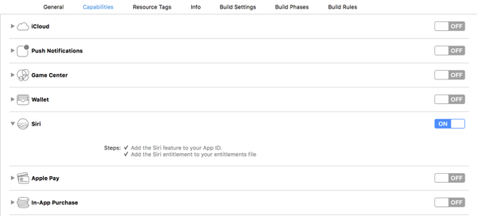

                             


voltmx.intentExtension Namespace
==============================

The voltmx.intentExtension namespace provides you with the ability to add Siri-related functionality For more information about what iMessage app extensions are and what you can use them for, refer the [Apple developer documentation](https://developer.apple.com/reference/intents).

Intent extensions enable your iOS app to interface with Siri. An Intent contains the data that Siri gathered from the user. The callback functions that your app sets with the [setExtensionsCallbacks Function](#setExtensionsCallbacks) process the input in the Intent.

By default, an Intent extension in Volt MX Iris does not have a UI. However, Iris also enables you to create an IntentUI extension that does provide a UI. When you create an IntentUI with Volt MX Iris, it generates an empty view. Whether you use an Intent extension or an IntentUI extension, you add your business logic to the extension's callback functions. Your JavaScript code accesses native functionality on iOS devices by using objects and invoking functions in the [Native Functions API](native_function.md#native_function_api_for_ios_reference.md).

Volt MX Iris supports following functionality in the Intent (or IntentUI) extensions.

*   VoIP calling
*   Messaging
*   Payments
*   Photo
*   Workouts
*   Ride booking

### App Vocabulary

It is often the case that your app will have specific vocabulary words associated with it that you will need to teach to Siri when your app is installed. Some vocabulary words are needed by all users of your app. Others are user-specific. Your app can set the user-specific vocabulary by invoking the [voltmx.vocabulary.setVocabularyStrings](voltmx.vocabulary_functions.md#setVocabularyStrings) function. Your app can remove vocabulary words with the [voltmx.vocabulary.removeAllVocabularyStrings](voltmx.vocabulary_functions.md#removeAllVocabularyStrings) function.

For vocabulary words that are needed by all of your users, you register a global vocabulary file when you install your app. For information on registering custom vocabulary words using a vocabulary file, refer the [Apple developer documentation](https://developer.apple.com/library/content/documentation/Intents/Conceptual/SiriIntegrationGuide/SpecifyingCustomVocabulary.md).

### Granting Permissions

Apple specifies that users must manually grant apps permission to use the Apple SiriKit. For your app to request permission from the user, it must do the following.

1.  Include the `NSSiriUsageDescription` key in your iOS app’s Info.plist file. The value for this key is a string that describes what information your app shares with SiriKit. For example, a workout app might set the value to the string “Workout information will be sent to Siri.” Inclusion of this key in your Info.plist is required.
    
2.  Enable Siri under the Capabilities tab for Main app, as shown in the following illustration.  
    
    
3.  Provide runtime permissions for your app by invoking functions in the [Runtime Permissions API](runtime_permissions.md). An example of this is provided in the following sample code.
    
```

    var result =
        voltmx.application.checkPermission(voltmx.os.RESOURCE_SIRI, null);
    
    // If the app does not have the required permissions ...
    if (result.status == voltmx.application.PERMISSION_DENIED) {
        // See if the app can request permission.
        if (result.canRequestPermission) {
            voltmx.print("Requesting Permission");
            voltmx.application.requestPermission(
                voltmx.os.RESOURCE_SIRI,
                permissionStatusCallback,
                null);
        } else {
            voltmx.ui.Alert(
                "PERMISSION DENIED: Open Device Settings.",
                null,
                "Siri Error",
                null,
                null);
        }
    } else if (result.status == voltmx.application.PERMISSION_GRANTED) {
        voltmx.print("Permission Granted");
    } else if (result.status == voltmx.application.PERMISSION_RESTRICTED) {
        voltmx.print("Permission Restricted");
    }
    
    function permissionStatusCallback(response) {
        if (response.status == voltmx.application.PERMISSION_GRANTED) {
            voltmx.print("Permission Granted");
        } else if (result.status == voltmx.application.PERMISSION_DENIED) {
            voltmx.print("Permission Denied");
        }
    }
```

### Configuring Your Project for Intent Extensions

To configure your project for Intent extensions, you **must** perform the following **mandatory** steps.

##### Step 1: Enable ‘Siri’ under Capabilities for KRelease, KDebug Target in your Xcode Project.

##### Step 2: Include the `NSSiriUsageDescription` key in your iOS app’s Info.plist file for authorization.

##### Step 3: Specify the intents that your extension supports.

1.  n Xcode, select the Info.plist file of your Intents extension.
    
2.  Expand the `NSExtension` and `NSExtensionAttributes` keys to reveal the `IntentsSupported` and `IntentsRestrictedWhileLocked` keys.
    
3.  In the `IntentsSupported` key, add a String item for each intent that the extension handles. Set the value of each item to the class name of the intent.This key is required. You can support all of the intents in a given domain or only some of them, and a single extension can support multiple domains.
    
4.  In the `IntentsRestrictedWhileLocked` key, add a String item for each intent for which you require the device to be unlocked. Set the value of each item to the class name of the intent. This key is optional. Some intents, such as those involving financial transactions, always require the user’s device to be unlocked. You can use this key to augment the default list with intents that do not require an unlocked device by default.
    

Functions
---------

The voltmx.intentExtension namespace provides the following function.


<details close markdown="block"><summary id="setExtensionsCallbacks">voltmx.intentExtension.setExtensionsCallbacks Function</summary> 

* * *

Sets an iMessage extension functionality with various states as callback events.

### Syntax

voltmx.intentExtension.setExtensionsCallbacks(callbacks)

### Input Parameters

callbacks

Contains an object with key-value pairs where the key specifies the extension state and the value is a callback function. The following are the possible keys.

| Key | Description |
| --- | --- |
| configureWithInteractionContextCompletion | The configuration is complete for the given interaction, the hosted view controller should call the completion block with its view's desired size. This size will be constrained between hostedViewMinimumAllowedSize and hostedViewMaximumAllowedSize of the extension context. Used with IntentUI extensions only. |
| handlerForIntent | An intent has arrived for the app. Used with Intent extensions only. |
| loadView | Loads a view that the controller manages. Used with IntentUI extensions only. |
| viewDidAppear | A view was just displayed. Used with IntentUI extensions only. |
| viewDidDisappear | A view just removed from the view hierarchy. Used with IntentUI extensions only. |
| viewDidLoad | The the view controller has loaded its view hierarchy into memory. Used with IntentUI extensions only. |
| viewWillAppear | A view is about to be displayed. Used with IntentUI extensions only. |
| viewWillDisappear | A view is about to be removed from the view hierarchy. Used with IntentUI extensions only. |


### Example: configureWithInteractionContextCompletion

```

function configureWithInteractionContextCompletion({
    "configureWithInteractionContextCompletion": configureWithInteractionContextCompletion
}) {
    // Native Function API code
}

voltmx.intentExtension.setExtensionsCallbacks(interaction, uicontext, completion);
```

### Example: handlerForIntent

```

function handlerForIntent(intent) {
    // Native Function API code
}

voltmx.intentExtension.setExtensionsCallbacks({
    "handlerForIntent": handlerForIntent
});
```

### Example: loadView

```

function loadView() {
    // Native Function API code
}

voltmx.intentExtension.setExtensionsCallbacks({
    "loadView": loadView
});
```

### Example: viewDidAppear

```

function viewDidAppear() {
    // Native Function API code
}

voltmx.intentExtension.setExtensionsCallbacks({
    "viewDidAppear": viewDidAppear
});
```

### Example: viewWillAppear

```

function viewWillAppear() {
    // Native Function API code
}

voltmx.intentExtension.setExtensionsCallbacks({
    "viewWillAppear": viewWillAppear
});
```

### Example: viewDidDisappear

```

function viewDidDisappear() {
    // Native Function API code
}

voltmx.intentExtension.setExtensionsCallbacks({
    "viewDidDisappear": viewDidDisappear
});

```

### Example: viewWillDisappear

```

function viewWillDisappear() {
    // Native Function API code
}

voltmx.intentExtension.setExtensionsCallbacks({
    "viewWillDisappear": viewWillDisappear
});
```

### Return Values

None.

### Remarks

When setting the callback function for `handlerForIntent`, the callback function takes a parameter named `intent`. This parameter contains an intent object of type INIntent class that encapsulates the request coming from Siri.

When setting the callback function for `configureWithInteractionContextCompletion`, the callback function takes the following parameters.

**_interaction_**

An object that contains the intent and response objects. Use the information in this object to configure the content of your view controller’s view. For some types of interactions, only an intent object is available.

**_uiContext_**

An object that holds context in which your view controller is displayed. Use this parameter to determine whether your view controller is to be displayed in the Maps or Siri interface. You can customize your view controller accordingly for each interface.

**_completion_**

The block to execute when you finish configuring your view controller. You must execute this block at some point in your implementation of this method. This block has no return value and takes a parameter named _desiredSize_ that sets the size you want applied to the view controller’s view. Specify a value that is between the allowed minimum and maximum size, which you can get from the view controller associated extension object. Specify CGRectZero to hide your view controller’s content altogether

### Platform Availability

iOS.only


