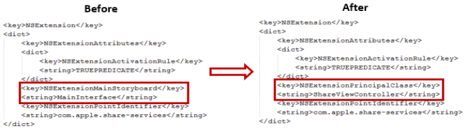

                             


voltmx.shareExtensions Namespace
==============================

The voltmx.shareExtensions Namespace implements the iOS Share extension, which is a type of app extension.

The Share app extension is one of the types of app extensions provided by Apple for iOS apps. The Share app extension allows the app users to share information from the current context with other entities, such as social media, apps, and services. For example, a Share app extension can be used to share photos directly from the Image Gallery with the social media.

The share extension app can be accessed by tapping an action button provided in an app to display the activity view. The activity view contains extensions relevant to the current context.

VoltMX Iris provides integrated support for developing Share app extensions for iOS apps. You develop Share extensions and package them into your app in the same way you do for other types of app extensions. For more information, refer [App Extension API for iOS](app-extension-ios.md).

<!-- For more information about what the Share app extension is and what you can do with it, refer the [Apple developer documentation](app-extension-ios.md). -->

For more information about what the Share app extension is and what you can do with it, refer the [Apple developer documentation](https://developer.apple.com/design/human-interface-guidelines/macos/extensions/share-extensions/).

A Share extension can use the default UI provided by Apple or a custom UI that you create. When you create a share extension using the Default GUI, a standard compose view UI is used as shown in the figure below.


The implementation of the voltmx.shareExtensions Namespace provides you with what you need to add your own business logic using the Native Function API in callback handlers.

If you create your own custom UI, you must use the Native Function API and then add your business logic according to your needs. The Info.plist file generated when you create a Share app extension from Xcode is configured to use the Default UI by default. To make use of the custom UI for your app extension, you need to perform the following steps.

1.  Open the Info.plist file of the Share app extension for which you want to develop a custom UI.
2.  Find and replace the `NSExtensionMainStoryboard` key with `NSExtensionPrincipalClass`, and also replace its value, `MainInterface` with `ShareViewController`. The figure below shows difference in the Info.plist file before and after modification.
    
    
    
3.  Save and close the file.

When you develop a Share extension, you put your business logic into a specific set of callback functions. Your app must set these callback function by invoking the [voltmx.shareExtensions.setExtensionsCallbacks](#setExtensionsCallbacks) function.

Properties
----------

The voltmx.shareExtensions Namespace provides the following properties.


<details close markdown="block"><summary>voltmx.shareExtensions.charactersRemaining</summary>

* * *

Sets an initial value to be displayed as the number of characters remaining in the placeholder.

<b>Syntax</b>

```

voltmx.shareExtensions.charactersRemaining;
```

<b>Example</b>

```
//Sample code  
voltmx.shareExtensions.charactersRemaining = 100;
```

<b>Type</b>

Number

<b>Read/Write</b>

Read and write.

<b>Remarks</b>

This property is accessible only in the default GUI mode.

<b>Platform Availability</b>

iOS

</details>
<details close markdown="block"><summary>voltmx.shareExtensions.contentText</summary>

* * *

Contains the text from the current textView.

<b>Syntax</b>

```

voltmx.shareExtensions.contentText;
```

<b>Example</b>

```
//Sample code  
var text = voltmx.shareExtensions.contentText;
```

<b>Type</b>

String

<b>Return Values</b>

text

<b>Remarks</b>

This property is only available in the default GUI mode.

<b>Platform Availability</b>

iOS

</details>
<details close markdown="block"><summary>voltmx.shareExtensions.extensionContext</summary>

* * *

Returns the current extension context.

<b>Syntax</b>

```

voltmx.shareExtensions.extensionContext;
```

<b>Example</b>

```
//Sample code  
var Context = voltmx.shareExtensions.extensionContext;
Context.extensionContext.completeRequestReturningItemsCompletionHandler([], );
```

<b>Type</b>

Object

<b>Read/Write</b>

Read only

<b>Platform Availability</b>

iOS

</details>
<details close markdown="block"><summary>voltmx.shareExtensions.placeholder</summary>

* * *

Sets the text for the share app extension in the placeholder.

<b>Syntax</b>

```

voltmx.shareExtensions.placeholder;
```

<b>Example</b>

```
//Sample code  
voltmx.shareExtensions.placeholder = "write here";
```

<b>Type</b>

String

<b>Read/Write</b>

Read and write.

<b>Remarks</b>

The API works only in default GUI mode.

<b>Platform Availability</b>

iOS

</details>
<details close markdown="block"><summary>voltmx.shareExtensions.view</summary>

* * *

Holds the current extension view.

<b>Syntax</b>

```

voltmx.shareExtensions.view;
```

<b>Example</b>

```
//Sample code  
var myView = voltmx.shareExtensions.view;
myView.addSubView(button);
```

<b>Type</b>

UIView

<b>Read/Write</b>

Read only.

<b>Platform Availability</b>

iOS

Functions
---------

The voltmx.shareExtensions Namespace provides the following function.

</details>
<details close markdown="block"><summary>voltmx.shareExtensions.popConfigurationViewController</summary>

* * *

Dismisses the current configuration view controller.

<b>Syntax</b>

```
voltmx.shareExtensions.popConfigurationViewController();
```

<b>Example</b>

```
//Sample code  
voltmx.shareExtensions.popConfigurationViewController();
```

<b>Parameters</b>

None.

<b>Return Values</b>

None.

<b>Remarks</b>

The function works only in the default GUI mode.

<b>Platform Availability</b>

iOS.

</details>
<details close markdown="block"><summary>voltmx.shareExtensions.pushConfigurationViewController</summary>

* * *

Displays a configuration view controller.

<b>Syntax</b>

```

voltmx.shareExtensions.pushConfigurationViewController(UIVController);
```

<b>Input Parameters</b>

| Parameter | Description |
| --- | --- |
| UIViewController | A UIViewController that your app creates using the Native Functions. |

 

<b>Example</b>

```

var UIVC = //native bindings code to create UIViewController  
 voltmx.shareExtensions.pushConfigurationViewController(UIVC);
```

<b>Return Values</b>

None.

<b>Remarks</b>

The function works only in the default GUI mode. The configuration view controller is called from a configuration item's tabHandler. Only one configuration view controller is allowed at a time. The pushed view controller should set `preferredContentSize` appropriately. The `SLComposeServiceViewController` observes changes to that property and animates sheet size changes as necessary.

<b>Platform Availability</b>

iOS.

</details>
<details close markdown="block"><summary>voltmx.shareExtensions.setExtensionsCallbacks</summary>

* * *

Allows your app to set callback event handlers for a Share extension.

<b>Syntax</b>

```
voltmx.shareExtensions.setExtensionsCallbacks(  
    callbacks);
```

<b>Input Parameters</b>

callbacks {Object}

Contains an object with key-value pairs where the key specifies the extension state and the value is a callback function. The following are the possible keys.  

| Key | Description |
| --- | --- |
| configurationItems | Enables the user to add configuration options via table cells at the bottom of the sheet, Returns an array of SLComposeSheetConfigurationItem objects. Only available in default GUI mode. |
| didSelectCancel | The user clicked the Cancel button. Only available in default GUI mode. |
| didSelectPost | The user clicked the Post button. Only available in default GUI mode. |
| isContentValid | Determines whether or not the content is valid. Only available in default GUI mode. Invalid content disables the Post button. Valid content enables it. |
| loadView | Loads the view into memory. |
| presentationAnimationDidFinish | The sheet presentation animation is finished. Only available in default GUI mode. |
| viewDidAppear | The view was just displayed. |
| viewWillAppear | The view controller's view is about to be added to a view hierarchy. |
| viewDidDisappear | The view has just been removed from the view hierarchy. |
| viewWillDisappear | The view is about to be removed from the view hierarchy. |

<b>Example</b>

```
var callbackEvents = {
    didSelectCancel: function() {
        voltmx.shareExtensions.extensionContext.cancelRequestWithError(undefined);
    },
    isContentValid: function() {
        var input = voltmx.shareExtensions.contentText;
        if (input.length < 100) {
            voltmx.shareExtensions.charactersRemaining = 100 - input.length;
            return true;
        } else {
            return false;
        }
    },
    configurationItems: function() {
        return [ConfigurationItem1, ConfigurationItem2];
    },
    viewDidLoad: function() {
        voltmx.shareExtensions.charactersRemaining = 100;
    }
};

voltmx.shareExtensions.setExtensionsCallbacks(callbackEvents);
```

<b>Example: configurationItems</b>

```
function configurationItems() {
    var returnarray = native bindings code to
    return array of SLComposeSheetConfigurationItem
    return returnarray;
}
voltmx.shareExtensions.setExtensionsCallbacks({“
    configurationItems”: configurationItems
});
```

<b>Example: didSelectCancel</b>

```
function didSelectCancelcallback() {
    // native bindings code
}
voltmx.shareExtensions.setExtensionsCallbacks({“
    didSelectCancel”: didSelectCancelcallback
});
```

<b>Example: didSelectPostcallback</b>

```
function didSelectPostcallback() {
    // native bindings code
}

voltmx.shareExtensions.setExtensionsCallbacks({“
    didSelectPost”: didSelectPostcallback
});
```

<b>Example: isContentValid</b>

```
function isContentValid() {
    if ( //check the validity of the input using native 						bindings code)
        {
            return true; //will enable the post button. 
        }
        return false; //will disable the post button.
    }
    voltmx.shareExtensions.setExtensionsCallbacks({“
        isContentValid”: isContentValid
    });
```

<b>Example; loadView</b>

```
function loadView() {
    //native bindings code
}
voltmx.shareExtensions.setExtensionsCallbacks({“
    loadView”: loadView
});
```

<b>Example: presentationAnimationDidFinish</b>

```
function presentationAnimationDidFinish() {
    //native bindings code
}
voltmx.shareExtensions.setExtensionsCallbacks({“
    presentationAnimationDidFinish”: presentationAnimationDidFinish
});

```

<b>Example: viewDidAppear</b>

```
function viewDidAppear() {
    //native bindings code
}
voltmx.shareExtensions.setExtensionsCallbacks({“
    viewDidAppear”: viewDidAppear
});
```

<b>Example: viewWillAppear</b>

```
function viewWillAppear() {
    //native bindings code
}
voltmx.shareExtensions.setExtensionsCallbacks({“
    viewWillAppear”: viewWillAppear
});

```

<b>Example: viewDidDisappear</b>

```
function viewDidDisappear() {
    //native bindings code
}
voltmx.shareExtensions.setExtensionsCallbacks({“
    viewDidDisappear”: viewDidDisappear
});
```

<b>Example: viewWillDisappear</b>

```
function viewWillDisappear() {
    //native bindings code
}
voltmx.shareExtensions.setExtensionsCallbacks({“
    viewWillDisappear”: viewWillDisappear
});
```

<b>Return Values</b>

None.

<b>Platform Availability</b>

iOS.

</details>


