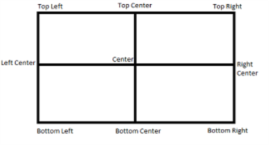

                            


voltmx.map Namespace
==================

The voltmx.map namespace provides support functions for use with the Map widget. This section contains reference information about the voltmx.map namespace in the following topics.

*   [Constants](#constants)
*   [Functions](#functions)

Constants
---------

The voltmx.map namespace defines the following constants.


<details close markdown="block"><summary>Map Provider Constants</summary>

* * *

The Map Provider Constants enable your app to select which map provider to use.

| Constant | Description |
| --- | --- |
| voltmx.map.MAP\_PROVIDER\_BING | Select Bing as the map provider. This constant is available on all platforms except SPA/Desktop Web. |
| voltmx.map.MAP\_PROVIDER\_GOOGLE | Select Google as the map provider. |

  

</details>
<details close markdown="block"><summary>Map View Mode Constants</summary>

* * *

Use the Map View Mode Constants to configure which map view your app selects.

| Constant | Description |
| --- | --- |
| voltmx.map.MAP\_VIEW\_MODE\_NORMAL | View the map in whatever mode is the default for the map provider. |
| voltmx.map.MAP\_VIEW\_MODE\_SATELLITE | View the map as a satellite image. |
| voltmx.map.MAP\_VIEW\_MODE\_STREET | View the map as a street map. |
| voltmx.map.MAP\_VIEW\_MODE\_TRAFFIC | View traffic information on the map. |

  

</details>
<details close markdown="block"><summary>Map Widget Error Codes</summary>

* * *

The following table lists the error codes that the Map widget generates.

| Constant | Description |
| --- | --- |
| voltmx.map.ROUTE\_SEARCH\_INVALID\_REQUEST | The format of the route search request was invalid. |
| voltmx.map.ROUTE\_SEARCH\_LIMIT\_EXCEEDED | The service has received too many requests from your application within the allowed time period. For Android, below are the usage limits imposed by Google Map Service. Up to 8 waypoints for Google Map free API and 23 waypoints for Google Map for Work in each request 2500 & 100000 direction requests per 24 hour period for free API and work api respectively. 2 and 10 requests per second for free API and work API respectively. |
| voltmx.map.ROUTE\_SEARCH\_NETWORK\_FAILURE | The request failed due to network failure. |
| voltmx.map.ROUTE\_SEARCH\_PLACE\_NOT\_FOUND | At least one of the locations specified in the request's source, destination, or waypoints could not be found. |
| voltmx.map.ROUTE\_SEARCH\_UNKNOWN\_ERROR | An unknown error occurred. |

  

</details>
<details close markdown="block"><summary>Pin Image Anchor Constants</summary>

* * *

The Pin Image Anchor Constants define the positions that your app can anchor a pin image to on a map. The image positions are illustrated in the image below.



| Constant | Description |
| --- | --- |
| voltmx.map.PIN\_IMG\_ANCHOR\_BOTTOM\_CENTER | Anchors the pin image at the bottom center position. |
| voltmx.map.PIN\_IMG\_ANCHOR\_BOTTOM\_LEFT | Anchors the pin image by its lower left corner. |
| voltmx.map.PIN\_IMG\_ANCHOR\_BOTTOM\_RIGHT | Anchors the pin image by its lower right corner. |
| voltmx.map.PIN\_IMG\_ANCHOR\_CENTER | Anchors the pin image at the center position. |
| voltmx.map.PIN\_IMG\_ANCHOR\_MIDDLE\_LEFT | Anchors the pin image at the middle left position of the image. |
| voltmx.map.PIN\_IMG\_ANCHOR\_MIDDLE\_RIGHT | Anchors the pin image at the middle right position of the image. |
| voltmx.map.PIN\_IMG\_ANCHOR\_TOP\_CENTER | Anchors the pin image at the top center position. |
| voltmx.map.PIN\_IMG\_ANCHOR\_TOP\_LEFT | Anchors the pin image by its upper left corner. |
| voltmx.map.PIN\_IMG\_ANCHOR\_TOP\_RIGHT | Anchors the pin image by its upper right corner. |

  

</details>
<details close markdown="block"><summary>Pin Image Type Constants</summary>

* * *

These constants define the types of images that can be used with maps.

| Constant | Description |
| --- | --- |
| voltmx.map.PIN\_IMG\_SRC\_TYPE\_BASE64 | Indicates that the pin image should be created out of given a base64 string. |
| voltmx.map.PIN\_IMG\_SRC\_TYPE\_FILE\_PATH | Indicates that the pin image is available in internal file system. The specified value can be either an absolute path or a File object. |
| voltmx.map.PIN\_IMG\_SRC\_TYPE\_IMAGE | Indicates that the pin image is of type Image object |
| voltmx.map.PIN\_IMG\_SRC\_TYPE\_RESOURCES | Indicates that the pin image is available in bundled resources. |

</details>
<details close markdown="block"><summary>Shape Type Constants</summary>

* * *

The following constants identify the shapes that can be drawn on maps.

| Constant | Description |
| --- | --- |
| voltmx.map.SHAPE\_TYPE\_POLYGON | The shape is a polygon. |
| voltmx.map.SHAPE\_TYPE\_POLYLINE | The shape is a polyline. |
| voltmx.map.SHAPE\_TYPE\_CIRCLE | The shape is a circle. |

</details>

Functions
---------

The voltmx.map namespaces contains the following functions.


<details close markdown="block"><summary>voltmx.map.containsLocation</summary>

* * *

This function tests to see whether a specified location is within a circle or polygon on a map or whether it lies along a polyline on a map.

### Syntax

```

voltmx.map.containsLocation(  
shapeType,
location,
shapeData)
```

### Input Parameters

| Parameter | Description |
| --- | --- |
| shapeType | Contains a [Shape Type Constant](voltmx_map_constants.md#ShapeTyp) that defines which kind of shape the location is being tested against. |
| location | Holds a location object which contains lat and lon values. |
| shapeData | A key-value pair object that defines the shape using the following keys: > locations \[Array\]: List of locations that defines a given shape. Each element in Array is an Object, which contains latitude and longitude values. For Circle, only first value in Array is considered.radius \[Number\]: Radius that is needed to define circle shape. This key is only valid of shapeType is Circle and ignored for other shapes.tolerance \[Number\] \[Android\]: Specify tolerance in meters when user is interacting with Polyline or Polygon. Not applicable for other shapes. |


### Examples

**Example 1: Polyline**

```

//Defining the shapeData parameter  
  var shapeData = {
    locations: [{
        lat: "17.451759",
        lon: "78.380806"
    }, {
        lat: "17.473305",
        lon: "78.425191"
    }],
    tolerance: 200,
};
//Defining the location parameter
var location = {
    lat: "17.427789",
    lon: "78.451751"
};  
//Checking if the location mentioned falls on the polyline  
var value = voltmx.map.containsLocation(voltmx.map.SHAPE_TYPE_POLYLINE, location, shapeData);	
```

**Example 2: Circle**

```

//Defining the shapeData parameter      
var shapeData = {
    locations: [{
        lat: "17.451759",
        lon: "78.380806"
    }],
    radius: 1000
};
//Defining the location parameter
    var location ={
      lat: "17.451759", 
      lon: "78.380806"
    };
//Checking if the location mentioned falls inside the circle           
var b = voltmx.map.containsLocation(voltmx.map.SHAPE_TYPE_CIRCLE, location, shapeData);	
```

### Return Values

True if the location is within the circle or polygon, or if it lies along the polyline. Otherwise, false.

### Remarks

For detailed information on how to use this function and what parameter values are valid, please see [Map API](mapapi.md).

### Platform Availability

Available on Android and iOS.

</details>
<details close markdown="block"><summary>voltmx.map.distanceBetween</summary>

* * *

This function finds the linear distance between two locations on a map.

### Syntax
```

voltmx.map.distanceBetween(  
    location1,  
    location2)
```

### Input Parameters


| Parameter | Description |
| --- | --- |
| location1 | Contains the first location to use. |
| location2 | Contains the second location to use. |

**Example**

```

//Defining pin 1.      
var pin1 = {
    id: "id1", // id is mandatory for every pin in dictionary
    lat: "17.4947934",
    lon: "78.3996441",
    name: "KPHB",
    image: "pinb.png",
    focusImage: "focusImage.png", //focus image will be shown when map pin is selected
    desc: "Kukatpally",
    showCallout: true,
    meta: {
        color: "green",
        label: "A"
    }
};
//Defining pin 2.
var pin2 = {
    id: "id2", // id is mandatory for every pin in dictionary
    lat: "17.3616",
    lon: "78.4747",
    name: "Charminar",
    image: "pinb.png",
    focusImage: "focusImage.png",
    //focus image will be shown when map pin is selected
    desc: "In Hyderabad",
    showCallout: true,
    meta: {
        color: "green",
        label: "B"
    }
};

//Adding pins.
this.view.MainMap.addPins([pin1, pin2]);
//Calculating the distance between the two pins.    
var distanceInMeters = voltmx.map.distanceBetween(pin1, pin2);
```

### Return Values

A number that specifies the distance between the two input locations.

### Platform Availability

Available on Android and iOS.

</details>
<details close markdown="block"><summary>voltmx.map.decode</summary>

* * *

This function enables apps to to decode the encoded polyline points which are provided in search route results. In Android, each step in the search results contains a key.

### Syntax

```

voltmx.map.decode(  
    encodedPolylinePoints)
```

### Input Parameters


| Parameter | Description |
| --- | --- |
| encodedPolylinePoints | Hold a string containing the encoded polyline points. |

### Return Values

An array containing only the lat/lon values.

**Example**

```

var polylineConfig = {
    lineColor: "0x0000ffff",
    lineWidth: "2"
};
var bool = voltmx.map.decode(polylineconfig);
```

### Platform Availability

Available on Android only.

</details>
<details close markdown="block"><summary>voltmx.map.searchRoutes</summary>

* * *

This function searches for routes between the start and destination locations.

### Syntax

```

voltmx.map.searchRoutes(  
    searchCriteria,  
    successCallback,  
    errorCallback)
```

### Input Parameters


| Parameter | Description |
| --- | --- |
| searchCriteria | A JSObject with set of search request configuration parameters that defines the search criteria for routes request. |
| successCallback | A callback function that receives the search results when search request succeeds. The callback function must have the following syntax. `function successCallback( routes );` The callback function's _routes_ parameter is an array with one or more routes indicating possible directions between source and destination. |
| errorCallback | An optional callback function that gets called when search request fails. The callback function must have the following syntax. `function errorCallback( errorCode [Number], errorMessage [String] )` The _errorCode_ parameter indicates the category of error. This carries the one of the Map Error Codes defined in the voltmx.map namespace. The _errorMessage_ parameter contains a detailed error message describes the reason for failure. These error messages are platform specific. |
 

### Example

```
* @ function callSearchRoutefunc * @description invokes searchRoutes API * /
  callSearchRoutefunc:function()
  {
    try{
      var searchCriteriaObj = {
        alternatives : true, 
        directionServiceUrl : "https:/ / maps.googleapis.com / maps / api / directions / json ",
        destination : {lat: MAPCONSTANTS.dest3Lat, lon: MAPCONSTANTS.dest3Lon},
        origin :  {lat: MAPCONSTANTS.originLat, lon : MAPCONSTANTS.originLon}, 
        transportMode : "driving ",
        apiKey:""
      };
      if (this.index === null || this.index === undefined) {
        alert('Please select any one destination');
      }
      switch (this.index) {
        case "VoltMX Foster City ":
          searchCriteriaObj.destination = {lat: MAPCONSTANTS.dest1Lat, lon: MAPCONSTANTS.dest1Lon};
          break;
        case "VoltMX Austin ":
          searchCriteriaObj.destination = {lat: MAPCONSTANTS.dest2Lat, lon: MAPCONSTANTS.dest2Lon};
          break;
        default :
          voltmx.print("@@@@
destination is Orlando ");
          break;
      } 

      voltmx.map.searchRoutes(searchCriteriaObj, this.searchRouteSuccesCallback, this.errorRouteSuccesCallback); 
    }catch(error){
      voltmx.print("
frmMapSearchResult Controller "+JSON.stringify(error));
    }
  },
  /**
* @function searchRouteSuccesCallback
* @description success callback for searchRoutes API
* @private  
* @param routes-&gt; routes available in the given source and destination
			 */
  searchRouteSuccesCallback:function(routes)
  {
    try{   
      this.displySearchRoutes(routes);
    }catch(error){
      voltmx.print("
frmMapSearchResult Controller "+JSON.stringify(error));
    }
  },
  /**
* @function errorRouteSuccesCallback
* @description error callback for searchRoutes API
*/
  errorRouteSuccesCallback:function(){
    try{
      alert("
Search result failed ");
    }catch(error){
      voltmx.print("
frmMapSearchResult Controller "+JSON.stringify(error));
    }
  },
  /**


```

### Return Values

None.

### Remarks

Applications which use the apiKey in search criteria must enable the “Directions API” in Google Developer Console. Google API’s usage quota is counted against the apiKey. For activating and deactivating Google API’s, please follow the below link for detailed procedure. For an overview on searching for routes on maps, please see [Map API](mapapi.md).

### Platform Availability

Available on Android and iOS.


</details>