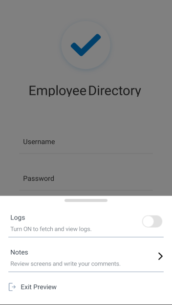
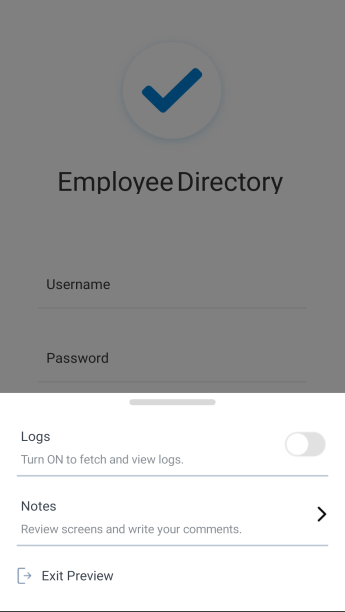

                          

Notes in the Volt MX App
========================

Once you launch the Volt MX App on your device, those you invite to access the Volt MX App on the cloud can create, view, and delete notes. Using notes, they can provide form-level comments, suggestions, and feedback to improve the app's design and user experience. A note is visible to everyone, but can only be deleted by the user who posted it.

For more information, click the notes option you want to use:

[Create a Note](#create-a-note)

[View Notes](#view-notes)

[Edit or Delete a Note](#edit-or-delete-a-note)

Create a Note
-------------

Once you launch the Volt MX App on your device, those you invite to access the preview on the cloud can create notes. Using notes, they can provide form-level comments, suggestions, and feedback to improve the app's design and user experience. A note is visible to everyone, but can only be modified or deleted by the user who posted it.

In addition to creating notes using the Volt MX App on your device, you can also do so within Volt MX Iris. Once an app has been previewed, and if you're logged in to your Volt MX account in Volt MX Iris, when you add a note (called a comment in Volt MX Iris), the preview on the cloud is automatically updated so that anyone viewing the app on their device can see your newly added note (i.e. comment).

For instructions on how to create a note, click the option you want:

[Create a Note in the Volt MX App](#create-a-note-in-the-volt-mx-app)

[Create a Comment in Volt MX Iris](#create-a-comment-in-volt-mx-iris)

### Create a Note in the Volt MX App

To create a note in the Volt MX App:

1.  Launch the child app using the Cloud feature.
2.  While previewing the app, navigate to the screen (i.e. form) that you want to add a note to.
3.  Hold two fingers on the device screen for about two seconds or shake the device. The Volt MX App menu displays.

5.  Tap **Notes**. The Form Notes pane appears on the device screen.  
    
6.  At the bottom of the Form Notes pane, tap in the **Add a note** text box, and then type your note.  
    You can add your notes to the respective form.  
    
7.  Once done writing the post, tap **Done** on the keypad.  
    The notes appears inside Volt MX Iris.  
    
8.  To dismiss the Form Notes pane, tap **Done** on the keypad.
9.  To minimize the notes pane, tap on the back button.  
    
10.  When you're ready to close the preview and return to the home screen of the Volt MX App, swipe the device screen with two fingers from left to right.

### Create a Comment in Volt MX Iris

In addition to creating notes using the Volt MX App on your device, you can also do so within Volt MX Iris. Once an app has been previewed, and if you're logged in to your Volt MX account in Volt MX Iris, when you add a note (called a comment in Volt MX Iris), the preview on the cloud is automatically updated so that anyone viewing the app on their device can see your newly added note (i.e. comment). Similarly, notes that are added by stakeholders using the Volt MX App on their devices can be viewed in the project within Volt MX Iris by refreshing the project.

To create a comment in Volt MX Iris:

1.  In Volt MX Iris, if you are not already logged in, log in to your Volt MX account.
2.  Open the shared project in Volt MX Iris. Or if it's already open, refresh it by clicking the **Project** menu, and then clicking **Refresh**.
3.  Navigate to the form you want to add a comment to.
4.  In the Properties Editor, click the **Review** tab, and then click **Comments**. All the comments (i.e. notes, as they are known in the Volt MX App) are listed.

6.  To create a new comment, click in the text box at the bottom of the **Review** tab, and then enter your comment.
7.  When you are finished creating your comment, click **Add**. Your commented is added, and is updated on the Volt MX App version of the project, which stakeholders can view on their devices.

View Notes
----------

Once you launch the Volt MX App on your device, you can view all the notes that you and those you invited to access the preview have posted.

In addition to viewing notes using the Volt MX App on your device, you can also do so within Volt MX Iris. Once an app has been previewed, and if you're logged in to your Volt MX account in Volt MX Iris, when people add notes to the preview on the cloud, in Volt MX Iris you can view those notes (called comments in Volt MX Iris) by refreshing the project.

For instructions on how to view notes, click the option you want:

[View Notes in the Volt MX App](#view-notes-in-the-volt-mx-app)

[View Comments in Volt MX Iris](#view-comments-in-volt-mx-iris)

### View Notes in the Volt MX App

Once you launch the Volt MX App on your device, you can view all the notes that you and those you invited to access the preview have posted.

To view notes in the Volt MX App:

1.  While previewing the app, navigate to the screen (i.e. form) whose notes you want to view.
2.  Hold two fingers on the device screen for about two seconds or shake the device. The Volt MX App menu displays.

4.  Tap **Notes**. The Form Notes pane appears on the device screen.  
      
    
5.  Scroll through the notes to view the details.
6.  To dismiss the Form Notes pane.  
    Tap on the notch available at the top of the screen
7.  When you're ready to close the preview and return to the home screen of the Volt MX App, swipe the device screen with two fingers from left to right.

### View Comments in Volt MX Iris

In addition to viewing notes using the Volt MX App on your device, you can also do so within Volt MX Iris. Once an app has been previewed, and if you're logged in to your Volt MX account in Volt MX Iris, when people add notes to the preview on the cloud, in Volt MX Iris you can view those notes (called comments in Volt MX Iris) by refreshing the project.

To create a comment in Volt MX Iris:

1.  In Volt MX Iris, if you are not already logged in, log in to your Volt MX account.
2.  Open the shared project in Volt MX Iris. Or if it's already open, refresh it by clicking the **Project** menu, and then clicking **Refresh**.
3.  Navigate to the form whose comments you want to view.
4.  In the Properties Editor, click the **Review** tab, and then click **Comments**. All the comments (i.e. notes, as they are known in the Volt MX App) are listed.

6.  Scroll through the comments to view them. If there new comments have been added by you or others using the Volt MX App since the last time you looked at the comments, the number of new comments appears in the blue status bar above the Properties Editor, next to **Notes**. By clicking Notes, a drop-down list of the new comments displays. When you click in the drop-down list or click **Refresh**, the new comments are considered read, and the number next to **Notes** goes away. You can always review these new comments in the **Comments** list on the **Review** tab. Since notes are listed in chronological order with the oldest comments appearing at the top, new comments appear at the bottom of the list of comments.

Edit or Delete a Note
---------------------

Once you launch the Volt MX App on your device, you can edit or delete any note that you created. You cannot edit or delete notes posted by other users.

In addition to editing and deleting your notes using the Volt MX App on your device, you can also do so within Volt MX Iris. Once an app has been previewed, and if you're logged in to your Volt MX account in Volt MX Iris, when people edit or delete notes on the preview on the cloud, in Volt MX Iris you can see those changes by refreshing the project.

For instructions on how to edit or delete notes, click the option you want:

[Delete Notes in the Volt MX App](#delete-notes-in-the-volt-mx-app)

[Edit or Delete Comments in Volt MX Iris](#edit-or-delete-comments-in-volt-mx-iris)

### Delete Notes in the Volt MX App

Once you launch the Volt MX App on your device, you can delete any notes that you created. You cannot delete notes posted by other users.

To delete a note in the Volt MX App:

1.  While previewing the app, navigate to the screen (i.e. form) that you want to delete a note from.
2.  Hold two fingers on the device screen for about two seconds or shake the device. The Volt MX App menu displays.

4.  Tap **Notes**. Notes screen appears with the list of available notes.
5.  Scroll through the notes to locate the note you want to delete.
6.  To delete the form Notes pane, swipe the Notes pane to left.  
    A delete icon appears.
7.  Tap on the icon .  
    The notes are deleted.
8.  When you're ready to close the preview and return to the home screen of the Volt MX App, swipe the device screen with two fingers from left to right.

### Edit or Delete Comments in Volt MX Iris

In addition to editing and deleting your notes using the Volt MX App on your device, you can also do so within Volt MX Iris. Once an app has been previewed, and if you're logged in to your Volt MX account in Volt MX Iris, when people edit or delete notes on the preview on the cloud, in Volt MX Iris you can see those changes by refreshing the project. In Volt MX Iris, you can only edit and delete notes (called comments in Volt MX Iris) that you created. You cannot edit or delete the comments added by other users.

To edit or delete comments in App User Guide:

1.  In Volt MX Iris, if you are not already logged in, log in to your Volt MX account.
2.  Open the shared project in Volt MX Iris. Or if it's already open, refresh it by clicking the **Project** menu, and then clicking **Refresh**.
3.  Navigate to the form whose comments you want to edit or delete.
4.  In the Properties Editor, click the **Review** tab, and then click **Comments**. All the comments (i.e. notes, as they are known in the Volt MX App) are listed.
5.  Scroll to the comment you want to edit or delete. Only comments you created can be edited or deleted.

7.  Do one of the following, depending on whether you want to edit or delete the comment.

*   **Edit a comment**. To the right of the comment's date stamp, click the pencil icon. The comment populates the text box at the bottom of the review tab, where you can edit it. Make the changes you want, and then click **Save**. To cancel the edit without making any changes, click **Cancel**. Your changes are applied to the comment, and the date stamp updates to reflect the edit. Since notes are listed in chronological order with the oldest comments appearing at the top, an edited comment appears at the bottom of the list of comments.
*   **Delete a comment.** To the right of the date stamp of the comment you want to delete, tap the **X**.

> **_Important:_** Be certain you want to delete a comment before clicking the **X**. You do not receive a confirmation dialog box asking if you're sure you want to delete the comment, and the deletion cannot be undone.

### Dismiss the Volt MX App Menu

If the menu of the Volt MX Appis displayed, you have the option of closing it without taking any action.

To dismiss the Volt MX App Menu:

1.  On the Volt MX App menu, tap **Dismiss**.

3.  When you are ready to close the preview of your app and return to the home screen of the Volt MX App, swipe the device screen with two fingers from left to right.
