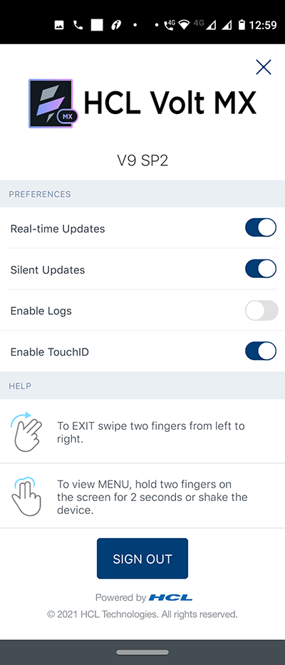
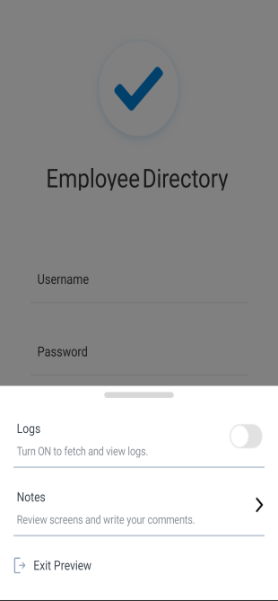
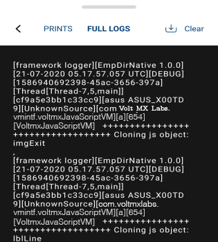
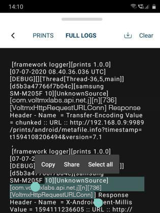
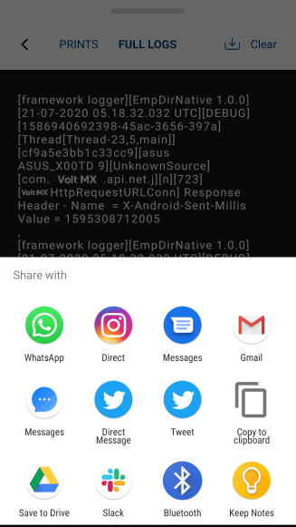
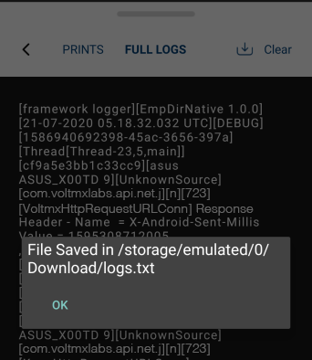
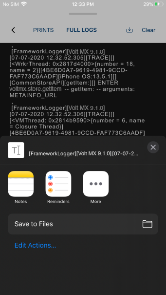
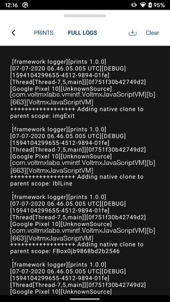

                          

View logs on the Volt MX App
============================

Logs on a device provide a detailed view of all the actions executed on the child app that is previewed using the Volt MX App. Logs on the device give developers a better debugging experience of the app usage.

Once you launch the child app using the Volt MX app on your device, you can access real-time logs on the app viewer. By using the View logs option, you can Volt MX APIs. In addition to viewing logs, you can also share, copy, clear, and download the logs.

The logs are two types, **Full Logs** and **Print logs**.

The Print logs display logs that are filtered by the features defined by the Developer. Full logs display content that is both defined by the developer as well as other functions that came predefined from Volt MX Iris.

Logs help developers to record the exact sequence of events that occurred while the app was running. With the **Print** logs option on the device, the developer can view the print logs. If the developer wants to view more info on logs, the developer can use the **Full logs** feature.

*   Using [view logs](#view-logs), you can view every action happening in the backend. It helps you to track the program execution in the backend.
*   Using [share the logs](#share-the-logs), you can share the logs with the pre-installed applications that are available on your device. You and the team can gain a better understanding of the actions executed on the app.
*   Using [copy the logs](#copy-logs-to-console), you can copy the logs and paste the logs in your Notepad or an equivalent app on your device.
*   Using [clear the logs](#clear-the-logs), you can clear the logs on the device. It helps you to improve the performance of the app.
*   Using [download the logs](#download-the-logs), you can download the logs on the console. For iPhone devices, using download logs you can also share the logs.

There are two ways to enable the logs on your device.

Enable logs in the Volt MX app
------------------------------

Once you launch the Volt MX App on your device, you can enable or disable Logs in the **Settings** page

To enable the Logs feature, do the following:

1.  On your device, open the Volt MX App.
2.  Log into the Volt MX app using your login credentials.  
    For Android devices, login is not required.  
    The app appears with the **USB** tab open by default.
3.  Tap **Settings**.  
    The Settings screen appears with details.  
      
    
4.  Under **Preferences**, toggle the **Enable Logs** button to on. By default, the toggle button is turned off.  
    

> **_Note:_** : After launching the child app, the app starts collecting the logs.

Enable the logs on the Child app using the Volt MX App.
-------------------------------------------------------

Once you launch the Child app using the Volt MX App on your device, you can Switch On the logs

To turn on the **Logs** option on the child App using the Volt MX App, do the following:

1.  On your device, open the Volt MX App.
2.  Log into the Volt MX app using your login credentials.  
    For Android devices, login is not required.  
    The app appears with the **USB** tab open by default.
3.  Open the **child** app.  
    
4.  Hold two fingers on the device screen for about two seconds or shake the device.  
    At the bottom of the screen, a new **menu** appears.  
    • When you launch the child app using **USB/Wi-F**i, the app appears with the **Logs** and **Exit Preview** features. The **Notes** option will not appear. When you launch the child app using the Cloud feature, you can see three features, **Logs**, **Notes**, and **Exit Preview**.  
      
    
5.  Toggle the **Logs** feature to on. By default, the toggle button is turned off.  
    The app will start collecting the logs.

> **_Important:_** To avoid any performance issues, disable logs when you don’t need to log actions.

### View logs

Before you get started with the view logs feature, ensure that you turn on the Fetch and View Logs features or the Enable logs feature on the child App or the Volt MX App.

For more information, refer how to [Enable Logs](#enable-logs-in-the-volt-mx-app) on Volt MX app or [Turn On](#enable-the-logs-on-the-child-app-using-the-volt-mx-app) the view logs on Child app.

1.  On your device, open the Volt MX App.
2.  Log into the Volt MX app using your login credentials.  
    The app appears with the **USB** tab open by default.
3.  Open the child app.
4.  Hold two fingers on the device screen for about two seconds or shake the device.  
    At the bottom of the screen, a new **menu** appears.
5.  Tap **View**.  
    The logs screen appears with log details.
6.  Tap **Full Logs** to view all logs to know where the problems occurred in the code.  
      
      
    

### Copy logs to console

Before you get started with the **Copy logs** feature, ensure that you **Turn On** the View and **Enable Logs** feature or **Enable Logs** on the Child App or the Volt MX App.

1.  On your device, open the **VoltMX** App.
2.  Log into the Volt MX app using your login credentials.  
    For the Android app, login is not required.  
    The app appears with the **USB** tab open by default.
3.  Open the child app.
4.  Navigate to the top of the screen.
5.  Hold two fingers on the device screen for about two seconds or shake the device.  
    At the bottom of the screen, a new menu appears.
6.  Tap **View**.  
    The Logs screen appears with the log details.
7.  Hold two fingers on the device logs screen for about two seconds.

*   For Android app you can select the logs, Three options appear, **Copy**, **Share**, and **Select all**.
*   For the iOS app, all the logs will be selected by default, a dialog box appears with the option **Copy**.  
    

9.  Tap **.Copy**.  
    Logs will be copied, and you can paste it on Notepad or any of a similar app on the device.  
      
      
    

### Share the logs

Before you get started with the **Copy logs** feature, ensure that you **Turn On** the View and **Enable Logs** feature or **Enable Logs** on the Child App or the Volt MX App.

1.  On your device, open the Volt MX App.
2.  Log into the Volt MX app using your login credentials.  
    For the Android app, login is not required.  
    The app appears with the **USB** tab open by default.
3.  Open the child app.
4.  Hold two fingers on the device screen for about two seconds or shake the device.  
    At the bottom of the screen, a new menu appears.
5.  Tap **View**.  
    The Logs screen appears with the log details.
6.  Hold two fingers on the device logs screen for about two seconds.  
    For Android app you can select the logs, A dialog box appears with three options **Copy**, **Share**, and **Select all**.  
    
7.  Tap **Share**.  
    You can see a new window with the required apps available on the device.

> **_Note:_** For iPhone, the share option in the logs section is not available. However, you can download the logs using the download icon and then share them from your iOS device.

9.  Tap on any **app** of your choice.  
    The screen will be redirected to the app.  
    

### Download the logs

Before you get started with the **Download logs** feature, ensure that you **Turn On** the View and **Enable Logs** feature or **Enable Logs** on the Child App or the Volt MX App.

1.  On your device, open the **VoltMX** App.
2.  Log into the Volt MX app using your login credentials.  
    The app appears with the **USB** tab open by default.
3.  Open the child app.
4.  Hold two fingers on the device screen for about two seconds or shake the device.  
    At the bottom of the screen, a new menu appears.
5.  Tap **View**.  
    The Logs screen appears with the log details.
6.  Tap Download **icon** , located beside to clear.

*   For the Android, logs will be downloaded on your storage.  
      
    

*   For the iPhone, logs will be downloaded as a file with a few new options; Notes, Reminders and More. When you select **More**, you view the pre-installed apps available on your device. Tap on any app of your choice. The screen will be redirected to the app.  
      
    

### Clear the logs

Before you get started with the **Clear logs** feature, ensure that you **Turn On** the View and **Enable Logs** feature or Enable Logs on the Child App or the Volt MX App.

1.  On your device, open the Volt MX App.
2.  Log into the Volt MX app using your login credentials.  
    For the Android app, login is not required.  
    The app appears with the **USB** tab open by default.
3.  Open the child app.
4.  Hold two fingers on the device screen for about two seconds or shake the device.  
    At the bottom of the screen, a new **menu** appears.
5.  Tap **View**.  
    The Logs screen appears with the log details.  
    
6.  Tap **Clear**.  
    The logs are cleared.  
    You can see a blank screen after clearing the logs.
