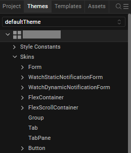
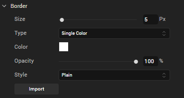
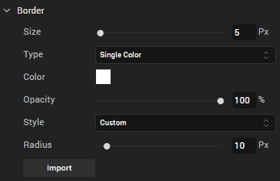
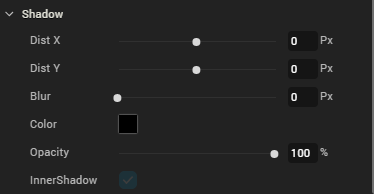
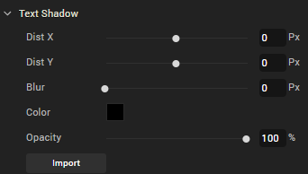
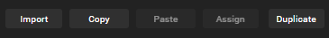
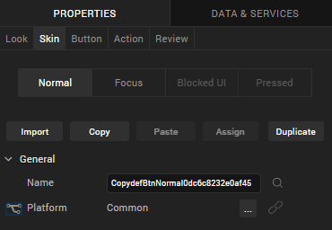

  

Understanding Skins and Themes
==============================

A widget’s appearance is defined by the skin that is applied to it. Every widget has a skin, even if it’s just the default skin. Skins give you the ability to establish visual continuity in your app. For instance, you may want all buttons in your app to use the same skin. Skins can also be applied depending on the state of a widget—for instance, when it’s at rest, receives focus, or is pressed. Several visual settings comprise a skin, such as the widget background color and opacity; the widget border color, opacity, size, and shape; the widget shadow settings; and in the case of certain widgets, font type, size, color, opacity, and shadow.

You can apply and manipulate skins in many different ways to meet your design needs, including editing, duplicating, copying and pasting, and forking. And by grouping skins together, you can create a theme that you can apply to widgets across the entire application.

You interact with widgets in two primary ways: on the widget level, using the Skins tab of an individual widget, and on a global level, using the Skins tab on the Project Explorer, where the skins of all widgets are listed.

also provides a default theme that has a set of skins defined for all the widgets within an application. The skins in this theme can be applied to widgets to get a different look and feel for the widgets. Themes are accessed from the Skins tab of the Project Explorer.

For information on impact of upgrade from any previous to V8, click [here](#Upgrade).

The following topics describe how to work with skins and themes:

[Use Default Skins](#How2)

[Create a New Skin](#How3)

[Configure a New Skin](#Configur)

[Edit a Skin](#How8)

[Apply a Skin](#How9)

[Reuse Skins](#How10)

[Fork a Skin](#Fork)

[Delete a Skin](#Deleting)

[Copy and Paste a Color or Gradient](Copy and Paste a Color.html)

[Using Themes - Applying a Collection of Skins as a Group](Using Themes Applying a Collection of Skins as a Group.html)

Use Default Skins
-----------------

The default skins allow you to specify common skins for widgets in states like Normal and Focus. Normal state is the default look of the widget, and Focus state occurs when the user touches or clicks the widget in the application. With default skins, you can provide a uniform look and feel for the widgets across various platforms.

For example, if you specify btnSkinNormal as the Normal skin for Button in Themes, all the buttons in the application will use btnSkinNormal as the Normal Skin for buttons.

Though the Application themes define a common skin for a particular widget across the application, you can still specify a different skin for a widget by selecting a different skin under the widget properties.

To view the default skins navigate to Project Explorer and click the Skins tab.

Click on a widget to view the default forms.

Create a New Skin
-----------------

You can create as many skins in as you want so that you can achieve the balance between continuity and flexibility that your app design needs.

To create a new skin, do the following: 

1.  On the Project Explorer, click the **Skins** tab.
2.  On the **Skins** tab, locate the type of widget that you want to create the new skin for, such as a Button, and then click that widget type’s context menu arrow .
3.  From the menu, click **New Skin**, and then click the type of new skin you want to create. Many widget types offer just the standard Skin, while others also offer a Focus Skin, or some variation.

Your new skin is created and is ready for you to configure.

Configure a New Skin
--------------------

Now that you have created a new skin, you need to configure its various properties with the look that you want. Here’s what you can do:

[Rename the Skin](#Rename)

[Set the Skin Background](#Set)

[Set the Skin Border](#Set2)

[Set Individual Corners in Borders](#Set_Individual_Corners_in_Borders)

[Set the Skin Shadow](#Set3)

[Set the Skin Font](#Set4)

[Set the Skin Font Shadow](#Set5)

### Rename the Skin

When you create a new skin, generates a unique name for it. And while you're welcome to keep the name that generates, you might find it more useful and easily recognizable if you rename it. You can rename widgets in two primary ways: using the Skins tab of an individual widget, and using the Skins tab on the Project Explorer, where the skins of all widgets are listed.

To rename a skin using the Skins tab on the Project Explorer, do the following:

1.  On the Project Explorer, click the **Skins** tab.
2.  On the **Skins** tab, locate the type of widget that the skin you want to rename is categorized under. If the skins currently don't appear under the type of widget, click the widget type to open the category and display the skins.
3.  From the list of skins, hover over the skin you want to rename and click its context menu arrow  to open the skin's context menu.
4.  From the skin's context menu, click **Rename**.
5.  Type a new name for the skin, and then press **Enter**.

To rename a skin using the Skins tab of an individual widget, do the following:

1.  On the Iris Canvas, locate a widget that's using the skin you want to rename, and then select it.
2.  in the Properties Editor, click the **Skins** tab.
3.  In the Name text box, type a new name for the skin, and then press **Enter**.

### Set the Skin Background

gives you a variety of ways to configure the background of a skin, which are described in the following table.

Not all background options are available for all widgets.

<table style="width: 100%;mc-table-style: url('Resources/TableStyles/2015DefinitiveBasicTable.css');" class="TableStyle-2015DefinitiveBasicTable" cellspacing="0"><colgroup><col style="width: 136px;" class="TableStyle-2015DefinitiveBasicTable-Column-Column1"> <col class="TableStyle-2015DefinitiveBasicTable-Column-Column1"></colgroup><tbody><tr class="TableStyle-2015DefinitiveBasicTable-Body-Body1"><td class="TableStyle-2015DefinitiveBasicTable-BodyE-Column1-Body1"><b>Background Type</b></td><td class="TableStyle-2015DefinitiveBasicTable-BodyD-Column1-Body1"><b>Description</b></td></tr><tr class="TableStyle-2015DefinitiveBasicTable-Body-Body1"><td class="TableStyle-2015DefinitiveBasicTable-BodyE-Column1-Body1">Single Color</td><td class="TableStyle-2015DefinitiveBasicTable-BodyD-Column1-Body1">Applies a uniform, single color as the background of the skin that you choose.</td></tr><tr class="TableStyle-2015DefinitiveBasicTable-Body-Body1"><td class="TableStyle-2015DefinitiveBasicTable-BodyE-Column1-Body1">Two Step Gradient</td><td class="TableStyle-2015DefinitiveBasicTable-BodyD-Column1-Body1">Applies two equally-applied colors as the background of the skin that you choose.</td></tr><tr class="TableStyle-2015DefinitiveBasicTable-Body-Body1"><td class="TableStyle-2015DefinitiveBasicTable-BodyE-Column1-Body1">Image</td><td class="TableStyle-2015DefinitiveBasicTable-BodyD-Column1-Body1">Applies an image of your choosing as the background of the skin. The image stretches to fill the dimensions of whatever widget the skin is applied to.</td></tr><tr class="TableStyle-2015DefinitiveBasicTable-Body-Body1"><td class="TableStyle-2015DefinitiveBasicTable-BodyB-Column1-Body1">Multi Step Gradient</td><td class="TableStyle-2015DefinitiveBasicTable-BodyA-Column1-Body1">Applies two or more colors as the background of the skin that you choose. A color can take up whatever percentage of the background you want. You can also adjust the opacity of each color, and you can change the orientation of the colors on a 360 degree axis.</td></tr></tbody></table>

To set the skin background, do the following:

1.  On the Iris Canvas, locate a widget that's using the skin you want to change the background for, and then select it.
2.  On the Properties pane of the widget, click the **Skins** tab.
3.  Click the state that you want the background to apply to, as follows:  
    
    <table style="width: 100%;mc-table-style: url('Resources/TableStyles/2015DefinitiveBasicTable.css');" class="TableStyle-2015DefinitiveBasicTable" cellspacing="0"><colgroup><col class="TableStyle-2015DefinitiveBasicTable-Column-Column1" style="width: 88px;"><col class="TableStyle-2015DefinitiveBasicTable-Column-Column1"></colgroup><tbody><tr class="TableStyle-2015DefinitiveBasicTable-Body-Body1"><td class="TableStyle-2015DefinitiveBasicTable-BodyE-Column1-Body1"><b>State</b></td><td class="TableStyle-2015DefinitiveBasicTable-BodyD-Column1-Body1"><b>Description</b></td></tr><tr class="TableStyle-2015DefinitiveBasicTable-Body-Body1"><td class="TableStyle-2015DefinitiveBasicTable-BodyE-Column1-Body1">Normal</td><td class="TableStyle-2015DefinitiveBasicTable-BodyD-Column1-Body1">Refers to the state the widget is in when it is at rest and not being engaged by the user.</td></tr><tr class="TableStyle-2015DefinitiveBasicTable-Body-Body1"><td class="TableStyle-2015DefinitiveBasicTable-BodyE-Column1-Body1">Focus</td><td class="TableStyle-2015DefinitiveBasicTable-BodyD-Column1-Body1">Refers to the state of the widget in instances when it is tabbed to or hovered over. This state is not available for all widgets.</td></tr><tr class="TableStyle-2015DefinitiveBasicTable-Body-Body1"><td class="TableStyle-2015DefinitiveBasicTable-BodyE-Column1-Body1">Blocked UI</td><td class="TableStyle-2015DefinitiveBasicTable-BodyD-Column1-Body1">Refers to the state of the widget when it is still visible to the user but is inactive. Designers customarily give a faded background to a Blocked UI to indicate to the user that it isn't currently available, such as a Sign In button being faded because the User Name and Password fields are empty. This state is not available for all widgets.</td></tr><tr class="TableStyle-2015DefinitiveBasicTable-Body-Body1"><td class="TableStyle-2015DefinitiveBasicTable-BodyB-Column1-Body1">Pressed</td><td class="TableStyle-2015DefinitiveBasicTable-BodyA-Column1-Body1">Refers to the state of the widget when it is being pressed. For example, changing the background as a button widget is being pressed provides visual feedback to the user that the button is working and that they successfully pressed the button. This state is not available for all widgets.</td></tr></tbody></table>
    
4.  In the Background section of the Skins tab, click the Type drop-down list and select the type of background you want. Instructions for how to configure each type are found in the following sub procedures.

Single Color

1.  Click the square color icon to open the Color Palette window.

3.  To select a particular hue, on the vertical color bar drag the two opposing arrows to the hue you want, and then change the hue’s lightness, darkness, and saturation by dragging to the desired location on the large color square. You can also assign a color by changing the RGB values, the HSB values, or pasting a hexadecimal value from another program into the **#** text box. To close the Color Palette window, click anywhere outside of it.
4.  By default, the opacity is set to 100, making the background completely opaque with no transparency. However, if you want the background to have a degree of transparency, you can decrease its opacity. To do so, type a value between 0 and 100 in the Opacity text box, or drag the opacity slider to the degree of opacity that you want.

Two Step Gradient

1.  Click the color preview bar to open the Two-Step Gradient Editor.
2.  Click the left gradient icon.
3.  Click the square of color next to **Color** to open the Color Palette window.

5.  To select a particular hue, on the vertical color bar drag the two opposing arrows to the hue you want, and then change the hue’s lightness, darkness, and saturation by dragging to the desired location on the large color square. You can also assign a color by changing the RGB values, the HSB values, or pasting a hexadecimal value from another program into the **#** text box. To close the Color Palette window, click anywhere outside of it.
6.  By default, the opacity is set to 100, making the background completely opaque with no transparency. However, if you want the background to have a degree of transparency, you can decrease its opacity. To do so, type a value between 0 and 100 in the Opacity text box, or click the arrow just to the right of the text box to display the opacity slider, and then drag the opacity slider to the degree of opacity that you want.
7.  Click the right gradient icon, and then repeat steps 3 through 5 for the right gradient step.
8.  When you have completed configuring the colors and their opacity, click **Apply**.

Image

1.  Copy the images you want to use to the following path in your workspace:  
    `<Workspace Name>\<App Name>\resources\common`
2.  On the Project Explorer, click the Assets tab, and then click the **Refresh** button  to bind any newly added images to the project.
3.  On the Skins tab of the widget you are changing the background for, in the Background section, click the Type drop-down list and select **Image**.
4.  Click **Choose Image**. The Background Image dialog box displays.
5.  From the Background Image dialog box, select the platforms you want to use the background image for. The image you select for the Default platform option is used if you don't specify a custom image for a specific platform.
6.  For each platform option you selected, click its corresponding Value field. Doing so brings up the Select Image dialog box. Click the image you want to use, and then click **OK**, and then click **OK** again.

The image you selected displays as the background, and stretches to fill the dimensions of whatever widget the skin is applied to. The file name of the image is also listed as the image being used in the Background section of the Skin tab in the Properties Editor.

Multi-Step Gradient

1.  Click the color preview bar to open the Multi-Step Gradient Editor.
2.  Click one of the gradient step icons .
3.  Click the square of color next to **Color** to open the Color Palette window.

5.  To select a particular hue, on the vertical color bar drag the two opposing arrows to the hue you want, and then change the hue’s lightness, darkness, and saturation by dragging to the desired location on the large color square. You can also assign a color by changing the RGB values, the HSB values, or pasting a hexadecimal value from another program into the **#** text box. To close the Color Palette window, click anywhere outside of it.
6.  By default, the opacity is set to 100, making the background completely opaque with no transparency. However, if you want the background to have a degree of transparency, you can decrease its opacity. To do so, type a value between 0 and 100 in the Opacity text box, or click the arrow just to the right of the text box to display the opacity slider, and then drag the opacity slider to the degree of opacity that you want.
7.  Repeat steps 3 through 5 for the other gradient steps.
8.  Add additional gradient steps by clicking anywhere just below the color bar, and you can delete a step by selecting it and then clicking **Delete**.
9.  Change the portion of the background that the gradient color affects by dragging its gradient step icon to a different position on the color bar.
10.  Change the orientation of the colors by trying out the Angle options, and then press **Enter** to apply the change. The available orientations are as follows:

<table style="width: 100%;mc-table-style: url('Resources/TableStyles/2015DefinitiveBasicTable.css');" class="TableStyle-2015DefinitiveBasicTable" cellspacing="0"><colgroup><col class="TableStyle-2015DefinitiveBasicTable-Column-Column1" style="width: 109px;"> <col class="TableStyle-2015DefinitiveBasicTable-Column-Column1"></colgroup><tbody><tr class="TableStyle-2015DefinitiveBasicTable-Body-Body1"><td class="TableStyle-2015DefinitiveBasicTable-BodyE-Column1-Body1">Angle</td><td class="TableStyle-2015DefinitiveBasicTable-BodyD-Column1-Body1">Description</td></tr><tr class="TableStyle-2015DefinitiveBasicTable-Body-Body1"><td class="TableStyle-2015DefinitiveBasicTable-BodyE-Column1-Body1">To top ↑</td><td class="TableStyle-2015DefinitiveBasicTable-BodyD-Column1-Body1">Orients the bottom color to be the topmost color.</td></tr><tr class="TableStyle-2015DefinitiveBasicTable-Body-Body1"><td class="TableStyle-2015DefinitiveBasicTable-BodyE-Column1-Body1">To right →</td><td class="TableStyle-2015DefinitiveBasicTable-BodyD-Column1-Body1">Orients the bottom color to be the rightmost color.</td></tr><tr class="TableStyle-2015DefinitiveBasicTable-Body-Body1"><td class="TableStyle-2015DefinitiveBasicTable-BodyE-Column1-Body1">To bottom ↓</td><td class="TableStyle-2015DefinitiveBasicTable-BodyD-Column1-Body1">Orients the bottom color to be the bottommost color.</td></tr><tr class="TableStyle-2015DefinitiveBasicTable-Body-Body1"><td class="TableStyle-2015DefinitiveBasicTable-BodyE-Column1-Body1">To left ←</td><td class="TableStyle-2015DefinitiveBasicTable-BodyD-Column1-Body1">Orients the bottom color to be the leftmost color.</td></tr><tr class="TableStyle-2015DefinitiveBasicTable-Body-Body1"><td class="TableStyle-2015DefinitiveBasicTable-BodyB-Column1-Body1">Custom</td><td class="TableStyle-2015DefinitiveBasicTable-BodyA-Column1-Body1">Orients the bottom color to the degree you specify in the numeric field that appears, along a 360 degree axis. For example, 225 orients the bottom color half way between the bottom angle (180), and the left angle (270).</td></tr></tbody></table>

12.  When you have completed configuring the colors and their opacity, click **Apply**.

### Set the Skin Border

The Border properties on the Skins tab become activated when the border width is greater than 0. Upon setting the border size to 1 or greater, the other border properties become editable. For the border color you can pick a single color or a multi-step gradient. And you can change its opacity.

Configuring the skin border for an SPA environment is slightly different. For more information, see [SPA Borders](#SPABorders).

To configure the skin border, do the following:

1.  In the Border section of the Skins tab, set the Size property to at least 1 pixel by either entering a number in the Px text box, or by moving the Size slider to the desired position.
2.  In the Border section of the Skins tab, click the Type drop-down list and select the type of border you want, either Single Color or Multi Step Gradient. Instructions for how to configure each type are as follows:

Single Color

1.  Click the square color icon to open the Color Palette window.

3.  To select a particular hue, on the vertical color bar drag the two opposing arrows to the hue you want, and then change the hue’s lightness, darkness, and saturation by dragging to the desired location on the large color square. You can also assign a color by changing the RGB values, the HSB values, or pasting a hexadecimal value from another program into the **#** text box. To close the Color Palette window, click anywhere outside of it.
4.  By default, the opacity is set to 100, making the background completely opaque with no transparency. However, if you want the background to have a degree of transparency, you can decrease its opacity. To do so, type a value between 0 and 100 in the Opacity text box, or drag the opacity slider to the degree of opacity that you want.

**Multi Step Gradient**

1.  Click the color preview bar to open the Multi-Step Gradient Editor.
2.  Click one of the gradient step icons .
3.  Click the square of color next to **Color** to open the Color Palette window.

5.  To select a particular hue, on the vertical color bar drag the two opposing arrows to the hue you want, and then change the hue’s lightness, darkness, and saturation by dragging to the desired location on the large color square. You can also assign a color by changing the RGB values, the HSB values, or pasting a hexadecimal value from another program into the **#** text box. To close the Color Palette window, click anywhere outside of it.
6.  By default, the opacity is set to 100, making the border completely opaque with no transparency. However, if you want the border to have a degree of transparency, you can decrease its opacity. To do so, type a value between 0 and 100 in the Opacity text box, or click the arrow just to the right of the text box to display the opacity slider, and then drag the opacity slider to the degree of opacity that you want.
7.  Repeat steps 3 through 5 for the other gradient steps.
8.  Add additional gradient steps by clicking anywhere just below the color bar, and you can delete a step by selecting it and then clicking **Delete**.
9.  Change the portion of the border that the gradient color affects by dragging its gradient step icon to a different position on the color bar.
10.  Change the orientation of the colors by trying out the Angle options, and then press **Enter** to apply the change. The available orientations are as follows:

<table style="width: 100%;mc-table-style: url('Resources/TableStyles/2015DefinitiveBasicTable.css');" class="TableStyle-2015DefinitiveBasicTable" cellspacing="0"><colgroup><col class="TableStyle-2015DefinitiveBasicTable-Column-Column1" style="width: 109px;"> <col class="TableStyle-2015DefinitiveBasicTable-Column-Column1"></colgroup><tbody><tr class="TableStyle-2015DefinitiveBasicTable-Body-Body1"><td class="TableStyle-2015DefinitiveBasicTable-BodyE-Column1-Body1">Angle</td><td class="TableStyle-2015DefinitiveBasicTable-BodyD-Column1-Body1">Description</td></tr><tr class="TableStyle-2015DefinitiveBasicTable-Body-Body1"><td class="TableStyle-2015DefinitiveBasicTable-BodyE-Column1-Body1">To top ↑</td><td class="TableStyle-2015DefinitiveBasicTable-BodyD-Column1-Body1">Orients the bottom color to be the topmost color.</td></tr><tr class="TableStyle-2015DefinitiveBasicTable-Body-Body1"><td class="TableStyle-2015DefinitiveBasicTable-BodyE-Column1-Body1">To right →</td><td class="TableStyle-2015DefinitiveBasicTable-BodyD-Column1-Body1">Orients the bottom color to be the rightmost color.</td></tr><tr class="TableStyle-2015DefinitiveBasicTable-Body-Body1"><td class="TableStyle-2015DefinitiveBasicTable-BodyE-Column1-Body1">To bottom ↓</td><td class="TableStyle-2015DefinitiveBasicTable-BodyD-Column1-Body1">Orients the bottom color to be the bottommost color.</td></tr><tr class="TableStyle-2015DefinitiveBasicTable-Body-Body1"><td class="TableStyle-2015DefinitiveBasicTable-BodyE-Column1-Body1">To left ←</td><td class="TableStyle-2015DefinitiveBasicTable-BodyD-Column1-Body1">Orients the bottom color to be the leftmost color.</td></tr><tr class="TableStyle-2015DefinitiveBasicTable-Body-Body1"><td class="TableStyle-2015DefinitiveBasicTable-BodyB-Column1-Body1">Custom</td><td class="TableStyle-2015DefinitiveBasicTable-BodyA-Column1-Body1">Orients the bottom color to the degree you specify in the numeric field that appears, along a 360 degree axis. For example, 225 orients the bottom color half way between the bottom angle (180), and the left angle (270).</td></tr></tbody></table>

12.  When you have completed configuring the colors and their opacity, click **Apply**.

7.  In the Border section of the Skins tab, click the Style drop-down list and select the type of corners you want, either Plain, Rounded Corner, Complete Rounded Corner, or Custom. Instructions for how to configure each type are found in the following table.

<table style="width: 100%;mc-table-style: url('Resources/TableStyles/2015DefinitiveBasicTable.css');" class="TableStyle-2015DefinitiveBasicTable" cellspacing="0"><colgroup><col class="TableStyle-2015DefinitiveBasicTable-Column-Column1" style="width: 170px;"> <col class="TableStyle-2015DefinitiveBasicTable-Column-Column1"></colgroup><tbody><tr class="TableStyle-2015DefinitiveBasicTable-Body-Body1"><td class="TableStyle-2015DefinitiveBasicTable-BodyE-Column1-Body1"><b>Border Style</b></td><td class="TableStyle-2015DefinitiveBasicTable-BodyD-Column1-Body1"><b>Instructions</b></td></tr><tr class="TableStyle-2015DefinitiveBasicTable-Body-Body1"><td class="TableStyle-2015DefinitiveBasicTable-BodyE-Column1-Body1">Plain</td><td class="TableStyle-2015DefinitiveBasicTable-BodyD-Column1-Body1"><ul><li>Plain border corners have a sharp 90 degree angle. To give a border plain border corners, click the Style drop-down list, and then select <b>Plain</b>.</li></ul></td></tr><tr class="TableStyle-2015DefinitiveBasicTable-Body-Body1"><td class="TableStyle-2015DefinitiveBasicTable-BodyE-Column1-Body1">Rounded Corner</td><td class="TableStyle-2015DefinitiveBasicTable-BodyD-Column1-Body1">
Rounded border corners with an opacity of 0 look like this:

<ul><li>Click the Style drop-down list, and then select <b>Rounded Corner</b>.</li></ul></td></tr><tr class="TableStyle-2015DefinitiveBasicTable-Body-Body1"><td class="TableStyle-2015DefinitiveBasicTable-BodyE-Column1-Body1">Complete Rounded Corner</td><td class="TableStyle-2015DefinitiveBasicTable-BodyD-Column1-Body1">
Complete Rounded border corners with an opacity of 0 look like this:

<ul><li>Click the Style drop-down list, and then select <b>Complete Rounded Corner</b>.</li></ul></td></tr><tr class="TableStyle-2015DefinitiveBasicTable-Body-Body1"><td class="TableStyle-2015DefinitiveBasicTable-BodyB-Column1-Body1">Custom</td><td class="TableStyle-2015DefinitiveBasicTable-BodyA-Column1-Body1">
With Custom border corners you can round the corners as deeply or shallowly as you want.
<ol><li>Click the Style drop-down list, and then select <b>Custom</b>.</li><li>Set the Custom rounded property between 1 and 100 pixels by entering a number in the Px text box, or by moving the Radius slider to the desired position.</li></ol></td></tr></tbody></table>

#### SPA Borders

SPA borders can be applied when you have forked a form to the SPA platform. For more information, see [Forking a Form](Forking.html#Forking_a_Form).

You can modify the following border properties of a widget on an SPA platform:

1.  **Size**: When you fork a widget skin for an SPA platform, you can either set unique values for each side of the widget border or set the same value for all the border sides.
    
    To set unique values for each border side, follow these steps:
    
    1.  Click the left border icon (**|**). The icon changes from gray to blue.
    2.  Either type the value or using the slider, set the left border size.
    3.  Perform the above steps for all the border sides.
    
    To set identical values for all border sides, do the following:
    
    1.  Click the border indicator  . The indicator changes from grey to blue.
    2.  Either type the value or using the slider, set the uniform border values.
    
    Border values are not retained if you unfork a widget skin.
    
2.  **Color**: To modify the border color, do one of the following:
    *   Update the border color of the widget.
    *   Reuse an existing color. For more information, see [Copy and Paste a Color](Copy and Paste a Color.html).
3.  **Opacity**: Change how opaque or transparent the border color is.
4.  **Style**: When you define the border size, the Style property is enabled. The following types of styles are available for widgets:
    *   **Plain**: Widget corners have a standard, 90-degree angle.
    *   **Rounded Corner**: Widget corners are rounded rather than having a sharp, 90-degree angle. If you select this option, you can either set unique values for each corner of the widget border or set the same value for all the border corners.
        
        To set unique values for each corner, do the following:
        
        1.  Click the left-top corner icon (****). The icon changes from grey to blue.
        2.  Either type the value or using the slider, set the left-top corner size.
        3.  Perform the above steps for all the border corners.
        
        To set identical values for all border corners, do the following:
        
        1.  Click the corner indicator  . The indicator changes from grey to blue.
        2.  Either type the value or using the slider, set the uniform corner values.

### Set Individual Corners in Borders

Rounded edges can be applied for widgets on skins forked for Android and Windows native platforms.

Android/Windows native platforms support configuring individual corner radius. Configuring border properties for each of the four edges of a given widget is not supported by Android/Windows native platforms.

**To set unique values for each corner, do the following:** 

1.  Click the border indicator  . The indicator changes from grey to blue.
2.  Either type the value or using the slider, set the uniform border values.
3.  Border values are not retained if you unfork a widget skin.
4.  Perform the above steps for all the border corners.

### Set the Skin Shadow

Shadow feature is available only when a skin is forked.

You can modify the following shadow properties of a widget:

*   1.  **Dist X**: Denotes the horizontal shadow distance away from the widget. When a positive **Dist X** value is entered the shadow is moved to the right-side of a widget. When a negative value is entered the shadow is moved to the left-side of a widget.
    2.  **Dist Y**: Denotes the vertical shadow distance away from the widget. When a positive **Dist Y** value is entered, shadow is moved to the top-side of a widget. When a negative value is entered the shadow is moved to the bottom-side of a widget.
    3.  **Blur**: Denotes the shadow blur of the widget by allowing you to soften shadow.
    4.  **Color**: Denotes the color of the shadow. You can select a shadow color by clicking the **Color Picker**.
    5.  **InnerShadow**: Click this check box if you want the shadow to display inside the widget. Otherwise, clear the check box to display the shadows outside the widget.

### Set the Skin Font

You can modify the following font properties of a widget:

*   **Color**: Denotes the font color. To modify the font color, do one of the following:
    *   **Select a color.** To do so, click the square color icon to open the Color Palette window. To select a particular hue, on the vertical color bar drag the two opposing arrows to the hue you want, and then change the hue’s lightness, darkness, and saturation by dragging to the desired location on the large color square. You can also assign a color by changing the RGB values, the HSB values, or pasting a hexadecimal value from another program into the **#** text box. To close the Color Palette window, click anywhere outside of it.
    *   **Reuse an existing color.** For more information, see [Copy and Paste a Color or Gradient](Copy and Paste a Color.html).
*   **Opacity**: You can change the opacity level of the font color.
*   **Size**: You can set the font size by pixels (0 to 600) or as a percentage (0 to 600) of the baseline font size of 28 pixels.

The framework, however, consumes only percentage-based values for font size. As the px values are purely representational, you must use percentage-based values while setting the skin's font size.

In iOS devices with OS 13, for certain font sizes, you will observe spacing.

*   **Font Family**: Click the **Edit** button of the **Font Family** property to open the **Font Names** window.
    
    
    
    Here, you can select the fonts for individual platforms for both Mobile and Tables
    
*   **Font Family**: You can either assign a default font family for all platforms by selecting a font from the **Font Family** drop-down list, or assign a font by platform using the **Edit** button. In assigning fonts by platform, you can use either of the two following methods:
    
    | Assign a font to a single platform | Assign a font to multiple platforms |
    | --- | --- |
    | To assign a font to an individual platform, do the following: | To assign a font to multiple platforms, do the following: |
    |  |  |
    | 
    1.  On the **Iris Canvas**, from the **Platform** drop-down list, select a platform.
    2.  From the widget **Properties** pane, click **Skin** tab.
    3.  From the **Font Family** drop-down list, select a font.
    4.  Save the project.
    
    Repeat the above steps for assigning fonts to other platforms.
    
     | 
    
    1.  Click **Edit**, next to the Font Family drop-down list.
    2.  On the **Mobile** tab, select the required font for each of the native and SPA platforms.
    3.  On the **Tablet** tab, select the required font for each of the native and SPA platforms.
    4.  On the **Desktop** tab, select the required font for Web and Windows platforms.
    5.  Click **Apply**.
    
     |
    
*   **Weight**: Select whether text on the widget should be normal or bold.
*   **Style**: Select whether text on the widget should be underlined or italicized.

### Set the Skin Font Shadow

Configure the text properties of a skin using Distance X, Distance Y, Blur, and Color properties -

The Text Shadow feature is available only for specific widgets such as Button, Label, and TextBox2.

You can modify the following text shadow properties of a widget:

1.  **DistX**: Denotes the horizontal shadow distance away from the widget text.
    *   A positive value places the text shadow to the right of the text.
    *   A negative value places the text shadow to the left of the text.
2.  **DistY**: Denotes the vertical shadow distance away from the widget.
    *   A positive value places the text shadow below the text.
    *   A negative value places the text shadow above the text.
3.  **Blur**: Denotes the shadow blur of the widget and allows you to soften text shadow.
4.  **Color**: Denotes the color of the text shadow. You can select a text shadow color by clicking the **Color Picker**.

### Location of Skin Files

Skins are grouped into a theme and the files are available in the themes folder in your application's workspace. See the following folder structure: 

<Workspace><your application name><themes>

For example, if your workspace is `C:/Users/your username/VoltMXIrisEWS` and your application name is `Application1`, then the themes are located at: `C:/Users/username/VoltMXIrisEWS/Application1/themes`.

Edit a Skin
-----------

To edit a skin you created in , do the following:

1.  Right-click the skin, and select **Edit As**.

3.  Select an option from the menu. The options are: 
    1.  **Skin**: Skin of the widget when it is not focused.
    2.  **Menu Focus Skin**: Skin of the widget when it is focused by the user.
4.  Configure the skin as required.
5.  Save the skin. After you save the skin, a new skin file is created in Project Explorer. You can use this skin for widgets in your application.

Apply a Skin
------------

To apply a skin to a widget, do the following: 

1.  Select a widget from the Iris Canvas.
2.  In the Properties pane, click the Skins tab.
3.  Select the state of the widget that you want the skin to apply to, such as Normal or Focus.
4.  Click the Search icon to the right of the Name text box. The drop-down list that appears lists all the available skins. To filter out unwanted skins from the list, begin typing the name of the skin you want.
5.  From the drop-down list of skins, select the skin you want to use.
6.  Go to **Skins** tab.
7.  Navigate to your widget of choice.
8.  Right-click and select **Assign To > Skin / Focus Skin**. If you select **Skin**, the skin will be applied to the normal state of the widget. If you select **Focus Skin**, the skin will be applied to the focused state of the widget.

Reuse Skins
-----------

Skins can be used to display different views of widgets in different platforms.

*   **Import**: Allows you to import a CSS file to be used as skin. This action can be performed using CSS Hat plug-in and Adobe Photoshop. You can find the list of CSS elements supported for import [here](#Supporte).
*   **Copy**: Allows you to copy the current skin of a widget to a clipboard.
*   **Paste**: Allows you to paste the copied skin to a selected widget.
*   Copying and pasting a skin creates another version of the original skin. The pasted skin becomes an independent skin. Any changes made to the original skin do not affect the pasted skin.
    
    The paste function can be applied across the widget states. For example, a Normal state skin of a Button Widget can be copied and pasted to the Focus skin state of the Button Widget.
    
*   **Assign**: Allows you to assign the copied skin to a widget.
*   **Duplicate**: Allows you to duplicate the current skin.

Differences between the Copy-Paste and Copy-Assign functions:

*   When a skin is copied and pasted, a new skin is created. However, when a skin is copied and assigned, no new skin is created.
*   Changes to the original skin do not affect the pasted skin. However, changes made to the original skin affects the assigned skin (because the copied and assigned skin are one and the same).

### Supported CSS Properties for Import

 
| CSS Rule | CSS Values |
| --- | --- |
| background-image | 
linear-gradient, -webkit-linear-gradient

Multiple gradients are not supported. For gradients that have two color stops, angles other than 0, 90, 180, and 270 are not supported.

 |
| background |
|  -webkit-background-image |
| \-webkit-background |
| background-color | All |
| opacity | All |
| border-radius | All |
| \-webkit-border-radius | All |
| border | All |
| border-color | All |
| border-width | All |
| color | All |
| font-size | All |
| font-weight | bold, normal |
| font-style | italic, none |
| text-decoration | underline, line-through, overline, none |
| text-shadow | All |
| box-shadow | All |
| \-webkit-box-shadow | All |

Fork a Skin
-----------

Through forking you can provide different values for the same skin across different platforms. However, only certain widget properties can be forked. You can identify if a property can be forked by the presence of a wishbone-shaped icon to the left of the property's name. Two types of forking are available:

**Simple Forking**. Fork one platform at a time.

**Complex Forking**. Forks multiple platforms of your choosing at the same time.

You can configure a skin and make it common to all platforms or apply it to a particular platform using the fork option in the **Properties > Skins** tab.

To fork a skin, do the following: 

1.  From the Application Canvas, select the platform for which you want to fork.

3.  In the Properties Editor on the **Skin** tab, in the General section, click the **Fork** icon to fork the skin for a selected platform. If the option is selected, the fork icon turns blue. The platform for which the skin is forked also appears at the platform.

You can also go to the Skins tab in Project Explorer, and right-click a skin to fork the skin.

6.  Click the lock icon to lock a skin. If you lock a skin, changes made to a widget's skin in one platform are applied to the remaining platforms.
7.  Click the ellipsis icon. The Fork Skin dialog appears.

For widgets like Calendar, which has the View Type property while forking. You can set the View Type property to different values.

10.  Select the platforms to fork and click **OK**. The skin will be forked for selected platforms.

### Important Considerations in Forking

*   Widgets that have background type as Multi-Step Gradient are by default forked (for example, Button and Phone Widgets).
*   When you fork and lock a widget skin, changes made to a widget's skin in one platform get applied to the remaining platforms, unless you specifically, unlock a platform.
*   To provide a unique skin for a platform, you apply fork and unlock properties for that platform.
*   By default all the widgets (except widgets that have background type as Multi-Step Gradient), will have a **Common** skin. Changes made to the Common skin will be applied across the platforms.
*   You can select the platforms to be forked by clicking the ellipsis button. From the **Fork Skin** dialog, select the desired platforms to be forked.
    
    
    

Delete a Skin
-------------

To delete a skin from the project library in , do the following: 

1.  Go to the **Skins** tab in the Project Explorer.
2.  Select the widget that has the skin you want to delete.
3.  Right-click the skin, and then click **Delete**.

5.  Select **Yes** in the confirmation window that appears. The selected skin is deleted.

If a skin is deleted, widgets attached to the skin revert to the default skins.

Impact of Upgrade to V8 on Skins in Widgets
-------------------------------------------

When you upgrade from any previous version of to V8, for widgets which don’t have any skins or themes applied on them, the following changes may be noticed.

*   Button/Label themes change  
    
*   Height and width of buttons change.
*   Background color of the form/flex changes to a lighter shade when we have the opacity set for Form/Flex which is present as root widget in form.  
    
*   Checkbox group and radio button group default selection color is changed to black.  
    
*   Combobox opened list view background color will change.
*   Radio button default value selected color will change  
    