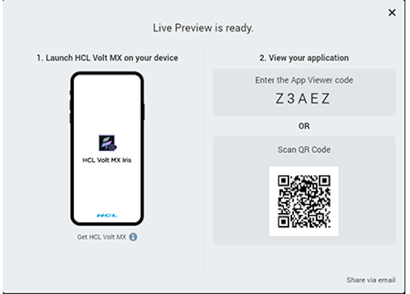

 

Live Preview
============

Overview
--------

Live Preview, a feature introduced in V8 SP4, provides a seamless in-app preview experience within . Live Preview reduces the build and preview time of an adaptive web app. It enables you to view your app as it appears on various devices without having to view the app on those devices.

Faster Previews:

Before V8 SP4, if one had to view a web app, they had to build the app, publish the app, get the URL, and open the URL in a web browser to test it.

From V8 SP4, this multistep process has been simplified. Now, when a developer selects the Live Preview option, Iris builds the app. Once the build is complete, a Iris Preview window appears which displays the web app.

Preview a Web app on Different Devices on a Single window:

Using Live Preview, you can switch between various Devices to experience their different form factors. From the Iris Preview window, you can select the device from a drop-down list.

When you select a specific device, the previewer instantly displays the web app mimicking the view on the device.

In-app Debugging:

Provides you with a debugger to detect and diagnose errors in your applications. You can set breakpoints and step through the application’s code using the in-app debugger.

Preview your Web App with Iris
------------------------------------

Before you run a Live Preview, ensure that you have a project in which you have a Web app designed.

**To preview an Adaptive Web App, do the following**:

1.  Open the project in which you have your web app designed.
2.  From the main menu, go to **Build** > **Live Preview Settings**.  
    The **Live Preview Settings** window appears.  
      
    
3.  Select the **Adaptive Web** channel for all the required platforms.  
    
4.  Click **Save & Run** or click **Save** and press **Ctrl+R** (**CMD+R** on Mac) on your keyboard to launch the Live Preview.  
    The build process begins in the Iris Build tab.  
    Once the build for the selected platforms is completed, a new **Iris Preview** window appears.
5.  From the Iris Preview window, you can select specific platform models from the drop-down menu and adjust their dimensions as required.  
      
      
      
    In Iris, you can see a **Live Preview is ready** window. The window contains App Details and QR code for the web app. Using the details, you can preview the web app on your device. For more details on how to view the app on your device, go to [Preview an App on a Device](../../iris_app_viewer/Content/FunctionalPreviewStarter.md).  
      
      
      
    

Debugging in Iris Live Preview
------------------------------------

V8 SP4 comes with an in-app debugger that can detect and diagnose errors in applications. Adaptive Web apps can be debugged within the Iris Preview window using the latest Iris debugger.

After launching the Live Preview, a debugger window automatically appears within the Iris Preview window.

You can also open the debugger in a separate window by clicking on the **Un-dock Developer Tools into separate window** button on the upper-right corner of the Iris Preview window.

The debugger allows you to control the execution of your application by:

*   Setting breakpoints.
*   Suspending launched applications.
*   Stepping through your code.
*   Examining the contents of the variables.

Debugging an application involves launching the application in the Live Preview mode on your desktop.

You can then use the in-app Google Chrome debugger to debug the application. For information on using the Chrome debugger, see [Get Started with Debugging JavaScript in Chrome DevTools](https://developers.google.com/web/tools/chrome-devtools/javascript/) on the Google Chrome website.

To understand how to Debug an application for iOS and Android platforms you can refer to:

*   [Debug JavaScript for iOS in](Inline_Debugger.html#DebugJavaScriptForiOSInIris)
*   [Debug JavaScript for Android in](Inline_Debugger.html#DebugJavaScriptForAndroidInIris)

Limitations
-----------

The Live Preview feature has the following limitations:

*   It does not support viewing the functionality of the NFIs/FFIs in your app. If your app contains an NFI or a FFI or any third-party library dependency an error message is displayed.  
    
*   It does not support the execution of APIs that require a handheld device, for example: Vibration API.
*   You must still view your Native applications on a handheld device.