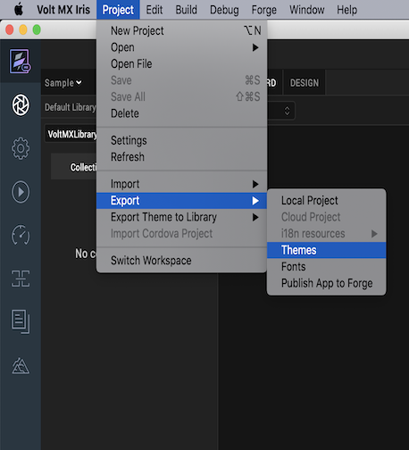

    

Micro Apps
==========

From the V9 Service Pack 5 release, you can import and use Micro Apps that implement a single module of an envisioned larger application (hereby referred to as a Composite or Super App). Micro Apps are focused on a highly targeted functionality and can perform the task quickly and efficiently. Using Micro Apps, you can create a standalone app that can also be used as part of a larger application.

A traditional business application contains a large suite of functionalities combined in a single UI that might lead to load or build time issues and the inability to quickly locate a specific functionality. Instead of managing a complex monolithic app, you can divide it into smaller and easily-manageable Micro Apps.

Micro Apps are only supported in VoltMX Reference Architecture projects.

Before you start using the Micro Apps feature, you must first configure the Base App. The **Base App** is the main app with which you start creating the project. The Base App may or may not contain linked Micro Apps. A collection of Micro Apps grouped together in a larger app (unified app) is called a Composite App (or Super App), which consists of a Base App and one or more Micro Apps. Any updates to a Micro App will reflect at every instance where that Micro App is used (composite applications, and modules). If a resource is referenced in more than two apps, you can place the resource in a common resource-sharing Micro App. When you enable resource sharing for a Micro App, the Base App can access the resources of that Micro App.

From the V9 Service Pack 5 release, you can package logic for the app's wearables (such as Forms, Glances, Notifications, and Modules) in a linked Micro App. HCL recommends that you maintain all the logic for the app's wearables in a single Micro App to avoid issues during the build process.


The following topics provide additional information about using Micro Apps:

*   [Use Case Scenario](#use-case-scenario)
*   [Create a Micro App](#create-a-micro-app)
*   [Link Micro Apps to a Project](#link-micro-apps-to-a-project)
*   [Import a Micro App into a Project](#import-a-micro-app-into-a-project)
*   [Hide a Micro App in the Project](#hide-a-micro-app-in-the-project)
*   [Exclude a Micro App from the Build Process](#exclude-a-micro-app-from-the-build-process-selective-build)
*   [Filter Micro Apps in the Project](#filter-micro-apps-in-the-project)
*   [Enable Resource Sharing for a Micro App](#enable-resource-sharing-for-a-micro-app)
*   [Update the Order of Micro Apps in a Project](#update-the-order-of-micro-apps-in-a-project)
*   [Export a Project with Micro Apps](#export-a-project-with-micro-apps)
*   [Import a Project with Micro Apps](#import-a-project-with-micro-apps)
*   [Unlink a Micro App from the Project](#unlink-a-micro-app-from-the-project)
*   [Link a VoltMX Foundry App to a Micro App](#link-a)
*   [Build Micro App Projects](#build-micro-app-projects)
*   [Project-level Settings and App-level Event Handling in Micro App Projects](#project-level-settings-and-app-level-event-handling)
*   [Resource Sharing in Micro App Projects](#resource-sharing-in-micro-app-projects)

Use Case Scenario
-----------------

Let us consider that a team of developers wants to create a unified banking application that gives a high-level overview of the different verticals of a bank (such as Accounts, Loans, Credit Cards and Wealth Management) to the higher management. As there are different specialized teams that work on different verticals of the application flow, merging the functionalities and managing updates from different teams in a single unified app is challenging.

In such cases, each team can create a Micro App that independently implements the business requirements for each vertical, and tests them independently. The developers can also maintain a shared app between these teams for the common modules or resources that can be used in any of the four Micro Apps. Once these individual apps are tested, the team can then create the Composite App by adding the four Micro Apps (each from a different vertical) as dependencies to the Base App, and then implement the application navigation logic between the Base App and the Micro Apps. Whenever there are changes made to any of the Micro Apps, the team can pull those updates individually and then test the end-to-end application. Upgrades, versioning, and maintenance of the application code becomes much more granular and efficient with Micro Apps.


Create a Micro App
------------------

Follow these steps to create a new Micro App in Volt MX Iris:

1.  Create a new project as a Base App.
2.  From the **Project** menu, select **New Project**.  
    The Project Name dialog box appears.
3.  Type a name for the Micro App, and then click **Create**.

Link Micro Apps to a Project
----------------------------

Follow these steps to link a Micro App to a Volt Iris project:

1.  From the **Project** menu, select **Link Micro App (From Workspace)**.  
    The **Link Micro App** dialog box appears.
2.  From the list of available applications, select the Micro Apps that you want to link to the project.  
    
3.  Click **Link**.  
    The selected Micro App is linked to the Base App.

### Important Considerations

*   The **Link Micro App** dialog box contains a list of all the apps (of the same architecture) available in the currently active workspace.
*   Volt Iris performs a project refresh when you link a Micro App to the Base App.
*   You can only link Micro Apps of the same app type to a Base App.  
    For example, you can only link Micro Apps that use the MVC architecture to a Base App that uses the MVC architecture, and you can only link Micro Apps that use the MVC 2.0 architecture to a Base App that uses the MVC 2.0 architecture.
*   When you link a Micro App to a Base App, resource sharing for the Micro App is disabled by default.
*   If you link a Micro App that was created using an older version of Volt Iris, an upgrade alert appears during the linking process.
*   From the V9 Service Pack 5 release, if a Micro App that contains dependent apps is linked to the Base App, the dependent apps are also linked to the Base App as direct dependencies.

Import a Micro App into a Project
---------------------------------

Follow these steps to import a Micro App into Volt Iris:

1.  From the **Project** menu, select **Import Micro App**.
2.  You can choose to import a file by using the following options:
    
    *   Click **From an Archive** to import the local project from an archive (.zip) file.
    *   Click **From a Folder** to import the local project from a folder.
    
    The **Import Project** wizard appears.
    
3.  Locate the file you want to import, select it, and then click **Open**.  
    The Micro App is imported to the current project, and appears below the Base App in the Project Explorer.

### Important Considerations

*   Volt Iris performs a project refresh when you import a Micro App into the project.
*   If a Micro App with the same name already exists in the project, Volt Iris displays a Conflict message prompting you if you want to overwrite the existing project. Click **OK** to overwrite the existing project. Click **Cancel** to end the import process.
    
    
    
*   After you overwrite a project, Volt Iris displays a Conflict Alert message with options to replace or use the existing Micro Apps.
    
    *   Click **Replace** to overwrite the existing Micro App with the new Micro App.
    *   Click **Skip** to use the existing Micro App present in the Workspace.
*   You can choose to import the Volt Iris services associated with the app during the project import process.  
    Suppose a Volt Iris service with the same name already exists in the Workspace. In that case, Volt Iris displays a Conflict Alert message with options to either replace or use the existing Micro Apps.
    
    *   Click **Continue** to overwrite the existing Micro App with the new Micro App.
    *   Click **Skip** to use the existing Micro App present in the Workspace.
*   If you import a Micro App with dependent Micro Apps, Volt Iris displays an alert prompting you to import the dependent Micro Apps into the Base App.
    
    1.  In the **Micro App Configuration** dialog box, from the **Action** context menu of the imported Micro App,
        1.  Click **Resolve** to resolve the conflicts.
        2.  Click **Unlink** to unlink the missing dependencies.
    2.  Locate the file you want to import, select it, and then click **Open**.  
        The dependent Micro App is imported into the Base App.
    3.  Click **Save**.

Hide a Micro App in the Project
-------------------------------

To hide Micro Apps from appearing in the Project Explorer and the App Storyboard, follow these steps:

1.  In the Project Explorer, from the hamburger menu, click **Micro App Configuration**.  
    The **Micro App Configuration** dialog box appears.  
    
2.  Select the **Hide in Project** check box for the Micro Apps that you want to hide.  
      
<!--     -->

*   The **Micro App Configuration** dialog box displays a list of all the Micro Apps that are directly linked to the Base App. It does not list the dependent Micro Apps of those linked Micro Apps.
*   To hide all the available Micro Apps from the project, click **Hide All**.
*   If you want to show Micro Apps that were previously hidden from the project, clear the ********Hide in Project******** check box.
*   You can only hide or un-hide Micro Apps from the project that are marked as being directly dependent on the Base App.

4.  Click **Save**.  
    The selected Micro Apps are hidden from the Project Explorer and the Storyboard view.

Alternatively, you can perform the following actions to hide Micro Apps in the project at the Micro App level:

1.  In the **Project Explorer**, right-click the Micro App you want to hide.
2.  From the context menu that appears, select **Hide**.  
<!--      -->
    The selected Micro App is hidden from the Project Explorer and the Storyboard view.

Exclude a Micro App from the Build Process - Selective Build
------------------------------------------------------------

To exclude Micro Apps from the build process at the project level, follow these steps:

1.  In the Project Explorer, from the hamburger menu, click **Micro App Configuration**.  
    The **Micro App Configuration** dialog box appears.
2.  Select the **Exclude from Build** check box for the Micro Apps you want to exclude from the build process.  
      
<!--      -->
    

*   The **Micro App Configuration** dialog box displays a list of all the Micro Apps that are directly linked to the Base App. It does not list the dependent Micro Apps of those linked Micro Apps.
*   To exclude all the available Micro Apps from the build process, click **Exclude All**.
*   If you want to include Micro Apps that were previously excluded from the build process, clear the ******Exclude from Build****** check box.  
    To include all available Micro Apps, clear the **Exclude from Build** check box in the header of the **Micro App Configuration** dialog box.
*   To exclude all available Micro Apps, select the **Exclude from Build** check box in the header of the **Micro App Configuration** dialog box.

4.  Click **Save**.  
    The selected Micro Apps are excluded from the build process.

Alternatively, you can perform the following actions to exclude or include Micro Apps in the build process at the Micro App level:

*   **To exclude Micro Apps from the build process**:
    
    From the Project Explorer, right-click the Micro App you want to exclude from the build process, and then select **Exclude from Build**.
    
*   **To include Micro Apps that were previously excluded from the build process**:
    
    From the Project Explorer, right-click the Micro App you want to include in the build process, and then select **Include in Build**.  
    
<!---->
### Important Considerations

*   You can only exclude Micro Apps from the build process that are marked as being directly dependent on the Base App.
*   If you exclude a Micro App that has dependent Micro Apps from the build process, Volt Iris displays an alert with details of the dependent Micro Apps that will be impacted due to the dependent Micro App being excluded from the build.

Filter Micro Apps in the Project
--------------------------------

You can configure the visibility of the nodes in each tab of the Project Explorer for a Micro App by applying filters. Volt Iris only displays the resources that you select from the Project Filter dialog box in the Project Explorer.

To filter the nodes of a Micro App in the Project Explorer, follow these steps:

1.  In the Project Explorer, navigate to the tab for which you want to apply the filter.  
    
2.  From the hamburger menu in the Project Explorer, click **Filter**.  
    The **Filter** dialog box appears.  
    
3.  From the **Micro Apps** field, select the Micro Apps that you want to filter.
4.  From the **Resources** section of the Project tab (or the **Themes**, **Entities**, or **Assets** sections of the Themes, Templates, or Assets tab of the Project Explorer respectively), select the filters that you want to apply for the Micro Apps.
5.  Click **Save**.  
    The selected Micro Apps are filtered based on the selected resources.  
    

Alternatively, you can perform the following actions to filter Micro Apps in the project at the Micro App level:

1.  In the **Project Explorer**, navigate to the tab that you want to filter.
2.  Right-click the Micro App that you want to filter.
3.  From the context menu that appears, select **Filter**.  
    The **Filter** dialog box appears.
4.  From the **Resources** section, select the filters that you want to apply for the Micro Apps.  
<!--     -->
5.  Click **Save**.  
    The selected Micro App is filtered based on the selected resources.  
    

Enable Resource Sharing for a Micro App
---------------------------------------

When you enable resource sharing for a Micro App, all its dependent Micro Apps and the Base App can utilize the resources (such as Themes, Form Templates, Components, Images, Shared Controllers, and others) of the Micro App.

For guidelines and information on handling resources in Micro App projects, refer [Resource Handling in Micro App Projects](#resource-sharing-in-micro-app-projects).

To enable resource sharing for Micro Apps follow these steps:

1.  In the Project Explorer, from the hamburger menu, click **Micro App Configuration**.  
    The **Micro App Configuration** dialog box appears.
2.  Select the **Action** context menu for the Micro App for which you want to enable resource sharing.  
<!--    -->
3.  From the context menu that appears, select **Enable Resource Sharing**.  
    Volt Iris displays an alert.
4.  Click **Confirm**, and then click **Save**.

### Important Considerations

*   When you link a Micro App to a project, resource sharing for the Micro App is disabled by default.
*   If you want to disable resource sharing for Micro Apps for which you had previously enabled resource sharing, from the **Action** context menu of the **Micro App Configuration** dialog box, click **Disable Resource Sharing**.  
    Volt Iris displays a warning that if you disable resource sharing, the UI of the linked Micro Apps may get distorted.  
<!--    -->

Update the Order of Micro Apps in a Project
-------------------------------------------

To update the priority order of Micro Apps with respect to the Base App, follow these steps:

1.  In the Project Explorer, from the hamburger menu, click **Micro App Configuration**.  
    The **Micro App Configuration** dialog box appears.
2.  Select the Micro App for which you want to change the order.
3.  Use the **Up** or **Down** arrow keys to reorder the Micro App.  
    
4.  Click **Save**.  
      
    The new order is successfully applied.

Alternatively, you can change the order of the Micro App from the Project Explorer as follows:

1.  In the Project Explorer, right-click the Micro App for which you want to change the order.
2.  From the context menu that appears, select one of the following options:
    *   **Move Up**: To move the Micro App above the previous Micro App.
    *   **Move Down**: To move the Micro App below the Micro App following it.

## <a id="export-a-project-with-micro-apps"></a> Export a Project with Micro Apps


Follow these steps to export a project that contains Micro Apps:

1.  From the **Project** menu, select **Export**.
2.  From the context menu that appears, select **Local Project**.
    
    The **Export** dialog box appears.  
    
    
3.  You can choose to export a Micro App by using the following options:
    
    *   **Export only &lt;ProjectName&gt; Application**: Exports only the Base App.
    *   **Export the &lt;ProjectName&gt; along with all its linked Micro Apps**: Exports the entire Composite App along with all the linked Micro Apps.
    
    Select the **Export Services along with the project** check box to include the Volt Foundry Service associated with the app during the export process.
    
4.  Click **Proceed**.  
    The selected Micro App is exported from the project.

## <a id="import-a-project-with-micro-apps"></a>Import a Project with Micro Apps


Follow these steps to import a project with linked Micro Apps:

1.  From the **Project** menu, point to **Import** > **Local Project** > **Open as New Project**.
2.  You can import a project in the following formats:
    *   Click **From an Archive** to import the local project from an archive (.zip) file.
    *   Click **From a Folder** to import the local project from a folder.
3.  Locate the file you want to import, select it, and then click **Open**.  
    The project is imported. Volt Iris opens the app in the Storyboard view, and the startup form is displayed on the Iris Canvas.

### Important Considerations

*   If the project workspace contains Micro Apps with the same name, Volt Iris displays a Conflict Alert message with options to replace or use the existing Micro Apps.
    
    *   Click **Replace** to overwrite the existing Micro App with the new Micro App.
    *   Click **Skip** to use the existing Micro App present in the Workspace.
    
      
    Click **OK** to continue the import process. Click **Cancel** to end the import process.
    
*   You can choose to import the Vot Foundry services associated with the app during the project import process.

Unlink a Micro App from the Project
-----------------------------------

To unlink Micro Apps from the Base App at the project level, follow these steps:

1.  In the Project Explorer, from the hamburger menu, click **Micro App Configuration**.  
    The **Micro App Configuration** dialog box appears.
2.  Select the **Action** context menu for the Micro App you want to unlink.
3.  From the context menu that appears, select **Unlink**.  
    The **Confirm Unlink** dialog box appears.  
<!--      -->
    
4.  Click **Save**.  
    The selected Micro App is unlinked from the project.

Alternatively, you can perform the following actions to unlink Micro Apps at the Micro App level:

1.  From the **Project Explorer**, right-click the Micro App you want to unlink.
2.  From the context menu that appears, select **Unlink**.  
    The **Confirm Unlink** dialog box appears.  
<!--    -->
    
    The selected Micro App is unlinked from the Base App.
    

### Important Considerations

*   Volt Iris performs a Project refresh when you unlink a Micro App from the Base App.
*   You cannot unlink a resource-sharing Micro App if it has multiple dependent Micro Apps. If you try to unlink a resource-sharing Micro App that has dependent Micro Apps, Volt Iris displays an alert with a list of the dependent Micro Apps that also need to be unlinked.  
      
    Click **Close** to continue.  
    However, you can unlink a resource-sharing Micro App that shares its resources only with the Base App.

Link a Volt Foundry App to a Micro App
-------------------------

Each Micro App in Volt Iris can have a corresponding Volt Foundry app linked to it. When you add a dependent Micro App to a Base App, Volt Iris automatically verifies if the Micro App has a linked Volt Foundry app. If there is no linked app, Volt Iris displays a dialog box prompting you to link a Volt Foundry app to the dependent Micro App.


Volt Iris imports the Volt Foundry services as part of the Micro App import process. You can add, edit, or unlink a specific service at the Micro App-level.

You cannot invoke the services of another Micro App in a Micro App, without linking the service to the linked Volt Foundry app of the Micro App. As part of the build process, Volt Iris fetches the details of the basVolt Foundry app, such as the appkey, appsecret, and service doc that will be integrated into the built binary.

You can create, link, import, export, and view mapping for a specific Volt Foundry app at the Micro App-level, and generate object models for the app. You can use the **Configure Environments** and **Publish Project Services** (to the environment specified in the Base App) menu options of the Data and Services panel only at the Base App-level. Volt Iris publishes the associated Volt Foundry app along with all its dependencies.

*   While in the Storyboard view, the Data and Services panel displays the details of the Volt Foundry app linked to the Base App.
*   Volt Iris does not import the Volt Foundry services when you add a dependency to a Micro App.

Follow these steps to link a Volt Foundry app to a Micro App:

1.  From the upper-right corner of the **Data & Services** panel, click the hamburger menu icon.  
    
2.  From the list of options that appears, click **Link to Existing App**.  
    The Foundry Applications dialog box appears.  
    
3.  From the available Volt Foundry applications list, select the app you want to link to the Micro App, and click **Associate**.  
    A confirmation dialog box appears.
4.  Click **Confirm**.  
    The Volt Foundry app is linked to the Micro App, and appears in the Data & Services panel.

Generate Object Models for Micro App Projects

With the introduction of the Micro Apps feature, you can generate the data model objects for individual Micro Apps as well as the complete composite app. If there are any updates made to a specific Micro App, you can use the Generate Object Models option to generate the data model objects for the individual Micro App. You can use the Generate All Object Models option to generate the data model objects for all the apps at the same time.

Build Micro App Projects
------------------------

Micro Apps are individual applications at design time and are worked upon on their individual folders in the workspace. All the granular resources such as images, fonts, videos, FFIs, NFIs, i18n are merged based on the order of priority given to the linked applications in the Project Manifest file of the Base App. In case of conflicts, a higher priority is given based on the order of applications linked in the Project Manifest file of the Base App.

You can build Micro Apps individually along with the Base App or build the complete composite app. When you build a composite app, all the dependent Micro Apps of the Base App are included in the build process, by default. However, you can select the dependent apps you want to include or exclude from the build through the **Micro App Configuration** dialog box.

The Base App is always included during the build. You cannot exclude the Base App from the build process.

When you build a composite app for the Native channel, Volt Iris generates the JS code for all the Micro Apps and merges them into a single folder during the generation of the binary. At the end of the build process, a single native binary is generated for the selected native platforms, and one zip/war file is generated for the selected web platforms. The Web binary is published via the linked Volt Foundry Base Application.

From the Volt Iris V9 Service Pack 5 release, support for the Incremental Build option has been added for Micro Apps projects.

The following build types are supported for Micro Apps:

*   [Build Native Local](../../iris_user_guide/Content/LocalBuildStarter.md)
*   [Build and Publish Web](../../iris_user_guide/Content/WebPublish.md)  
    

The Build and Publish Web option is disabled if a Volt Foundry app is not linked to the Base App.

*   [Run Live Preview](../../iris_user_guide/Content/LivePreview.md)
*   [Publish Live Preview](../../iris_user_guide/Content/LivePreview.md)
*   The [CI build](../../iris_user_guide/Content/CI_BUILD_VoltMX_Iris.md) tool validates the dependencies of the app and generates a single application binary for the Native or Web channels based on the platforms that you select for the build. If there are missing dependencies in the project, the CI build tool displays an error message.

The Micro Apps architecture does not support builds for the following platforms:

*   Windows Native Mobile/Tablet
*   Windows Desktop Kiosk
*   Universal Windows
*   The Micro Apps architecture does not support the following build types.
    *   Preview an app on the VoltMX App (Cloud build)
    *   Incremental Preview for Native Apps
    *   Hot Reload for Web Apps

Project-level Settings and App-level Event Handling
---------------------------------------------------

The Micro Apps and the Base App each have their own app-level settings and app- level events. When you link a Micro App as a dependency to a Base App, the settings and app level events of the Base App are given a higher priority. However, if there are settings of a dependent Micro App that must be enabled for the Micro App to work appropriately, Volt Iris enables those settings for the composite app. Therefore, HCL recommends that you maintain uniformity in maintaining the same settings across the Base App and its dependent apps.

All the app-level APIs only work for the composite app. The [app-level events](../../iris_widget_prog_guide/Content/Application_Events.md) of the composite app are given the highest priority. Ensure that you provide unique key names across Micro Apps to avoid conflicts. For example, you must name the keys of the Data Store APIs with the appID added as a prefix to avoid conflicts. During the testing of independent Micro Apps, the settings, APIs and app-level events of those particular applications are given a higher priority. There is no option to execute the app-level events of individual Micro Apps. If there is any app-specific logic that needs to be handled, that logic must be migrated to the Base Application’s events

*   Ensure that you maintain unique identifiers for database APIs that you use in different Micro Apps.
*   If you invoke a Keychain API with an identifier that was used earlier, previously saved keychain keys will be overridden.

To configure settings for a Micro App, follow these steps:

1.  From the **Project Explorer**, right-click the Micro App for which you want to configure the settings.  
      
    A context menu appears.
2.  Select **Settings**.  
    The **Micro App Settings** dialog box appears.  
    
3.  Configure the required settings, and then click **Done**.

### Important Considerations

You must configure the following settings in the Base App:

*   **General Settings**: App ID, App Version, Vendor Name, Bundle ID, Bundle Version, App Icons.
*   **Foundry Settings**: Foundry Environment.
*   **Native App Settings**: Minimum Target SDK and Maximum Target SDK, Certificates, Store credentials, Signing keys, Map Keys, Push Certificates, Push Notifications.
*   **Responsive Web App Settings**: Search Engine Optimization, PWA Settings, and other related settings such as the Manifest file, Service Worker Enable ES5 build, and others.
*   **Misc Settings**: Cordova, Splash Screen, i18n, Default Font-Sizes, APM settings.

Ensure that there are no conflicts in the following settings between a Base App and its dependent apps:

*   Enable Desktopweb Legacy
*   Enable JS Library Mode (Legacy)
*   Enable Async Mode

If you invoke the following app-level APIs multiple times, the previous configurations are overridden at runtime:

*   setApplicationInitializationEvents()
*   setApplicationCallbacks()
*   setApplicationBehaviors()
*   setApplicationProperties()
*   addApplicationCallbacks()

Resource Sharing in Micro App Projects
--------------------------------------

In the Micro App projects, resources can be shared across a Base App and its dependent Micro Apps. Resources that can be shared include Components, Images, Skins, Style Constants, Themes, i18n keys, Forms, Templates, and Controller Files.

If a resource is referenced in more than two apps, place the resource in a shared Micro App. You can create a shared Micro App by enabling the Resource Sharing option in the Micro App Configuration screen.  
When you enable the resource sharing option for a Micro App, the Base App can access the resources of that Micro App.

Ensure that you have minimal resource-sharing Micro Apps in a project. If a project has multiple resource-sharing Micro Apps, it may result in distortions in the UI or navigation flow of the Base App when a dependent Micro App is unlinked. The UI distortions occur as the references of the resources between the Base App and its dependent Micro App are missing.

The resources from the Base App and the Micro Apps are listed in the respective Project Explorer tabs. Within a specific tab of the Project Explorer, the resources are segregated based on the Micro App in which they are available.

When you update a resource, the changes are saved within the resource’s corresponding Micro App or in the Base App.

In case of any naming conflicts for any resources, the resource from the Micro App is overwritten with the corresponding assets from the Base App.

In case of conflicts, Volt Iris decides the order of precedence of a resource based on the order of priority assigned to the Micro Apps in the Project Manifest file of the Base App. The Base App is given the highest priority by default. You can change the order of priority of the Micro Apps by manually updating the project.manifest file of the Base App (present in the Workspace folder of the Base App), and then refresh the project to view the changes.

Here is a sample project.manifest file:

```
{
    "dependencies": \[
        {
            "name": "Accounts",
            "useResources": true,
            "isHidden": false,
            "excludeFromBuild": false
        },
        {
            "name": "Authentication",
            "useResources": false,
            "isHidden": false,
            "excludeFromBuild": false
        },
        {
            "name": "FundsTransfer",
            "isHidden": false,
            "excludeFromBuild": true
        },
	 {
            "name": "CardManagement"  
            "isHidden": true,  
            "excludeFromBuild": false  
        }
    \]
}
```

Micro Apps help in managing the application UI and code at the design time. However, after the composite app is built, Volt Iris generates a single app binary. Therefore, HCL recommends that you provide unique names to all the Components, Skins, Style Constants, Images, Fonts, i18n keys, and other project resources. This will help to avoid conflicts between Micro Apps when the final composite app is built.

Forms and Templates present in different Micro Apps may have the same name.

The Base App can access the following resources of its dependent Micro Apps:

*   **Modules -** All the global module.js files from each Micro App are merged and listed in an alphabetical order in the <appname> folder in the final binary.
*   **Actions** - The Action Editor of Micro App lists the resources of the Form that is present in the current app.  
    From the Base App, you can navigate to any form of a dependent Micro App. The **Navigate to Form** action displays a list of Forms to which you can navigate. The Forms of the dependent Micro Apps are listed in the `FormName [App Name]` format.
*   **Components** \- The Components section of the Project Explorer lists all the components available in the project, segregated based on the Micro App in which they are available. Any changes made to a component will reflect everywhere that the component is used.  
    You can drag and drop a component from a resource-sharing Micro App into its dependent Micro Apps, and instantiate the component without having to duplicate the component.
*   **Templates** - The Templates section of the Project Explorer lists all the Templates available in the project, segregated based on the Micro App in which they are available.  
    You can use Templates from a resource-sharing Micro App in another Micro App and assign the template without having to duplicate it.
*   **Custom Widgets** - All the Custom Widgets of the dependent Micro Apps are listed collectively in the main app. In case of conflicts, the custom widgets of the Base App and any dependent files are given higher priority. To edit a custom widget of a dependent app, you must navigate to the specific Micro App. This ensures that you are aware of the changes that you make at the app level.
*   **i18n Resources** - The context menu of each dependent Micro App has the option to open its corresponding project settings window, that lists its respective i18n locales. If the i18n keys or locales are defined in the Micro App, you can edit the key-value pair on the Volt Iris canvas.  
    The i18n resources for the composite app are enabled only when the `isI18nConfigEnabled` and `isI18nLayoutConfigEnabled` flags are enabled in the project properties for both the Base App and the dependent Micro Apps. If the flags are not enabled for the Base App, the i18n resources are disabled for the complete app. In case of conflicts, Volt Iris decides the order of precedence based on the order of priority assigned to the Micro Apps in the project.manifest file of the Base App.
*   **Themes** \- All the Themes present in the project are listed in the Themes tab of the Project Explorer, segregated based on the Micro App in which they are available. The Base App and its dependent Micro Apps contain identical Themes. If there are any missing themes in a linked Micro App, Volt Iris creates identical themes from the Base App. At runtime, all the Themes present in the project are merged and listed based on the order of priority assigned to the Micro Apps in the project.manifest file of the Base App.  
    For information on how to handle themes between a Base App and its dependent Micro Apps, refer [Guidelines to Handle Themes between the Base App and Micro Apps](#guidelines-to-handle-themes-between-the-base-app-and-micro-apps).  
    
*   **NFIs** - All the NFIs of the dependent Micro Apps are listed collectively in the main app. The NFIs of the dependent Micro Apps are read -only. To edit, delete, or update NFIs from a dependent app, you must navigate to the individual Micro App and make the updates. If you try to update the NFIs of a dependent Micro App in the main app, the following alert appears:  
    `This NFI is part of <microapp_name>. Please go to <microapp_name> to modify this NFI.`
*   **FFIs** - All the FFIs of the dependent Micro Apps are merged and packaged collectively in the main app during the build process. In case of conflicts, the FFIs of the Base App are given higher priority.
*   **Global Variables -** All the Global Variables of the dependent Micro Apps are listed collectively in the main app. In case of conflicts, the Global variables of the Base App are given higher priority followed by the defined dependency hierarchy of all the dependent Micro Apps. The global variables of the Base App are accessible across the project. However, if you want to declare global variables that will be used across multiple apps, you must declare those variables in an app that has shared resources enabled. If you declare global variables in the Micro App, the global variable of the last loaded file (at runtime) is given higher priority.
*   **Require files/ define in controllers** \- All the require files of the composite app and all its dependent Micro Apps are listed in separate app folders within the require section of the root directory of the project. HCL recommends that you name the require files with unique names to be placed in the root directory of the project or use App Groups to sort files. All the require files are merged in the root folder as part of the build process. In case of conflicts, the require files that are merged last as part of the build process are given a higher priority. Volt Iris displays a warning in case of conflicts due to the usage of the same file name or app group name in the require folder, and prompt you to resolve the conflicts and correct all the references.
*   **Web Wrapper Components** \- The Web wrapper components are listed collectively as part of the main app.
*   **Workerthreads-** All the global workerthreads from each Micro App are merged and listed in an alphabetical order in the JSSRC folder of the <appname> folder in the final binary.

### General Guidelines

*   You can reuse Skins and Style Constants from a resource-sharing app in other apps. Any changes made to the Skins and Style Constants will automatically reflect across the project. If you rename Style Constants independently, it may lead to broken references in other Micro Apps where they are used.
*   If an app contains nested components, any rename or delete actions on the child component must be done only in the composite app. If you rename the child component in the individual Micro App, it may lead to broken references in the parent component that is used in the other apps.
*   You can reuse Segment Templates from a resource-sharing app in Segments of other apps. If you want to rename the child widgets of a template, you must do so in the composite app. If you rename the child widgets of a template in the individual Micro App, it may lead to broken references in the Segment widget's widgetDataMap property.
*   If you rename or delete any i18n keys of a resource sharing app, it may lead to broken references in other Micro Apps where the key is used.
*   You can increase the re-usability of images or fonts by creating them in the skins of resource-sharing apps. You can then reference the skin or the images in other apps that are dependent on the resource sharing app. If you rename the image or font independently, it may lead to broken references in other Micro Apps where they are used.

### Export Composite App Themes

You can export the Themes present in a project to import them for use in a different Volt Iris 	project. For a Composite App, you can select the Themes that you want to export (export Base App Themes, or export Composite App Themes) during the export process.

To export a theme, follow these steps:

1.  On the **Project** menu in VoltMX Iris, point to **Export**, and then click **Themes**.  
      
    The **Export** dialog box appears.  
    
2.  Select one of the options to export the Themes:  
    
    *   **Export only &lt;Base\_App&gt; Themes**: Exports only the Themes present in the Base App.
    *   **Export &lt;Base\_App&gt; Themes along with all its linked MicroApps Themes.**: Exports the Themes present in the Base App and its linked Micro Apps.
    
    
3.  Click **Proceed**.  
    The **Export Themes** dialog box appears.  
      
    
4.  Select the skins that you want to export, and then click **Finish**.  
    The **Save As** dialog box appears.
5.  Navigate to the folder where you want to save the exported Themes, and then click **Save**.  
    The Themes that you selected are bundled as a .zip file, and a status box informs you that the export was successful.
6.  Click **Close**.  
    

If a Theme (or Skin) with the same name exists in both the Base App and a linked Micro App, VoltMX Iris exports the Theme (or Skin) of the Base App.

### Guidelines to Handle Themes between the Base App and Micro Apps

Following are a few Guidelines to handle themes in a Micro App architecture project:

Before getting started with this feature, ensure that you have a good understanding of using [Skins and Themes in Volt Iris](../../iris_user_guide/Content/Customizing_the_Look_and_Feel_with_Skins.md).

*   During the Micro App import process, if the Base App has a higher number of themes than the themes present in the dependent Micro App, Volt Iris automatically creates the missing themes in the imported Micro App to maintain identical themes across the Base App and its dependent Micro Apps.
*   During the Micro App import process, if the dependent Micro App has a higher number of themes than the themes in the composite app, Volt Iris ignores the extra themes present in the imported Micro App.
*   If you create new skins or skin constants for an individual Micro App, the details of the skin or skin constant are added to the theme of the Micro App.
*   If you want to create new skins or skin constants that you can reuse across all the dependent Micro Apps of a Base App, you must create them in a theme of the Shared Resources App.
*   If you create a new Micro App, it must have identical themes as the Base App. For example, if the Base App has two themes, Default theme and Theme1, the dependent Micro App must also have two themes, Default and Theme1.
*   If you create a new theme in the Base App, Volt Iris automatically creates a similar theme for all the dependent Micro Apps of the Base App.
*   If there are any conflicts between the themes that are used in the composite app and the themes of the Micro App, or if the Micro App has missing themes, creates the missing theme (by duplicating the last applied theme) during the Micro App import process.
*   If you delete a theme from the Base App, Volt Iris deletes the theme from all the dependent Micro Apps.
*   During the application build process, all the Skins and Style Constants from the Base App and its dependent Micro Apps are included in the build process (generation of a single binary) and are applied to the composite app.

Micro Apps Limitations
----------------------

*   Micro Apps are only supported in the VoltMX Reference Architecture projects.
*   You can only link Micro Apps of the same app type to a Base App.  
    For example, you can only link Micro Apps that use the MVC architecture to a Base App that uses the MVC architecture, and you can only link Micro Apps that use the MVC 2.0 architecture to a Base App that uses the MVC 2.0 architecture.
*   You can only hide or un-hide Micro Apps from the project that are marked as being directly dependent on the Base App.
*   You can only exclude Micro Apps from the build process that are marked as being directly dependent on the Base App.
*   The Micro Apps architecture does not support the following build types.
    *   Preview an app on the VoltMX App (Cloud build)
    *   Incremental Preview for Native Apps
    *   Hot Reload for Web Apps
