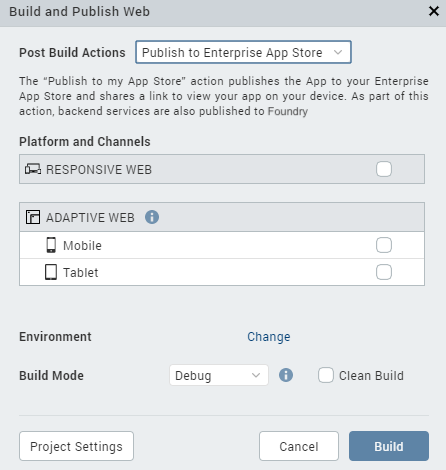
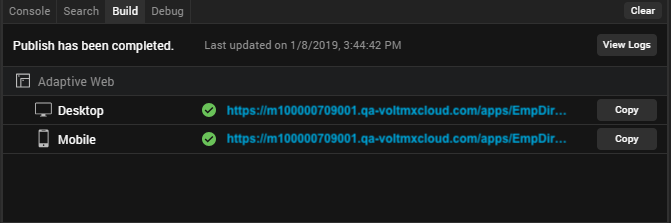

 

Publishing a Web App in
=======================

Overview
--------

Web Publish, a feature introduced in V8 SP4, enables you to build and publish a web app from to your cloud.

Seamless in-app Build and Publish Experience

Starting with V8 SP4, you can publish a web app to , without leaving the Iris window. Earlier, one had to design their web app in Iris and then open the console to the publish the web app. This process has now been simplified.

The Build and Publish Web feature is available in the Build menu of the application.

The publish process occurs in the background, and you can continue to use the Iris canvas while the app is being built and published.

Access to the Published URL within

Once the publish is complete, the published URL is displayed on the Build tab in . When you click the URL, the Iris Preview window opens. For more information on the Iris Preview window, click [here](LivePreview.html).

You can also click on **Copy** beside the URL to copy it and view the app in a web browser of your choice.

The Build tab in Iris displays the status of your app publish. If there are any errors, they appear in the Build tab. You can switch to the Console tab for a detailed view of the error logs.

Prerequisites
-------------

**Following are the prerequisites to publish a Web App within** :

1.  Sign in to your Cloud account.
2.  Link a new or an existing foundry app to your Iris Project.

When you try to publish the app without logging into , the login window appears.

If you try to publish the app, even when you do not have an associated app, you will get a prompt to link a app.

To change the selected Cloud account or Environment, go to **Project Settings** > . hen, click the tab. At the top of this tab, under Environment, select an environment from the drop-down list. Click **Done**. If you do not see any environments listed, you need to create one. For more information, refer [Environments](../../../Foundry/voltmx_foundry_user_guide/Content/Environments.md) in the Console User Guide.

To publish the web app to , the app needs to be associated with a app.

If no Foundry App is associated to your Iris project, an error message is displayed.

You must either create a new app or use an existing one. For information on how to create a new app, see [How to Add Applications](http://opensource.voltmxtechsw.com/volt-mx-docs/voltmxlibrary/voltmxfoundry/voltmx_foundry_user_guide/Content/Adding_Applications.html) in the Console User Guide.

Post Build Actions
------------------

The Build and Publish Web option in  builds the application for the selected Web platforms and performs the selected Post Build Action. You must choose the Post Build Action in the **Build and Publish Web** window, before the build process begins. There are three types of Post Build Actions:

*   [Build and Publish Web App](#Run) – This action publishes the application to your environment.
*   [Publish to my App Store](#Publish) – This action publishes the Web application to your Enterprise App Store.
*   [Generate Web App](#Generate) – This action generates the archive for your Web application and saves it on your file system.

The Post Build Action is initiated after the Build is complete.

### Build and Publish Web App

The Build and Publish Web App action publishes the application to your environment and enables you to view your app by providing a link.

The Build and Publish Web app option also publishes the app to the Cloud.

To publish an app to the Cloud, logging in to your Account is mandatory.

### Publish to my App Store

The Publish to my App Store action generates the web app archive and publishes the application to your Enterprise App Store. After a successful publish, a confirmation window appears, which shares a link to view the Enterprise app store on your device.

To publish an app to the Enterprise App Store, logging in to your Account is mandatory.

For more information on Publish to my App Store, click [here](EAS.html#Publishing).

### Generate Web App

The Generate Web App action generates the archives for your Web application and saves it on your file system. The Iris project does not have to be linked to to complete this action.

Once the build is complete, the generated web archives will appear in your project's workspace > binaries folder. You can then upload and publish the app on .

Alternatively, once the build is complete, you will get notified by an email from " – Build Service", with download links for all these binaries.

You will also get the build logs in your project's workspace > binaries folder. You can refer to the logs to analyze the build for failures or success.

Publish a Web app
-----------------

Before you publish a web app, ensure that you have a project in which you have a Web app designed.

**To publish a Web app, follow these steps**:

1.  Open the project in which you have designed a web app.  
    
2.  Sign in to your Cloud account.  
    
3.  Link your Iris Project to a app. You can link your Project to a new or an existing Foundry app.
4.  On the **Data & Services** panel, click the hamburger menu near the **Refresh** button.
5.  Click either **Create New App** or **Link to Existing App**. The console appears.
6.  If you have not already, sign in to your account by using your cloud credentials.
7.  If you choose:
    1.  **Create New App**, a new Foundry app with the same name as the Iris Project is created.
    2.  **Link to Existing App**, a list of existing apps from your account are displayed.
8.  To select the app that you want to associate your app with, click **Associate** beside the App Name.  
      
    The app you chose/created is successfully linked to your Iris Project.
9.  Close the window and return to by clicking on the Iris icon on the left navigation pane.
10.  From the main menu of , select **Build** > **Build and Publish Web**.  
    The Build and Publish Web window appears.  
      
    
11.  Select the required Platforms and Channels for which you want to build and publish your web app.
12.  From the **Post Build Action** drop-down menu, select the desired **Post Build Action**. For more details about the Post Build Action, click [here](#Post).
13.  From the **Build Mode** drop-down list, select your desired build mode.
*   You can choose to change the cloud environment on which your app will be published. To do so click on **Change** beside the **Environment** option.
*   Once all the required settings are ready, click **Build**.  
    The progress of the Web App Publish is displayed in the Build tab of Iris.  
    Once the publish process is complete, a Web App URL appears on the Build tab.
*   Click on the generated URL to preview your Web app in the [**Live Preview** mode](LivePreview.html#Live_Preview).  
    The Iris Preview window appears. You can use this window to debug the application.
*   You can also click on **Copy** to copy the URL to your clipboard and view it in a web browser of your choice.  
    
*   Click on **View Logs** to access the logs of the publish process.
*   An **Application was deployed mail** will also be sent to your registered e-mail account. This mail will contain the App details along with the App URL. Click on the URL in the mail to open the web app in your default web browser.