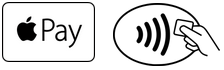

                            

Native Function API Developer's Guide:[Native Function APIs for iOS](native_function_apis_for_ios.md) > [iOS Examples](ios_examples.md) > Apple Pay

Apple Pay
=========

Apple Pay is a secure mobile payment and digital wallet service by Apple Inc., using which you can make contactless payments using your iPhone 6, iPhone 6 Plus, and Apple Watch. Your credit and debit card information is stored in Apple Passbook. Your card information is securely encrypted and a unique Device Account Number is used when you make your payments. If your iPhone is stolen or lost, you can sign in to iCloud and put your device in Lost Mode. This will eventually suspend Apple Pay from misuse.

Enable this API from Project properties before using.

> **_Important:_** This API is available on iOS platform only.

The stores that accept contactless payments will display one of these symbols at checkout.

Some benefits of Apple Pay are:

*   Simple to set up and ease of use.
*   Secure and safe payment method.
*   You need not carry your cards all the time to make payments.

For more information on Apple Pay, follow the links:

*   [Configuring Your Environment](https://developer.apple.com/library/archive/ApplePay_Guide/Configuration.md#//apple_ref/doc/uid/TP40014764-CH2-SW1)
*   [Creating a Payment Request](https://developer.apple.com/library/archive/ApplePay_Guide/CreateRequest.md#//apple_ref/doc/uid/TP40014764-CH3-SW2)
*   [Authorizing a Payment](https://developer.apple.com/library/archive/ApplePay_Guide/Authorization.md#//apple_ref/doc/uid/TP40014764-CH4-SW3)
*   [Payment Processing](https://developer.apple.com/library/archive/ApplePay_Guide/ProcessPayment.md#//apple_ref/doc/uid/TP40014764-CH5-SW4)

> **_Note:_** The PKPaymentButton class is not available in JavaScript. Alternatively, you have to download the Apple Pay button resources and use them on a Volt MX button to achieve the look desired for an Apple Pay button.

Sample Application
------------------

Click [here](https://github.com/HCL-TECH-SOFTWARE/volt-mx-samples/blob/main/SampleApplePayAPI/sampleApplePay.zip) to download sample application for Apple Pay.
