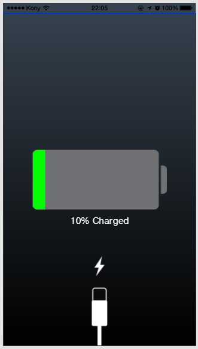
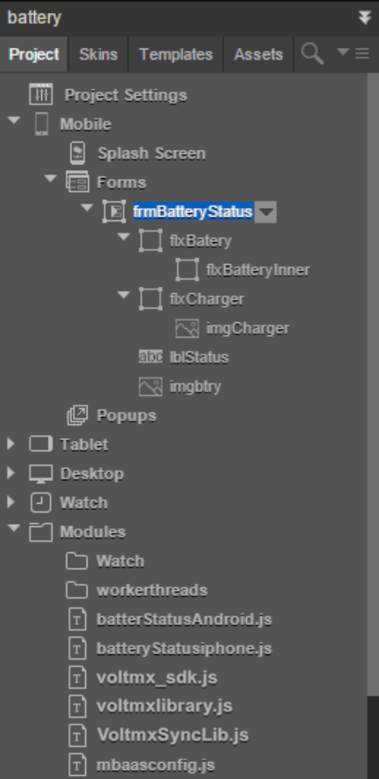

                           

Native Function API Developer's Guide:[Native Function APIs for Android](native_function_apis_for_android.md) > [Android Examples](android_examples.md) > Battery Status - Application Walkthrough

Battery Status Application Walk-through.
========================================

The Volt MX Battery Status app is a simple graphical application that works both on iPhone and Android. It showcases:

*   How to read battery status using the Volt MX Iris Native Function API to access stock Android and iOS APIs.
*   How to write code that supports two platforms in one application.
*   How to use Android Intents in Volt MX JavaScript.
*   How to use the iOS currentDevice object to read device status in Volt MX JavaScript.



Downloading the App
-------------------

You can download the app from the GitHub project site.

Understanding the App
---------------------

The project contains a single form which contains flex containers for the battery status graphic and the Charger status graphic. The top level form, frmBatteryStatus has an action associated with it's preShow event that makes the api calls to display the charging and battery status for the phone.

### App UI

There are two main parts of the app - what you can see Iris, and what is contained in JavaScript code associated with the app. The iris project can be seen in the Project browser:



The project consists of one form named frmBatteryStatus.

This form contains three elements:

*   The battery charge level indicator
    *   flxBattery
    *   flxBatteryInner
    *   imgBtry
*   The charge level status
    *   lblStatus
*   An indicator that the battery is currently charging
    *   imgCharger

These elements are adjusted at run time from JavaScript code associated with the project. The code can is contained in two user provided files:

*   batterStatusAndroid
*   batteryStatusiphone

You can see these files displayed at the bottom of the project.

The function getDeviceInfo() is associated with the preShow event of frmBatteryStatus which is called just before the form is displayed.

### preShow Event

Every form has a preShow event, which fires every time a form is displayed. It fires just before anything is drawn to the screen.

In this app the form is displayed just once, during start-up and is not changed or updated after that. This means that the battery is read one time, just before the initial display of the status. Any change to phone status following app start-up, such as removing the charging cable or discharging the battery will not be updated on the display.

To see how this works in Iris, go to the Project browser and click on Mobile, then Forms. There is only one form listed, frmBatteryStatus.

Click on this form. In the Properties window (found on the right hand side of Iris), click on the Action tab. You will see a listing of events that belong to the form. Toward the top of the General section of that listing you will see the entry for preShow.

Note that the link icon to the right of the listing is blue. This means that there is an action associated with the event. The name of the action is also given. If you click on Edit, you will see the content of the action. The action is set to call a getDeviceInfo() function from associated code. More on that in a moment.

### Determining the Platform

The getDeviceInfo() function contains platform specific code depending on what platform it is being compiled for. This is done using the ifdef conditional:

```
            function getDeviceInfo(){
  //#ifdef android
  getBatteryStatusForAndroid();
  //#else
  getBatteryStatusForIphone();
  //#endif
}
```

There are two platform specific functions defined, one for Android and one for iOS. These use the Native Function APIs for Android and iOS respectively.

### Getting Battery Status for Android

Now it's time to get the battery status. If you are building for Android, the following code will be called to use the Android OS via the Native Function API for Android.

Most of the following code is simply plumbing to allow your JavaScript code to process the Android [ACTION\_BATTERY\_CHANGED](https://developer.android.com/reference/android/content/Intent.md#ACTION_BATTERY_CHANGED) [intent](https://developer.android.com/reference/android/content/Intent.md) using the Android [BatteryManager](https://developer.android.com/reference/android/os/BatteryManager.md) class. Refer to the Android documentation in the above links in order to understand how these calls work. The java.import class is detailed in the [Common tasks for Android](common_tasks_for_android.md) topic elsewhere in this documentation set.

```
            function getBatteryStatusForAndroid(){
    var BatteryStatus ={};
    var VoltMXMain = java.import("com.konylabs.android.KonyMain");
	var Intent = java.import("android.content.Intent");
	var IntentFilter = java.import("android.content.IntentFilter");    
	var BatteryManager = java.import("android.os.BatteryManager");  
	var context = VoltMXMain.getActivityContext();
	var ifilter = new IntentFilter(Intent.ACTION_BATTERY_CHANGED);
	var batteryStatusIntent = context.registerReceiver(null, ifilter);
	var BateryLevel = batteryStatusIntent.getIntExtra(BatteryManager.EXTRA_LEVEL, 0);
    BatteryStatus.BateryLevel=BateryLevel;
    var status = batteryStatusIntent.getIntExtra(BatteryManager.EXTRA_STATUS, -1);
    var isCharging = status == BatteryManager.BATTERY_STATUS_CHARGING ||
                     status == BatteryManager.BATTERY_STATUS_FULL;
    BatteryStatus.isCharging=isCharging;
    setValues(BatteryStatus);
}
```

### Getting Battery Status for iOS

If you are building the project for the iOS platform, the following JavaScript code will be executed. objc.import is called to establish the connection with the iOS UIDevice object which contains the status of the current device. The use of this Native Function API call is detailed in the [Common tasks for iOS](common_tasks_for_ios.md) topic elsewhere in this document.

```
            function getBatteryStatusForIphone(){ 
    var BatteryStatus={};
    var UIDevice = objc.import("UIDevice");
    var currentDevice = UIDevice.currentDevice();
    currentDevice.batteryMonitoringEnabled = true;
	var batteryLevel = currentDevice.batteryLevel;
   // BatteryStatus.BateryLevel=BateryLevel;
   var state =currentDevice.batteryState;
   batteryLevel = (batteryLevel*100).toFixed(1);
   batteryLevel=Math.round(batteryLevel);
    BatteryStatus.BateryLevel=batteryLevel;
  if(state==1){
    BatteryStatus.isCharging=false;
  }  else{
    BatteryStatus.isCharging=true;
  }
  setValues(BatteryStatus);
}
```

Once you have access to currentDevice, your code can query it for battery state. See the following Apple reference topics for more information on how to do this.

[UIDevice](common_tasks_for_ios.md#https://developer.apple.com/reference/uikit/uidevice?language=objc)

[batteryState](https://developer.apple.com/reference/uikit/uidevice/1620051-batterystate?language=objc)

[batteryLevel](https://developer.apple.com/reference/uikit/uidevice/1620042-batterylevel)

### Setting the UI

The platform specific code that gets the battery state places the status information in global variables, which can be read by platform independent code once the status has been determined.

The setValues function is called no matter what platform you are building for, and it is responsible for setting up the graphic controls on the main form of the app to communicate battery status to the user.

```
            function setValues(BatteryStatus){
  var batteryLevel=BatteryStatus.BateryLevel.toFixed();
  if(batteryLevel<=10){
    frmBatteryStatus.lblStatus.text="Low Battery";
    frmBatteryStatus.flxBatteryInner.skin="sknflxFB3B2F";
    frmBatteryStatus.flxBatteryInner.width=batteryLevel+"%";
  }else{
    frmBatteryStatus.lblStatus.text=batteryLevel+"% Charged";
    frmBatteryStatus.flxBatteryInner.skin="sknflx01ff01";
    frmBatteryStatus.flxBatteryInner.width=batteryLevel+"%";
  }
  frmBatteryStatus.flxBatteryInner.forceLayout();
  if(BatteryStatus.isCharging){
    frmBatteryStatus.imgCharger.isVisible=true;
  }else{
     frmBatteryStatus.imgCharger.isVisible=false;
  }
}
```

Note how a skin is used to set the color of the display to red or green depending on how fully charged the battery is.
