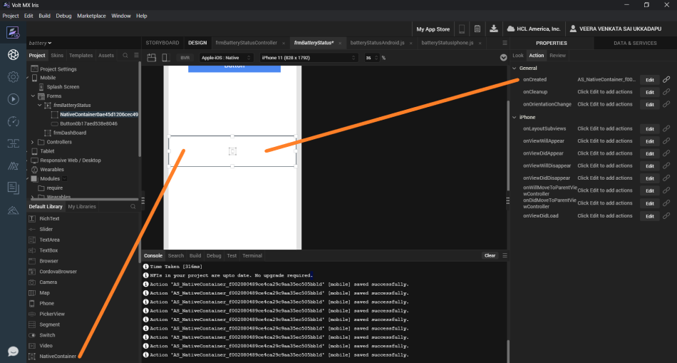

                           

Native Function API Developer's Guide:[Native Function APIs for iOS](native_function_apis_for_ios.md) > [iOS Examples](ios_examples.md) > Using the Native Container Widget to Display iOS Controls

Using the Native Container Widget to Display iOS Controls
=========================================================

Introduction
------------

The [Native Container widget](../../../Iris/iris_widget_prog_guide/Content/nativeContainer.md) and the Native Function API allows you to use native iOS or Android UI controls in your own Volt MX Iris Apps.

The following example shows first how to use the iOS UISegmentedControl in Objective-C in iOS, and then shows the same thing in a Volt MX app using the Native Container widget and the Native Function API for iOS.

Using the UISegmentedControl in Objective-C
-------------------------------------------

```
            @implementation ViewController - (void) viewDidLoad { [super viewDidLoad];
	// Do any additional setup after loading the view, typically from a nib.
	UISegmentedControl * control = [self createSegmentedControl];
	[self.view addSubview: control];
} - (void) didReceiveMemoryWarning { [super didReceiveMemoryWarning];
	// Dispose of any resources that can be recreated.
}

- (UISegmentedControl * ) createSegmentedControl {
	UISegmentedControl * control = [[UISegmentedControl alloc] init];
	UIColor * color = [[UIColor alloc] initWithRed: 255 green: 255 blue: 255 alpha: 0];
	[control setFrame: CGRectMake(20, 20, 300, 25)];
	[control insertSegmentWithTitle: @"Test 1"
	atIndex: 0 animated: NO];
	[control insertSegmentWithTitle: @"Test 2"
	atIndex: 1 animated: NO];
	[control insertSegmentWithTitle: @"Test 3"
	atIndex: 2 animated: NO];
	//[control setBackgroundColor:color];
	control.backgroundColor = color;
	[control addTarget: self action: @selector(onClickForSegmentedControl: forEvent: ) forControlEvents: UIControlEventAllEvents];
	return control;
}

- (void) onClickForSegmentedControl: (UISegmentedControl * ) sender forEvent: (UIEvent * ) event {
	int index = sender.selectedSegmentIndex;
	NSLog(@"Selected Index : %@", [NSNumber numberWithInt: index]);
}@end
```

Using the UISegmentedControl with the Native Container Widget
-------------------------------------------------------------

First, use Iris to add a [Native Container widget](../../../Iris/iris_widget_prog_guide/Content/nativeContainer.md) to your app.



Next, use the properties window to set the Native Container widget's onCreated event to run the following code:

```
            function addAndShowSegmentedUIView(parentView) {
	var UISegmentedControl = objc.import("UISegmentedControl");
	var UIColor = objc.import("UIColor");

	//Creating a color object requires to call a static member
	var color = UIColor.alloc().initWithRedGreenBlueAlpha(255, 255, 255, 1);
	var control = UISegmentedControl.alloc().jsinit();
	control.frame = {
		"x": 10,
		"y": 10,
		"width": 150,
		"height": 25
	};
	control.backgroundColor = color;
	control.insertSegmentWithTitleAtIndexAnimated("Test 1", 0, false);
	control.insertSegmentWithTitleAtIndexAnimated("Test 2", 1, false);
	control.insertSegmentWithTitleAtIndexAnimated("Test 3", 2, false);
	var handlerInstance = EventHandler.alloc().jsinit();

	//Note the ":" after the name onClick. As per the apple doc for selector this ensures that 
	// sender of the event is sent as the first argument to the selector function.
	control.addTargetActionForControlEvents(handlerInstance, "onClick:", UIControlEventAllEvents);
	parentView.addSubview(control);
}

var EventHandler = objc.newClass("EventHandler", "NSObject", null, {
	"onClick": function(sender) {
		alert("Clicked : " + sender.selectedSegmentIndex);
	}
});
```

At the end of the function the parentView parameter (which was passed in when the function was called) is used to add the new iOS controls to the Native Container that you created in Iris.

Using JavaScript to Add a Native Container Widget
-------------------------------------------------

Normally you would use the Iris widget palette to add a control to your app, but there are times when you might want to do the same thing using JavaScript code. This example creates a Native Container Widget, and adds it to a pre-existing form named `frmImage`.

```
            function addNativeContainerTofrm() {
	var basicprop = {
		"id": "NativeContainer1",
		"zIndex": 2,
		"onLayoutSubviews": nc_onLayoutSubviews,
		"onViewWillAppear": nc_onViewWillAppear,
		"onViewDidAppear": nc_onViewDidAppear,
		"onViewWillDisappear": nc_onViewWillDisappear,
		"onViewDidDisappear": nc_onViewDidDisappear,
		"onCreated": nc_onNativeContainerViewCreated,
		"onCleanup": nc_onNativeContainerCleanup,
		"onWillMoveToParentViewController": nc_onWillMoveToParentViewController,
		"onDidMoveToParentViewController": nc_onDidMoveToParentViewController,
		"onViewWillUnload": nc_onViewWillUnload,
		"onViewDidUnload": nc_onViewDidUnload,
		"onViewDidLoad": nc_onViewDidLoad,
		"onOrientationChange": nc_onOrientationChange,
		"top": "8%",
		"left": "0%",
		"width": "100%",
		"height": "92%"
	};

	var nativeContainer = new voltmx.ui.NativeContainer(basicprop);
	frmImage.add(nativeContainer);
	frmImage.show();
}

function nc_onNativeContainerViewCreated(uiviewobj) {
	voltmx.print("nc_onNativeContainerViewCreated");
}
```

For Further Information
-----------------------

The Volt MX Generator sample, which can be found in GitHub, is a larger app that uses the Native Function API and the Native container widget.
