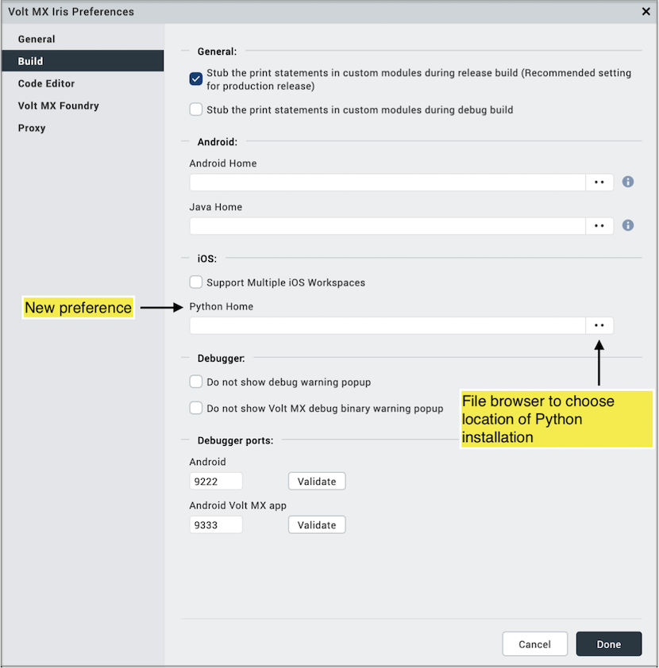

                                   
Setting the Python Installation Path
=====================================

This section provides details of Iris preference to set path to Python installation.

Starting with Mac OS Monterey version 12.3, Apple has removed Python 2.7 as being bundled by default. This version of Python is required for iOS builds from Iris.

To use Python version 2.7 with Mac OS Monterey version 12.3, first download and install it manually. Then specify the path to your Python installation in the Iris preferences page as shown below.

