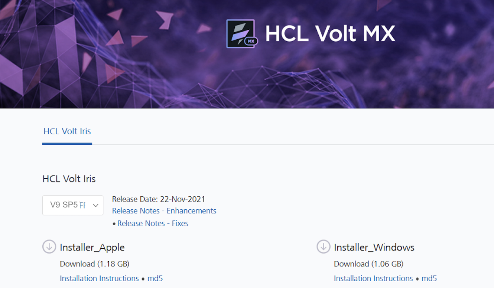

Volt MX Iris V9 Mac Install Guide
===================================

<!-- 
<ul>
  <li><a href="#pr">Prerequisites</a></li>
  <li><a href="#sr">System Requirements</a></li>  
  <li><a href="#di">Download Volt MX Iris</a></li>  
  <li><a href="Installing VoltMX Iris.html#installing">Install Volt MX Iris</a></li>  
  <li><a href="Installing VoltMX Iris.html#configuring-volt-mx-iris-to-use-a-proxy-server">Configuring Volt MX Iris to use a Proxy server</a></li>
  <ul>
    <li><a href="Installing VoltMX Iris.html#basic-proxy">Basic Proxy</a></li>    
    <li><a href="Installing VoltMX Iris.html#ntlm-proxy">NTLM Proxy</a></li>    
    <li><a href="Installing VoltMX Iris.html#custom-ntlm-proxy">Custom NTLM Proxy</a></li>    
    <li><a href="Installing VoltMX Iris.html#white-list-essential-domains">White-list Essential Domains</a></li>
  </ul>  
  <li><a href="Launching VoltMX Iris.html#post-installation-tasks">Post Installation Tasks</a></li>  
  <li><a href="Launching VoltMX Iris.html#launching">Launching Volt MX Iris</a></li>  
  <li><a href="Upgrade.html">Update Volt MX Iris</a></li>  
  <li><a href="StudioInstallation_FAQs.html#appendix-frequently-asked-questions-faqs">FAQs</a></li>
</ul> -->

<!-- <a href=#pr>Prerequisites</a>

- [System Requirements](#sr)
- [Download Volt MX Iris](#di) 
- [Install Volt MX Iris](Installing VoltMX Iris.md#installing)
  - [Configuring Volt MX Iris to use a Proxy server](Installing VoltMX Iris.md#configuring-to-use-a-proxy-server)
    - [Basic Proxy](Installing VoltMX Iris.md#basic-proxy)
    - [NTLM Proxy](Installing VoltMX Iris.md#ntlm-proxy)
    - [Custom NTLM Proxy](Installing VoltMX Iris.md#custom-ntlm-proxy)
    - [White-list Essential Domains](Installing VoltMX Iris.md#white-list-essential-domains)
- [Post Installation Tasks](Launching VoltMX Iris.md#post-installation-tasks)
  - [Launching Volt MX Iris](Launching VoltMX Iris.md#launching)
- [Update Volt MX Iris](Upgrade.md)
- [FAQs](StudioInstallation_FAQs.md#appendix-frequently-asked-questions-faqs) -->

<!-- # Volt MX Iris V9 Mac Install Guide -->

This document explains how to install Volt MX Iris and the required software on your Macintosh computer, using an installer program.

<ul>
<li>
    <a href="#pr">Prerequisites</a>
  </li>
  <li>
    <a href="Installing%20VoltMX%20Iris.html#installing">Install Volt MX Iris</a>
  </li>
  <li>
    <a href="Launching%20VoltMX%20Iris.html#post-installation-tasks">Post Installation Tasks</a>
  </li>
</ul>

<h2 id="#pr">Prerequisites</h2>

Following are the requirements needed to complete the installation process. They include the hardware and software prerequisites required to complete the process.

<h2 id="sr">System Requirements</h2>

This section helps you understand the system requirements and necessary software required to install Volt MX Iris.

<h2 id="sor">Software Requirements</h2>

<!-- ### Software Requirements -->

Mac OS X 10.9 and above

<h2 id="hr">Hardware Requirements</h2>  

| Component        | Requirement                                                                                      |
| ---------------- | ------------------------------------------------------------------------------------------------ |
| Processor        | x86-64 CPU (64-bit Mac, with an Intel Core i3, Intel Core i5, Intel Core i7, or Xeon processor.) |
| RAM              | 8 GB                                                                                             |
| Internal Storage | 24 GB                                                                                            |
| Network          | Ethernet Port                                                                                    |

<h2 id="di">Download Volt MX Iris</h2>

The following section explains the procedure to download Volt MX Iris:

- [As a trial user](#downloading-a-trial-version)
- [As a customer](#downloading-with-a-volt-mx-account)

<h2 id="dr">Downloading a trial version</h2>

Before downloading the Iris trial version, you must create a Volt MX account. You can go to the Volt MX website and create a new account, or respond to an email invitation from an existing Volt MX user. To create your account, follow these steps:

1. If you received an invitation email, click **Accept Invitation**. Otherwise, go to [https://manage.demo-hclvoltmx.com/registration](https://manage.demo-hclvoltmx.com/registration).

2. On the **Registration** page, provide the required details and click **Start Free Trial**.

3. When you receive your registration confirmation email, respond by clicking **Activate Account**.

4. On the activation page, name your new account and pick a cloud location. Provide the other required details and click **Activate My Account**.

Your account is activated. The Iris installer should start downloading automatically. If not, or if you want to download the installer later, follow these steps:

1. Go to [community.demo-hclvoltmx.com/downloads](http://community.demo-hclvoltmx.com/downloads).

2. Type your email address and password, and then click **Sign In**. The downloads page appears.

3. Under **HCL Volt Iris**, click **Installer_Apple**.

The installer is downloaded to your computer.

**Note:** You must have administrative rights on your computer to install Volt MX Iris.

**Note:** When you activate your account, you receive an email with a link to the Foundry console. After you have installed Iris, visit [https://support.hcltechsw.com/csm?id=kb_article&sysparm_article=KB0094403](https://support.hcltechsw.com/csm?id=kb_article&sysparm_article=KB0094403) for important information about configuring Iris and Foundry to work together.

<h2 id="dv">Downloading with a Volt MX Account</h2>

To download Volt MX Iris on your Mac computer, follow these steps:

1. Visit [community.hclvoltmx.com/downloads](http://community.hclvoltmx.com/downloads).
2. Type your Volt MX account login credentials, and click **Sign in**. The **Manage Cloud** page appears.
3. Under Volt MX, Click the **Download** button for Mac. The installer is downloaded as a zip file to your computer.

   

<!-- - [Prerequisites](#pr)
  - [System Requirements](#sr)
  - [Download Volt MX Iris](#di)
- [Install Volt MX Iris](Installing VoltMX Iris.md#installing)
  - [Configuring Volt MX Iris to use a Proxy server](Installing VoltMX Iris.md#configuring-to-use-a-proxy-server)
    - [Basic Proxy](Installing VoltMX Iris.md#basic-proxy)
    - [NTLM Proxy](Installing VoltMX Iris.md#ntlm-proxy)
    - [Custom NTLM Proxy](Installing VoltMX Iris.md#custom-ntlm-proxy)
    - [White-list Essential Domains](Installing VoltMX Iris.md#white-list-essential-domains)
- [Post Installation Tasks](Launching VoltMX Iris.md#post-installation-tasks)
  - [Launching Volt MX Iris](Launching VoltMX Iris.md#launching)
- [Update Volt MX Iris](Upgrade.md)
- [FAQs](StudioInstallation_FAQs.md#appendix-frequently-asked-questions-faqs) -->

<!-- 
<ul>
  <li><a href="#pr">Prerequisites</a></li>
  <li><a href="#sr">System Requirements</a></li>  
  <li><a href="#di">Download Volt MX Iris</a></li>  
  <li><a href="Installing VoltMX Iris.html#installing">Install Volt MX Iris</a></li>  
  <li><a href="Installing VoltMX Iris.html#configuring-volt-mx-iris-to-use-a-proxy-server">Configuring Volt MX Iris to use a Proxy server</a></li>
  <ul>
    <li><a href="Installing VoltMX Iris.html#basic-proxy">Basic Proxy</a></li>    
    <li><a href="Installing VoltMX Iris.html#ntlm-proxy">NTLM Proxy</a></li>    
    <li><a href="Installing VoltMX Iris.html#custom-ntlm-proxy">Custom NTLM Proxy</a></li>    
    <li><a href="Installing VoltMX Iris.html#white-list-essential-domains">White-list Essential Domains</a></li>
  </ul>  
  <li><a href="Launching VoltMX Iris.html#post-installation-tasks">Post Installation Tasks</a></li>  
  <li><a href="Launching VoltMX Iris.html#launching">Launching Volt MX Iris</a></li>  
  <li><a href="Upgrade.html">Update Volt MX Iris</a></li>  
  <li><a href="StudioInstallation_FAQs.html#appendix-frequently-asked-questions-faqs">FAQs</a></li>
</ul> -->
