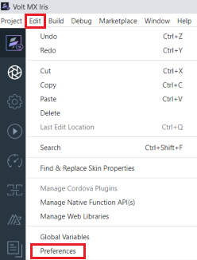

# Install Volt MX Iris

To install Volt MX Iris, follow these steps:

1.  Navigate to the location where you downloaded the installer file VoltMX-Iris-9.0.exe, and double-click it.  
    
    <!--  -->
2.  The installer extracts the required files.

    After the extraction is complete, the Volt MX Iris installation window appears.

    > **_Note:_** Although, Volt MX Iris is a safe product to install, your anti virus or firewall may flag the product. Ensure that you give permission for installing Iris. Also, to avoid getting such warning messages in future (while updating Iris) add iris.exe to your antivirus or firewall safe list.

3.  Click **Next**.

    

    The **Select Installation Folder** pane appears.

4.  Click **Choose** to select a folder on the drive where you want to install Volt MX Iris.  
    Click **Restore Default Folder** to reset the default installation folder.

    

5.  Click **Next**.  
    The **Select Workspace Folder** pane appears.
6.  Click **Choose** to select a folder on the drive to be used as Iris workspace.  
    Click **Restore Default Folder** to reset the default Iris workspace.

    

    > **_Note:_** The Workspace folder contains all your Iris projects.

7.  Click **Next**. The **License Agreement** pane appears.
8.  Read the License Agreement carefully and if you accept the terms of the agreement, select **I Accept the terms of the License Agreement** option, and then click **Install**.  
    The **Installing Volt MX Iris** page appears, and the installation begins.

    

11. After the installation is complete, the **Install Complete** pane appears.

    The pane provides a QR code to download the Volt MX App application. Scan the QR code to download the app.

    > **_Note:_** The QR code is developed using a third party library, QRCode.js (version 0.0.1 & [license](https://github.com/davidshimjs/qrcodejs/blob/master/LICENSE)). This is not bundled with the app. This library is bundled with Volt MX Iris Installer.

    

    You can choose to select **Launch Iris** and click **Done**. Volt MX Iris sends anonymous usage data to the Volt MX Cloud. The intent is to use this data to help better understand how the application is being used. To turn off anonymous usage data collection in Iris, deselect the necessary check box under **Edit** \> **Preferences** \> **General**.

## Configuring Iris to Use a Proxy Server

> **_Note:_** If your computer is not configured behind a proxy server, you can skip this section and move to the next section: [Launching Iris](Launching VoltMX Iris.md).

When your system is a part of an internal network and connects to the Internet using a proxy server, you must modify the Iris configuration settings to bypass the proxy server and access the Internet.

You can use any of the following methods to configure Iris to use a proxy server:

- [Basic Proxy](#basic-proxy): Provides steps to configure your basic proxy settings to allow Iris access to the Internet.
- [NTLM Proxy](#ntlm-proxy): Provides steps to configure your NTLM proxy settings to allow Iris access to the Internet.
- [Custom NTLM Proxy](#custom-ntlm-proxy): Provides steps to customize and configure your NTLM proxy settings to allow Iris access to the Internet.

## Basic Proxy

To configure Iris to use a Basic proxy, follow these steps:

1.  In Volt MX Iris, click **Edit** > **Preferences**.  
    The **Iris Preferences** window appears.  
    
2.  Click the **Proxy** tab.
3.  Under the **Proxy Settings** section, select the **Enable Proxy** check box.
    
4.  From the **Proxy Type** list, select the type of the Proxy Service that you want to configure, either Basic or NTLM.

    > **_Note:_** You can only configure a BASIC Proxy.

5.  In the **Proxy Host** text box, enter the value of the proxyHost.
6.  In the **Proxy Port** text box, enter the value of the proxyPort.
7.  In the **Proxy Username** text box, enter the username to sign in to the Proxy Server.
8.  In the **Proxy Password** text box, enter the password to sign in to the Proxy Server.
9.  In the **No Proxy Hostnames** text box, enter the URL of the domain that must bypass the Proxy server. You can also provide a list of URLs separated by commas.
10. After you provide all the inputs, click **Validate** to verify the connection.  
    Once all the details are validated, the Done button is enabled.
11. Click **Done**.

## NTLM Proxy

To configure Iris to use an NTLM proxy, follow these steps:

<ol>
  <li>Navigate to the <b>Iris</b> installation folder > <b>Config</b> folder (ex.C:\Program Files\Iris\config).</li>  
  <li>Open the <em>proxy_config.js</em> file.</li>  
  <li>Edit the following details between the <b>USER EDITABLE SECTION START</b> and <b>USER EDITABLE SECTION END</b>.
  <pre><code style="display:block;background-color:#eee;">//USER EDITABLE SECTION START
 /*
In case of NTLM custom config only PROXY_TYPE and CNTLM_PORT 
ProxyConfig paramaters are required. Rest can be left undefined.
Custom CNTLM config can also be generated by using cntlmconf.sh 
on mac  e.g.
./cntlmconf.sh -u NTLMUSER -d DOMAIN -s PROXY-IP:PROXY-PORT

\*/
//To enable proxy, change the following value to true.
var ENABLE_PROXY = false;

//Type Proxy IP address.
var PROXY_IP = 'XXX.XXX.XXX.XXX';

//Type NTLM Domain name.
var NTLM_DOMAIN = 'XXXXXXX.com';

//Type NTLM server port number.
var PROXY_PORT = 8080;

//Type your Username. Note: If your user name is user@domain.com,
then enter the username as useronly. Domain name is not required.
var PROXY_USER = 'XXXXXX';

//Type your password.
var PROXY_PWD = 'XXXXXX';

var PROXY_TYPE = PTYPE.NTLM_PROXY;

//USER EDITABLE SECTION END</code></pre></li>

<li>Save the proxy_config.js file.</li>
</ol>

## Custom NTLM Proxy

To configure Iris to use a custom NTLM proxy, follow these steps:

<ol>
  <li>Navigate to the <b>Iris</b> installation folder > <b>Config</b> folder (ex. C:\Program Files\Iris\config).</li>  
  <li>Open the proxy_config.js file.</li>  
  <li>Edit the following details between the <b>USER EDITABLE SECTION START</b> and <b>USER EDITABLE SECTION END</b>.<pre><code style="display:block;background-color=#eee;">//USER EDITABLE SECTION START
 /*
In case of NTLM custom config only PROXY_TYPE and CNTLM_PORT ProxyConfig 
paramaters are required. Rest can be left undefined.
Custom CNTLM config can also be generated by using cntlmconf.sh on 
mac
 e.g.
./cntlmconf.sh -u NTLMUSER -d DOMAIN -s PROXY-IP:PROXY-PORT

\*/
//To enable proxy, change the following value to true.
var ENABLE_PROXY = false;

//Type Proxy IP address.
var PROXY_IP = 'XXX.XXX.XXX.XXX';

//Type NTLM Domain name.
var NTLM_DOMAIN = 'XXXXXXX.com';

//Type NTLM server port number.
var PROXY_PORT = 8080;

//Type your Username. Note: If your user name is user@domain.com,
then enter the username as useronly. Domain name is not required.
var PROXY_USER = 'XXXXXX';

//Type your password.
var PROXY_PWD = 'XXXXXX';

//If the type of proxy used is basic, replace NTLM_PROXY with BASIC_PROXY.
var PROXY_TYPE = PTYPE.NTLM_PROXY;
//Change the value to false
var GENERATE_NTLM_CONF = false;
//USER EDITABLE SECTION END</code></pre></li>

  <li>Save and close the <em>proxy_config.js</em> file.</li>  
  <li>Navigate to the <b>Iris</b> installation folder > <b>nw</b> folder> <b>nw-win</b> folder (ex. C:\Program Files\VoltMXIris\nw\nw_win).
  <blockquote><b><em>Note: </em></b>For some NTLM v1 and v2 configurations, the default generated <b>cntlm.ini</b> file may not work. In such cases, you need to customize your proxy settings.</blockquote></li>  
  <li>Open the <b>cntlm.ini</b> file.</li>  
  <li>Modify the following parameters:
  <pre><code style="display:block;background-color:#eee;">//Type user name
Username    my_proxy_user;
//Type Domain name
Domain my_proxy_domain.com;
//Type the Proxy address:portnumber
Proxy my_proxy_server:8080;</code></pre></li>  
  <li>Save and close the <em>cntlm.ini</em> file.</li>  
  <li>To generate the profile, follow these steps:
    <ol type="a">
      <li>Open a Command Prompt window in the current folder.</li>
      <li>Execute <em>cntlm.exe -c cntlm.ini -I -M http://xxxx.com</em>.</li>      
      <li>Type your NTLM password, if requested, to generate a profile.</li>      
      <li>Copy the generated profile.</li>
    </ol>
  </li>  
  <li>Reopen the cntlm.ini file.</li>
  <li>Append the profile details (copied from step 9). A portion of the cntlm.ini file after appending the parameters is shown:
  <pre><code style="display:block;background-color:#eee;">Username    my_proxy_user
Domain      my_proxy_domain.com
Proxy       my_proxy_server:8080
NoProxy     localhost, 127.0.0.*, 10.*, 192.168.*
Gateway     no
Listen      3128
Auth            NTLMv2
PassNTLMv2      XXXXXXXXXXXXXXXXXXXXXXXXXXXXXXXX</code></pre></li>   
  <li>Save the <em>cntlm.ini</em> file.</li>  
  <li>Move the <em>cntlm.ini</em> file to User Profile folder\user name\Iris\irisdata (for example, C:\Users\Iris\irisdata).</li>
</ol>

## White-list Essential Domains

Ensure that you contact your system administrator and white-list the following domain URLs:

- https://api.hclvoltmx.com
- https://manage.hclvoltmx.com
- https://manage.demo-hclvoltmx.com
- https://visualization.hclvoltmx.com
- https://accounts.auth.hclvoltmx.com
- https://download.hclvoltmx.com
- https://community.hclvoltmx.com
- https://cloud-metrics.hclvoltmx.net
- https://opensource.hcltechsw.com
- https://hcl-tech-software.github.io
- https://hclvoltmx-prototypetransit.s3.amazonaws.com

