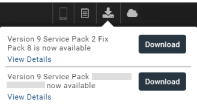
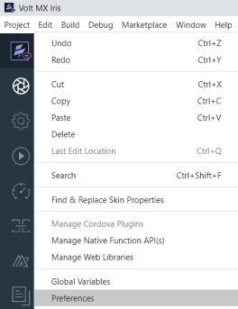
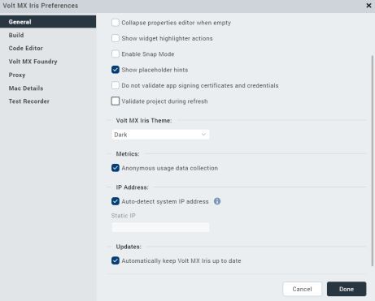
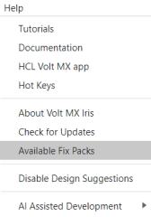
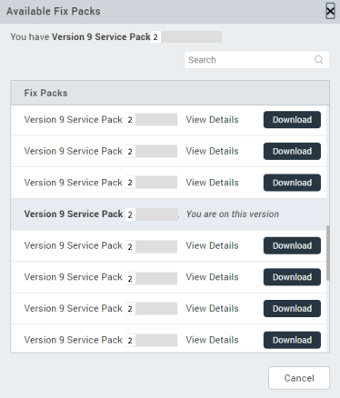
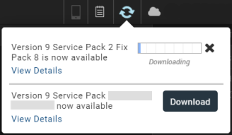
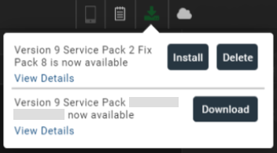
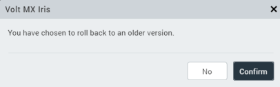
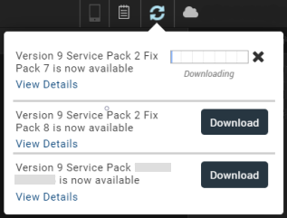
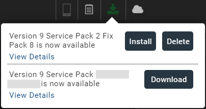

Update Volt MX Iris
==================

This section provides information on how to update and rollback from one version of Volt MX Iris to another version.

Volt MX releases an update package with consolidated plug-ins regularly. When Volt MX releases an update, you will receive an update notification on your Iris instance that prompts you to update to the latest version of Volt MX Iris.

From the Notification bar on the top-right corner of Iris, click **Update**.  
An update dialog box with a list of available versions for download appears. The update dialog box also contains information about the update version and a link to the respective Release Notes.

If multiple updates are available, the **Update** dialog box sorts the releases into the following two categories:

- Major release versions (such as V8, V9, V10) or Service Packs (such as V9SP1, V9SP2) pertaining to the current major release version.
- Latest Fix Pack releases available on the current version (Service Pack or major release).

For example, let us assume that the current Volt MX Iris version is V9 SP2 GA. If the V9 SP4 GA, V9 SP3 GA, V9SP2 FP23, and V9 SP1 FP12 versions have been released, the update section of Volt MX Iris displays only the V9 SP4 GA and V9 SP1 FP12 versions for download.

> **_Note:_** The update dialog box only displays the latest available version (Fix Pack, Service Pack, or major release). If you want to download a specific intermediate version, refer [Manual Update Process](#manually-update-the-version-of-volt-mx-iris).

You can update Iris in the following two ways:

- [Enable Auto-updates](#automatically-update-volt-mx-iris)
- [Manual Update process](#manually-update-the-version-of-volt-mx-iris)

### Automatically Update Volt MX Iris

To enable the auto-update settings in Volt MX Iris, follow these steps:

1.  From the **Edit** menu of Volt MX Iris, click **Preferences**.  
      
    The **Iris Preferences** window appears.
2.  In the **General** section, select the **Automatically keep Iris up to date** checkbox.

    

    > **_Note:_** Clear the checkbox to Turn off Automatic updates. This is not recommended as it causes Iris to go out of sync with regular product updates.  
    > Even if you turn off the Auto updates, you will still receive a reminder every time you launch Volt MX Iris.

3.  Click **Done**.  
    Volt MX Iris restarts for the changes to take effect.

When new updates are available, Volt MX Iris displays a notification and starts the download process. The progress of the Fixpack or ServicePack download appears in the update section of the notification bar.

> **_Note:_** You can dismiss the notification. The download continues in the background.

After the download is complete, click **Install** to install the updates, or click **Delete** to delete the downloaded version.

### Manually Update the version of Volt MX Iris

To update the version of Volt MX Iris Fix Packs and Service Packs, follow these steps:

1.  Ensure that you are connected to the internet.
2.  From the **Help** menu of Volt MX Iris, click **Available Fix Packs**.

    

    The **Available Fix Packs** dialog box appears.

3.  From the list of available Fix Packs and Service Packs, select the version that you want to install, and click **Download**.

    The current version of Volt MX Iris is also displayed in the dialog box.

    

    Volt MX Iris displays the progress of the Fix Pack or the Service Pack download on the update section of the notification bar.

    

4.  After the download process is complete, click **Install**.

    

    Volt MX Iris restarts, and the upgrade is complete.

    > **_Note:_** Click **View details**, to get detailed Release Notes for the recommended Iris update on the HCL Documentation page.

5.  After the upgrade process is complete, click **Launch Iris**.

    The updates are installed and ready to use.

## Rollback to a Previous Version of Volt MX Iris

By using the Rollback feature, you can roll the version of Volt MX Iris back to a previous Fix Pack that is available in the current version (Major release or Service Pack).

> **_Note:_** You can only roll back to any Fix Packs that are available on the current Service Pack (or major release) version. If you have already upgraded to a higher Service Pack (or major release) version, the Rollback option will not be available.

To roll back to a previous version of Volt MX Iris, follow these steps:

1.  Ensure that you are connected to the internet.
2.  From the **Help** menu of Volt MX Iris, click **Available Fix Packs**.

    

    The **Available Fix Packs** dialog box appears.

3.  From the list of available Fix Packs and Service Packs, select the version that you want to roll back to, and click **Download**.

    The current version of Volt MX Iris is also displayed in the dialog box.

    > **_Note:_** The Available Fix Packs dialog box only displays the Fix Packs that are available on the current version.

    

    A confirmation dialog box appears with a `You have chosen to rollback to an Older Version` message.

4.  Click **Confirm**.

    

    Volt MX Iris displays the progress of the Fix Pack or the Service Pack download on the update section of the notification bar.

    

5.  After the download process is complete, click **Install**.

    

    Volt MX Iris restarts, and the rollback is complete.

    > **_Note:_** Click **View details**, to get detailed Release Notes for the recommended Iris update on the HCL Documentation page.

6.  After the rollback process is complete, click **Launch Iris**.

    The updates are installed and ready to use.

> **_Note:_** When you upgrade to a newer version, Volt MX Iris stores the version information of the previous version. When you select the **Roll Back To Previous Version** option, the stored version information is used during the rollback process.

### Important Considerations

- After a download is complete, the update dialog box displays the **Install** and **Delete**  
  Click **Install** to install the updates. Click **Delete** to delete the downloaded version.
- If you cancel the installation and try to download the same version again, Volt MX Iris displays a dialog box with the `Already Downloaded` message.
- If you attempt a download when another download is in progress, Volt MX Iris displays a dialog box with the `A download is currently in progress` message.
- If you attempt to download a version without installing the previous version that was downloaded, Volt MX Iris displays the `A download Fix Pack is pending install. Install the Fix Pack or delete it to continue` message with the **Install** and **Delete**
