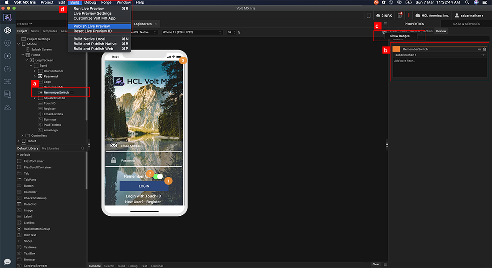
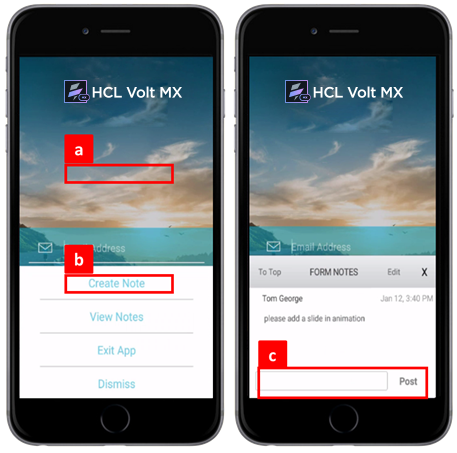
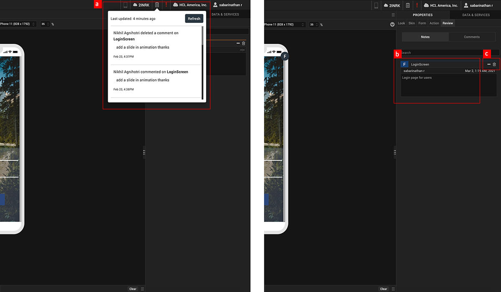

                             

Volt MX  Iris Tutorials

Notes and Comments
------------------

<iframe src="https://www.youtube.com/embed/QSlwxXHveSM" allowfullscreen=""></iframe>

1\. Documenting Notes in Iris
-----------------------------------

1.  Widget Selection
    
    Select the widget or form on which one would like to capture and document Notes.
    
2.  Documenting Notes
    
    Create, Edit and Save notes with respect to the selected widget or form, in rich text format.
    
3.  Toggle Badges
    
    Switch ON badges to view a graphical representation of the notes documented, on a form.
    
4.  Publish To Cloud
    
    Publish the application preview to the cloud for collaboration with peers.
    

2\. Reviewers Point of View – Providing Feedback
------------------------------------------------

1.  Provide Feedback
    
    Touch screen of Iris App Preview with 2 fingers to provide comments.
    
2.  Create Comment
    
    Select the ‘create note’ option to provide feedback and comments on the particular form on the mobile application preview.
    
3.  Post Comment To Designer
    
    Enter the comment and post it to the designer.
    

3\. Designers Point of View – Receiving Feedback
------------------------------------------------

1.  Feedback Notifications
    
    View feedback notifications from peers on the Iris console.
    
2.  View Comments History
    
    View the entire list of comments provided with respect to the particular form in the mobile application.
    
3.  Respond To Comments
    
    Edit and respond to comments as required or even delete comments as desired.
    

