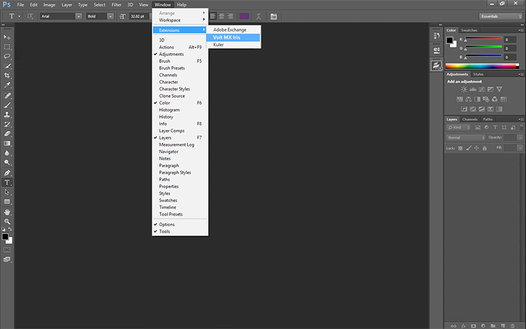
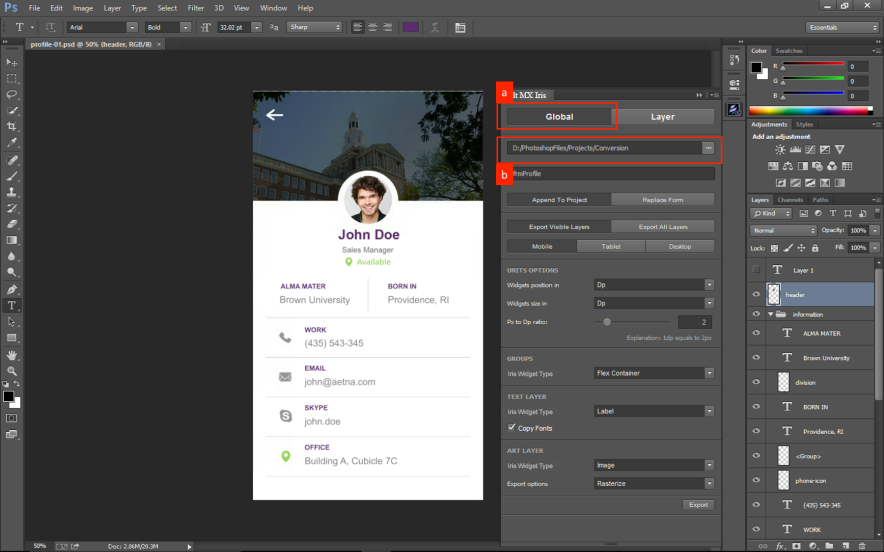
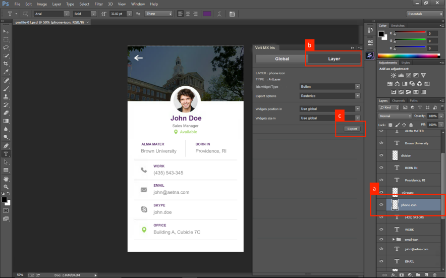
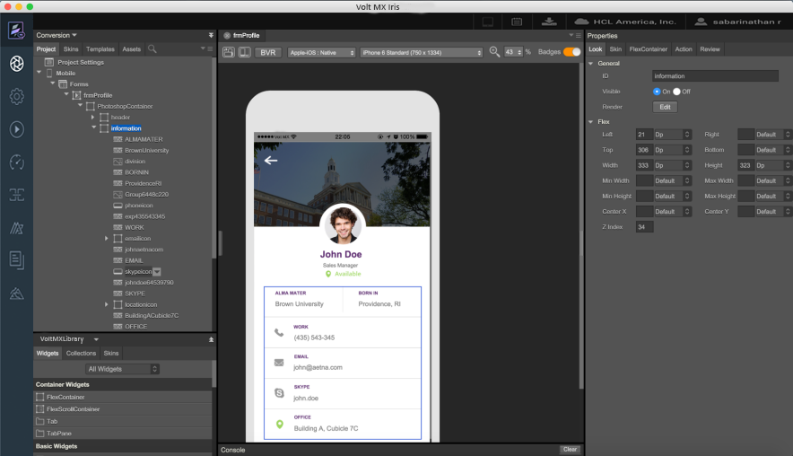

                             

Volt MX  Iris Tutorials

Photoshop conversion extension
------------------------------

<iframe src="https://www.youtube.com/embed/dBp46NqJRqs" allowfullscreen=""></iframe>

1\. Access The Extension
------------------------

1.  Install the Volt MX Iris Extension from VoltMX.com.
    
2.  Once installed you can access the extension from **Window** > **Extensions**.
    

  

2\. Global Configurations
-------------------------

1.  Open the PSD file to be imported. Global configuration tab allows us to specify properties applicable to the entire PSD file.
    
2.  Select the Iris project location. This points directly to a project inside your Iris workspace directory.
    

3\. Layer Configurations
------------------------

1.  In case we need to override the global configuration for a layer, select the particular layer.
    
2.  Select the Layer configuration tab. The layer specific properties are listed. Select the required configuration. This configuration will override the Global configurations for that layer.
    
3.  Click on Export.
    

4\. Open in iris
----------------------

1.  Open the exported project in Iris.
    
2.  Notice all the layers converted to corresponding Iris widgets.
    

