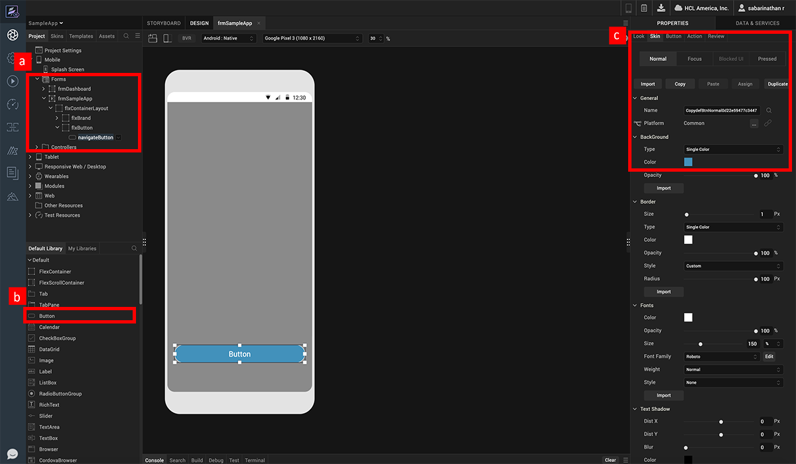
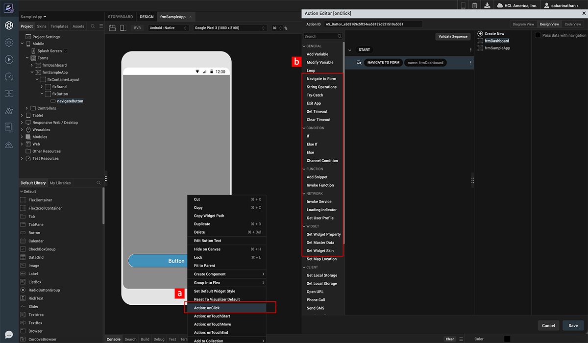
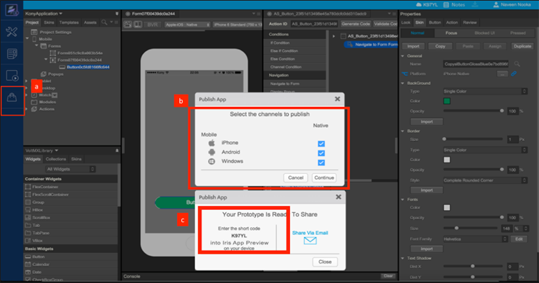
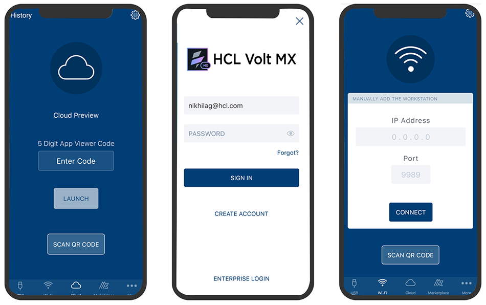

                             

Volt MX  Iris Tutorials

Getting Started with Iris
-------------------------------

<iframe src="https://www.youtube.com/embed/ODfy1Xqn3aI" allowfullscreen=""></iframe>

1\. Create a Green Button
-------------------------

1.  Create a form under Mobile channel.
    
2.  Drag the button widget from the Widgets pane and drop it onto the canvas area. Position the button on canvas using mouse or by setting the properties in Look tab.
    
3.  Click on Skin tab and set the background color to green using color picker and border property to complete rounded corner.
    

  

2\. Add Interactivity
---------------------

1.  Right click on the button and click on the onClick Action.
    
2.  In the Action Editor that opens up, click on Navigate To Form Action and select the desired form.
    

3\. Publish To Cloud
--------------------

1.  Click on Publish. If you are not already signed in you will be prompted to sign in.
    
2.  Select the required channels to publish the App Preview.  
      
    
3.  Click on the Cloud tab in App Preview and enter the short code generated to download and preview the app.
    

4\. Preview App
---------------

1.  Download Volt MX Iris App from App Store.
    
2.  Log in into the App Preview using your Volt MX Credentials.
    
3.  Click on the Local tab and enter the details to launch the Application.
    

