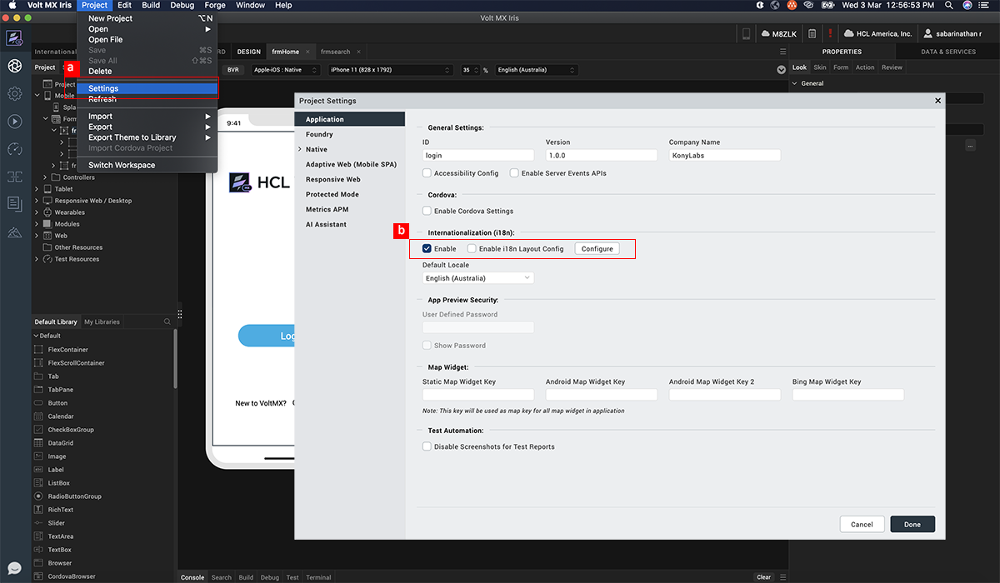
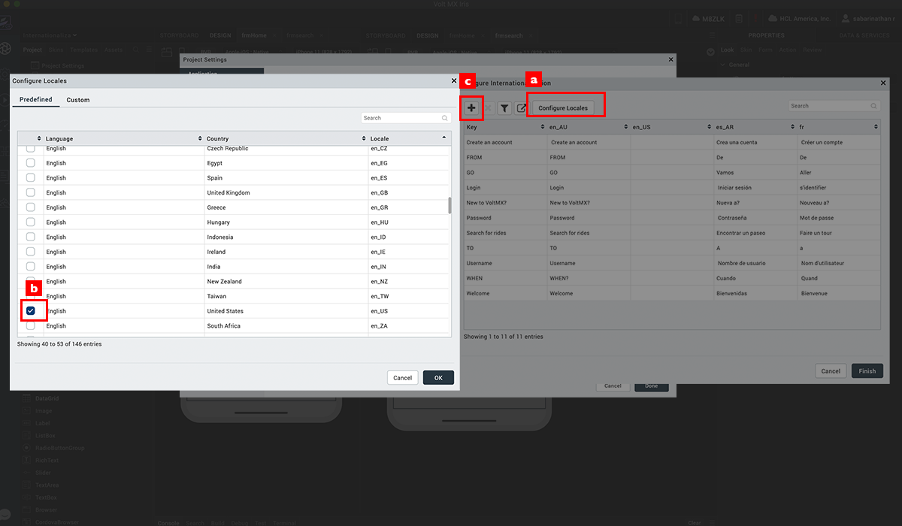
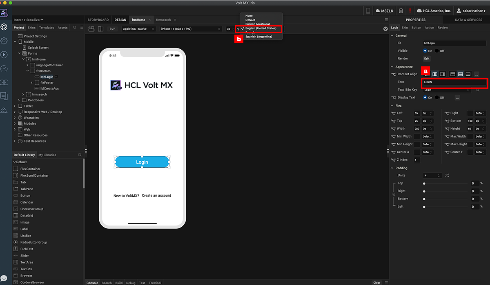
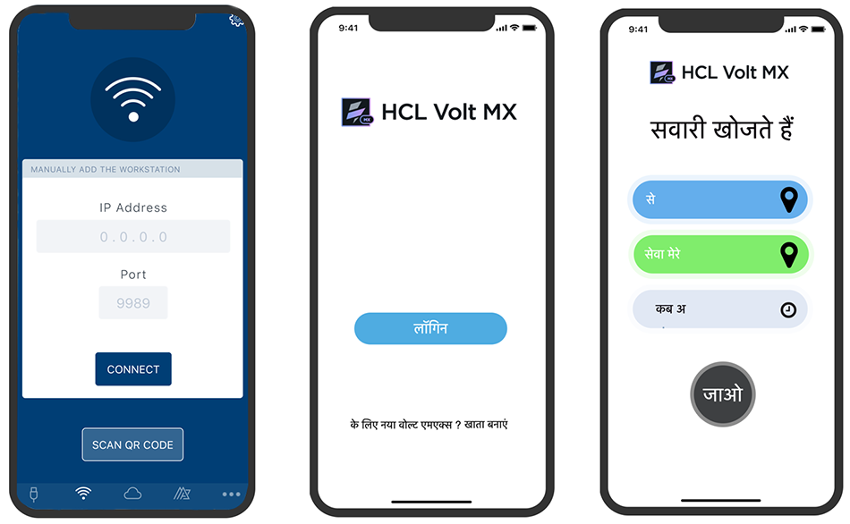

                             

Volt MX  Iris Tutorials

Internationalization
--------------------

<iframe src="https://www.youtube.com/embed/N85QfGPAAy8" allowfullscreen=""></iframe>

1\. Enable Internationalization
-------------------------------

1.  Click on **Project Settings**.
    
2.  In the Project Settings dialogue that opens up, click **Enable i18n**. Click **Edit** to configure the required locales.
    

2\. Add Locales
---------------

1.  Click **Configure Locales** button to add locales to the application.
    
2.  Select all the required locales. If the locale you are looking for is not available in the predefined locales, go to the Custom tab and define the required locale.  
    
3.  Once the locales are selected, go back to the Configure Internationalization tab and add the required keys.
    

3\. Assign Keys
---------------

1.  Once internationalization is enabled in the application a drop down to assign the i18n key will appear in the Look panel. Select an widget and assign the required i18 key to the widget.
    
2.  Locale can be switched right from canvas.  
      
    

4\. App Preview
---------------

