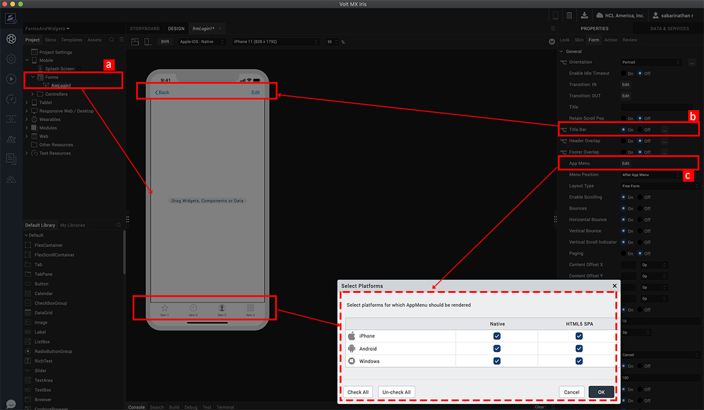
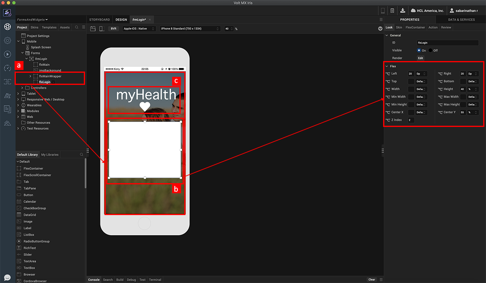
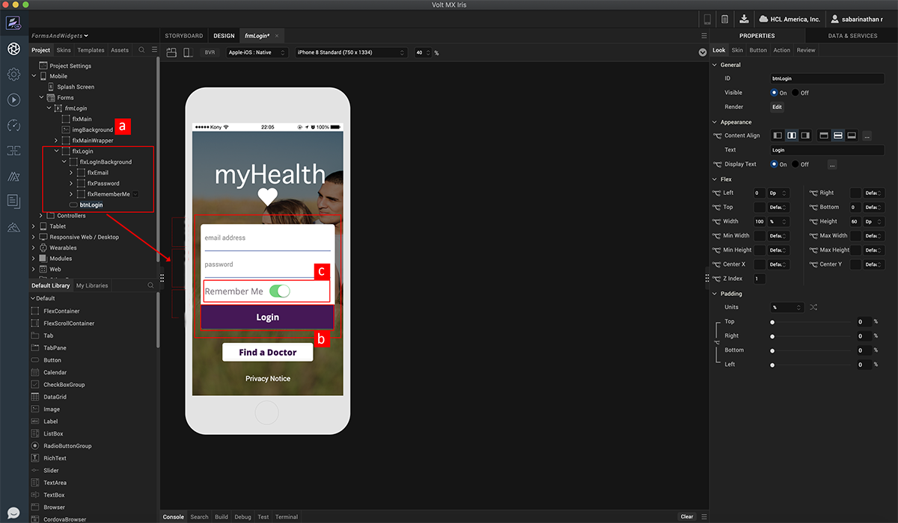
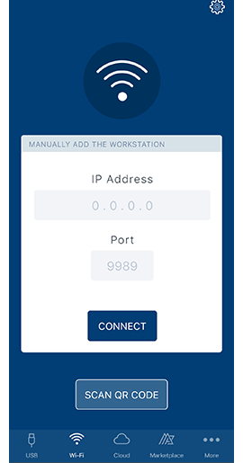
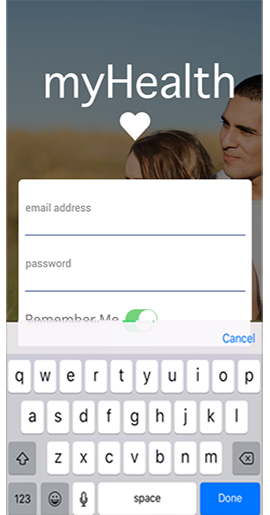

                             

Volt MX  Iris Tutorials

Introduction to Forms and Widgets
---------------------------------

<iframe src="https://www.youtube.com/embed/LARDxrWQd54" allowfullscreen=""></iframe>

1\. Create a Form
-----------------

1.  Create a flex form using the **Forms** > **New menu** item in the project explorer.
    
2.  Turn off the Title Bar for this form.  
      
    
3.  Turn off the App Menu for this form.
    

2\. Assign Image Background And Layout Login Container
------------------------------------------------------

1.  Drag drop flex container which we will use for the form background.
    
2.  Drag drop another flex container which we will use for laying out the log in UI elements. Position this container to be at fixed position from left and right edges of form.  
    
3.  Place an image on the parent flex container and assign it the logo image.
    

3\. Layout Login Fields
-----------------------

1.  Place flex containers on the log in container as holders.
    
2.  Place text fields and button on the these holders, position and skin the widgets.  
      
    
3.  Place a switch widget on the log in container.
    

4\. View Prototype on Iris Application Preview
----------------------------------------------------

  

