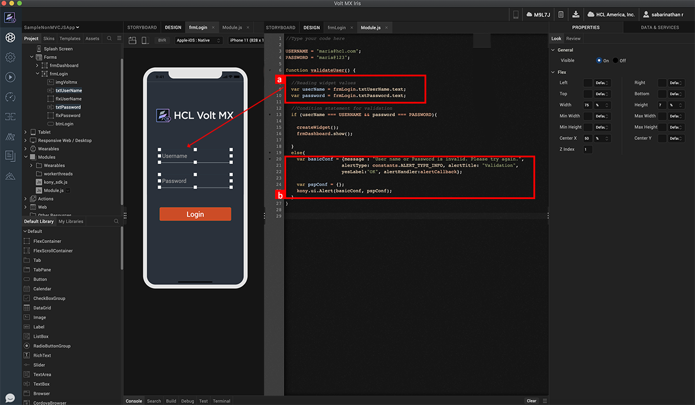
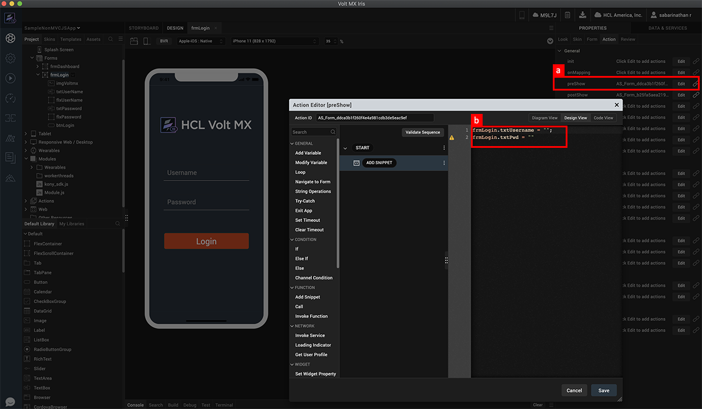
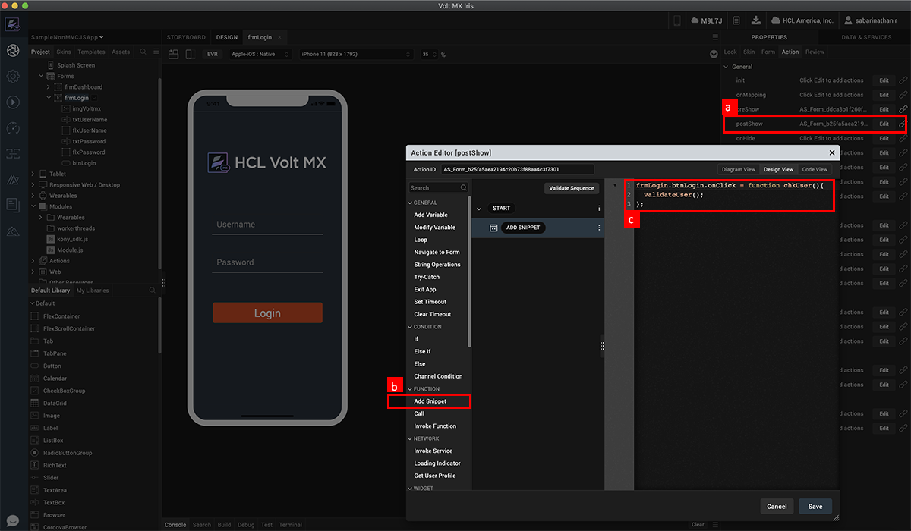
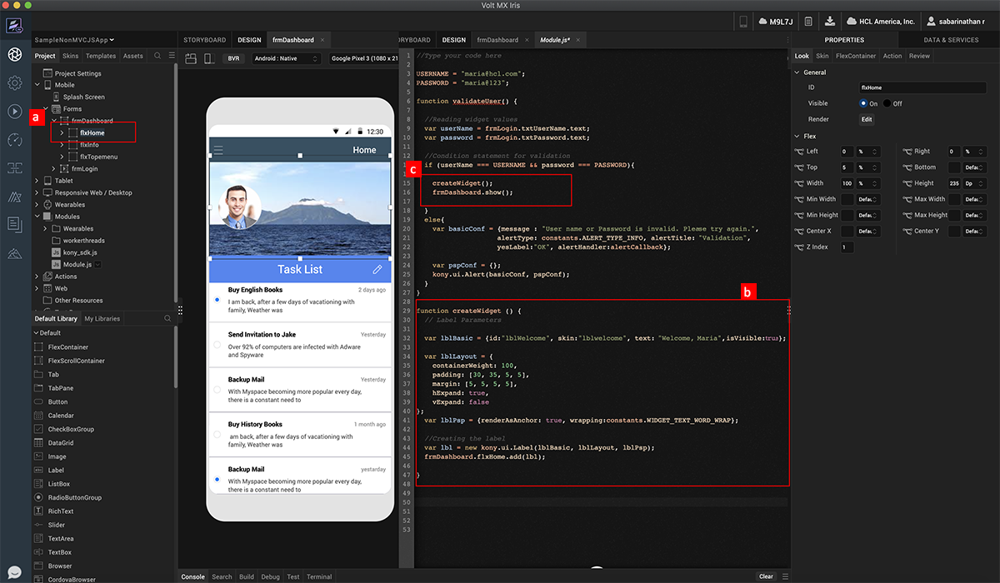

                             

Volt MX  Iris Tutorials

Introduction to Volt MX JavaScript
-------------------------------

<iframe src="https://www.youtube.com/embed/lx98lh0BmOM" allowfullscreen=""></iframe>

  
  

1\. Reading data from widgets
-----------------------------

1.  Reading the values of the text box widgets and assigning it to variables.
    
2.  Using the Volt MX Alert API – The alert API uses two parameters, one is a set of basic configurations and another is the platform specific configurations.
    

2\. Writing data to widgets
---------------------------

1.  Adding the JavaScript code in the PreShow action of the form enables the functionality to be invoked before rendering the form.
    
2.  Writing data (empty strings, in this example) to the text box widgets.
    

3\. Defining Widget method
--------------------------

1.  Setting an action on the post-show of a form. This allows the functionality to be invoked as soon as the form is rendered.
    
2.  Add a snippet through the Action editor.  
      
      
    
3.  Defining the widget method – in this case assigning a function to the onClick method for the button widget on the log in form.
    

4\. Creating a widget through JavaScript
----------------------------------------

1.  Create a new widget inside the flex container - flxMain.
    
2.  Creating a label widget – define the parameters for the widget constructor. Create the widget using the constructor. Add the widget to the container widget - flxMain.
    
3.  Calling the widget constructor as required – in this case, before navigating to the next form.
    

