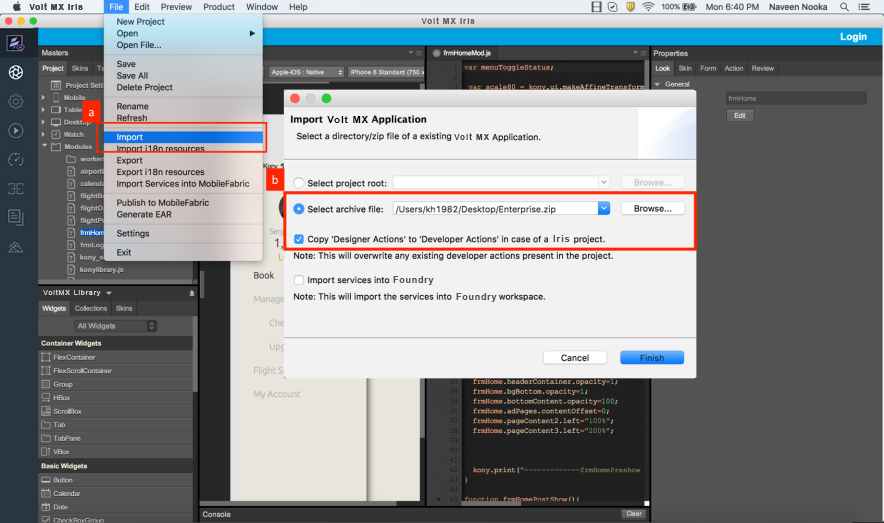
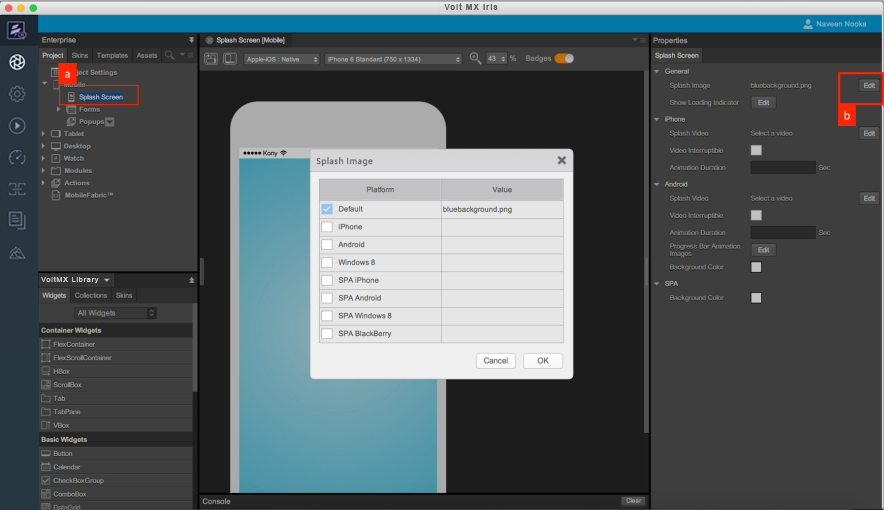
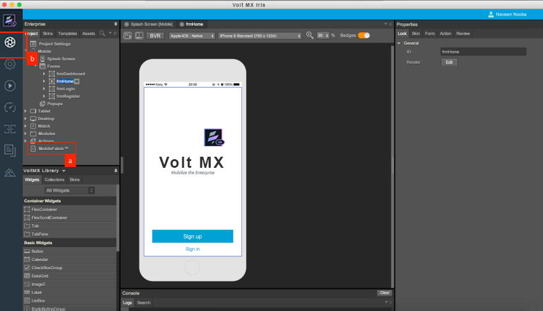
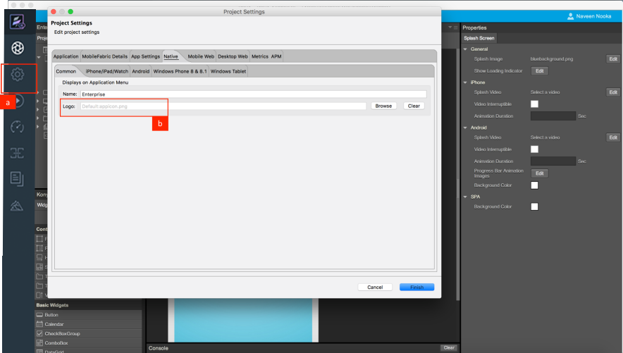
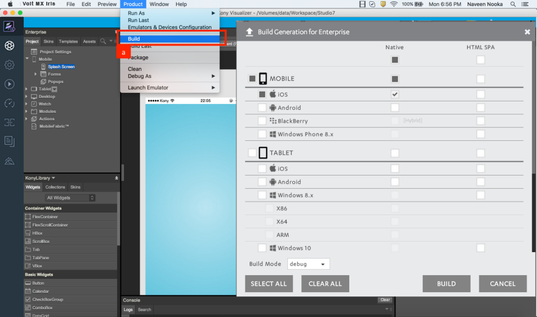
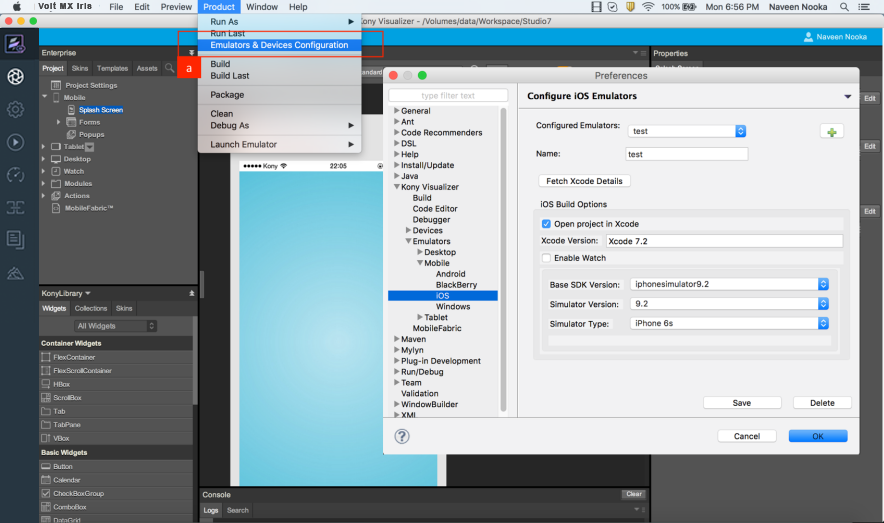
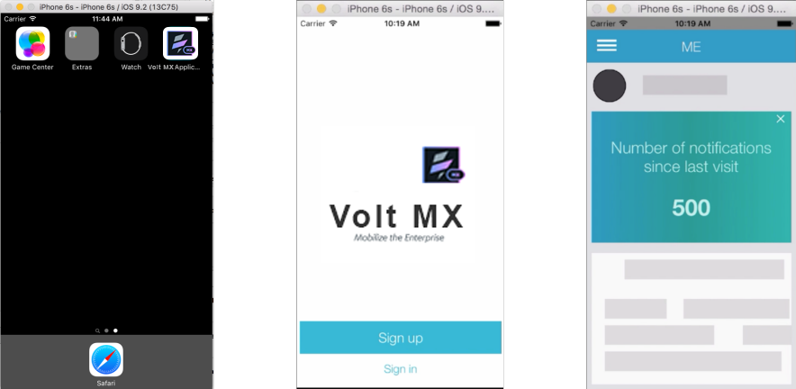

                             

Volt MX  Iris Tutorials

Iris 
---------------------

<iframe src="https://www.youtube.com/embed/W9vb8pIE-7I" allowfullscreen=""></iframe>

  

1\. Import A Project Created In Iris
----------------------------------------------------------

1.  Click on Import.
    
2.  Select the archive file. Check the **Copy Designer Actions to Developer Actions** option to copy the actions defined.
    

2\. Add Splash
--------------

1.  Click on Splash Screen node under Mobile Channel. Splash Screen appears on Iris Canvas.
    
2.  Click on **Edit** in Splash screen properties and in the pop up that opens, assign the required Splash image.  
    

3\. Service Integration
-----------------------

1.  To configure services, click on Foundry™ node displayed under Project explorer. All the service definitions are to be done in the Foundry™ console.
    
2.  To Jump back to Iris Canvas from Foundry™ console click on the workspace icon.  
      
    

4\. App Icon
------------

1.  To configure an app icon (logo) click on Project Settings.
    
2.  In the Project Settings explorer, navigate to the Native tab and assign the required Logo.
    

5\. Build App Binary
--------------------

1.  To generate the application binary click on Build.
    
2.  All the available channels and platforms are listed on the Build screen. Choose the required channels and platforms and generate the build.
    

6\. Configure Emulators
-----------------------

1.  Define emulators by navigating to the Emulators and Devices Configuration.
    
2.  Select the required SDK version, Simulator Version and Type.  
    

7\. Run Application
-------------------

1.  **Run As** will list all the emulators configured on the system. Choose the required emulator and run the application.
    

