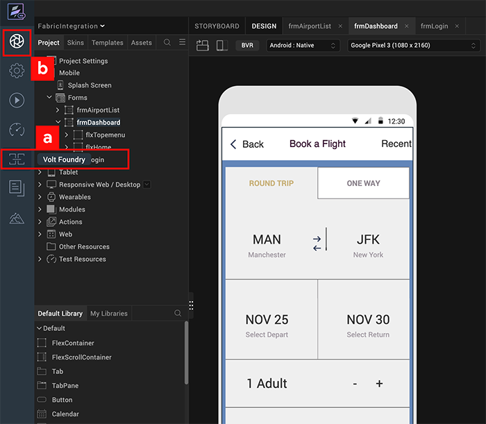
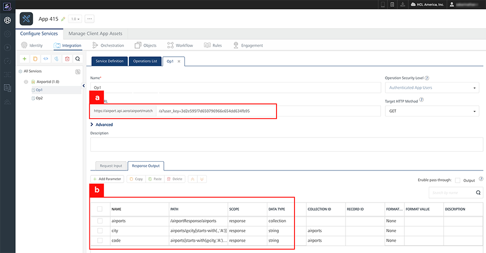
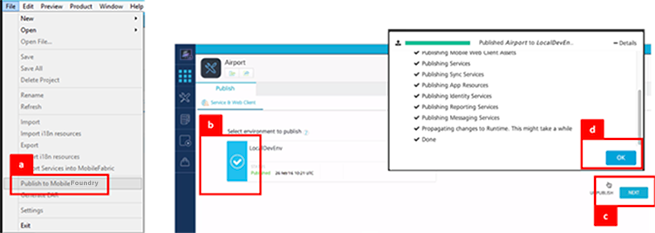
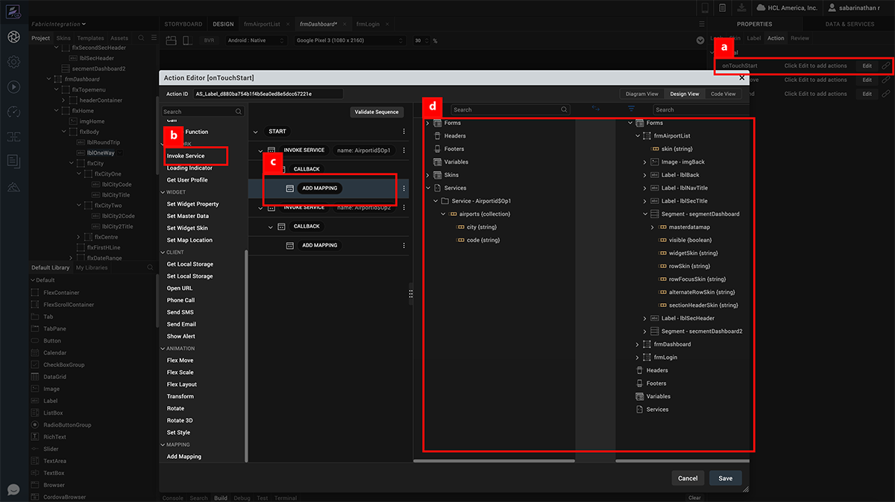
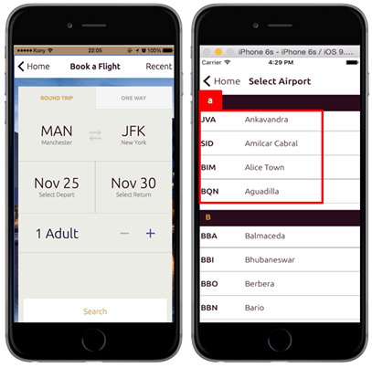

                             

Volt MX  Iris Tutorials

Foundry Integration
------------------------

<iframe src="https://www.youtube.com/embed/830t8QWcDO8" allowfullscreen=""></iframe>

1\. Invoke Foundry from within Iris
----------------------------------------------

1.  Invoke Foundry from within Iris Enterprise.
    
2.  Click here to get back to the Iris Canvas at any time.
    

  

2\. Defining the Foundry Service and Operation
---------------------------------------------------

1.  Specify the URL that the Foundry Operation will access to retrieve information.
    
2.  Define the data parameters that will be propagated to the mobile application and assign values to it by parsing and extracting it from the service response using XPath.
    

3\. Publish Foundry Application
-------------------------------------

1.  Select the option to publish the Foundry application to a Foundry run-time environment.
    
2.  Select the target Foundry run-time environment to publish the application just created.
    
3.  Publish Foundry Application.
    
4.  Ensure that the Foundry application has gone live successfully.
    

4\. Map Service Results to Form
-------------------------------

1.  Select the **On Click** event of the widget which will trigger the Foundry service call.
    
2.  Select **Invoke Asynchronous Service** action.  
      
    
3.  Include the **Add Mapping** action to the call back of the asynchronous service call.
    
4.  Configure the **Add Mapping** action by mapping.
    

5\. Run Application
-------------------

1.  Run application on simulator and view the Foundry service information appearing in the mobile application forms.
    

