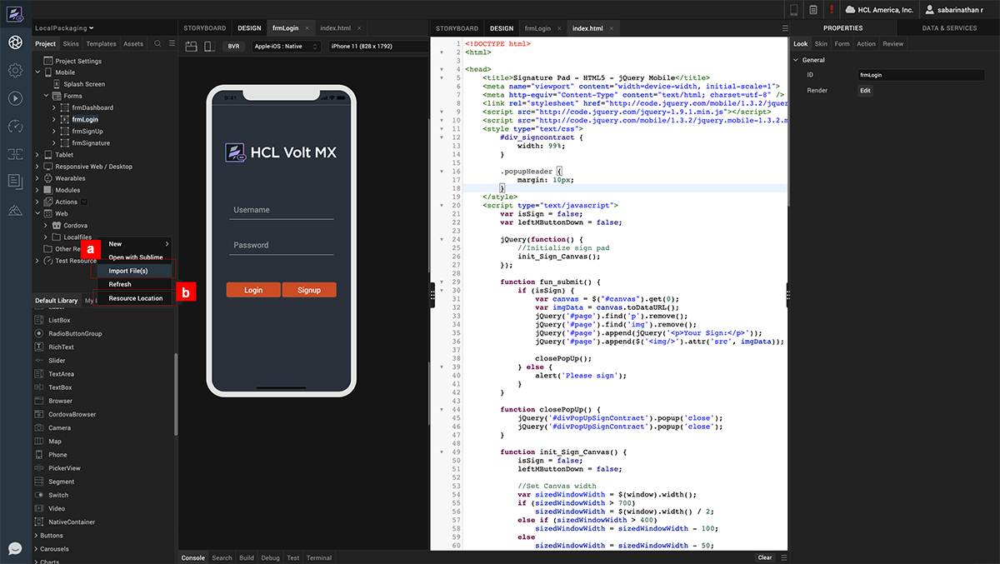
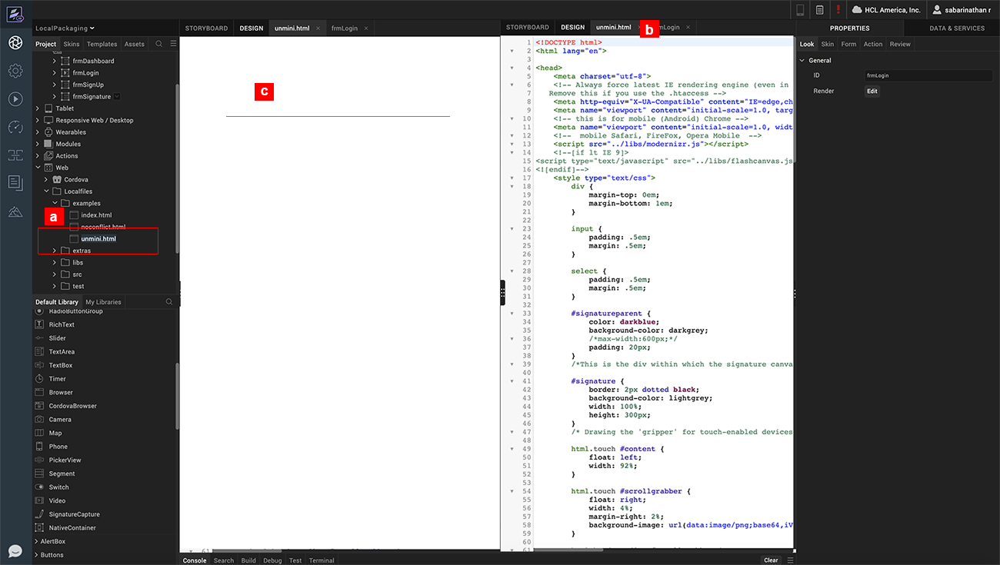
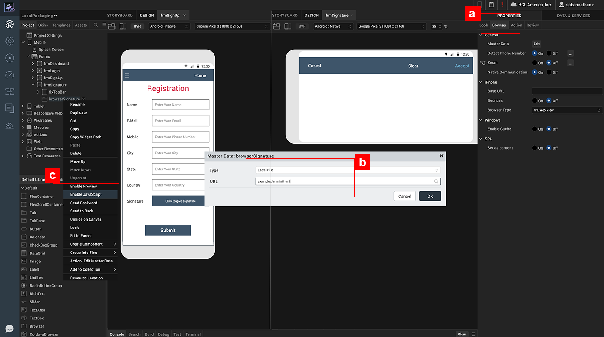
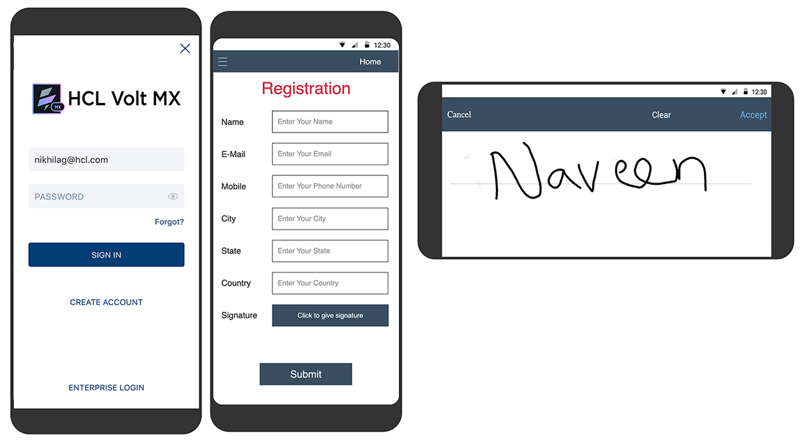

                             

Volt MX  Iris Tutorials

Package Web Content locally
---------------------------

<iframe src="https://www.youtube.com/embed/WiU5SlAvruc" allowfullscreen=""></iframe>

1\. Import Web Assets
---------------------

1.  Right click on Localfiles under Web and Click on Import to Import the required web content.
    
2.  Web assets can also be directly copied into the Resource Location.
    
3.  Once Imported these Assets appear under the Localfiles node.
    

2\. edit hTML content
---------------------

1.  To modify the web content, click the file to open it in Code Editor.
    
2.  Make the required changes to the content.                                                   
    
3.  Changes reflect instantly in the Live Preview tab.
    

3\. Assign The Source to browser widget
---------------------------------------

1.  Navigate to the Browser widget Properties.
    
2.  Edit the Master Data property. Set the Type to Local and specify index.html in the URL field.  
      
    
3.  Right click on the browser widget and enable Javascript Execution to see a live rendering on the browser widget.
    

4.App Preview
-------------

1.  Login into App Preview and launch the app.
    
2.  Clicking on Add button in the Claims form opens the Signature Capture form.
    
3.  Clicking on Add button in the Claims form opens the Signature Capture form.
    

