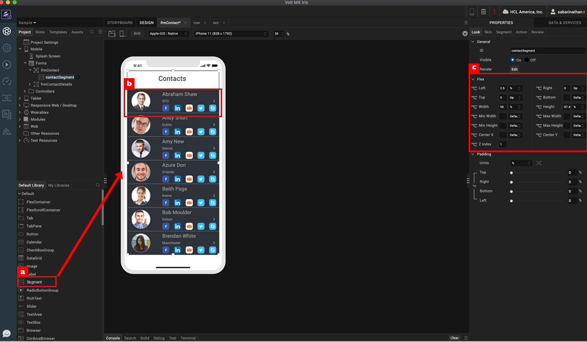
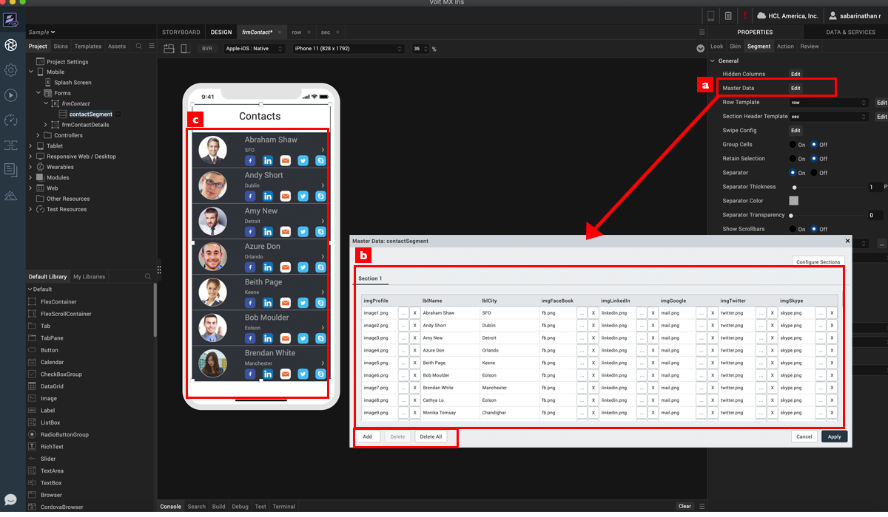
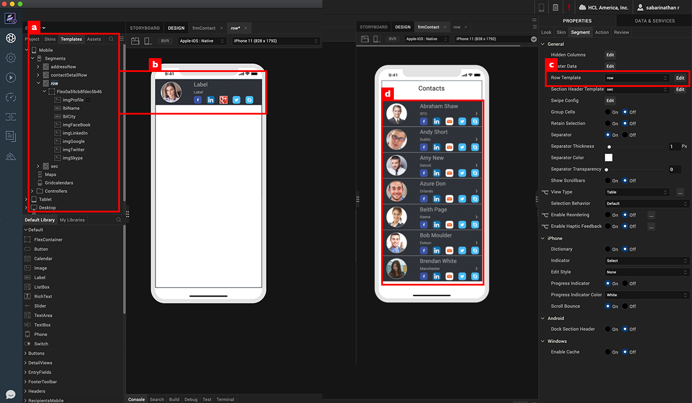
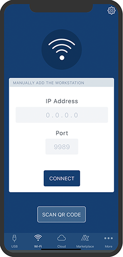
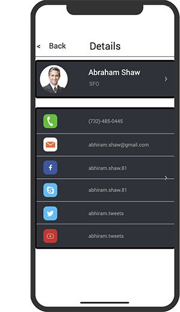

                             

Volt MX  Iris Tutorials

Segment Widget - Introduction
-----------------------------

<iframe src="https://www.youtube.com/embed/v2kut_GA82c" allowfullscreen=""></iframe>

1\. Design a Segment
--------------------

1.  Drag the segment widget onto the design canvas.
    
2.  Position and size the segment widget.
    
3.  Drag widgets and skin them to design the segment row.
    

  

2\. Assign Data To Segment
--------------------------

1.  Click Master Data property to show the data input dialog.
    
2.  Provide row data to the segment and use add button to add new data row.
    
3.  Once data input is complete, see real time reflection on design canvas .
    

3\. Design A Row Template and Assign it to Segment
--------------------------------------------------

1.  Design a row template by using widgets placed under a flex container.
    
2.  See the real time reflection on the row template on the device canvas.
    
3.  Assign the row template to segment.
    
4.  All the items will use this template to display data uniformly.
    

4\. View prototype on iris application preview
----------------------------------------------------

         

 

