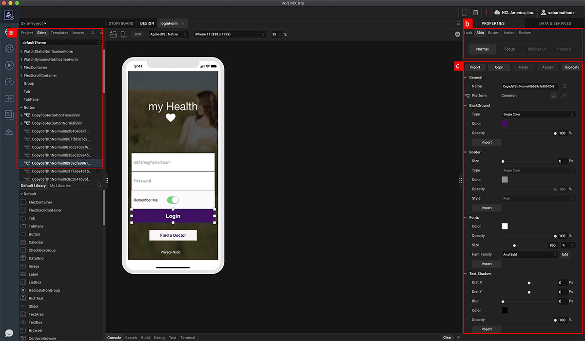
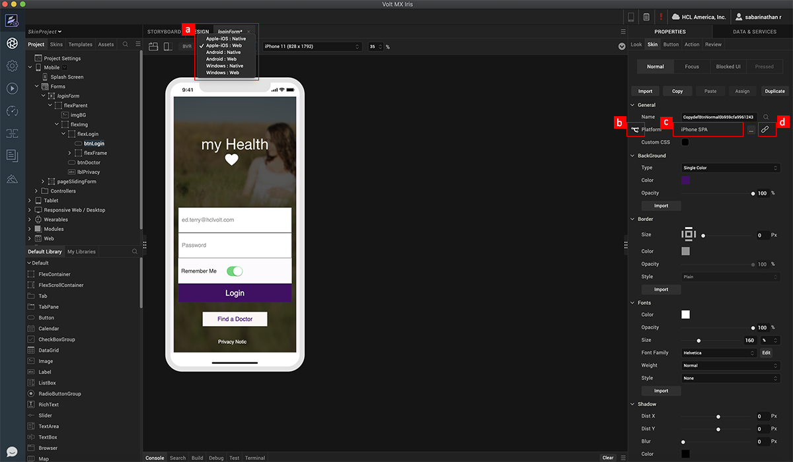
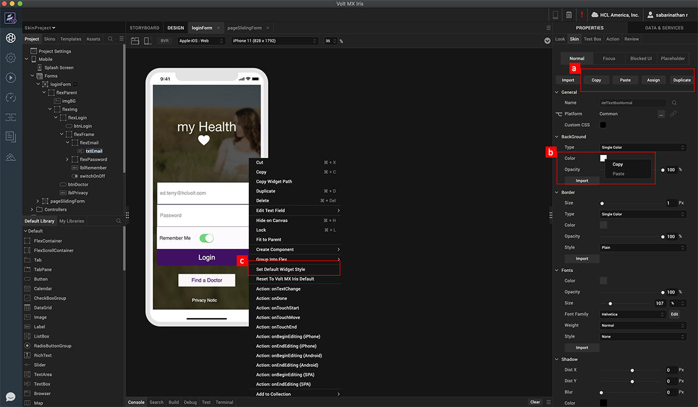
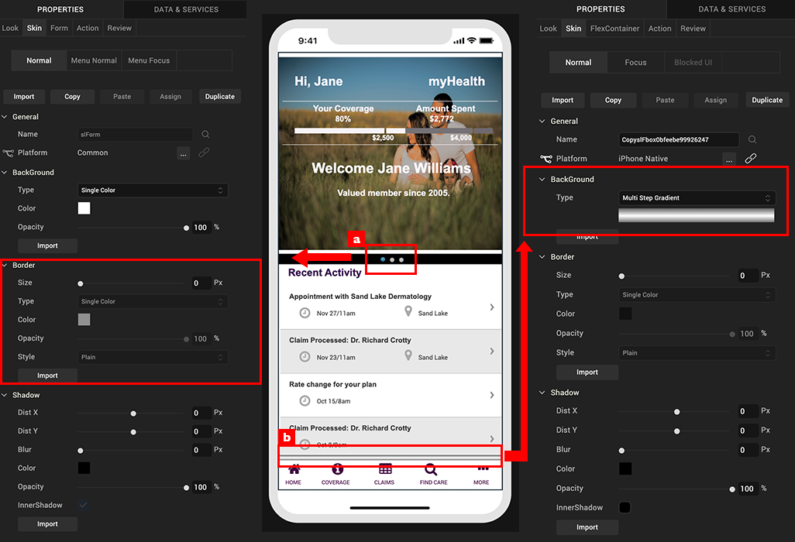

                             

Volt MX  Iris Tutorials

Understanding Skins
-------------------

<iframe src="https://www.youtube.com/embed/mlDY3vMBBr8" allowfullscreen=""></iframe>

  
  

1\. Creating and managing skins
-------------------------------

1.  With skins, we can create native multi-channel app designs using familiar design tools and native drawing libraries. A skin is created when a widget is added to a form and modified. All the skins are organized by widgets under the skin tab.
    
2.  A widget can have different types or modes, based on widget properties or interactions. These types may vary based on the platforms selected.  
      
3.  In case of nested widgets, interactions are not bubbled to parents when it comes to applying skins. **For example**, if a Hover skin is defined for nested widgets and we hover over the child, only the child’s Hover skin is applied - not the parent’s.  
    
4.  A skin has several properties such as the widget background and opacity, border settings, font settings, and shadow settings.
    

  

2\. Forking a Skin
------------------

1.  To access a few skin properties that are unique to certain widgets based on the native capabilities, Iris "forks” the skin, which provides access to these properties for each platform. To fork, first select the platform.
    
2.  Next, select the fork icon in the skin properties. You may notice that as you switch between different platforms, the skin retains the same visual properties, which is because the skin is “linked”, as seen with blue color of the LINK icon.
    
3.  Notice that the forked platform appears next to the fork icon.
    
4.  If you want to apply properties and make them unique to the platform, deselect the LINK icon.
    

3\. Skin Helper Tools
---------------------

1.  To make is easy to quickly share or copy skins between widgets of a give type, you can use the **Copy**, **Paste**, **Assign**, and **Duplicate** options at in the properties panel.
    
2.  To quickly copy and paste either gradients, or colors, from one property or skin, to another property or skin, right click on the color or gradient – notice the **Copy**, and **Paste** options.
    
3.  In case you would like to define a unique default skin for each of the widgets for a project, you can do this by right clicking on the widget and selecting the **Set Default Widget Style** option. This default skin will then get assigned to any subsequent widgets you add in the project.
    

4\. Unique use-cases (Tips & Tricks)
------------------------------------

1.  This example here, a page indicator, is a circle. I have created it by simply using the border property to achieve a complete circle. The radius should be large enough so that it is equal to the height and width of the widget, as you can see in the example here.
    
2.  Here is an example of a shadow. To create this effect, I have created a flex container, and have applied a semi-transparent gradient. Since the skin properties use the native drawing capabilities of the device, I can scale and stretch without worrying about creating image files.
    

