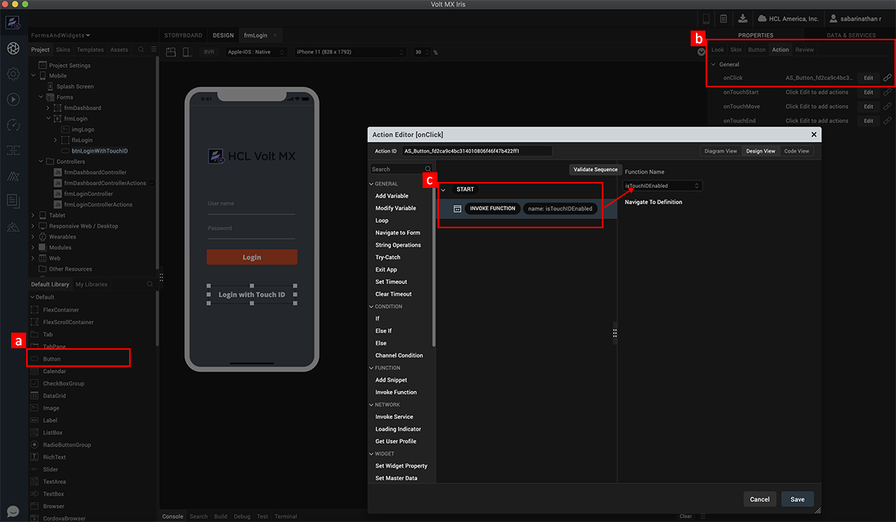

                             

Volt MX  Iris Tutorials

Volt MX  APIs - Touch ID API
------------------------

<div class="youtube-wrapper"><iframe src="https://www.youtube.com/embed/aWNnLU_KKx4" allowfullscreen=""></iframe></div>

1\. Link the Touch ID feature to your form
------------------------------------------



1.  Drag a button widget for invoking for invoking touch ID functionality.
    
2.  Add an onClick action to the button widget.  
      
      
    
3.  Through action editor, invoke the function that you will add as part of the next step.
    

2\. Implement the JavaScript code using the Touch ID APIs
---------------------------------------------------------

```
function isTouchIDEnabled() {
    var status = voltmx.localAuthentication.getStatusForAuthenticationMode(constants.LOCAL_AUTHENTICATION_MODE_TOUCH_ID);
    if (status == 5000) {
        voltmx.localAuthentication.authenticate(constants.LOCAL_AUTHENTICATION_MODE_TOUCH_ID, touchID_return, {
            "promptMessage": "Place your finger on the home button to login"
        });
    } else {
        var msg = "Touch ID is not enabled on your device";
        voltmx.ui.Alert({
            message: msg,
            alertType: constants.ALERT_TYPE_INFO,
            yesLabel: "Close"
        }, {});
    }
}

function touchID_return(status, message) {
    if (status == 5000) {
        frmDashboard.show();
    } else {
        var return_message = status + ":" + message;
        voltmx.ui.Alert({
            message: return_message,
            alertType: constants.ALERT_TYPE_INFO,
            yesLabel: "Close"
        }, {});
    }
}
```

1.  Invoke the API to check if the Touch ID is enabled.
    
2.  If Touch ID is enabled, call the authentication API to invoke the Touch ID prompt.  
      
      
    
3.  The call back function of the Authenticate API, where you will implement the logic for the authentication success and failure scenarios.
    

3\. Application preview when the authentication API is invoked.
---------------------------------------------------------------


1.  Configure the expression for the If condition. If the Widget Property confirmpasswordtxt.text is Not Equal to passwordtxt.text.
    
2.  In the Action Editor that opens up, click on If Condition listed under the Conditions group.  
      
    
3.  An If condition is added to the action sequence.
    

