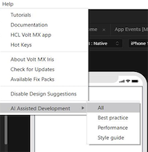
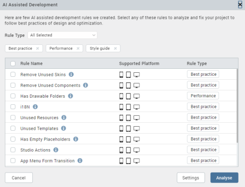
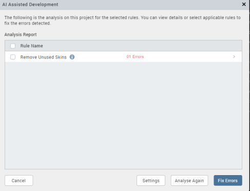
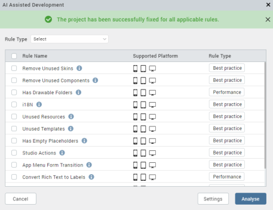
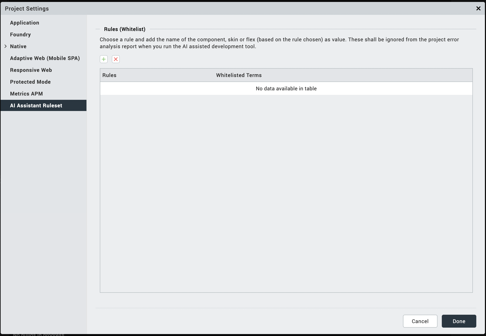

                          

AI Assisted Development
=======================

**AI Assisted Development** helps the developers in scanning the project for unused skins, resources, and widgets before building an application. The AI Assisted Development also helps you to analyze the project for increasing the performance by checking if heavy widgets like RichText can be replaced with light widgets like Label.

Using the AI Assisted Development, you can:

*   Optimize the size of the project
*   Reduces the build time
*   Increases the performance of the application  

> **_Note_**: The AI Assisted Development feature is not available for apps that use the Micro App Architecture.

Here are the topics associated with AI Assisted Development:

*   [Analyze and fix your project](#analyze-and-fix-your-project)
*   [Add Exceptions while analyzing your project](#add-exceptions-while-analyzing-your-project)
*   [Rules and Rule Categories](#rules-and-rule-categories)

Analyze and fix your project
----------------------------

To start scanning your project, follow these steps:

1.  Open the project you want to analyze in Volt Iris.
2.  From the main menu, navigate to **Help** > **AI Assisted Development**.  
    You can view the following options:
    
    *   All
    *   Best Practices
    *   Performance
    *   Style Guide  
        
    
    These are the different categories of rules that can be used to analyze your project.  
      
    
    
3.  Select one of the options.  
    The **AI Assisted Development** window appears with a table of the rules.  
      
    
    > **_Note:_** You can also run AI Assisted Development from Volt IQ. To do so, type a command such as `Run AI Assisted Development` in the Volt IQ chat window.
    
      
    
4.  From the left- side of the table , select a rule to analyze your project. For example, _Remove Unused Skins_.  
    For more information on the different rules and the rule categories, click [here](#rules-and-rule-categories).
5.  Click **Analyze**. The **Analysis Report** appears.  
    This report displays the unused items beside the respective rules  
      
    
6.  Click on the respective rule to view the details of the unused item.
7.  Select the item you want to delete from your project.
8.  Click **Fix Errors**. This will delete the items permanently from your project.  
    
    > **_Note:_** This is an irreversible step. You cannot recover the deleted item after this step.
    
      
      
    

Add Exceptions while analyzing your project
-------------------------------------------

To add any resources, skins, or widgets as an exception while analyzing the a project, follow these steps.

1.  In Volt Iris, open your project.
2.  From the main menu, navigate to **Help** > **AI Assisted Development** and select the rule categories, say **Best Practices**.  
    The **AI Assisted Development** window appears.
3.  Click **Settings**.  
    The **Rules Whitelist** window appears displaying a table with two columns: **Rules** and **Value**.  
      
    You can also access the **Rules Whitelist** window from the **Project Settings**. In the **Project Settings** window, from the left pane select **AI Assistant**.  
      
    
4.  Click **+** to add the exception.  
    A new row is added to the table.
5.  Under the column **Rules**, select the rule for which you are adding the exception.
6.  Under the column **Value**, provide the name of the resource, skin or widget that must not be analyzed.  
    For example, if a rule name is **Remove Unused Skins** with the value **formSkin**, when you run the analysis for unused skins, the **formSkin** will be ignored from the analysis.

Rules and Rule Categories
-------------------------

The following table shows the rules that you can apply to your project and the rule categories .

  
| Rule name | Rule Category | Description |
| --- | --- | --- |
| Remove Unused Skins | Best Practices | Scans the project for unused skins |
| Remove Unused Components | Best Practices | Scans the project for unused components |
| Remove Hard-Coded Data | Best Practices | Scans the project for hard-coded data in the following: Templates, Forms, Components, JavaScript Code, Static data. Hard coding is the software practice of embedding data directly into a program’s source code. The command also identifies the stubbed response, if a stubbed response is enabled in any of the foundry apps. |
| Has Drawable Folders | Performance | Checks if the project has any drawable folders in the resources folder. |
| i18N | Best Practices | Scans the project for i18n key and font files. |
| Unused Resources | Best Practices | Scans the project for resources that have not been applied to any widget or property. |
| Unused Templates | Best Practices | Scans for Segment templates that have not been used in the project. |
| Has Empty Placeholders | Best Practices | Scans for widgets with Placeholders that do not have any value in them. |
| Studio Actions | Best Practices | Scans for any unused studio actions in the project. |
| App Menu Form Transitions | Best Practices | Scans for any empty transitions inside an AppMenu widget. |
| Convert RichText to Labels | Performance | Scans for RichText widgets that do not use HTML scripts and so can be replaced with a Label widget. |
| Widget Left Alignment Check | Best Practices | Scans the project for widgets that have a left alignment. |
| Font Family and Size Consistency | Style Guide | Checks the texts used in the project use the same font family and size. |
