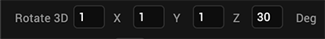

                          

Animation Actions
-----------------

> **_Note:_** Animation actions are only supported for Apple Watch on V9 Servicepack 5 Fixpack 15 or later.

From the Animation section of the list of actions available along the left column of the Action Editor, you can add any of the following six actions. Click an action for instructions on how to add it to an action sequence.

  
| Action | Property |
| --- | --- |
| [Flex Move](#flex-move) | Moves the widget from its original position. (Not supported for Apple Watch) |
| [Flex Scale](#flex-scale) | Resizes a widget. |
| [Flex Layout](#flex-layout) | Moves, scales, and rotates a widget with a single action along an X and Y axis (two dimensional). (Not supported for Apple Watch)|
| [Transform](#transform) | Moves, scales, and rotates a widget with a single action along an X, Y, and Z axis (three dimensional). (Not supported for Apple Watch).  |
| [Rotate](#rotate) | Rotates a widget along an X and Y axis (two dimensional). (Not supported for Apple Watch) |
| [Rotate 3D](#rotate-3d) | Rotates a widget along an X, Y, and Z axis (three dimensional). (Not supported for Apple Watch) |
| [Set Style](#set-style) | Changes the background color of a widget. |

### Flex Move

To move a widget, do the following:

1.	From the Project tab of the Project Explorer, select the widget you want to apply the action to. Once it’s highlighted on the Iris Canvas, right-click it, and then select one of the action sequences, such as onTouchStart. Doing so opens the Action Editor and creates an action sequence for you to configure.
2.	From the list of actions available along the left column of the Action Editor, scroll down, and then click **Flex Move** from the Animation section of available actions.
3.	In the pane of the Action Editor, select the widget you want to move.
4.	Update the properties with the following details, and click **Save** to save the action sequence and close the Action Editor window:

  
| Property | Description | Examples |
| --- | --- | --- |
| Animation ID | The name or ID of the animation. You can use the default ID, or you can enter your own ID, ensuring that it has no spaces, and does not duplicate the name of an existing animation. | Move\_left |
| Left | Specifies the distance a widget moves to the left from its original position. | \-20 px, 100 dp, 15% |
| Right | Specifies the distance a widget moves to the right from its original position. | 10 px, 175 dp, 25% |
| Top | Specifies the distance a widget moves to the top from its original position. | \-15 px, 200 dp, 7% |
| Bottom | Specifies the distance a widget moves to the bottom from its original position. | 23 px, 225dp, 6% |
| Center X | Specifies the distance a widget's center moves horizontally from its original position. | \-21 px, 263 dp, 11% |
| Center Y | Specifies the distance a widget's center moves vertically from its original position. | \-15 px, 200 dp, 7% |
| Time | Specifies the number of milliseconds (ms) in which an animation is completed. | 1000 |
| Time Function | The following time functions are available: **Ease.** Specifies a transition effect with a slow start, then fast, then end slowly. **Linear.** Specifies a transition effect with the same speed from start to end. **Ease-In.** Specifies a transition effect with a slow start. **Ease-Out.** Specifies a transition effect with a slow end. **Ease-In-Out.** Specifies a transition effect with a slow start and end. |   |
| Delay | Specifies the number of milliseconds (ms) to wait before starting an animation. | 2000 |
| Repeat | Specifies the number of times an action is repeated. To run the action indefinitely, select the **Infinite** check box. | 5 |
| Direction | Specifies whether the direction of the animation goes in one direction or alternates. When the animation alternates, the animated widget moves toward the end position specified in the positional properties, and then returns to its starting point at the same rate. The following options are available: **None.** The animation moves from its starting point to the end position specified in the positional properties. **Alternate.** When the **Repeat** property is set to greater than 1, the animation action moves toward the end position specified in the positional properties during odd occurrences, and then returns back to the starting point during even occurrences. | None, Alternate |
| Start | Specifies how an animation action starts. The following options are available: **Immediately.** Start the animation immediately, with delay, if selected. **With Animation.** Action is run along with another action. **After Animation.** Action is run after completing another action. **_Note:_** **With Animation** and **After Animation** properties are ignored if only single action is available in the **Action Sequence** pane. | Immediately |
| Inherit | The following options are available: **None.** Upon completing this action, widget returns to its original size. **Forward.** Upon completing this action, widget stays at final position. **Backward.** Upon completing an action, widget will come return to the original position. **Both.** Applies Forward and Backward options.   | Both |

> **_Note:_** For the following properties Left, Right, Top, Bottom, Center X and Center Y, you can specify the values in Device Independent Pixels (dp), pixels (px), and percentage (%). You can also specify negative values for these properties.

### Flex Scale

To scale a widget, do the following:

1.	From the Project tab of the Project Explorer, select the widget you want to apply the action to. Once it’s highlighted on the Iris Canvas, right-click it, and then select one of the action sequences, such as onTouchStart. Doing so opens the Action Editor and creates an action sequence for you to configure.
2.	From the list of actions available along the left column of the Action Editor, scroll down, and then click **Scale** from the Animation section of available actions.
3.	In the pane of the Action Editor, select the widget of which you want to change the scale.
4.	Update the properties with the following details, and click **Save** to save the action sequence and close the Action Editor window:

  
| Property | Description | Examples |
| --- | --- | --- |
| Animation ID | The name or ID of the animation. You can use the default ID, or you can enter your own ID, ensuring that it has no spaces, and does not duplicate the name of an existing animation. (Not supported for Apple Watch) | Scale\_widget |
| Width | Specifies the width of a widget. | 100 px |
| Height | Specifies the height of a widget. | 250 dp |
| Min Width | Specifies the minimum width of a widget. (Not supported for Apple Watch) | 20% |
| Min Height | Specifies the minimum height of a widget. (Not supported for Apple Watch) | 15% |
| Max Width | Specifies the maximum width of a widget. (Not supported for Apple Watch) | 540px |
| Max Height | Specifies the maximum width of a widget. (Not supported for Apple Watch) | 300px |
| Anchor X | Specifies the horizontal anchor point from where widget rotation begins. (Not supported for Apple Watch) | 15% |
| Anchor Y | Specifies the vertical anchor point from where widget rotation begins. (Not supported for Apple Watch) | 25% |
| Time | Specifies the number of milliseconds (ms) in which an animation is completed. | 1000 |
| Time Function | The following time functions are available: **Ease.** Specifies a transition effect with a slow start, then fast, then end slowly. **Linear.** Specifies a transition effect with the same speed from start to end. **Ease-In.** Specifies a transition effect with a slow start. **Ease-Out.** Specifies a transition effect with a slow end. **Ease-In-Out.** Specifies a transition effect with a slow start and end. (Not supported for Apple Watch) |   |
| Delay | Specifies the number of milliseconds (ms) to wait before starting an animation. | 2000 |
| Repeat | Specifies the number of times an action is repeated. To run the action indefinitely, select the **Infinite** check box. | 5 |
| Direction | Specifies whether the direction of the animation goes in one direction or alternates. When the animation alternates, the animated widget moves toward the end position specified in the positional properties, and then returns to its starting point at the same rate. The following options are available: **None.** The animation moves from its starting point to the end position specified in the positional properties. **Alternate.** When the **Repeat** property is set to greater than 1, the animation action moves toward the end position specified in the positional properties during odd occurrences, and then returns back to the starting point during even occurrences. (Not supported for Apple Watch) | None, Alternate |
| Start | Specifies how an animation action starts. The following options are available: **Immediately.** Start the animation immediately, with delay, if selected. **With Animation.** Action is run along with another action. **After Animation.** Action is run after completing another action. **_Note:_** **With Animation** and **After Animation** properties are ignored if only a single action is available in the **Action Sequence** pane. (Not supported for Apple Watch) | Immediately |
| Inherit | The following options are available: **None.** Upon completing this action, widget returns to its original size. **Forward.** Upon completing this action, widget stays at final position. **Backward.** Upon completing an action, widget will come return to the original position. **Both.** Apply Forward and Backward options.  (Not supported for Apple Watch) | Both |

> **_Note:_** For the following properties Width, Height, Min Width, Min Height, Max Width, Max Height, you can specify the values in Device Independent Pixels (dp), pixels (px), and percentage (%). You can also specify negative values for these properties.

### Flex Layout

Using this single action, you can move, scale, and rotate a widget in two dimensions.

To use the Flex Layout animation, do the following:

1.	From the Project tab of the Project Explorer, select the widget you want to apply the action to. Once it’s highlighted on the Iris Canvas, right-click it, and then select one of the action sequences, such as onTouchStart. Doing so opens the Action Editor and creates an action sequence for you to configure.
2.	From the list of actions available along the left column of the Action Editor, scroll down, and then click **Flex Layout** from the Animation section of available actions.
3.	In the pane of the Action Editor, select the widget of which you want to change the scale.
4.	Update the properties with the following details, and click **Save** to save the action sequence and close the Action Editor window:

  
| Property | Description | Examples |
| --- | --- | --- |
| Animation ID | The name or ID of the animation. You can use the default ID, or you can enter your own ID, ensuring that it has no spaces, and does not duplicate the name of an existing animation. | FlexLayoutAnimation |
| Left | Specifies by how much a widget moves to the left from its original position. | \-20 px, 100 dp, 15% |
| Right | Specifies by how much a widget moves to the right from its original position. | 10 px, 175 dp, 25% |
| Top | Specifies by how much a widget moves to the top from its original position. | \-15 px, 200 dp, 7% |
| Bottom | Specifies by how much a widget moves to the bottom from its original position. | 23 px, 225dp, 6% |
| Center X | Specifies by how much a widget's center moves horizontally from its original position. | \-21 px, 263 dp, 11% |
| Center Y | Specifies by how much a widget's center moves vertically from its original position. | \-21 px, 263 dp, 11% |
| Width | Specifies the width of a widget. | 100 px |
| Height | Specifies the height of a widget. | 250 dp |
| Min Width | Specifies the minimum width of a widget. | 20% |
| Min Height | Specifies the minimum height of a widget. | 15% |
| Max Width | Specifies the maximum width of a widget. | 540px |
| Max Height | Specifies the maximum width of a widget. | 300px |
| Rotate | Specifies the angle at which a widget is rotated. | 45 |
| Anchor X | Specifies the horizontal anchor point from where widget rotation begins. | 15% |
| Anchor Y | Specifies the vertical anchor point from where widget rotation begins. | 15% |
| Time | Specifies the number of milliseconds (ms) in which an animation is completed. | 1000 |
| Time Function | The following time functions are available: **Ease.** Specifies a transition effect with a slow start, then fast, then end slowly. **Linear.** Specifies a transition effect with the same speed from start to end. **Ease-In.** Specifies a transition effect with a slow start. **Ease-Out.** Specifies a transition effect with a slow end. **Ease-In-Out.** Specifies a transition effect with a slow start and end. |   |
| Delay | Specifies the number of milliseconds (ms) to wait before starting an animation. | 2000 |
| Repeat | Specifies the number of times an action is repeated. To run the action indefinitely, select the **Infinite** check box. | 5 |
| Direction | Specifies whether the direction of the animation goes in one direction or alternates. When the animation alternates, the animated widget moves toward the end position specified in the positional properties, and then returns to its starting point at the same rate. The following options are available: **None.** The animation moves from its starting point to the end position specified in the positional properties. **Alternate.** When the **Repeat** property is set to greater than 1, the animation action moves toward the end position specified in the positional properties during odd occurrences, and then returns back to the starting point during even occurrences. | None, Alternate |
| Start | Specifies how an animation action starts. The following options are available: **Immediately.** Start the animation immediately, with delay, if selected. **With Animation.** Action is run along with another action. **After Animation.** Action is run after completing another action.  **_Note:_** **With Animation** and **After Animation** properties are ignored if only single action is available in the **Action Sequence** pane. | Immediately |
| Inherit | The following options are available: **None.** Upon completing this action, widget returns to its original size. **Forward.** Upon completing this action, widget stays at final position. **Backward.** Upon completing an action, widget will come return to the original position. **Both.** Apply Forward and Backward options.   | Both |

> **_Note:_** For the following properties Left, Right, Top, Bottom, Center X and Center Y, Width, Height, Min Width, Min Height, Max Width, and Max Height, you can specify the values in Device Independent Pixels (dp), pixels (px), and percentage (%). You can also specify negative values for these properties.

### Transform

Using this single action, you can move, scale, and rotate a widget in three dimensions.

To use the Flex Layout animation, do the following:

1.	From the Project tab of the Project Explorer, select the widget you want to apply the action to. Once it’s highlighted on the Iris Canvas, right-click it, and then select one of the action sequences, such as onTouchStart. Doing so opens the Action Editor and creates an action sequence for you to configure.
2.	From the list of actions available along the left column of the Action Editor, scroll down, and then click **Transform** from the Animation section of available actions.
3.	In the pane of the Action Editor, select the widget you want to transform.
4.	Update the properties with the following details, and click **Save** to save the action sequence and close the Action Editor window:

  
| Property | Description | Examples |
| --- | --- | --- |
| Animation ID | The name or ID of the animation. You can use the default ID, or you can enter your own ID, ensuring that it has no spaces, and does not duplicate the name of an existing animation. | TransformAnimation |
| Left | Specifies by how much a widget moves to the left from its original position. | \-20 px, 100 dp, 15% |
| Top | Specifies by how much a widget moves to the top from its original position. | \-15 px, 200 dp, 7% |
| Width | Specifies the width of a widget. | 100 px |
| Height | Specifies the height of a widget. | 250 dp |
| Rotate | Specifies the angle at which a widget is rotated. This can range between 180 and -180. | 45 |
| Anchor X | Specifies the horizontal anchor point from where widget rotation begins. | 15% |
| Anchor Y | Specifies the vertical anchor point from where widget rotation begins. | 15% |
| Time | Specifies the number of milliseconds (ms) in which an animation is completed. | 1000 |
| Delay | Specifies the number of milliseconds (ms) to wait before starting an animation. | 2000 |
| Repeat | Specifies the number of times an action is repeated. To run the action indefinitely, select the **Infinite** check box. | 5 |
| Direction | Specifies whether the direction of the animation goes in one direction or alternates. When the animation alternates, the animated widget moves toward the end position specified in the positional properties, and then returns to its starting point at the same rate. The following options are available: **None.** The animation moves from its starting point to the end position specified in the positional properties. **Alternate.** When the **Repeat** property is set to greater than 1, the animation action moves toward the end position specified in the positional properties during odd occurrences, and then returns back to the starting point during even occurrences. | None, Alternate |
| Fill Mode | Defines the appearance of the animated widget after the animation has executed, outside of the time the animation takes place. The following options are available: **Forward.** Causes the animated widget to carry forward, after the animation, the properties it had when the animation ended. **Backward.** Causes the animated widget to go back, after the animation, to the properties it had when the animation ended. **Both.** Causes the animated widget to carry forward, after the animation, the properties it had when the animation ended, except for whatever property or properties are key-framed to revert back after the animation, as defined in additional code. | \-21 px, 263 dp, 11% |

> **_Note:_** For the following properties Left, Top, Width, and Height, you can specify the values in Device Independent Pixels (dp), pixels (px), and percentage (%). You can also specify negative values for these properties.

### Rotate

To rotate a widget, do the following:

1.	From the Project tab of the Project Explorer, select the widget you want to apply the action to. Once it’s highlighted on the Iris Canvas, right-click it, and then select one of the action sequences, such as onTouchStart. Doing so opens the Action Editor and creates an action sequence for you to configure.
2.	From the list of actions available along the left column of the Action Editor, scroll down, and then click **Rotate** from the Animation section of available actions.
3.	In the pane of the Action Editor, select the widget you want to rotate.
4.	Update the properties with the following details, and click **Save** to save the action sequence and close the Action Editor window:

  
| Property | Description | Examples |
| --- | --- | --- |
| Animation ID | The name or ID of the animation. You can use the default ID, or you can enter your own ID, ensuring that it has no spaces, and does not duplicate the name of an existing animation. | Rotate\_angle |
| Rotate | Specifies the angle at which a widget is to be rotated. | 45 |
| Anchor X | Specifies the horizontal anchor point from where widget rotation begins. | 15% |
| Anchor Y | Specifies the vertical anchor point from where widget rotation begins. | 15% |
| Time | Specifies the number of milliseconds (ms) in which an animation is completed. | 1000 |
| Time Function | The following time functions are available: **Ease.** Specifies a transition effect with a slow start, then fast, then end slowly. **Linear.** Specifies a transition effect with the same speed from start to end. **Ease-In.** Specifies a transition effect with a slow start. **Ease-Out.** Specifies a transition effect with a slow end. **Ease-In-Out.** Specifies a transition effect with a slow start and end. |   |
| Delay | Specifies the number of milliseconds (ms) to wait before starting an animation. | 2000 |
| Repeat | Specifies the number of times an action is repeated. To run the action indefinitely, select the **Infinite** check box. | 5 |
| Direction | Specifies whether the direction of the animation goes in one direction or alternates. When the animation alternates, the animated widget moves toward the end position specified in the positional properties, and then returns to its starting point at the same rate. The following options are available: **None.** The animation moves from its starting point to the end position specified in the positional properties. **Alternate.** When the **Repeat** property is set to greater than 1, the animation action moves toward the end position specified in the positional properties during odd occurrences, and then returns back to the starting point during even occurrences. | None, Alternate |
| Start | Specifies how an animation action starts. The following options are available: **Immediately.** Start the animation immediately, with delay, if selected. **With Animation.** Action is run along with another action. **After Animation.** Action is run after completing another action. **_Note:_** **With Animation** and **After Animation** properties are ignored if only single action is available in the **Action Sequence** pane. | Immediately |
| Inherit | The following options are available: **None.** Upon completing this action, widget returns to its original size. **Forward.** Upon completing this action, widget stays at final position. **Backward.** Upon completing an action, widget will come return to the original position. **Both.** Apply Forward and Backward options.   | Both |

### Rotate 3D

To rotate a widget along the X, Y, and Z axes, do the following:

1.	From the Project tab of the Project Explorer, select the widget you want to apply the action to. Once it’s highlighted on the Iris Canvas, right-click it, and then select one of the action sequences, such as onTouchStart. Doing so opens the Action Editor and creates an action sequence for you to configure.
2.	From the list of actions available along the left column of the Action Editor, scroll down, and then click **Rotate 3D** from the Animation section of available actions.
3.	In the pane of the Action Editor, select the widget you want to rotate.
4.	Update the properties with the following details, and click **Save** to save the action sequence and close the Action Editor window:

  
| Property | Description | Examples |
| --- | --- | --- |
| Animation ID | The name or ID of the animation. You can use the default ID, or you can enter your own ID, ensuring that it has no spaces, and does not duplicate the name of an existing animation. | Rotate3D\_angle |
| Rotate 3D | Specifies which axes rotate, and the angle of their rotation. For each axis—X, Y, and Z—you specify either 0, which means you don't want that axis to rotate, or 1, which means you do want it to rotate. You also specify the number of degrees by which the widget should rotate upon the chosen axes. |  |
| Perspective | Sets the perspective transform and the vanishing point to center of the widget; this can be platform-specific. Perspective creates the illusion of distance between the user and the object. | 1000 |
| Anchor X | Specifies the horizontal anchor point from where widget rotation begins. | 15% |
| Anchor Y | Specifies the vertical anchor point from where widget rotation begins. | 15% |
| Time | Specifies the number of milliseconds (ms) in which an animation is completed. | 1000 |
| Time Function | The following time functions are available: **Ease.** Specifies a transition effect with a slow start, then fast, then end slowly. **Linear.** Specifies a transition effect with the same speed from start to end. **Ease-In.** Specifies a transition effect with a slow start. **Ease-Out.** Specifies a transition effect with a slow end. **Ease-In-Out.** Specifies a transition effect with a slow start and end. |   |
| Delay | Specifies the number of milliseconds (ms) to wait before starting an animation. | 2000 |
| Repeat | Specifies the number of times an action is repeated. To run the action indefinitely, select the **Infinite** check box. | 5 |
| Direction | Specifies whether the direction of the animation goes in one direction or alternates. When the animation alternates, the animated widget moves toward the end position specified in the positional properties, and then returns to its starting point at the same rate. The following options are available: **None.** The animation moves from its starting point to the end position specified in the positional properties. **Alternate.** When the **Repeat** property is set to greater than 1, the animation action moves toward the end position specified in the positional properties during odd occurrences, and then returns back to the starting point during even occurrences. | None, Alternate |
| Inherit | The following options are available: **None.** Upon completing the action, the widget returns to its original position. **Forward.** Upon completing the action, the widget stays at its final position. **Backward.** Upon completing the action, the widget animates backwards back to its original position. **Both.** The Forward and Backward options are both implemented.   | Both |

### Set Style

The Set Style animation changes the background color of a widget.

To change the background color of a widget, do the following:

1.	From the Project tab of the Project Explorer, select the widget you want to apply the action to. Once it’s highlighted on the Iris Canvas, right-click it, and then select one of the action sequences, such as onTouchStart. Doing so opens the Action Editor and creates an action sequence for you to configure.
2.	From the list of actions available along the left column of the Action Editor, scroll down, and then click **Set Style** from the Animation section of available actions.
3.	In the pane of the Action Editor, select the widget of which you want to change the style.
4.	Update the properties with the following details, and click **Save** to save the action sequence and close the Action Editor window:

  
| Property | Description | Examples |
| --- | --- | --- |
| Animation ID | The name or ID of the animation. You can use the default ID, or you can enter your own ID, ensuring that it has no spaces, and does not duplicate the name of an existing animation. (Not supported for Apple Watch) | SetStyle\_Color |
| Background Color | Select a color from the color picker. Only Single color . |   |
| Opacity | Specifies the opacity of the background color. | 15% |
| Time | Specifies the number of milliseconds (ms) in which an animation is completed. | 1000 |
| Time Function | The following time functions are available: **Ease.** Specifies a transition effect with a slow start, then fast, then end slowly. **Linear.** Specifies a transition effect with the same speed from start to end. **Ease-In.** Specifies a transition effect with a slow start. **Ease-Out.** Specifies a transition effect with a slow end. **Ease-In-Out.** Specifies a transition effect with a slow start and end. (Not supported for Apple Watch) |   |
| Delay | Specifies the number of milliseconds (ms) to wait before starting an animation. | 2000 |
| Repeat | Specifies the number of times an action is repeated. To run the action indefinitely, select the **Infinite** check box. | 5 |
| Direction | Specifies whether the direction of the animation goes in one direction or alternates. When the animation alternates, the animated widget moves toward the end position specified in the positional properties, and then returns to its starting point at the same rate. The following options are available: **None.** The animation moves from its starting point to the end position specified in the positional properties. **Alternate.** When the **Repeat** property is set to greater than 1, the animation action moves toward the end position specified in the positional properties during odd occurrences, and then returns back to the starting point during even occurrences. (Not supported for Apple Watch) | None, Alternate |
| Start | Specifies how an animation action starts. The following options are available: **Immediately.** Start the animation immediately, with delay, if selected. **With Animation.** Action is run along with another action. **After Animation.** Action is run after completing another action. **_Note:_** **With Animation** and **After Animation** properties are ignored if only single action is available in the **Action Sequence** pane. (Not supported for Apple Watch) | Immediately |
| Inherit | The following options are available: **None.** Upon completing this action, widget returns to its original size. **Forward.** Upon completing this action, widget stays at final position. **Backward.** Upon completing an action, widget will come return to the original position. **Both.** Apply Forward and Backward options. (Not supported for Apple Watch) |  |
