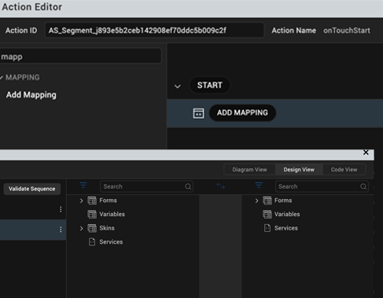
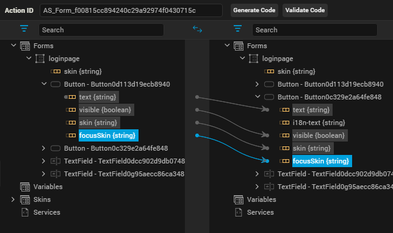

                          

Map Widget Properties to One Another
====================================

 Mapping provides an easy way of linking a widget property (or skin, variable, or an i18n key) to another widget. Mapping also allows you to achieve a uniform look and feel across the design, and reduces the effort required to design an app since any modification made to a widget property results in modifying all its linked widget properties. Not supported for Apple Watch. Click any of the following topics for more information.

*   [Mapping Overview](#mapping-overview)
*   [Important Considerations](#important-considerations)
*   [Map Properties to One Another](#map-properties-to-one-another)
*   [Add an Expression](#add-an-expression)
*   [Unlink Mapped Properties](#unlink-mapped-properties)
*   [Locate Properties by Filtering and Searching](#locate-properties-by-filtering-and-searching)
*   [Map Data with the Help of Expressions](#map-data-with-the-help-of-expressions)
*   [Map a Collection to a Widget or a Service Parameter](#map-a-collection-to-a-widget-or-a-service-parameter)
*   [Set Data for a Component with Contract](C_CreatingComponent.md#set-data-for-components-with-contract-by-using-mapping-editor)
*   [Map a Segment's Section Header Template Widgets](Segment2.md#Map_a_Segment's_Section_Header_Template)
*   [Map Data to the Segment in a Component](DataPanel.md#set-data-for-the-segment-in-a-component)
*   [Map Data across Channels and Breakpoints](#map-data-across-channels-and-breakpoints)

Mapping Overview
----------------

The Mapping Editor consists of two panes: the source and the target.

### Source

The left pane of the Mapping Editor is called the Source, and contains the following folders:

*   Forms: Lists all the forms and their child widgets. All the properties of a form and its child widgets that can be mapped are displayed.
*   Headers: List all the header templates and their child widgets. All the properties of a header and its child that can be mapped are displayed. (Free Form JavaScript projects only)
*   Footers: List all the footer templates and their child widgets. All the properties of a footer and its child that can be mapped are displayed. (Free Form JavaScript projects only)
*   Variables: List all the variables created for a project.
*   Skins: List all the skins available for a form and its child widgets.
*   i18n Keys: List all the i18n keys available for the project.
*   Services: Lists all services currently available for mapping.

### Target

The right pane of the Mapping Editor is called the Target, and contains the following folders:

*   Forms: Lists all the forms and their child widgets. All the properties of a form and its child widgets that can be mapped are also displayed.
*   Headers: List all the header templates and their child widgets. All the properties of a header and its child that can be mapped are also displayed. (Free Form JavaScript projects only)
*   Footer: List all the footer templates and their child widgets. All the properties of a footer and its child that can be mapped are also displayed. (Free Form JavaScript projects only)
*   Variables: List all the variables created for a project.
*   Services: Lists all services currently available for mapping.

<blockquote>
<em><b>Note: </b></em>
<ul>
<li>Skins and i18n keys folders are unavailable in the Target pane.</li>
<li>Headers and Footers are only included for Free Form JavaScript projects.</li>
</ul>
</blockquote>

Important Considerations
------------------------

*   The datatype for both the source and the target has to be the same. If they’re not, Volt MX Iris notifies you.
*   You cannot map across channels. That is, you cannot map the widget text of a Mobile channel to the widget text of a Tablet (or Desktop) channel.
*   If a form is forked (e.g. iOS:Native), only when the source and target are of same platform (iOS:Native) are the mapped values are applied during functional preview.
*   A source element can have one-to-many mappings, but a target element can have only one-to-one mapping. That is, a source element can be linked to multiple target elements. But a target element can only be linked to one source element.
*   While mapping skins, source and target widgets should be of the same type. That is, you can map a skin of a Button to another Button only.
*   The data type of the source and target should be same. That is, if the source data type is String, you can map it only to a target element of data type String.
*   When you map a collection to another collection, you must first map at the parent-level (map one collection to the other collection) and then map the elements.
*   If the source and target widgets are of the same type, and the values of the two properties being mapped are identical, you cannot map them.
*   Since tabs are listed under form elements, you cannot map any data to a tab widget using the Mapping Editor.
*   For service mappings, do not use structures that have more than simple key value pairs and attributes. Break out complex structures and use code to get the lost values.
*   VoltMX Service mappings cannot support dynamic associations or hierarchical structures. Use code to work around this limitation.

Map Properties to One Another
-----------------------------

It's important to note that, after mapping, any changes you make to the target element effects the source element as well.

To map properties, do the following:

1.  From the left pane of the Action Editor, under the Mapping section, click **Add Mapping**. Doing so opens the Mapping Editor.
    
    
    
2.  From the Source pane, navigate to a widget's property, and then click it. You can make it easier to locate the property you want by using the Filter drop-down list to filter the app's forms and widgets according to any of the following criteria: Include Containers, Display All Properties, Variables, Skins, Mapped Elements, Services, and I18N Keys.

3.  From the Target pane, navigate to a widget's property, and then click it. Doing so establishes a mapping relationship between the source element and the target element. You can make it easier to locate the property you want by using the Filter drop-down list to filter the app's forms and widgets according to any of the following criteria: Include Containers, Display All Properties, Variables, Skins, Mapped Elements, Services, and I18N Keys.
    
    
    
4.  Click **Save** to save the action sequence and close the Action Editor window.

Add an Expression
-----------------

You can write a code snippet on a target element for manipulating a widget property.

To add an expression, do the following:

1.	Right-click the target element.

2.	Click **Add Expression**.
3.	Type the code and save the project. Example of an expression:

    "Welcome " + loginPage.FirstName.text + loginPage.LastName.text;

4.	Click **Save** to save the action sequence and close the Action Editor window.
    

Unlink Mapped Properties
------------------------

To unlink a mapping or to remove any expression, do the following:  

1.	In the Target pane, right-click a property that is mapped to a source property.
2.	Click **Unbind**.
3.	Click **Save** to save the action sequence and close the Action Editor window.

Locate Properties by Filtering and Searching
--------------------------------------------

The elements under Source and Target in the Mapping Editor can be sorted by either filtering or searching. When you search, the pane lists only those elements that match what you type in the Search box. The Filter feature includes the following filtering parameters:

  
| Filter Category | Description |
| --- | --- |
| All | Displays all the elements |
| Include Containers | Include Containers such as FlexContainers and FlexScrollContainers in the list of widgets |
| Display All Properties | DDisplays additional widget properties for mapping |
| Variables | Displays variables, both local and global |
| Skins | Displays skins |
| Mapped Elements | Displays data that has already been mapped |
| Services | Displays services |
| I18N | Displays i18n keys|

Map Data with the Help of Expressions
-------------------------------------

You can also map data to widgets or service parameters by creating an expression. When you write an expression to map the data, you can perform the required operations on the data before mapping it to the selected element.

> **_Note:_** You can add an expression only to the elements that have a data type associated with it. These elements can be service parameters or attributes of a widget. You cannot add an expression at the widget name or service name level.

To map data with the help of an expression, do the following:

1.  In the Mapping Editor, select the element in the Target to which you want to map data.
2.  Right-click this element, and then click **Add Expression**. Doing so displays the Expression Editor.
3.  Define the required expression, and then click outside of the Expression Editor. The data derived out of the expression is mapped to the selected element, and a red circle appears next to the element indicating that it has an expression.
4.  Click **Save** to save the action sequence and close the Action Editor window.

Map a Collection to a Widget or a Service Parameter
---------------------------------------------------

When you want to map elements within a collection to a widget or a service parameter, the first element in the collection gets mapped to the widget by default.

> **_Note:_** You have to explicitly edit the expression to modify the index of the collection that needs to be mapped.

To edit the collection index value, follow these steps:

1.  On the Source pane of the Mapping Editor, select an element within the collection as the source by clicking it.
2.  On the Target pane, click a widget (or service parameter) that has the same data type as the collection element. The first element within the collection gets mapped to the widget you selected.
3.  Right-click the mapped widget (or service parameter), and then click **Edit Expression**. Doing so opens the Expression Editor.
4.  Delete the default index value in the expression and provide the required index value. For example, students\[3\]\["name"\] indicates that you have mapped the value at the third index of name within the students collection.
5.  Click **OK**.
6.  Click **Save** to save the action sequence and close the Action Editor window.

Map Data Across Channels and Breakpoints
----------------------------------------

From V9 SP1 release, you can map different data for different channels and breakpoints in the [Segment](../../../Iris/iris_widget_prog_guide/Content/Segment.md#segmentedui-widget) widget using the **Mapping Editor**. This feature helps you to create mappings when the Segment widget is placed inside a component or when it is placed in a Desktop web form. The following sections provide more information about how to create mappings in each scenario.

*   [Mapping for Segment in a Component](#mapping-for-segment-in-a-component)
*   [Mapping for Segment with Desktop Web Breakpoints](#mapping-for-segment-with-desktop-web-breakpoints)

### Mapping for Segment in a Component

A component is not specific to a platform. You can create a component and then use it across all platforms and channels. However, while using Segment widget inside a component, the templates assigned to the widget varies across channels. This means that the data assigning to the widget also varies across channels. From V9 SP1, in Volt MX Iris, you can use **Mapping editor** to map different data for the same Segment widget (in a component) for different channels. You can map the following Segment widget properties for the various channels to data from the services, variables, etc.

*   [Row data and section data](../../../Iris/iris_widget_prog_guide/Content/Segment_Properties.md#data)
*   [selectedRowItems](../../../Iris/iris_widget_prog_guide/Content/Segment_Properties.md#selected3)

Follow these steps to map the UI elements of a component to data.

1.  From the **Templates** explorer, open the component with a Segment widget. Make sure to assign row templates to the segment according to the various channels.
2.  From the top of the canvas, select the platform from the first drop-down list (For example, **iOS Mobile: Native**).
3.  From the **Properties** panel, navigate to the **Action** tab.
4.  Click **Edit** for any of the actions (such as **onClick event**).  
    The **Action Editor** window appears.
5.  From the left menu of the **Action Editor**, select an action such as **Add Mapping**.  
    The **Mapping Editor** window appears.
6.  Perform the required mappings between the data and the UI elements.
7.  Click **Save**.
8.  Select the next platform from the drop-down list on top of the canvas (For example, **Desktop: Web**).
9.  From the **Properties** panel, navigate to the **Action** tab.
10.  Select the event as mentioned in the previous steps.  
    The **Action Editor** window appears.
11.  Navigate to the action node added earlier.
12.  Continue to map the data to the UI elements as required.
13.  Click **Save**.

Refer the **Code View** tab in the **Action Editor** window to get the generated code for all the mappings.

### Mapping for Segment with Desktop Web Breakpoints

In Desktop web platforms, you can assign different row templates to a Segment widget for different breakpoints. In Volt MX Iris V9 SP2, you can use Volt MX Iris to map the data of a Segment widget for each breakpoint. This means that you can map data separately for each breakpoint in a form.

Follow these steps to map the UI elements to data for each breakpoint.

1.  Open a Desktop Web application in Volt MX Iris.
2.  Open the form with Segment widget in the canvas.
3.  From the top of the canvas, enable **Breakpoint forking**. Also ensure to select the scale as **100%**.  
    The form appears on the canvas with scale in the X and Y axis. You can also see the breakpoints as inverted red triangles on the scale (For example, **640 Px**, **1024 Px**, and **1366 Px**).
4.  Click on any of the breakpoints in the scale (For example, **1366 PX**) .
5.  From the canvas, select the Segment widget.
6.  From the **Properties** panel, navigate to the **Segment** tab and assign a row template.
7.  From the **Properties** panel, navigate to the **Action** tab.
8.  Click **Edit** for an action (such as for **onClick event**).  
    The **Action Editor** window appears.
9.  From the left menu of the Action Editor, select an action such as Add Mapping.  
    The Mapping editor window appears.
10.  Perform the required mappings between the data and the UI elements.
11.  Click **Save**.
12.  Click on any of the breakpoints in the scale (For example, **640 PX**) .
13.  From the **Properties** panel, navigate to the **Action** tab.
14.  Select the event as mentioned in a previous step.  
    The **Action Editor** window appears.
15.  Navigate to the action added earlier .
16.  Continue to map the data to the UI elements as required.
17.  Click **Save**.

Refer the **Code View** tab in the **Action Editor** window to get the generated code for all the mappings.

> **_Note:_** Once the mappings are created from a forked breakpoint template, any modifications to the width removes the mappings made for those breakpoints.
